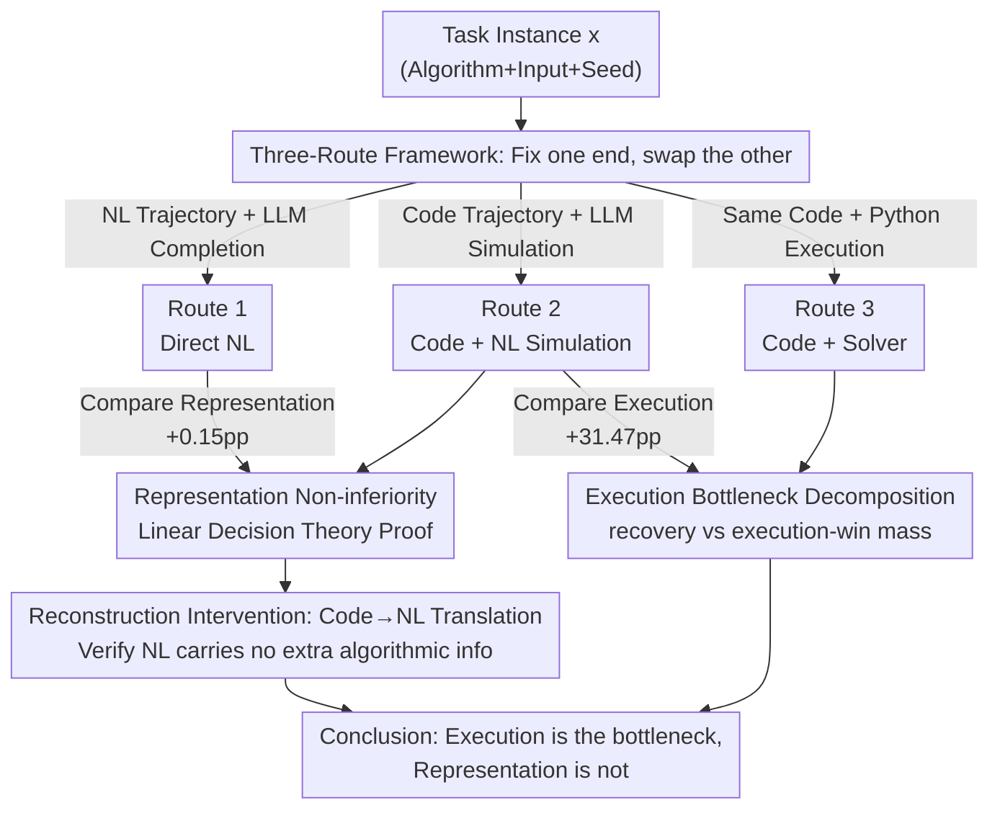

# Is Code Better Than Language for Algorithmic Reasoning?

**Conference**: ICML2026  
**arXiv**: [2606.15589](https://arxiv.org/abs/2606.15589)  
**Code**: https://github.com/TerryTong-Git/ToolProj  
**Area**: LLM Reasoning / Neuro-symbolic / Tool Use  
**Keywords**: Algorithmic Reasoning, Tool Use, Code Generation, Decision Theory, Representation vs. Execution

## TL;DR
The authors utilize a "three-route" framework to disentangle two confounded factors in tool-augmented LLMs: reasoning representation (code vs. natural language) and execution mechanism (LLM simulation vs. real interpreter). Across 40 verifiable algorithmic tasks, results show that code representation itself provides negligible gains (+0.15pp), while "reliable external execution" significantly elevates accuracy from 17% to 49% (+31.47pp). A linear decision-theoretic model further proves that "code representation is non-inferior to natural language."

## Background & Motivation
**Background**: Many agentic systems translate problems into executable code for external solvers (e.g., PAL, Faithful CoT), often significantly outperforming end-to-end natural language (NL) chain-of-thought (CoT) on complex logical and algorithmic tasks. Intuition typically attributes this success to code being a "structured representation more suitable for reasoning."

**Limitations of Prior Work**: This comparison is **confounded**. The NL route and the code route learn two different objects—the NL route produces a natural language trajectory continued by the LLM itself, while the code route produces a program executed by a Python runtime. These routes **simultaneously change two variables**: the intermediate representation (prose vs. program) and the executor (LLM forward pass vs. deterministic interpreter). Consequently, it is impossible to distinguish whether observed performance gains stem from "code as a representation" or "the act of external execution."

**Key Challenge**: The absence of a "common intermediate route" prevents the decoupling of representation and execution.

**Goal**: Split the problem into two independently verifiable sub-questions: (1) Fix the executor to the LLM and vary the representation (NL vs. code)—is representation the bottleneck? (2) Fix the code trajectory and vary the executor (LLM simulation vs. Python)—is execution the bottleneck?

**Key Insight**: The authors construct an **intermediate intervention**: let the model write executable code but **not actually run it**; instead, have the LLM "pretend to be an interpreter" within the context to simulate the code execution. This allows a fair comparison between code and NL representations under the "same LLM executor."

**Core Idea**: Use Route 2 ("Code + LLM Simulation") as a bridge to isolate representation effects from execution effects, identifying the true driver of performance.

## Method

### Overall Architecture
The authors model any reasoning pipeline as a **two-stage stochastic process**: a trajectory generator $E:\mathcal{X}\to\Delta(\mathcal{Z})$ maps a task instance $x$ to an intermediate trajectory $z$ (NL CoT or a program), and an executor $\rho:\mathcal{X}\times\mathcal{Z}\to\Delta(\mathcal{Y})$ consumes the trajectory to produce the final answer $y$. Evaluation uses 0–1 loss $\ell(y,x)=\mathbf{1}\{y\neq Y^*(x)\}$, where all tasks have unique, externally verifiable answers.

Under this $(E,\rho)$ abstraction, the three routes represent different combinations:

The core of the experiments lies in "**changing only one stage at a time**": comparing Route 1 vs. Route 2 fixes the LLM executor while changing representation; comparing Route 2 vs. Route 3 fixes the code trajectory while changing the executor. All routes utilize structured JSON output constraints, and prompts are kept consistent (Route 2 only adds instructions to "generate code and simulate").

### Key Designs

**1. Three-Route Framework: Using Route 2 as a Bridge for Decoupling**

Directly comparing "NL end-to-end" and "Code + Solver" mixes representation and execution variables—the fundamental flaw this paper addresses. By inserting Route 2—where code is the trajectory modality but execution remains internal—the authors create two controlled comparisons. Route 1 ($Z_{NL}$ + LLM) and Route 2 ($Z_{Code}$ + same LLM simulation) **differ only in representation**. Route 2 and Route 3 (same $Z_{Code}$ + Python runtime $\rho_{Exec}(y\mid x,z)=\mathbf{1}\{y=\mathrm{Exec}(x,z)\}$) **differ only in the executor**. This "fix one, change the other" design is a standard causal intervention for disentangling confounders.

**2. Representation Non-inferiority: Linear Decision Theory Proof**

To argue that representation is not the bottleneck, the authors supplement empirical data with a provable linear model. Inputs for each route are decomposed as $S_r=(B,U_r)$: where $B$ is the **core sufficient statistic** determining the answer (recurrence relations, boundary conditions) and $U_r$ represents **answer-irrelevant surface variations** (variable names, phrasing). Assumption 4.1 models natural language as "code-side noise plus additional paraphrasing noise": $U_N=U_C+\eta_N$, where noises are zero-mean given the core (Lemma 4.1.1 guarantees $\mathbb{E}[U_r\mid B]=0$ and $\mathbb{E}[U_C\eta_N^\top\mid B]=0$).

This yields a Loewner ordering of noise covariances $\Sigma_{U,C}\preceq\Sigma_{U,N}$ (Proposition 4.2: $\Sigma_{U,N}-\Sigma_{U,C}=\mathbb{E}[\eta_N\eta_N^\top]\succeq 0$). For linear hypothesis classes with squared loss, the risk decomposes into $R_r(h_{a,v})=R_{\text{core}}(a)+v^\top\Sigma_{U,r}v$. Since the core term is independent of the route:

$$\sup_{h\in\mathcal{H}_{\text{lin}}}\{R_C(h)-R_N(h)\}=\sup_{h}\,v^\top(\Sigma_{U,C}-\Sigma_{U,N})v\le 0.$$

Intuition: The "extra chatter" in natural language exists only as additional noise dimensions which, in finite samples, increases fitting error by $\sigma^2\frac{p}{n-p-1}$ but **provides no new information for the answer**. Thus, representationally, code is at least as good as NL.

**3. Reconstruction Intervention: Code-to-NL Translation**

To test the theory on non-linear LLMs, a "reconstruction experiment" is used. For each instance, the target model receives three inputs: (1) Baseline: problem $x$ only; (2) Native: $x\,\|\,z_{NL}$ (original NL trajectory); (3) Translated: $x\,\|\,\hat z_{NL}$ (NL trajectory translated from the corresponding code). If NL carried algorithmic info absent in code, one would expect $\text{Acc}(x\|\hat z_{NL})<\text{Acc}(x\|z_{NL})$. Results show overlapping confidence intervals, failing to reject the equality null hypothesis. This suggests that NL translated from code is functionally equivalent to native NL, meaning NL CoT does not introduce algorithmic strategies beyond what code captures.

**4. Execution Bottleneck Decomposition: Recovery vs. Execution-Win Mass**

Having ruled out representation, the 31pp gap is attributed to the executor. The authors define "correct code event" $C=\{g(X,Z_C)=Y^*(X)\}$ and split the performance difference between Route 2 and Route 3 into **complementary masses**: **recovery mass** (Route 2 succeeds where Route 3 fails = 1.61%, i.e., LLM simulation "fixes" broken code) and **execution-win mass** (Route 3 succeeds where Route 2 fails = 33.08%, i.e., correct code but LLM simulation failure). The stark disparity confirms: once code is correct, LLM "mental simulation" is highly unreliable, and delegating to a deterministic interpreter is the true source of the 31pp gain.

### Loss & Training
This work does not involve model training; all evaluations are performed during inference. Statistics use McNemar’s paired tests for route comparison, cluster bootstrap for 95% CIs, and Holm–Bonferroni for family-wise error rate control. A Generalized Linear Mixed Model (GLMM) with a logit link is used to characterize the interaction between difficulty and route: $\mathrm{logit}(p_i)=\alpha+\beta_{\text{route}_i}+\gamma\tau_i+\delta_{\text{route}_i}\tau_i+u_{\text{inst}}+u_{\text{seed}}$.

## Key Experimental Results

### Main Results
Evaluation set: 40 tasks from CLRS-30, NP-Hard-Eval, and a custom suite, totaling 1,113 unique instances, 3 seeds, and 6 models (20,034 paired evaluations). Tasks include arithmetic, DP, graph algorithms, strings, geometry, and NP-hard optimization.

| Route | Representation / Execution | Accuracy | Paired Diff vs. Prev | 95% CI |
| :--- | :--- | :--- | :--- | :--- |
| Route 1 | NL Trajectory + LLM Completion | 17.21% | — | — |
| Route 2 | Code Trajectory + LLM Simulation | 17.37% | +0.15pp (vs R1) | [−0.30, +0.61] |
| Route 3 | Code Trajectory + Python Execution | 48.84% | +31.47pp (vs R2) | [+29.20, +33.71] |

McNemar's $p=0.39$ for Route 1 vs. Route 2 is non-significant—changing representation to code yields almost no gain. Route 3 takes an overwhelming lead.

### Ablation Study

| Analysis | Key Metric | Implication |
| :--- | :--- | :--- |
| Route 2 vs Route 3: recovery mass | 1.61% | Small fraction where LLM simulation fixes bad code |
| Route 2 vs Route 3: execution-win mass | 33.08% | Large fraction where correct code fails due to LLM simulation |
| Reconstruction (Translated vs Native NL) | Overlapping CI | Translated NL is functionally identical to native NL |
| Difficulty Scaling (increasing $\tau$) | Route 3 stays high; NL routes decay | Execution advantage grows with task complexity |

### Key Findings
- **Representation is not the bottleneck**: Swapping NL for code (Route 1→2) yields zero significant gain (+0.15pp). Translating code back to NL does not degrade performance.
- **Execution is the bottleneck**: The 31pp gain comes almost entirely from deterministic interpreters. LLM simulation of code is extremely unreliable (execution-win mass 33% vs recovery mass 1.6%).
- **Task difficulty scales the execution advantage**: Language-based routes decay rapidly as complexity increases, while external execution remains robust.

## Highlights & Insights
- **The intermediate intervention is elegant**: Utilizing Route 2 ("Code + LLM Simulation") to decouple representation from execution provides methodological value beyond specific numbers.
- **Theory mirrors experiment**: The linear decision-theoretic proof for "representation non-inferiority" provides a solid boundary, which the reconstruction intervention verifies on real LLMs.
- **Implications for agent design**: Rather than chasing "more structured prompts/representations," efforts should focus on offloading verifiable sub-tasks to deterministic tools. Gains come from reliable execution, not from making the model "think like code."
- **Decomposition of complementary masses**: The recovery/execution-win mass framework is applicable to any "generator + executor" two-stage system to pinpoint failures.

## Limitations & Future Work
- **Scope limited to verifiable algorithmic tasks**: The premise requires unique, externally runnable answers. Outcomes for open-ended reasoning (common sense, creative writing) remain unknown.
- **Simulation depends on prompting**: The authors acknowledge that the fidelity of "code simulation" in Route 2 is sensitive to prompt instructions.
- **Linear theory assumptions**: Modeling NL as "code noise + extra paraphrase noise" is an idealization; whether NL carries extra algorithmic info in the real distribution is only approximated empirically.
- **Future directions**: Extending the framework to "partially executable" tasks or quantifying "which tasks benefit most from solver offloading" would provide further guidance.

## Related Work & Insights
- **Comparison to PAL / Faithful CoT**: Prior works compared Route 1 and Route 3 directly, attributing gains to the combination. This paper isolates the execution component as the dominant factor.
- **Comparison to NL CoT**: This work proves that for algorithmic tasks, NL CoT does not introduce superior strategies compared to code; the underlying representation is fundamentally similar in utility.
- **Software Naturalness**: Leverages the concept that code is a more syntactically constrained and regular statistical object to support the noise covariance assumptions.

## Rating
- Novelty: ⭐⭐⭐⭐⭐ Decoupling representation and execution via intermediate intervention is highly clever.
- Experimental Thoroughness: ⭐⭐⭐⭐ Extensive testing (6 models, 40 tasks), though limited to algorithmic domains.
- Writing Quality: ⭐⭐⭐⭐⭐ Clear logical chain connecting theory and experiments.
- Value: ⭐⭐⭐⭐⭐ Provides a falsifiable answer to "where tool gains come from," guiding future agent/tool-use design.

<!-- RELATED:START -->

## Related Papers

- [\[ICML 2026\] What Really Improves Mathematical Reasoning: Structured Reasoning Signals Beyond Pure Code](what_really_improves_mathematical_reasoning_structured_reasoning_signals_beyond_.md)
- [\[ICLR 2026\] On Code-Induced Reasoning in LLMs](../../ICLR2026/llm_reasoning/on_code-induced_reasoning_in_llms.md)
- [\[ICLR 2026\] OR-PRM: A Process Reward Model for Algorithmic Problem in Operations Research](../../ICLR2026/llm_reasoning/or-prm_a_process_reward_model_for_algorithmic_problem_in_operations_research.md)
- [\[ACL 2025\] Self-Correction is More than Refinement: A Learning Framework for Visual and Language Reasoning Tasks](../../ACL2025/llm_reasoning/self-correction_is_more_than_refinement_a_learning_framework_for_visual_and_lang.md)
- [\[ICLR 2026\] Reasoning with Sampling: Your Base Model is Smarter Than You Think](../../ICLR2026/llm_reasoning/reasoning_with_sampling_your_base_model_is_smarter_than_you_think.md)

<!-- RELATED:END -->
