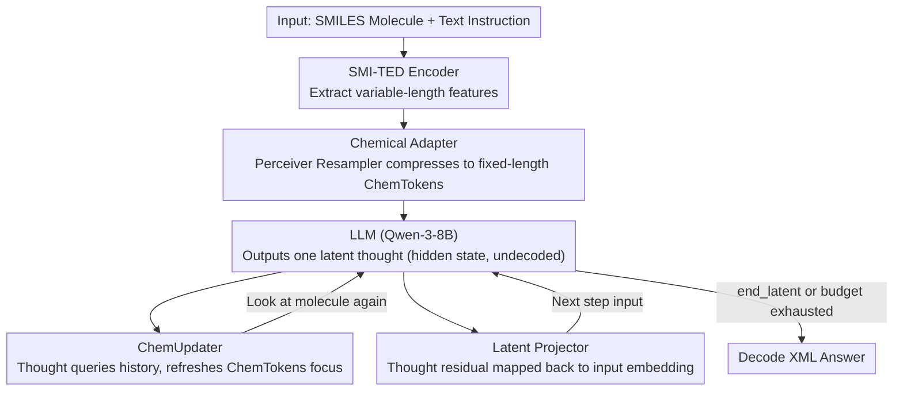

# LatentChem: From Textual CoT to Latent Thinking in Chemical Reasoning

**Conference**: ICML 2026  
**arXiv**: [2602.07075](https://arxiv.org/abs/2602.07075)  
**Code**: Available (The paper claims GitHub + HuggingFace are public, but exact links are not provided in the footnotes)  
**Area**: LLM Reasoning / Scientific Computing (Chemical LLM)  
**Keywords**: chemical reasoning, latent thinking, continuous thinking vectors, GRPO, modality mismatch

## TL;DR
LatentChem replaces "explicit CoT text chains" with "continuous latent thinking vectors + dynamic molecular-aware updates" in chemical LLMs. Under GRPO outcome-only rewards, the model was observed to **spontaneously abandon text CoT** in favor of latent reasoning. It achieved a non-tie win rate of 59.88% against explicit CoT baselines on ChemCoTBench, with an average 10.84x reduction in reasoning steps and a 5.96x wall-clock speedup.

## Background & Motivation

**Background**: Current chemical LLMs (such as domain-tuned models based on Qwen-3 + SMI-TED encoders) almost exclusively follow the "explicit CoT" route—forcing continuous physicochemical intuitions like electron delocalization, steric hindrance, and functional group modifications into linearized chains of natural language tokens before producing answers. Benchmarks like Mol-Instructions and ChemCoTBench also default to text CoT as the reasoning interface.

**Limitations of Prior Work**: The intrinsic property landscape of chemistry is a high-dimensional continuous manifold (where properties like LogP and QED change smoothly with structure), but text tokens are discrete, low-bandwidth symbols. Translating an action like "adding a methyl group"—which could be completed in a single structural step—into dozens of tokens such as "analyze binding site → verify valence bonds → describe addition" creates what the authors call a "jagged staircase" trajectory. This is both slow (explosion in reasoning steps) and prone to hallucination due to drift in long chains.

**Key Challenge**: There is a natural **modality mismatch** between continuous physicochemical dynamics and discrete linguistic symbol channels. Text CoT is neither the native carrier of chemical logic nor necessarily the optimal computational medium. Although existing "latent reasoning" work (like Coconut) moves reasoning into the latent space, they treat molecular embeddings as **static contexts**, failing to refocus on different substructures during the reasoning process.

**Goal**: Construct a chemical-specific latent reasoning interface to answer two questions: (1) When a model is allowed to reason in continuous latent space without being forced to output text CoT, which modality will it spontaneously choose? (2) Is this choice a "shortcut" or a truly superior computational strategy?

**Key Insight**: Decouple reasoning from generation. Natural language serves only as the input/output interface, while intermediate reasoning follows a cycle of "continuous thinking vectors + dynamic perception refreshing." Using GRPO to reward only format legality, structural validity, and answer correctness—without rewarding brevity or penalizing CoT omission—allows the model to autonomously decide whether to use text.

**Core Idea**: Construct a "perception-reasoning" dual-pathway using **ChemUpdater for dynamic molecular representation re-querying** + **latent projector for closed-loop hidden state feedback**. Under outcome-oriented RL, the model will spontaneously internalize CoT into the latent space.

## Method

### Overall Architecture
LatentChem aims to test the hypothesis that forcing continuous physical intuitions of chemistry into discrete text tokens is a "modality mismatch," and that continuous latents are a more native reasoning medium. To this end, it downgrades natural language to a pure I/O interface on a general LLM backbone (defaulting to Qwen-3-8B) and switches intermediate reasoning to a "perception-thinking" dual-pathway. Molecular features extracted by the SMI-TED encoder are first compressed into fixed-length ChemTokens by a Chemical Adapter and injected as soft prompts into the LLM. Following the text instruction, the model continuously outputs several hidden state steps (which are not decoded into text but fed back via a latent projector). For each step, a ChemUpdater queries the history with the latest thought to refresh ChemTokens, allowing the model to "take another look at the molecule" until it outputs `<end_latent>` or exhausts its budget, at which point it decodes the answer. The system is formed through 4-stage curriculum training. Crucially, the final stage uses only outcome rewards without rewarding brevity, yet observes the spontaneous abandonment of text CoT. The following is the data flow during inference (GRPO is the trigger on the training side):

### Key Designs

**1. Chemical Adapter: Making molecular representations fixed-length and re-queryable**

Ordinary prefix tuning simply "plugs in an embedding," but LatentChem requires the ChemUpdater to continuously query the molecule during reasoning. This requires molecular representations to be both fixed-length and faithful to the structure. The Adapter adopts the Perceiver Resampler approach, using $N$ learnable latent queries $\mathbf{Q}$ to perform cross-attention on the variable-length dense features $\mathbf{H}_{mol}\in\mathbb{R}^{L\times d_{enc}}$ from SMI-TED: $\mathbf{H}_{chem}=W(\text{LN}(\mathbf{Q}+\text{MHA}(\mathbf{Q},\mathbf{H}_{mol},\mathbf{H}_{mol})))$. Each query acts as a "semantic anchor" to automatically extract certain chemical attributes, and a linear layer $W$ projects them to $d_{llm}$ dimensions to obtain fixed-length ChemTokens. To prevent the adapter from "cheating" by relying on text priors, Stage 1 adds a counterfactual alignment loss $\mathcal{L}_{CF}$ (a hinge loss maximizing the answer likelihood difference between "clean vs. perturbed molecules") in addition to answer-only supervision. This forces it to compress properties truly needed for the answer into ChemTokens.

**2. ChemUpdater: Upgrading static encoders to differentiable perceptors scheduled by reasoning states**

This is the core distinction between LatentChem and Coconut. Coconut treats molecular embeddings as static context, meaning the longer the latent thinking chain, the further it drifts from the original structure. ChemUpdater allows the model to "look at the molecule again, but at different parts" for each reasoning step. Specifically, it uses the current ChemTokens $\mathbf{H}_{chem}^{(t)}$ as queries to perform cross-attention with the full history of thoughts $\mathbf{Z}_{1:t}$ as keys/values, refreshing with a residual: $\mathbf{H}_{chem}^{(t+1)}=\text{LN}(\mathbf{H}_{chem}^{(t)}+\text{CrossAttn}(\mathbf{H}_{chem}^{(t)},\mathbf{Z}_{1:t},\mathbf{Z}_{1:t}))$. This transforms the molecular encoder from a "one-time static feature extractor" into a "perceptor that dynamically schedules focus based on reasoning states." This is critical for tasks like molecular optimization that require repeated localization of different substructures (binding site → bonds → functional groups)—removing it drops the Success Rate (SR) by 12% in ablations.

**3. Latent Projector: Closing the loop of thought vectors into input space**

To close the reasoning loop in continuous space, thought vectors from the LLM output space must be aligned back to the input space. Otherwise, the model would have to compress thoughts into discrete tokens at each step, falling back into the tokenization bottleneck. The Latent Projector is a lightweight residual FFN: $\mathbf{h}_{t+1}=\mathbf{z}_t+\text{FFN}(\text{LN}(\mathbf{z}_t))$, mapping the raw hidden state $\mathbf{z}_t$ back to the input embedding as the direct input for the next step. This allows the thinking to be passed along in its original form without passing through text. Together with ChemUpdater, it forms the two return edges in the reasoning loop: the projector handles "passing the thought," while ChemUpdater handles "refreshing molecular perception." Removing it drops SR by 10.8%.

**4. GRPO Outcome-Only Reward: Latent as a "modality selection probe" triggering spontaneous internalization**

The first three modules only prepare the interface for "allowing latent reasoning." What turns this into a falsifiable experiment is the reward design in Stage 4. Rewards include only format, validity, and correctness, **completely excluding brevity or CoT omission penalties**. With the latent modules frozen and the backbone unfrozen, the learned latent dynamics serve as a stable "internal simulator" for the backbone's decision-making. Under this pure outcome-driven setting, the model still spontaneously abandoned text CoT, outputting only a "." or ":" as a transition token before directly generating the XML answer. This validates the modality mismatch hypothesis: when given a choice and rewarded only on results, the model's preference for continuous latents proves they are better suited for chemical logic, rather than being a shortcut forced by brevity rewards. Causal ablation (replacing the first $k$ latent steps with Gaussian noise significantly degrades performance) further proves these "silent steps" perform substantial computation.

### Loss & Training
Four-stage curriculum training gradually moves reasoning from text to latents. **Stage 1** trains the adapter + LLM with latent reasoning disabled, using answer-only supervision and counterfactual alignment $\mathcal{L}_{total}^{(1)}=\mathcal{L}_{clean}+\lambda\mathcal{L}_{CF}$ to compress molecular semantics into ChemTokens. **Stage 2** continues training these modules but adds explicit CoT supervision $\mathbf{y}_{full}=[\mathbf{y}_{cot},\mathbf{y}_{ans}]$ and extends counterfactual alignment to the full sequence, teaching the model to reason using text chains. **Stage 3** freezes the adapter + LLM and trains only the ChemUpdater + latent projector, allowing the latent modules to adapt to the fixed semantic space and learn to generate thought vectors that the decoder can process. **Stage 4** freezes the latent modules and unfreezes the backbone, optimizing a composite reward (format + validity + correctness) via GRPO to teach the backbone to use latent thoughts as an internal simulator. Training data is based on the ChemCoTDataset 2025-11 snapshot with ~14k CoT samples, covering molecular understanding, editing, optimization, and reaction prediction.

## Key Experimental Results

### Main Results

| Task | Metric | LatentChem | Stage 1+2+4 (Explicit CoT) | Coconut-Chem | Δ vs CoT |
|------|------|------------|----------------------------|--------------|----------|
| Mol Optim. LogP | SR% | **96** | 77 | 44 | +19 |
| Mol Optim. GSK3-β | SR% | **82** | 67 | 47 | +15 |
| Mol Optim. Solubility | SR% | **89** | 86 | 58 | +3 |
| ChEBI-20 Description | METEOR | **0.15** | 0.05 | 0.07 | +0.10 |
| ChemLLMBench Description | METEOR | **0.16** | 0.07 | 0.04 | +0.09 |
| ChemCoTBench All | Non-tie Win Rate ℛ*_win | **59.88%** | — (Baseline) | 32.11% | Significant |
| ChemLLMBench All | ℛ*_win | **55.58%** | — | 44.82% | Significant |
| ChEBI-20 Open | ℛ*_win | **85.26%** | — | 65.58% | Significant |
| Mol-Instructions All | ℛ*_win | 49.88 | — | 40.57 | Near Tie |

> LatentChem (8B) outperformed the Claude 3.7 Sonnet SOTA reported in ChemCoTBench for molecular optimization. Reasoning steps decreased by an average of 10.84x (up to 29.9x for reaction tasks), with a wall-clock speedup of 5.96x.

### Ablation Study

| Configuration | Mol Optim. SR% ↑ | Mol Description METEOR ↑ |
|------|------------------|--------------------------|
| LatentChem (Full) | **80.67** | **0.143** |
| w/o ChemUpdater | 68.67 (−12.0) | 0.068 (−0.075) |
| w/o Latent Projector | 69.83 (−10.8) | 0.087 (−0.056) |
| w/o Latent Thinking | 71.00 (−9.67) | 0.052 (−0.091) |

**Scale-matched**: Experiments with 4B and 14B backbones repeating LatentChem vs. scale-matched Explicit CoT showed consistent trends with win rates of 52.42% and 51.80% respectively on ChemCoTBench All, indicating the advantage is not merely due to parameter scale.

### Key Findings
- **Spontaneous CoT Internalization in GRPO**: Despite being supervised by explicit CoT throughout Stages 1-3, once only outcome rewards were used in Stage 4, the model actively stopped generating intermediate text. It outputted only a "." or ":" as a transition token before the XML answer—an "internalization" that was not encouraged by any loss, but was a strategic shift driven by rewards.
- **Causal necessity**: Replacing the first $k$ latent steps with Gaussian noise led to significant performance drops, proving these "silent steps" perform actual encoding rather than being ceremonial.
- **Hydraulic trade-off in budget stress tests**: When the latent budget $T \geq 6$, the model generates almost no text CoT. When the budget is constrained to $T < 6$, the model automatically **reactivates text CoT** to compensate for reasoning depth—demonstrating a dynamic scheduling between implicit and explicit reasoning modalities.
- **Functional partitioning of the latent manifold**: t-SNE shows that initial step 0 task representations are fully entangled but rapidly split into task-specific clusters within the first 2 steps, stabilizing by step 10. RSA shows that the Spearman correlation between latent geometry and Tanimoto chemical topology remains stable throughout the reasoning chain—indicating that large latent updates are **orthogonal** to structural encoding and do not destroy physical fidelity.
- **Task dependency**: Latent advantages are overwhelming for open-ended generation tasks (molecular optimization, description). For closed tasks (reaction prediction), latent and CoT are comparable—validating that the core dividend of latents is "creative exploration on continuous manifolds," whereas linguistic tokens suffice for deterministic mappings.

## Highlights & Insights
- **Latent reasoning as an experimental instrument, not just a performance trick**: Instead of a priori declaring "latents are better," the authors construct an interface allowing the model to choose its modality and observe spontaneous behavior under GRPO. This "model choice as evidence" argumentation is highly persuasive and avoids counter-arguments that "latents are stronger simply due to more parameters or longer training."
- **Transferable "dynamic re-perception" via ChemUpdater**: The paradigm of upgrading an encoder from a static source to a "differentiable perceptor queried by reasoning states" is applicable to protein sequences, 3D geometry, and code ASTs where repeated refocusing on substructures is required.
- **Brevity obtained without brevity rewards**: Triggering internalization via outcome-only rewards is a counter-example to "reward hacking = performance degradation." The model choosing short outputs while improving accuracy proves that "shortness" here is not cheating, but a result of identifying latents as more native than text.
- **The "hydraulic trade-off" and cognitive architecture**: The automatic fallback to text CoT under tight latent budgets naturally mirrors the Kahneman System 1/2 framework, which the authors explicitly position as a blueprint for future "hybrid cognitive architectures."

## Limitations & Future Work
- **Interpretability collapse**: The latent reasoning process is opaque to humans. While post-hoc analysis can verify physical grounding, intermediate steps of molecular modification cannot be audited—a critical drawback for scientific applications requiring verifiable reasoning.
- **Mol-Instructions Tie**: The ℛ*_win of 49.88% on this benchmark suggests latent advantages are task-dependent and not universally superior.
- **Training stability and reward sensitivity**: The authors acknowledge that GRPO stability and the robustness of reward weight selection across tasks remain underexplored. Additionally, Stage 4 lacks a separate RL prompt dataset, and data distribution sharing with SFT might lead to source overlap.
- **Dependency on SMI-TED + specific adapter**: Experiments are tied to the Perceiver Resampler structure; transferability to other molecular encoders (e.g., Uni-Mol) has not been verified.
- **Future Work**: The authors suggest a hybrid System 1/2 architecture—using latents for structural computation and decoding latent thoughts back to natural language when justification is needed. An additional extension could be inverse distillation (using latent thoughts to generate human-readable CoT for audit trails).

## Related Work & Insights
- **vs. Coconut (Hao et al., 2025c)**: Coconut moves reasoning to the latent space but keeps molecular embeddings static. LatentChem uses ChemUpdater for dynamic refreshing. Under the same backbone (Qwen-3-8B + SMI-TED), Coconut-Chem only achieved a 32.11% win rate on ChemCoTBench, compared to LatentChem's 59.88%, highlighting the importance of dynamic perception.
- **vs. Explicit Chemical CoT (Stage 1+2+4)**: Using identical network structures and GRPO training but with an explicit CoT interface as the baseline (50%). LatentChem's +9.88pp advantage is purely attributable to the latent interface itself, ensuring a clean control of variables.
- **vs. Compressed reasoning ("contemplation tokens" / "soft capsules")**: These works compress text CoT into a few latent tokens but still treat them as discrete. LatentChem utilizes **fully continuous hidden state loops + dynamic perception refreshing**, demonstrating that outcome-only rewards can trigger modality switching.
- **Insight**: Using outcome-only GRPO in Stage 4 as a "modality selection probe" is a generalizable methodology—to verify if modality X is more suitable than Y for task T, construct an interface supporting both and observe the model's preference under outcome rewards.

## Rating
- **Novelty**: ⭐⭐⭐⭐⭐ "Spontaneous internalization + ChemUpdater dynamic perception" in chemical LLMs is a first-of-its-kind systematic validation; the methodological significance outweighs the engineering value.
- **Experimental Thoroughness**: ⭐⭐⭐⭐ Four benchmarks + three types of baselines + 4B/14B scale-matched + ablations + causal ablation + budget stress tests. It is very comprehensive; one star deducted for not directly comparing with the latest general latent reasoning baselines (e.g., Geiping recursive unrolling).
- **Writing Quality**: ⭐⭐⭐⭐⭐ The logic chain of hypothesis-interface-observation-verification is very clear. The "jagged staircase vs. smooth manifold" concept, Figure 6's hydraulic trade-off, and Figure 7's t-SNE + RSA effectively illustrate abstract phenomena.
- **Value**: ⭐⭐⭐⭐ A paradigm-level contribution to chemical LLMs with a 5.96x speedup. One star deducted as interpretability collapse limits immediate real-world deployment; practical value awaits hybrid System 1/2 sequels.

<!-- RELATED:START -->

## Related Papers

- [\[ACL 2026\] Render-of-Thought: Rendering Textual Chain-of-Thought as Images for Visual Latent Reasoning](../../ACL2026/llm_reasoning/render-of-thought_rendering_textual_chain-of-thought_as_images_for_visual_latent.md)
- [\[ICML 2026\] Conformal Thinking: Risk Control for Reasoning on a Compute Budget](conformal_thinking_risk_control_for_reasoning_on_a_compute_budget.md)
- [\[ICML 2026\] Prioritize the Process, Not Just the Outcome: Rewarding Latent Thought Trajectories Improves Reasoning in Looped Language Models](prioritize_the_process_not_just_the_outcome_rewarding_latent_thought_trajectorie.md)
- [\[ICML 2026\] TRACE: 用 Toulmin 论证模型评 LLM CoT 推理过程质量](trace_toulmin-based_reasoning_assessment_through_constructive_elements_for_llm_c.md)
- [\[AAAI 2026\] L2V-CoT: Cross-Modal Transfer of Chain-of-Thought Reasoning via Latent Intervention](../../AAAI2026/llm_reasoning/l2v-cot_cross-modal_transfer_of_chain-of-thought_reasoning_v.md)

<!-- RELATED:END -->
