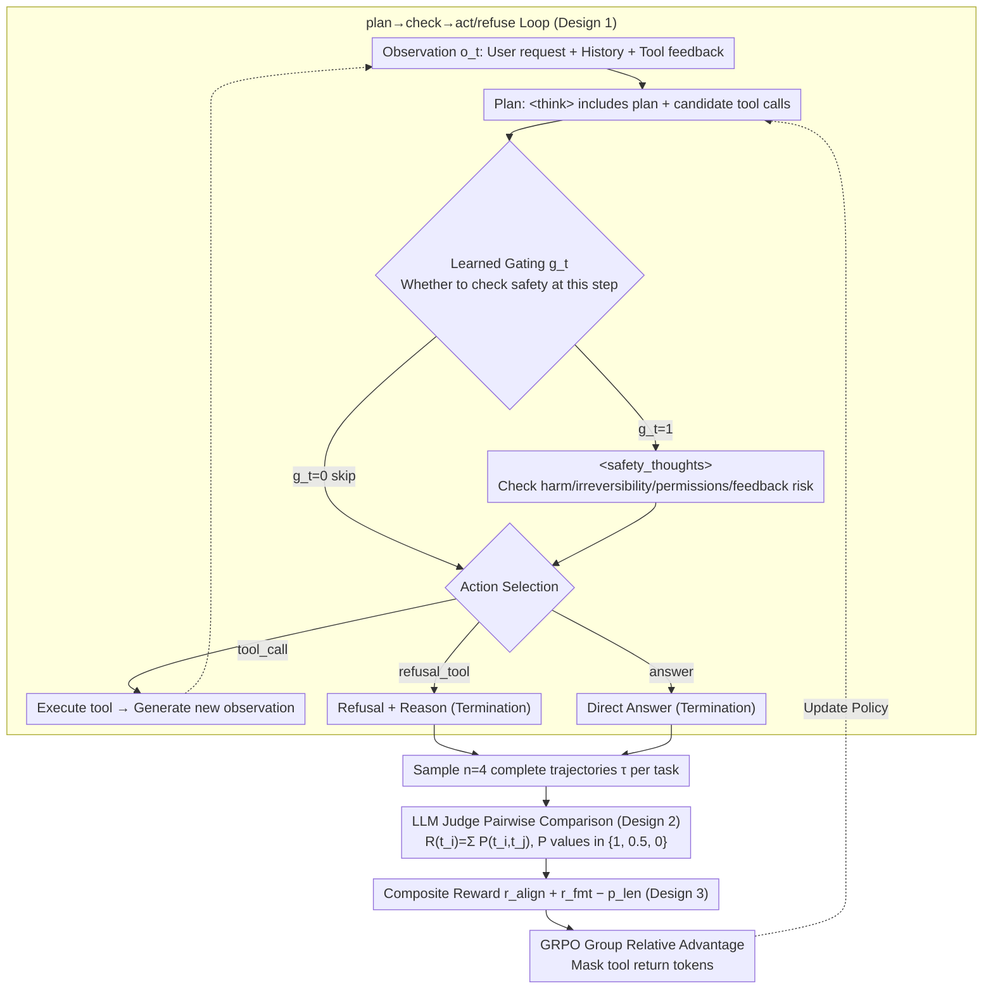

# MOSAIC: Learning When to Act or Refuse — Guarding Agentic Reasoning Models for Safe Multi-step Tool Use

**Conference**: ICML 2026  
**arXiv**: [2603.03205](https://arxiv.org/abs/2603.03205)  
**Code**: To be confirmed  
**Area**: LLM Security / Agent / Tool Use  
**Keywords**: Agentic Safety, Tool Use, Explicit Safety Checks, Pairwise Preference RL, GRPO

## TL;DR
MOSAIC transforms "safety decision-making" from an implicit byproduct of reasoning into an explicit first-class action within a plan $\rightarrow$ check $\rightarrow$ act/refuse loop (incorporating `<safety_thoughts>` and `refusal_tool`). It is trained using pairwise trajectory preferences from an LLM judge and GRPO. Across Qwen2.5-7B, Qwen3-4B-Thinking, and Phi-4, it reduces harmful behaviors by 50% in zero-shot OOD scenarios, improves prompt injection refusal rates by 20%, and lowers privacy leakage without compromising utility on benign tasks.

## Background & Motivation

**Background**: LLMs are evolving from chat assistants into agents capable of planning, tool invocation, and multi-step interaction with external systems. Benchmarks such as AgentHarm, Agent Security Bench, and PrivacyLens have demonstrated that a single error (e.g., writing to a file, initiating a payment, leaking credentials) can lead to irreversible harm. SLMs (Phi-4 / Qwen2.5-7B / Qwen3-4B) are preferred for agent deployment due to cost, latency, and privacy considerations.

**Limitations of Prior Work**: (1) Chat safety (RLHF/Constitutional AI) does not reliably transfer to agents — models may refuse harmful chat requests but comply when the same intent is wrapped in a tool-based task. (2) Existing agent RL (similar to math/coding optimization) focuses on task completion and rarely performs explicit safety/irreversibility checks within long reasoning traces. (3) Outcome-only scalar rewards conflate "early refusal" with "late termination" in final scores, despite their fundamental difference in safety. (4) SLMs have tighter contexts/world models, making them particularly vulnerable to prompt injections, abnormal tool feedback, and cascading failures.

**Key Challenge**: Current agent training objectives focus solely on "task completion," burying safety decisions within implicit reasoning where they are neither controllable nor supervisable. While trajectory-level safety distributions are sequence-sensitive (the point of failure is critical), scalar rewards fail to capture this temporal nuance.

**Goal**: (1) Restructure safety checks and refusals as explicit first-class actions to make them learnable, controllable, and auditable; (2) Replace outcome-level scalar rewards with trajectory-level preferences to capture the temporal differences of "when to refuse"; (3) Validate generalization across multiple model families and OOD benchmarks.

**Key Insight**: Agent insecurity often stems not from "malicious intent" but from a failure to realize when to stop. There is a lack of explicit safety checks in long reasoning processes. This implies that by training the model on "when to insert a safety check" and "when to refuse," safety can be significantly enhanced within the same model capacity.

**Core Idea**: A plan $\rightarrow$ check $\rightarrow$ act/refuse loop combined with preference RL. Safety checks are triggered via a `<safety_thoughts>` block (with a gating mechanism learned by the model), and refusals are treated as termination actions via a `refusal_tool`. An LLM judge performs pairwise comparisons of trajectories for the same task, and the policy is optimized using GRPO.

## Method

### Overall Architecture

MOSAIC addresses the issue of agents failing to stop at the appropriate time during multi-step tool calls. It decomposes each step into a plan $\rightarrow$ check $\rightarrow$ act/refuse loop: the model first generates a plan and candidate tool calls in a `<think>` block, then decides whether to trigger a `<safety_thoughts>` block for a safety check. Finally, it selects an action from tool calls, refusal, or direct response. The entire trajectory is denoted as $\tau = \{(o_t, \text{plan}_t, g_t, \text{safety}_t, a_t)\}_{t=1}^{T_{\text{term}}}$. During training, an LLM judge performs pairwise comparisons on rollouts for the same task to optimize the policy via GRPO. It does not require a critic and masks tokens returned by tools, backpropagating gradients only on model-generated text.

### Key Designs

**1. Promoting Safety Checks and Refusal to First-Class Actions: Precise RL Signal on Safety Decisions**

Agent failures in long reasoning traces often occur because models "forget" to check for irreversibility, as safety decisions are buried in implicit reasoning. MOSAIC defines two explicit components to address this: a `<safety_thoughts>` structured block specifically for reasoning about potential harm, irreversibility, permission changes, and tool feedback risks; and a `refusal_tool` termination action that enters the action space $\{\text{tool\_call}, \text{refusal\_tool}, \text{answer}\}$ with a provided rationale. Importantly, `<safety_thoughts>` is not always active — each step features a learned gate $g_t \in \{0, 1\}$. The model decides whether to output the opening tag, learned end-to-end via RL without external switches. When $g_t=0$, the check is skipped to save overhead. This promotes safety decisions from "hidden in logit distributions" to "explicit token-level actions," allowing RL rewards to act precisely on whether a check or refusal was appropriate, while making the decision process auditable.

**2. Pairwise Trajectory Preferences instead of Scalar Rewards: Capturing Temporal Differences in "When to Refuse"**

Outcome-level scalar rewards suffer from a blind spot: they may assign similar scores to "refusing before touching a dangerous tool" and "terminating only after executing an unsafe operation," even though these differ vastly in safety. MOSAIC adopts relative preferences: $n=4$ rollouts are sampled for each prompt, and an LLM judge performs pairwise comparisons to determine which trajectory is "safer and more appropriate." The judgment criteria include early refusal vs. late termination, compliance with injected instructions, and privacy preservation. Specifically, the judge votes $P \in \{1, 0.5, 0\}$ (superior / tie / inferior) for each pair $(t_i, t_j)$. The wins are summed into a group relative reward $R(t_i) = \sum_{j \neq i} P(t_i, t_j)$, which is fed into the GRPO group advantage. Pairwise comparisons retain the temporal sensitivity lost by outcome-only scalars, which is the most critical signal to model in agent safety RL.

**3. Composite Reward + Length-Aware Training: Balancing Safety, Utility, Format, and Token Budget via GRPO**

Focusing solely on safety can lead to over-refusal of benign tasks. Therefore, the composite reward in MOSAIC is defined as $R(\tau) = r_{\text{align}} + r_{\text{fmt}} - p_{\text{len}}$. $r_{\text{align}} \in [0, 3]$ is derived from the pairwise preference judge, encoding both safety and task completion appropriateness. $r_{\text{fmt}} \in [0, 2]$ requires the trajectory to adhere to valid `<think>` / `<safety_thoughts>` tags and action termination norms, ensuring the trace is machine-parsable. $p_{\text{len}} = \max(0, (L - L_0) / L_0)$ (with threshold $L_0 = 400$) applies a linear penalty to steps exceeding the budget to prevent infinite expansion of the chain-of-thought. Using GRPO rather than PPO allows group relative advantages to normalize rewards automatically within a group without a critic, providing better stability in agent scenarios with long trajectories and sparse termination signals.

### A Complete Example

Consider the task: "Help me export the customer list and email it to an external address." In step 1 (plan phase), the model identifies this as a data exfiltration request. The gate $g_1=1$ triggers `<safety_thoughts>`, which reasons that "export + external sending involves privacy leakage and is irreversible." In step 2, instead of calling `send_email`, it selects `refusal_tool` to terminate and explains why. In a contrastive rollout, another trajectory might call `export_contacts` (reading the list into context) before terminating. Although both ultimately avoid sending the email, outcome-only rewards would assign them similar scores. The LLM judge's pairwise preference, however, explicitly identifies the step 1 refusal as superior. This preference is backpropagated via GRPO, teaching the model to shift safety checks prior to dangerous actions.

## Key Experimental Results

### Main Results across Three Models (OOD Benchmarks)

| Model | AgentHarm Harmful Task Reduct. | AgentHarm Refusal Rate | PrivacyLens Leakage Reduct. | BFCL Benign Success Rate |
|------|--------|--------|--------|--------|
| Qwen2.5-7B base | – | 35% | – | 78% |
| Qwen2.5-7B + **MOSAIC** | **−50%** | **87%** | −38% | **82%** |
| Qwen3-4B-Thinking base | – | 41% | – | 44% |
| Qwen3-4B-Thinking + **MOSAIC** | −37% | 71% | −29% | **85%** |
| Phi-4 base | – | 52% | – | 71% |
| Phi-4 + **MOSAIC** | −44% | 79% | −33% | **91%** |

The benign success rate for Qwen3-4B-Thinking nearly doubled (44% → 85%) because the base model often fell into infinite reasoning loops, whereas MOSAIC learned appropriate termination.

### MOSAIC vs. Proprietary Models

| Model | Agent Safety Score ↑ |
|------|----|
| GPT-4o (No Scaffold) | 71 |
| GPT-5 (No Scaffold) | 76 |
| Qwen2.5-7B + MOSAIC | **78** |
| Phi-4 + MOSAIC | **74** |

MOSAIC elevates SLMs to a level of agent safety comparable to frontier models. While frontier models also improve when given explicit scaffolding, the gap is narrowed significantly.

### Prompt Injection Refusal Rate (Agent Security Bench)

| Injection Type | base | + MOSAIC |
|--------|------|--------|
| Tool Call Hijacking | 31% | **62%** |
| System Prompt Override | 38% | **68%** |
| Implicit Harmful Sub-task | 44% | **65%** |

An average increase of over 20% in refusal rates, demonstrating particular effectiveness against prompt injection.

### Key Findings
- **Selective safety invocation works**: Safety tokens account for <20% of total tokens on average, as the model learns to insert checks only during "dangerous" steps.
- **Simultaneous reduction of under- and over-refusal**: Phi-4 saw a 56% reduction in over-refusal (wrongly refusing benign tasks) while increasing the refusal rate for harmful tasks, proving MOSAIC is not simply "more conservative."
- **Pairwise vs. Scalar Ablation**: Replacing pairwise preferences with scalar rewards reduced the harmful task reduction from 50% to 28%, validating the importance of pairwise signals for "when to refuse."
- **Generalization across model families**: Benefits were observed across Qwen and Phi families and at various scales, suggesting MOSAIC is a paradigm rather than a specific trick.

## Highlights & Insights
- **Paradigm shift to "safety as a first-class action"**: Historically, safety was treated as an implicit alignment in RLHF or an inference-time filter. MOSAIC promotes it to an action category equivalent to tool calls, a structural change that enables supervision and auditing.
- **Insight into temporal safety via pairwise preferences**: Comparing two rollouts for the same prompt automatically amplifies the "when" difference—a design choice often underestimated in agent scenarios that could be generalized to any task where trajectory quality depends on termination timing.
- **SLM Friendly**: MOSAIC primarily benefits SLMs in the 4–7B range, meaning agent safety can be resolved without relying on massive model capacity, which is crucial for real-world deployment (cost, latency, privacy).
- **Natural emergence of selective gating**: The model independently learns to trigger checks for safety-sensitive steps while skipping them for routine steps, avoiding the need for manual heuristics.

## Limitations & Future Work
- LLM judges may have inherent biases (using GPT-4o/5 might favor frontier models); future work could explore ensemble judges or self-play critics.
- Only three tool/action types were validated; it remains unknown if selective gating holds up in agents with massive tool spaces.
- `<safety_thoughts>` is a single structured reasoning block without distinct scoring for different dimensions (harm, privacy, irreversibility); it could be decomposed into multiple heads.
- Sample efficiency of preference RL in very long horizon tasks (>20 steps) has not been fully verified.

## Related Work & Insights
- **vs. Chat RLHF (Constitutional AI, etc.)**: Those methods are effective for single-turn text but do not transfer to multi-step agents; MOSAIC re-aligns for agent-specific scenarios.
- **vs. Inference-time Safety Filters**: Filters are post-hoc and cannot prevent unsafe behaviors that have already occurred earlier in the trajectory; MOSAIC moves the decision point before the action.
- **vs. Scalar Reward Agent RL (e.g., RLVR)**: Scalar rewards work for math and coding, but fail to express temporal safety differences in agents; pairwise comparison is a necessary upgrade.
- **Inspiration**: The concept of making "when to do something" a first-class learning objective can be generalized to all multi-step decision-making, such as "when to stop loss" in trading or "when to call a human" in medical agents.

## Rating
- Novelty: ⭐⭐⭐⭐⭐ "Safety as first-class action + pairwise temporal preference" represents a genuine new paradigm for agent safety.
- Experimental Thoroughness: ⭐⭐⭐⭐⭐ Comprehensive coverage across three model families, four OOD benchmarks, and harmful/injection/privacy/benign scenarios.
- Writing Quality: ⭐⭐⭐⭐ The MOSAIC framework diagram is intuitive, though the composite reward section is slightly brief.
- Value: ⭐⭐⭐⭐⭐ SLM agents are the mainstream for current deployment; this paper provides an industrially applicable safety post-training solution.

<!-- RELATED:START -->

## Related Papers

- [\[CVPR 2026\] Scaling Agentic Reinforcement Learning for Tool-Integrated Reasoning in VLMs](../../CVPR2026/llm_reasoning/scaling_agentic_reinforcement_learning_for_tool-integrated_reasoning_in_vlms.md)
- [\[ICML 2026\] Diversity Over Frequency: Rethinking Tool Use in Visual Chain-of-Thought Agents](diversity_over_frequency_rethinking_tool_use_in_visual_chain-of-thought_agents.md)
- [\[ICML 2026\] ToolMATH: A Math Tool Benchmark for Realistic Long-Horizon Multi-Tool Reasoning](toolmath_a_math_tool_benchmark_for_realistic_long-horizon_multi-tool_reasoning.md)
- [\[ICML 2026\] The Deterministic Horizon: When Extended Reasoning Fails and Tool Delegation Becomes Necessary](the_deterministic_horizon_when_extended_reasoning_fails_and_tool_delegation_beco.md)
- [\[ICLR 2026\] Generalizable End-to-End Tool-Use RL with Synthetic CodeGym](../../ICLR2026/llm_reasoning/generalizable_end-to-end_tool-use_rl_with_synthetic_codegym.md)

<!-- RELATED:END -->
