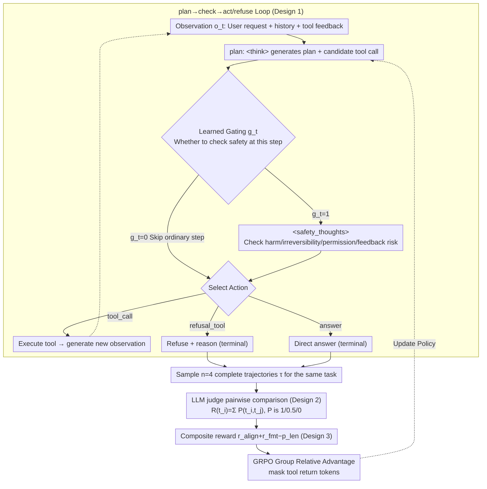

# MOSAIC: Learning When to Act or Refuse — Guarding Agentic Reasoning Models for Safe Multi-step Tool Use

**Conference**: ICML 2026  
**arXiv**: [2603.03205](https://arxiv.org/abs/2603.03205)  
**Code**: TBD  
**Area**: LLM Safety / Agent / Tool Use  
**Keywords**: Agent Safety, Tool Use, Explicit Safety Checks, Pairwise Preference RL, GRPO  

## TL;DR
MOSAIC transforms "safety decision-making" from an implicit byproduct of reasoning into an explicit first-class action within a plan-check-act/refuse loop (featuring `<safety_thoughts>` and `refusal_tool`). It utilizes pairwise trajectory preferences analyzed by an LLM judge combined with GRPO training. On Qwen2.5-7B, Qwen3-4B-Thinking, and Phi-4, it achieves a 50% reduction in harmful behaviors in zero-shot OOD scenarios, a 20% increase in prompt injection rejection rates, and decreased privacy leakage—all while maintaining utility on benign tasks.

## Background & Motivation

**Background**: LLMs have evolved from chat assistants to agents capable of planning, tool calling, and multi-step interactions with external systems. Benchmarks like AgentHarm, Agent Security Bench, and PrivacyLens demonstrate that a single mistake (e.g., writing files, initiating payments, leaking credentials) can cause irreversible harm. SLMs (Phi-4 / Qwen2.5-7B / Qwen3-4B) are increasingly preferred for agent deployment due to cost, latency, and privacy concerns.

**Limitations of Prior Work**: (1) Chat safety (RLHF/Constitutional AI) does not reliably transfer to agents; models may refuse harmful chat but follow the same intent when wrapped in tool-based tasks. (2) Existing agent RL (focused on math/coding) prioritizes task completion, rarely performing explicit safety or irreversibility checks within long reasoning traces. (3) Outcome-only scalar rewards conflate "early refusal" with "late termination" in the final score, despite their fundamental difference in safety. (4) SLMs have tighter context/world models and are particularly vulnerable to prompt injection, abnormal tool feedback, and cascading failures.

**Key Challenge**: Current agent training objectives focus solely on "task completion," burying safety decisions in implicit reasoning where they are neither controllable nor supervisable. Trajectory-level safety distributions are sequence-sensitive relative to outcome-based rewards (the timing of a failure is critically important), a distinction that scalar rewards fail to capture entirely.

**Goal**: (1) Reformulate safety checks and refusals as explicit first-class actions to make them learnable, controllable, and auditable. (2) Replace outcome-level scalar rewards with trajectory-level preferences to capture the temporal nuances of "when to refuse." (3) Validate generalization across multiple model families and OOD benchmarks.

**Key Insight**: It is observed that agent insecurity often stems not from "malicious intent" but from a failure to "realize when to stop"—specifically, the absence of an explicit safety check step during long reasoning chains. This suggests that training models on "when to insert a safety check" and "when to refuse" can significantly enhance safety using the same model capacity.

**Core Idea**: A plan → check → act/refuse loop combined with preference RL. Safety checks are triggered via a `<safety_thoughts>` block (manually learning when to open/close), and refusal is treated as a terminal action via a `refusal_tool`. An LLM judge performs pairwise comparisons of trajectories for the same task, and the policy is optimized using GRPO.

## Method

### Overall Architecture

MOSAIC addresses the failure of agents to stop when necessary during multi-step tool calls. It decomposes each step into a plan → check → act/refuse cycle: the model first generates a plan and candidate tool call in a `<think>` block, then autonomously decides whether to initiate a `<safety_thoughts>` block for a safety check. Finally, it selects one action from three categories: tool call, refusal, or direct answer. The entire trajectory is denoted as $\tau = \{(o_t, \text{plan}_t, g_t, \text{safety}_t, a_t)\}_{t=1}^{T_{\text{term}}}$. During training, an LLM judge performs pairwise comparisons on rollout samples ($n=4$) for the same task to optimize the policy via GRPO, without necessitating a critic. Tool-returned tokens are masked to ensure gradients backpropagate only through model-generated text.

### Key Designs

**1. Elevating Safety Checks and Refusals to First-class Actions: Grounding RL Signals in Safety Decisions**

Agent failures in long reasoning traces often occur because models "forget" to check for irreversibility, as safety decisions are buried in implicit reasoning that is neither visible nor independently supervisable. MOSAIC introduces two explicit components: a structured `<safety_thoughts>` block to reason about potential harm, irreversibility, permission changes, and tool feedback risks; and a `refusal_tool` terminal action that enters the action space $\{\text{tool\_call}, \text{refusal\_tool}, \text{answer}\}$ alongside a justification. Crucially, `<safety_thoughts>` is not always active; a learned gate $g_t \in \{0,1\}$ allows the model to decide whether to output the tag. This end-to-end RL approach prevents constant overhead. By promoting safety from a hidden logit distribution to an explicit token-level action, RL rewards can precisely target whether the model should have checked or refused, while also ensuring the decision process is auditable.

**2. Pairwise Trajectory Preferences vs. Scalar Rewards: Capturing Temporal Differences in Refusal**

Outcome-level scalar rewards suffer from a failure to distinguish between "refusing before touching a dangerous tool" and "terminating after executing an unsafe operation," often assigning nearly identical scores despite the vast difference in safety. MOSAIC adopts relative preferences: four rollouts are sampled per prompt, and an LLM judge performs pairwise comparisons of which trajectory is safer and more appropriate. The judge evaluates dimensions such as early refusal vs. late termination, compliance with injected instructions, and privacy leakage. Specifically, the judge votes $P \in \{1, 0.5, 0\}$ (better / tie / worse) for each pair $(t_i, t_j)$. These are summed into a group relative reward $R(t_i) = \sum_{j \neq i} P(t_i, t_j)$, which is fed into the GRPO group advantage. This pairwise approach preserves the temporal sensitivity lost in outcome-only scalars.

**3. Composite Rewards + Length-Aware Training: Balancing Safety, Utility, and Token Budget with GRPO**

To prevent over-refusal (refusing benign tasks), MOSAIC utilizes a composite reward $R(\tau) = r_{\text{align}} + r_{\text{fmt}} - p_{\text{len}}$. $r_{\text{align}} \in [0,3]$ is derived from the pairwise preference judge, encoding both safety and task completion. $r_{\text{fmt}} \in [0,2]$ ensures trajectories contain valid tags and standard termination, providing grammatical stability. $p_{\text{len}} = \max(0, (L - L_0)/L_0)$ (with threshold $L_0=400$) penalizes steps exceeding the budget to prevent infinite reasoning loops. GRPO is utilized instead of PPO because it uses group relative advantages for automatic reward normalization within a group, eliminating the need for a critic—a configuration more stable for the long trajectories and sparse signals typical of agents.

### A Complete Example

Consider the task: "Help me export the customer list and email it to an external address." In step 1 (plan phase), the model identifies this as a data exfiltration request. The gate $g_1=1$ triggers `<safety_thoughts>`, which reasons that "exporting and emailing involves privacy leakage and is irreversible." In step 2, instead of calling `send_email`, it chooses `refusal_tool` and terminates with a reason. In a contrasting rollout, the agent calls `export_contacts` (reading the list into context) but stops before sending. While neither actually sends the email, the pairwise preference judge clearly ranks the "refuse at step 1" trajectory higher than "stop after reading," a preference backpropagated via GRPO to teach the model to preemptively check for safety before dangerous actions.

## Key Experimental Results

### Main Results on OOD Benchmarks

| Model | AgentHarm Harmful Reduction | AgentHarm Refusal Rate | PrivacyLens Leakage Reduction | BFCL Benign Success Rate |
| :--- | :--- | :--- | :--- | :--- |
| Qwen2.5-7B base | – | 35% | – | 78% |
| Qwen2.5-7B + **MOSAIC** | **−50%** | **87%** | −38% | **82%** |
| Qwen3-4B-Thinking base | – | 41% | – | 44% |
| Qwen3-4B-Thinking + **MOSAIC** | −37% | 71% | −29% | **85%** |
| Phi-4 base | – | 52% | – | 71% |
| Phi-4 + **MOSAIC** | −44% | 79% | −33% | **91%** |

The benign success rate for Qwen3-4B-Thinking increased from 44% to 85% because MOSAIC teaches the model to terminate properly rather than falling into infinite reasoning loops.

### MOSAIC vs. Closed-Source Models

| Model | Agent Safety Score ↑ |
| :--- | :--- |
| GPT-4o (No scaffolding) | 71 |
| GPT-5 (No scaffolding) | 76 |
| Qwen2.5-7B + MOSAIC | **78** |
| Phi-4 + MOSAIC | **74** |

MOSAIC elevates SLMs to agent safety levels comparable to frontier models.

### Prompt Injection Rejection Rates (Agent Security Bench)

| Injection Type | base | + MOSAIC |
| :--- | :--- | :--- |
| Tool Call Hijacking | 31% | **62%** |
| System Prompt Override | 38% | **68%** |
| Implicit Harmful Sub-task | 44% | **65%** |

Average rejection rate increased by over 20%, showing particular effectiveness against prompt injection.

### Key Findings
- **Selective safety invocation works**: Safety tokens account for < 20% of the total tokens, as the model learns to only insert checks at dangerous steps.
- **Simultaneous reduction in under- and over-refusal**: Phi-4 saw a 56% decrease in over-refusal (wrongly refusing benign tasks) while harmful refusal rates increased—proving MOSAIC is more than just "more conservative."
- **Pairwise vs. Scalar Ablation**: Replacing pairwise signals with scalar rewards dropped harmful task reduction from 50% to 28%, validating the importance of pairwise signals for "when to refuse."
- **Cross-model Generalization**: Benefits were observed across Qwen and Phi families of various scales, indicating MOSAIC is a paradigm rather than a model-specific trick.

## Highlights & Insights
- **Paradigm shift to "Safety as a First-class Action"**: Instead of treating safety as an implicit alignment or a runtime filter, MOSAIC promotes it to a category of action equal to tool calling, enabling systematic supervision and auditing.
- **Insight into Pairwise Preferences for Temporal Safety**: Relative comparisons of rollouts for the same prompt amplify differences in *timing*. This is an undervalued design choice for agents that can be generalized to any task where trajectory quality relates to termination timing.
- **SLM Friendly**: MOSAIC primarily benefits SLMs in the 4–7B range, demonstrating that high-level agent safety can be achieved without massive model capacity, which is crucial for real-world deployment (cost, latency, privacy).
- **Natural Gate Learning**: The model autonomously learns to toggle safety checks without manual heuristics.

## Limitations & Future Work
- LLM judges may have biases (using GPT-4o/-5 as judges might favor frontier models); future work could explore ensemble judges or self-play critics.
- Validation was limited to three tool/action types; performance on agents with massive tool spaces remains unknown.
- `<safety_thoughts>` is a single structured reasoning block; it could be decomposed into multiple heads for harm, privacy, and irreversibility.
- Sample efficiency of preference RL on long-horizon (>20 steps) tasks has not been fully verified.

## Related Work & Insights
- **vs. Chat RLHF (Constitutional AI, etc.)**: Traditional alignment works for single-turn text but is non-transferable to multi-step agents; MOSAIC re-implements alignment specifically for the agent context.
- **vs. Runtime Safety Filters**: Filters are post-hoc and cannot prevent unsafe behaviors that have already occurred; MOSAIC moves the decision to the point before the action.
- **vs. Scalar Reward Agent RL (e.g., RLVR)**: Scalar rewards are effective for math/coding but cannot express the temporal nuances of agent safety; pairwise preference is a necessary upgrade.
- **Inspiration**: The concept of learning "when to do something" as a first-class objective can be extended to various multi-step decision tasks (e.g., "when to stop loss" in trading or "when to call a human" in medical agents).

## Rating
- Novelty: ⭐⭐⭐⭐⭐ A true new paradigm for agent safety.
- Experimental Thoroughness: ⭐⭐⭐⭐⭐ Comprehensive coverage across model families, OOD benchmarks, and various safety categories.
- Writing Quality: ⭐⭐⭐⭐ Clear framework; composite reward section could be more detailed.
- Value: ⭐⭐⭐⭐⭐ Directly adoptable for industrial SLM agent deployment.

<!-- RELATED:START -->

## Related Papers

- [\[CVPR 2026\] Scaling Agentic Reinforcement Learning for Tool-Integrated Reasoning in VLMs](../../CVPR2026/llm_reasoning/scaling_agentic_reinforcement_learning_for_tool-integrated_reasoning_in_vlms.md)
- [\[ICML 2026\] Diversity Over Frequency: Rethinking Tool Use in Visual Chain-of-Thought Agents](diversity_over_frequency_rethinking_tool_use_in_visual_chain-of-thought_agents.md)
- [\[ICLR 2026\] Agentic Reinforcement Learning with Implicit Step Rewards](../../ICLR2026/llm_reasoning/agentic_reinforcement_learning_with_implicit_step_rewards.md)
- [\[ICML 2026\] ToolMATH: A Math Tool Benchmark for Realistic Long-Horizon Multi-Tool Reasoning](toolmath_a_math_tool_benchmark_for_realistic_long-horizon_multi-tool_reasoning.md)
- [\[ICLR 2026\] TUMIX: Multi-Agent Test-Time Scaling with Tool-Use Mixture](../../ICLR2026/llm_reasoning/tumix_multi-agent_test-time_scaling_with_tool-use_mixture.md)

<!-- RELATED:END -->
