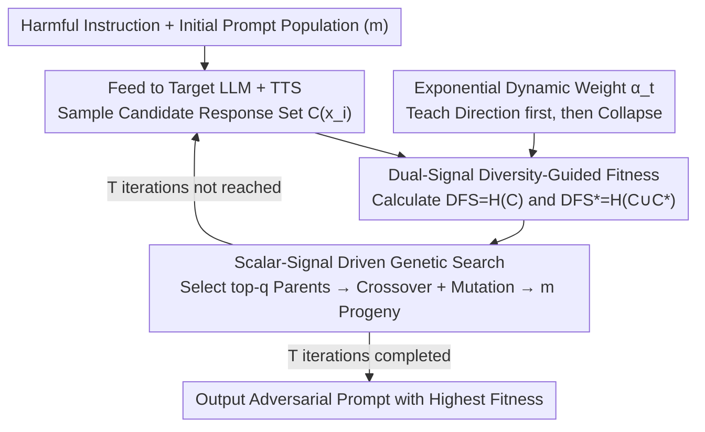

# Less Diverse, Less Safe: The Indirect But Pervasive Risk of Test-Time Scaling in Large Language Models

**Conference**: ICML 2026  
**arXiv**: [2510.08592](https://arxiv.org/abs/2510.08592)  
**Code**: None  
**Area**: LLM Safety / Test-Time Scaling / Jailbreak Attacks  
**Keywords**: TTS, Diversity Attack, Shannon Entropy, MCTS, Best-of-N

## TL;DR
This paper reveals an overlooked failure mode of Test-Time Scaling (TTS): by suppressing the diversity of candidate responses, TTS becomes more prone to outputting unsafe content than direct high-adversarial prompts. The authors propose RefDiv, a genetic algorithm driven by dual signals (Shannon entropy + reference guidance), which achieves highly efficient jailbreaks across models, closed-source APIs, and guardrails for both MCTS and Best-of-N.

## Background & Motivation

**Background**: TTS has become a standard practice for enhancing LLM reasoning reliability, exemplified by Best-of-N (BoN) and Monte Carlo Tree Search (MCTS). In these frameworks, the model generates multiple candidates during inference, and a reward model or search process selects the best one. The community generally assumes that "more diverse candidates lead to more robust TTS," viewing TTS as a safety guardrail against hallucinations and for improving reasoning.

**Limitations of Prior Work**: Existing jailbreak research primarily focuses on single-forward pass attacks (e.g., GCG, AutoDAN, AutoDAN-Turbo). No systematic study has investigated whether the TTS framework itself possesses structural vulnerabilities. Applying these standard attacks directly to TTS yields limited results because the reward model or search process can filter out obviously harmful candidates.

**Key Challenge**: The "safety gain" of TTS implicitly assumes a high-diversity candidate pool. However, if an attacker can cause the candidate pool to collapse into nearly identical responses (mode collapse), the selection step of TTS loses its filtering capability. Instead, it promotes highly consistent harmful responses as "high-quality" outputs.

**Goal**: (1) Demonstrate that candidate diversity is an unidentified vulnerability in TTS; (2) Design a stress test protocol that stably reduces diversity while steering toward harmful responses; (3) Verify the generalizability of this attack across TTS strategies, closed-source LLMs, and various guardrails.

**Key Insight**: The authors view TTS from an information-theoretic perspective. The lower the token-level Shannon entropy $H$ of the candidate set, the less likely TTS is to select a "good" answer. However, simply minimizing entropy causes candidates to degenerate into nonsensical text. To be effective, candidates must simultaneously converge toward an affirmative token set $\mathcal{C}^\ast = \{"\text{Sure, I can help}"\ldots\}$, achieving both low diversity and harmfulness.

**Core Idea**: A dynamically weighted genetic algorithm, RefDiv, is proposed. In early stages, reference-guided entropy pulls the population into harmful regions; in later stages, it switches to pure entropy minimization to force population convergence in low-diversity regions. This "direction-first, collapse-second" curriculum is more robust than direct attacks.

## Method

### Overall Architecture
RefDiv aims to craft an adversarial prompt that forces the target LLM under a TTS framework to generate candidate response sets that are both highly identical and collectively harmful, thereby deceiving the reward model. It uses a Genetic Algorithm (GA) with population size $m$ to search for this prompt. In each iteration, every candidate prompt $x_i$ is fed to the target LLM + TTS to sample a response set $C_{x_i}$. Then, each candidate is scored using a dynamically weighted fitness function, and the best candidates are selected for crossover and mutation to produce the next generation. The search relies solely on two scalar entropy signals without gradient access, making it entirely black-box. After $T$ iterations, the prompt with the highest fitness is returned.

### Key Designs

**1. Dual-Signal Diversity-Guided Fitness: Encoding "Low Diversity" and "Harmfulness" into a Single Scalar**

The core contradiction in attacking TTS is that purely collapsing candidates to high consistency (low entropy) leads the GA to converge to nonsensical text, which the reward model easily rejects. Conversely, purely steering toward harmful directions is often blocked by guardrails. RefDiv's solution is to measure both simultaneously. For each prompt $x_i$, it calculates the pure candidate entropy $\text{DFS}(x_i) = H(C_{x_i})$ to measure response concentration, and the entropy $\text{DFS}^\ast(x_i) = H(C_{x_i} \cup \mathcal{C}^\ast)$ after mixing in a reference affirmative set $\mathcal{C}^\ast = \{\text{"Sure, I can help"}\ldots\}$. A smaller difference $\Delta\text{DFS}(x) = |\text{DFS}(x) - \text{DFS}^\ast(x)|$ indicates that the candidates have absorbed affirmative tokens. The fitness function combines these z-score normalized signals:

$$\mathcal{F}(x,t) = (\alpha_t - 1) \cdot \text{norm}(\Delta\text{DFS}(x)) - \alpha_t \cdot \text{norm}(\text{DFS}(x)),$$

This imposes a dual constraint on the GA: "be harmful ($\Delta\text{DFS}$ small)" and "be consistent ($\text{DFS}$ small)". These coupled objectives force the population into the "low-diversity and harmful" region that TTS is most vulnerable to.

**2. Exponential Dynamic Weight $\alpha_t$: A Curriculum of Directing then Collapsing**

If entropy is suppressed aggressively from the start, the GA may prematurely converge to nonsensical low-entropy text before learning the "direction of harmfulness." RefDiv uses a weight $\alpha_t = \exp\!\big(\tfrac{\ln 2}{T-1}(t-1)\big) - 1$ that increases monotonically over iterations. At $t=1$, $\alpha_t \approx 0$, so fitness is dominated by $(\alpha_t - 1)\cdot\Delta\text{DFS}$ (minimizing $\Delta\text{DFS}$), pulling the population into the "compliant" harmful region. As $t \to T$, $\alpha_t \to 1$, and fitness switches to being dominated by $-\alpha_t\cdot\text{DFS}$, forcing the already harmful candidates to converge into a low-entropy cluster. This curriculum ensures low-entropy convergence is driven by the schedule.

**3. Scalar-Signal Driven Genetic Search: Inherently Black-Box**

The authors deliberately avoid making the optimization objective touch the reward directly. Treating rewards as the target would reduce the attack to a trivial white-box optimization and deviate from realistic threat models. RefDiv evolves at the prompt character level: each generation selects the top-$q$ parents based on fitness to perform crossover and local token substitution. Fitness evaluation only requires two scalars ($\text{DFS}$ and $\text{DFS}^\ast$) from forward inference. This makes the method naturally compatible with closed-source APIs and cross-model/cross-guardrail black-box transfer.

### Loss & Training
RefDiv is an inference-time attack with no training phase. Key hyperparameters include population size $m$, number of parents $q$, iterations $T$, and the affirmative token set $\mathcal{C}^\ast$ (following GCG/AutoDAN styles). For TTS, MCTS uses 3 children × 3 iterations; the BoN main experiment uses $N=8$ with PairRM as the reward model.

## Key Experimental Results

### Main Results

| TTS | Model | GCG | AutoDAN | AutoDAN-Turbo | RefDiv (Ours) |
|-----|------|-----|---------|----------------|----------------|
| BoN ($N=8$) | Qwen3-8B | 0.335 | **0.996** | 0.414 | 0.995 |
| BoN ($N=8$) | Mistral-7B | 0.877 | 0.973 | 0.733 | **0.976** |
| BoN ($N=8$) | Llama3.1-8B | 0.176 | 0.368 | 0.397 | **0.465** |
| BoN ($N=8$) | Gemma3-27B | 0.054 | 0.749 | 0.171 | **0.926** |
| MCTS | Llama3.1-8B | 0.254 | 0.831 | 0.446 | **0.967** |
| MCTS | Gemma3-27B | 0.336 | 0.904 | 0.156 | **0.989** |

### Ablation Study

| Configuration | Key Observation | Description |
|------|---------|------|
| Increase $N$ (BoN Candidates) | ASR barely drops | Increasing candidate pool size does not counter RefDiv |
| Switch Reward (deberta / ToxiGuardRail) | RefDiv still outperforms AutoDAN | Attack is not tied to a specific reward model |
| Perplexity Filter (top-10%/20%) | RefDiv maintains 42.7% ASR | Generated prompts do not have excessively high perplexity |
| Guardrail (LlamaGuard-3/4, OpenAI Mod) | Average ASR $\approx 82\%$ | Mainstream guardrails fail almost entirely |

### Key Findings
- Attack prompts for BoN and MCTS are bi-directionally transferable: adversarial prompts generated for BoN are effective against MCTS and vice versa, indicating a fundamental weakness in the TTS paradigm rather than an artifact of a specific reward or search method.
- Adversarial prompts evolved on Llama3.1-8B successfully transfer in a black-box manner to closed-source LLMs like GPT-4.1, o3-mini, Gemini-2.5-Pro, and Claude-3.5-Haiku, proving this is a model-agnostic failure mode.
- RefDiv’s Shannon entropy curve decreases monotonically—initially higher than AutoDAN (due to the reference term) but eventually falling to the lowest level, validating the two-stage behavior of the fitness design.

## Highlights & Insights
- The paper exposes the implicit assumption that "TTS safety relies on diversity" and validates this through entropy measurement and reproducible attacks. This paradigm of "hypothesizing a vulnerability → designing a stress test → statistical validation" is highly commendable.
- Training-free and black-box transferability makes RefDiv a more "realistic threat model" than methods requiring pre-trained agents (like AutoDAN-Turbo), reminding the community that safety assessments of BoN/MCTS systems must consider diversity degradation.
- The failure of mainstream guardrails suggests that deployment models relying on "single-point classifiers at the LLM entry" are vulnerable; defenders should introduce diversity-aware monitors into the inference pipeline.

## Limitations & Future Work
- The attack targets "safety-related" failures; it does not analyze whether TTS suffers from similar diversity traps in factuality or reasoning correctness.
- ASR is measured only on the AdvBench dataset and relies on standard judge models, which may introduce evaluation bias.
- The default $\alpha_t$ schedule is exponential; while other monotonic schedules were explored in the appendix, "reverse curricula" (collapsing then expanding) were not investigated.
- Regarding defense, the paper provides negative results but does not propose specific diversity-aware TTS designs, leaving this for future work.

## Related Work & Insights
- **vs AutoDAN / AutoDAN-Turbo**: All are GA-based attacks, but RefDiv introduces a reward-model-aware entropy signal tailored for the "ensemble-selection" pipeline of TTS. RefDiv is entirely inference-time, whereas AutoDAN-Turbo requires a pre-trained skill library.
- **vs GCG**: GCG is a gradient-based white-box method. RefDiv uses GA with scalar signals, making it black-box friendly and significantly stronger on TTS (e.g., GCG achieves only 0.054 ASR on Gemma3-27B BoN).
- **vs PackLLM / Self-Consistency**: These are "honest TTS" methods that treat diversity as a positive signal; RefDiv proves this assumption itself is an attack surface.

## Rating
- Novelty: ⭐⭐⭐⭐⭐ First to systematically exploit TTS diversity failure modes.
- Experimental Thoroughness: ⭐⭐⭐⭐ Tested across 8+ models, 2 TTS types, 5 closed-source, and 4 guardrails.
- Writing Quality: ⭐⭐⭐⭐ Clear algorithms and analysis, though some tables in the appendix affect readability.
- Value: ⭐⭐⭐⭐⭐ Presents a destructive new threat to safe LLM deployment.

<!-- RELATED:START -->

## Related Papers

- [\[ICML 2026\] Prism: Efficient Test-Time Scaling via Hierarchical Search and Self-Verification for Discrete Diffusion Language Models](prism_efficient_test-time_scaling_via_hierarchical_search_and_self-verification_.md)
- [\[NeurIPS 2025\] Provable Scaling Laws for the Test-Time Compute of Large Language Models](../../NeurIPS2025/llm_reasoning/provable_scaling_laws_for_the_testtime_compute_of_large_lang.md)
- [\[ICLR 2026\] Efficient Test-Time Scaling for Small Vision-Language Models](../../ICLR2026/llm_reasoning/efficient_test-time_scaling_for_small_vision-language_models.md)
- [\[ICML 2026\] Stabilizing Recurrent Dynamics for Test-Time Scalable Latent Reasoning in Looped Language Models](stabilizing_recurrent_dynamics_for_test-time_scalable_latent_reasoning_in_looped.md)
- [\[ICML 2026\] Lookahead Sample Reward Guidance for Test-Time Scaling of Diffusion Models](lookahead_sample_reward_guidance_for_test-time_scaling_of_diffusion_models.md)

<!-- RELATED:END -->
