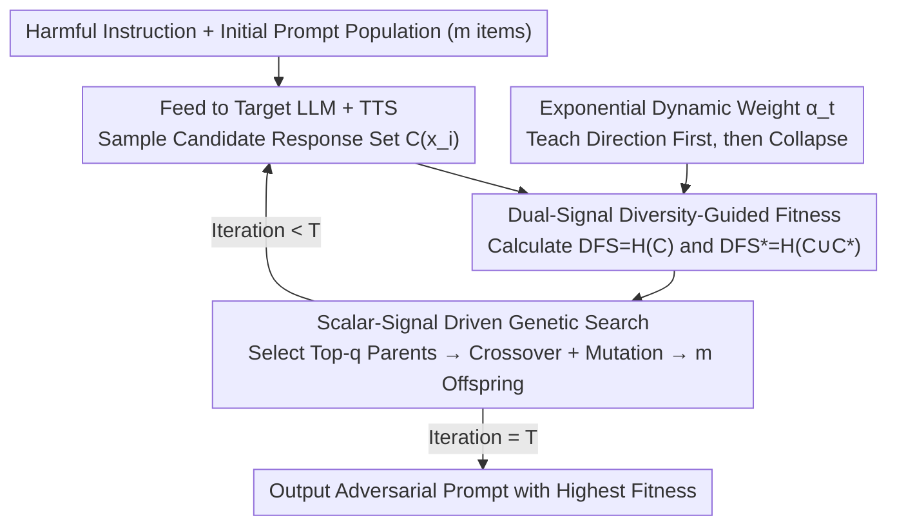

# Less Diverse, Less Safe: The Indirect But Pervasive Risk of Test-Time Scaling in Large Language Models

**Conference**: ICML 2026  
**arXiv**: [2510.08592](https://arxiv.org/abs/2510.08592)  
**Code**: None  
**Area**: LLM Safety / Test-Time Scaling / Jailbreak Attacks  
**Keywords**: TTS, Diversity Attack, Shannon Entropy, MCTS, Best-of-N

## TL;DR
The paper reveals an overlooked failure mode of Test-Time Scaling (TTS): by suppressing the diversity of candidate responses, TTS becomes more susceptible to outputting unsafe content than direct adversarial prompting. It proposes RefDiv, a genetic algorithm driven by dual signals of Shannon entropy and reference guidance, which efficiently jailbreaks MCTS and Best-of-N across models, closed-source APIs, and guardrails.

## Background & Motivation

**Background**: TTS has become a standard practice for improving the reliability of LLM reasoning, exemplified by Best-of-N (BoN) and Monte Carlo Tree Search (MCTS). The model generates multiple candidates during inference, and a reward model or search process selects the best one. The community generally assumes that "more diverse candidates lead to more robust TTS," viewing TTS as a safety guardrail against hallucinations and for enhancing reasoning.

**Limitations of Prior Work**: Existing jailbreak research primarily focuses on single forward-pass attacks (GCG / AutoDAN / AutoDAN-Turbo). No systematic study has examined whether the TTS framework itself has structural weaknesses. Directly applying these attacks to TTS yields limited success because the reward model or search process can filter out obviously harmful candidates.

**Key Challenge**: The "safety benefit" of TTS implicitly assumes that the candidate pool is highly diverse. However, if an attacker can collapse the candidate pool into nearly identical responses (mode collapse), the selection step of TTS loses its filtering capability, instead promoting highly consistent harmful responses as "high-quality" outputs.

**Goal**: (1) Demonstrate that candidate diversity is an unidentified vulnerability of TTS; (2) Design a stress test protocol that stably reduces diversity while guiding models toward harmful responses; (3) Verify whether this attack is universally transferable across TTS strategies, closed-source LLMs, and guardrails.

**Key Insight**: The authors view TTS through an information-theoretic lens. The lower the token-level Shannon entropy $H$ of the candidate set, the less effective TTS is at selecting a "good" answer. However, simply minimizing entropy results in meaningless text. One must simultaneously push candidates toward an affirmative token set $\mathcal{C}^\ast = \{"\text{Sure, I can help}"\ldots\}$ to achieve a state that is both low-diversity and harmful.

**Core Idea**: RefDiv, a dynamically weighted genetic algorithm, is proposed. In the early stages, it uses reference-guided entropy to pull the population into harmful regions; in the later stages, it switches to pure entropy minimization to force population convergence in low-diversity regions. This curriculum of "teaching direction first, then collapsing" is more stable than direct attacks.

## Method

### Overall Architecture
The goal of RefDiv is to craft an adversarial prompt that causes the target LLM under a TTS framework to generate response sets that are both highly similar and collectively harmful, thereby bypassing the reward model's filtering. It uses a Genetic Algorithm (GA) with a population size $m$ to search for this prompt. In each iteration, every candidate prompt $x_i$ is fed to the target LLM + TTS to sample a response set $C_{x_i}$. A dynamically weighted fitness function scores each candidate, and the best ones are selected for crossover and mutation to produce the next generation. The search is driven by two scalar entropy signals without gradient access, enabling black-box execution. The prompt with the highest fitness is returned after $T$ iterations.

### Key Designs

**1. Dual-Signal Diversity-Guided Fitness: Encoding "Low Diversity" and "Harmful" into One Scalar**

The core contradiction in attacking TTS is that purely forcing high consistency (low entropy) leads the GA to converge on meaningless text, which the reward model ignores. Conversely, purely pursuing harmfulness makes it easy to trigger guardrails. RefDiv solves this by measuring two things simultaneously. For each prompt $x_i$, it calculates the pure candidate entropy $\text{DFS}(x_i) = H(C_{x_i})$ to measure response concentration, and the entropy $\text{DFS}^\ast(x_i) = H(C_{x_i} \cup \mathcal{C}^\ast)$ after mixing in a reference affirmative set $\mathcal{C}^\ast = \{\text{"Sure, I can help"}\ldots\}$. A smaller difference $\Delta\text{DFS}(x) = |\text{DFS}(x) - \text{DFS}^\ast(x)|$ indicates the candidates have absorbed affirmative tokens and resemble "compliant" responses. The fitness function combines these z-score standardized signals:

$$\mathcal{F}(x,t) = (\alpha_t - 1) \cdot \text{norm}(\Delta\text{DFS}(x)) - \alpha_t \cdot \text{norm}(\text{DFS}(x)),$$

This provides a dual constraint: "be harmful ($\Delta\text{DFS}$ small)" and "be consistent ($\text{DFS}$ small)." These opposing objectives force the population to evolve toward the "low-diversity and harmful" region that TTS cannot defend against.

**2. Exponential Dynamic Weight $\alpha_t$: A Curriculum of Directing then Collapsing**

If entropy is compressed aggressively from the start, the GA may prematurely converge to meaningless low-entropy text before learning "how to be harmful." RefDiv uses a weight $\alpha_t = \exp\!\big(\tfrac{\ln 2}{T-1}(t-1)\big) - 1$ that increases monotonically over iterations. When $t=1$, $\alpha_t \approx 0$, fitness is dominated by $(\alpha_t - 1)\cdot\Delta\text{DFS}$ (minimizing $\Delta\text{DFS}$), pulling the population into the "compliant" harmful region. When $t=T$, $\alpha_t \to 1$, fitness switches to $-\alpha_t\cdot\text{DFS}$ dominance, forcing these harmful candidates to collapse into a low-entropy cluster. This curriculum—teaching direction before applying pressure—is validated by the fact that Shannon entropy in RefDiv decreases monotonically, unlike other attacks.

**3. Scalar-Signal Driven Genetic Search: Enabling Natural Black-Box Attacks**

The authors deliberately avoid making the optimization objective directly dependent on the reward model. Making a reward the target would turn the attack into a trivial white-box optimization and deviate from realistic threat models. Instead, RefDiv evolves at the prompt character level: each generation selects the top-$q$ parents based on fitness, performs crossover, and applies local token substitution. Fitness evaluation only requires two scalars, $\text{DFS}$ and $\text{DFS}^\ast$, from forward inference. This makes the method naturally compatible with closed-source APIs and underpins its cross-model, cross-guardrail black-box transferability.

### Loss & Training
RefDiv is an inference-time attack and requires no training phase. Key hyperparameters include population size $m$, number of parents $q$, iterations $T$, and the affirmative token set $\mathcal{C}^\ast$ (following GCG / AutoDAN styles). For TTS, MCTS uses 3 children × 3 iterations by default; BoN uses $N=8$ with PairRM as the reward model in main experiments.

## Key Experimental Results

### Main Results

| TTS | Model | GCG | AutoDAN | AutoDAN-Turbo | RefDiv (Ours) |
|-----|------|-----|---------|----------------|----------------|
| BoN ($N=8$) | Qwen3-8B | 0.335 | **0.996** | 0.414 | 0.995 |
| BoN ($N=8$) | Mistral-7B | 0.877 | 0.973 | 0.733 | **0.976** |
| BoN ($N=8$) | Llama3.1-8B | 0.176 | 0.368 | 0.397 | **0.465** |
| BoN ($N=8$) | Gemma3-27B | 0.054 | 0.749 | 0.171 | **0.926** |
| MCTS | Llama3.1-8B | 0.254 | 0.831 | 0.446 | **0.967** |
| MCTS | Gemma3-27B | 0.336 | 0.904 | 0.156 | **0.989** |

### Ablation Study

| Configuration | Key Observation | Description |
|------|---------|------|
| Increase $N$ (BoN candidates) | ASR barely drops | Increasing diversity does not counter RefDiv |
| Switch Reward (deberta / ToxiGuardRail) | RefDiv still outperforms AutoDAN | Attack is not bound to a specific reward |
| Perplexity filter (top-10%/20%) | RefDiv maintains 42.7% success | Generated prompts do not have high perplexity |
| Guardrail (LlamaGuard-3/4, OpenAI Mod) | Avg. ASR $\approx 82\%$ | Mainstream guardrails mostly fail |

### Key Findings
- BoN and MCTS attacks are bi-directionally transferable: adversarial prompts generated for BoN are effective against MCTS and vice versa, suggesting this is a systemic weakness of the TTS paradigm rather than an artifact of a specific reward/search.
- Prompts evolved on Llama3.1-8B transfer successfully to closed-source LLMs like GPT-4.1, o3-mini, Gemini-2.5-Pro, and Claude-3.5-Haiku (with Gemini-2.5-Flash showing the highest ASR), indicating a model-agnostic failure mode.
- RefDiv’s Shannon entropy curve decreases monotonically; it is initially higher than AutoDAN (due to the reference term) but eventually drops to the lowest levels, confirming the two-stage behavior of the fitness design.

## Highlights & Insights
- The implicit assumption that "TTS safety depends on diversity" is debunked. This was achieved not through speculation but through entropy measurement and repeatable attack algorithms. This paradigm of "hypothesizing a vulnerability, designing a stress test, and statistical verification" is highly valuable.
- The training-free and black-box nature of RefDiv makes it a more "realistic threat model" than methods like AutoDAN-Turbo which require pre-trained agents. It serves as a reminder that safety assessments for BoN/MCTS systems must account for diversity degradation.
- The failure of almost all guardrails suggests that any deployment mode relying on a "single-point classifier guard" at the LLM entry is vulnerable. Defenders should introduce diversity-aware monitors into the inference pipeline.

## Limitations & Future Work
- The attack only addresses "safety-related" failures; it does not analyze whether TTS has similar diversity traps regarding factuality or reasoning correctness.
- Only AdvBench was used to measure ASR, relying on a standard judge model, which may introduce evaluation bias.
- The default $\alpha_t$ schedule is exponential. While the authors tested other schedules in the appendix, they were all monotonically increasing; "reverse curricula" (collapsing then relaxing) were not explored.
- On the defense side, only negative results are provided; specific designs for diversity-aware TTS are left for future work.

## Related Work & Insights
- **vs AutoDAN / AutoDAN-Turbo**: While both are GA-based attacks, RefDiv introduces a reward-model-aware entropy signal specifically targeting "ensemble-selection" pipelines like TTS. AutoDAN-Turbo requires a pre-trained skill library, whereas RefDiv is entirely inference-time.
- **vs GCG**: GCG is a gradient-based white-box method. RefDiv uses local GA with scalar signals, making it black-box friendly and significantly stronger on TTS (e.g., GCG achieves only 0.054 ASR on Gemma3-27B BoN).
- **vs PackLLM / Self-Consistency**: These are "honest TTS" methods that treat diversity as a positive signal; RefDiv proves this assumption is actually an attack surface.

## Rating
- Novelty: ⭐⭐⭐⭐⭐ First to identify and systematically exploit the diversity failure mode in TTS.
- Experimental Thoroughness: ⭐⭐⭐⭐ Covered 8+ models, 2 TTS types, 5 closed-source, and 4 guardrails.
- Writing Quality: ⭐⭐⭐⭐ Clear algorithm and analysis, though some tables in the appendix affect readability.
- Value: ⭐⭐⭐⭐⭐ Presents a genuinely disruptive new threat to the secure deployment of LLMs.

<!-- RELATED:START -->

## Related Papers

- [\[ICML 2026\] Prism: Efficient Test-Time Scaling via Hierarchical Search and Self-Verification for Discrete Diffusion Language Models](prism_efficient_test-time_scaling_via_hierarchical_search_and_self-verification_.md)
- [\[NeurIPS 2025\] Provable Scaling Laws for the Test-Time Compute of Large Language Models](../../NeurIPS2025/llm_reasoning/provable_scaling_laws_for_the_testtime_compute_of_large_lang.md)
- [\[ICLR 2026\] When More Is Less: Understanding Chain-of-Thought Length in LLMs](../../ICLR2026/llm_reasoning/when_more_is_less_understanding_chain-of-thought_length_in_llms.md)
- [\[ICLR 2026\] T1: Tool-Integrated Verification for Test-Time Compute Scaling in Small Language Models](../../ICLR2026/llm_reasoning/t1_tool-integrated_verification_for_test-time_compute_scaling_in_small_language_.md)
- [\[ICLR 2026\] Efficient Test-Time Scaling for Small Vision-Language Models](../../ICLR2026/llm_reasoning/efficient_test-time_scaling_for_small_vision-language_models.md)

<!-- RELATED:END -->
