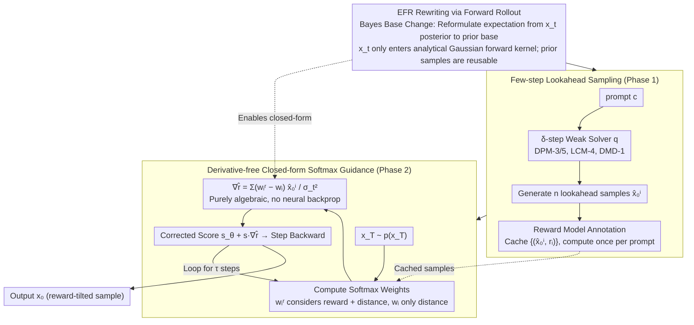

# Lookahead Sample Reward Guidance for Test-Time Scaling of Diffusion Models

**Conference**: ICML 2026 Spotlight  
**arXiv**: [2602.03211](https://arxiv.org/abs/2602.03211)  
**Code**: https://github.com/aailab-kaist/Diffusion-LiDAR-Sampling  
**Area**: Diffusion Models / Test-Time Scaling / Reward Guidance  
**Keywords**: Diffusion Models, test-time scaling, reward guidance, lookahead sampling, closed-form Stein score

## TL;DR
LiDAR rewrites the Expected Future Reward (EFR) using a few pre-generated lookahead samples and forward perturbation kernels, transforming reward guidance into closed-form softmax weights without neural backpropagation. It matches DATE's performance on SDXL/GenEval while being 9.5× faster.

## Background & Motivation
**Background**: T2I diffusion models often generate samples that do not align with human intent. Mainstream alignment paths follow two categories: fine-tuning (e.g., DPO, RLHF) and test-time scaling. The latter trades computation for performance without retraining and is a recent research hotspot. Its core is pushing the distribution $p_\theta(\mathbf{x}_0\mid\mathbf{c})$ toward a reward-tilted target $p_\theta^r(\mathbf{x}_0\mid\mathbf{c}) \propto p_\theta(\mathbf{x}_0\mid\mathbf{c})\exp(\lambda r(\mathbf{x}_0,\mathbf{c}))$. Solving for the corresponding target Stein score requires estimating the **Expected Future Reward (EFR)** of any intermediate particle $\mathbf{x}_t$: $r_t^\lambda(\mathbf{x}_t,\mathbf{c}) = \log\mathbb{E}_{p_\theta(\mathbf{x}_0\mid\mathbf{x}_t,\mathbf{c})}[\exp(\lambda r(\mathbf{x}_0,\mathbf{c}))]$.

**Limitations of Prior Work**: Existing EFR estimation routes have critical flaws:

- **Backward rollout** (multiple rollouts to $\mathbf{x}_0$ for averaging): Requires running full reverse diffusion at every timestep, incurring near-prohibitive overhead.
- **First-order Tweedie Taylor approximation**: Uses $\bar{\mathbf{x}}_0 = \mathbb{E}[\mathbf{x}_0\mid\mathbf{x}_t]$ to replace samples. The error expands linearly as $\lambda$ increases, causing distortion under strong reward signals.
- **Gradient guidance** (UG / DATE): Requires backpropagation through a three-stage neural chain ($\mathbf{x}_t \to \mathbf{s}_\theta \to$ decoder $\to r$), necessitating differentiable rewards and often causing OOM on 2.6B models like SDXL.
- **SMC-based methods**: Use importance resampling to avoid backpropagation, but particles quickly collapse to a single high-reward sample in high-dimensional pixel space, leading to a sharp drop in diversity and performance highly dependent on the particle count $N$.

**Key Challenge**: The EFR expression inherently forces $\mathbf{x}_t$ to serve as both a "neural network input" and a "gradient variable." This is the common root cause for necessary backpropagation, inaccurate approximations, and SMC instability.

**Goal**: Find an EFR rewriting formulation where $\mathbf{x}_t$ no longer enters any neural network as an input, while still accurately characterizing the Stein score of the reward-tilted distribution.

**Key Insight**: Noting that $p_\theta(\mathbf{x}_0\mid\mathbf{x}_t,\mathbf{c}) \propto p(\mathbf{x}_t\mid\mathbf{x}_0)p_\theta(\mathbf{x}_0\mid\mathbf{c})$, can the expectation base be changed from "posterior conditioned on $\mathbf{x}_t$" to "prior $p_\theta(\mathbf{x}_0\mid\mathbf{c})$ weighted by the forward kernel $p(\mathbf{x}_t\mid\mathbf{x}_0)$"? In this way, $\mathbf{x}_t$ only appears in the analytical Gaussian kernel, and neural dependency is decoupled.

**Core Idea**: Use *future marginal samples + forward perturbation kernels* to rewrite EFR (Theorem 3.1), and use few-step ODE solvers (DPM-3/5/8, LCM-4, DMD-1) for cheap **lookahead sampling** to generate these marginal samples. Furthermore, prove that the Stein score in this form has a closed-form softmax solution (Theorem 3.3), achieving a backprop-free reward guidance sampler—**LiDAR**—with costs nearly identical to vanilla sampling.

## Method

### Overall Architecture
LiDAR aims to push diffusion sampling toward a reward-tilted distribution at test-time without the cost of backpropagation. It decouples reward guidance into two stages (Algorithm 1/2): First, a cheap weak sampler generates a batch of lookahead samples and scores them for each prompt. Then, during formal sampling, these samples act as "landmarks." A closed-form softmax formula pulls the particle $\mathbf{x}_t$ toward high-reward samples and away from low-reward ones at each timestep, with "gravitational" pull proportional to the reward. Specifically, Phase 1 takes prompt $\mathbf{c}$ and uses a $\delta$-step fast solver $q(\mathbf{x}_0\mid\mathbf{c})$ to generate $n$ lookahead samples $\{\hat{\mathbf{x}}_0^i\}_{i=1}^n$ labeled with reward model as $\{(\hat{\mathbf{x}}_0^i, r_i)\}$. This step is independent of $\mathbf{x}_t$ and calculated once per prompt. Phase 2 iterates from $\mathbf{x}_T\sim p(\mathbf{x}_T)$, replacing the ordinary Stein score with $\mathbf{s}_\theta(\mathbf{x}_t,t,\mathbf{c}) + s\cdot\nabla_{\mathbf{x}_t}\hat r_t^\lambda$, where the gradient term is a softmax-weighted difference of the lookahead samples. There is no backpropagation, and the reward model can even be non-differentiable.

### Key Designs

**1. EFR Rewriting via Forward Rollout (Theorem 3.1): Decoupling $\mathbf{x}_t$ from the Neural Network**

The difficulty of EFR is that $\mathbf{x}_t$ must be fed into the network and differentiated, which is why backpropagation is mandatory and Taylor approximations are inaccurate. LiDAR resolves this via a Bayes base change: noticing $p_\theta(\mathbf{x}_0\mid\mathbf{x}_t,\mathbf{c}) \propto p(\mathbf{x}_t\mid\mathbf{x}_0)p_\theta(\mathbf{x}_0\mid\mathbf{c})$, the expectation over the posterior $\mathbb{E}_{p_\theta(\mathbf{x}_0\mid\mathbf{x}_t,\mathbf{c})}[\exp(\lambda r)]$ is equivalently rewritten as a weighted expectation over the prior $\mathbb{E}_{p_\theta(\mathbf{x}_0\mid\mathbf{c})}\big[\tfrac{p(\mathbf{x}_t\mid\mathbf{x}_0)}{\mathbb{E}[p(\mathbf{x}_t\mid\mathbf{x}_0)]}\exp(\lambda r)\big]$. After this change, $\mathbf{x}_t$ only appears in the analytical Gaussian forward kernel $p(\mathbf{x}_t\mid\mathbf{x}_0)$, which has a closed-form derivative. The prior samples $\mathbf{x}_0\sim p_\theta(\mathbf{x}_0\mid\mathbf{c})$ are independent of $\mathbf{x}_t$ and can be reused by any timestep or particle—transforming rollout from "rerunning reverse diffusion at every step" to "generate once, reuse everywhere."

**2. Few-step Lookahead Sampling + Weak-to-Strong Interpretation: Negligible Pre-generation Cost**

Base change alone isn't enough if one still uses the full $p_\theta$ to generate $n$ prior samples. LiDAR instead uses a cheap weak sampler $q(\mathbf{x}_0\mid\mathbf{c})$ (such as DPM-3/5, LCM-4, DMD-1) to approximate the expensive $p_\theta$ for marginal samples. Substituting $q$ into the rewritten formula (Eq. 11) yields the lookahead reward $\tilde r_t^\lambda$ (Definition 3.2), whose guidance term is equivalent to $s\cdot\nabla_{\mathbf{x}_t}\log\tfrac{q^r(\mathbf{x}_t\mid\mathbf{c})}{q(\mathbf{x}_t\mid\mathbf{c})}$. This effectively transfers the "density change of the weak sampler under reward" as a signal to the strong sampler, with a tunable guidance scale $s$. This is a standard form of weak-to-strong generalization: the weak solver acts as a "probe" for reward signals, while the full 50/100-step reverse sampling acts as the "executor."

**3. Derivative-free Closed-form Softmax Guidance (Theorem 3.3): Eliminating Backpropagation**

With the previous steps, the guidance gradient becomes purely algebraic. Differentiating the finite sample estimate of Eq. 11 yields $\nabla_{\mathbf{x}_t}\hat r_t^\lambda = \sum_{i=1}^n (w_i^r - w_i)\hat{\mathbf{x}}_0^i / \sigma_t^2$, where $w_i^r = \mathrm{Softmax}_i(\lambda r_i - \|\mathbf{x}_t-\hat{\mathbf{x}}_0^i\|^2/2\sigma_t^2)$ weights by both reward and distance to $\mathbf{x}_t$, and $w_i = \mathrm{Softmax}_i(-\|\mathbf{x}_t-\hat{\mathbf{x}}_0^i\|^2/2\sigma_t^2)$ weights only by distance. The difference $w_i^r - w_i$ represents "how much more the reward wants me to lean toward a lookahead sample compared to simple proximity": when $r_i$ is high, $w_i^r > w_i$, pulling $\mathbf{x}_t$ toward $\hat{\mathbf{x}}_0^i$. This closed-form satisfies the four properties in Table 1: Efficient-Rollout, Finite i.i.d., No-Taylor, and No-BackPropagation.

### Loss & Training
LiDAR is a purely *training-free* test-time method, introducing no loss or parameter updates. Key hyperparameters include the lookahead solver steps $\delta$, lookahead sample count $n$, reward temperature $\lambda$, guidance scale $s$, and total sampling steps $\tau$. The paper provides two scaling laws for budget allocation: as $\delta$ increases, $D_{TV}\le O(1/\sqrt{\delta})$ (Theorem 3.4), and as $n$ increases, finite sample error converges to the lookahead target at $1/\sqrt n$ (Theorem 3.5). In practice, $n=50$ is sufficient.

## Key Experimental Results

### Main Results
Methods compared on SD v1.5 / SDXL using ImageReward as guidance on GenEval prompts (4 images per prompt), measuring generation quality and single-inference cost (A100):

| Backbone (sampler) | Method | IR ↑ | GenEval ↑ | Time(s) ↓ | Mem(GiB) ↓ |
|--------------------|--------|------|-----------|-----------|------------|
| SD v1.5 (DDPM-100) | Vanilla | -0.001 | 0.426 | 7.07 | 8.90 |
| SD v1.5 (DDPM-100) | UG (Bansal'24) | 0.326 | 0.355 | 58.36 | 28.16 |
| SD v1.5 (DDPM-100) | DATE (Na'25) | 0.364 | 0.438 | 32.89 | 24.71 |
| SD v1.5 (DDPM-100) | **LiDAR (DPM-5,n=50)** | **0.384** | **0.478** | **13.41** | **8.90** |
| SDXL (DDPM-100)    | Vanilla | 0.722 | 0.545 | 42.0 | 33.84 |
| SDXL (DDPM-100)    | UG | 0.749 | 0.541 | 334.4 | OOM* |
| SDXL (DDPM-100)    | DATE | 0.960 | 0.570 | 272.3 | OOM* |
| SDXL (DDPM-100)    | **LiDAR (DPM-8,n=50)** | 0.994 | 0.585 | **97.99** | **33.84** |
| SDXL (DDPM-100)    | **LiDAR (DMD-1,n=100)** | **1.006** | **0.598** | **78.67** | **33.84** |

LiDAR achieves GenEval scores comparable to DATE on SDXL (0.585 vs 0.570) in ~30% of the time, without OOM-level backpropagation memory.

### Ablation Study

| Configuration | IR | GenEval | Time(s) | Notes |
|---------------|----|---------|---------|-------|
| Vanilla SD v1.5 | -0.001 | 0.426 | 7.07 | No-guidance baseline |
| DPM-3, n=3 | 0.109 | 0.439 | 7.44 | Extremely weak lookahead, effective at near-zero cost |
| DPM-5, n=3 | 0.172 | 0.449 | 7.54 | Upgrading lookahead solver precision only |
| DPM-5, n=9 | 0.211 | 0.453 | 8.27 | Increasing $n$ |
| DPM-5, n=50 | 0.384 | 0.478 | 13.41 | Full configuration |
| DPO Fine-tuned + LiDAR | 0.445 | 0.489 | 13.41* | Orthogonal stack with training-side methods |

### Key Findings
- **Lookahead precision $\delta$ and sample count $n$ are monotonically beneficial**, following the $O(1/\sqrt\delta)$ and $O(1/\sqrt n)$ scaling (Figure 3).
- **Acceleration stems from "removing backpropagation"**: The bottleneck for UG/DATE is backpropagating through the 2.6B SDXL. LiDAR's closed-form score allows memory usage to revert to vanilla levels.
- **Orthogonal to DPO fine-tuning** (IR 0.384 → 0.445), suggesting LiDAR is an additive gain rather than a reward-hacking replacement.
- **Adaptable to non-differentiable rewards**: On UDLM discrete diffusion + QM9 molecules using "ring count" as reward, novel molecules increased from 130 → 257 (Table 4).
- **Minimal degradation in CLIP/HPS** suggests guidance does not sacrifice prompt alignment (mitigates reward hacking), whereas UG's HPS dropped from 0.263 to 0.236.

## Highlights & Insights
- **"Base change" solves all constraints at once**: Reformulating EFR from the $p_\theta(\mathbf{x}_0\mid\mathbf{x}_t)$ base to the $p_\theta(\mathbf{x}_0)$ base simultaneously enables efficient-rollout, finite i.i.d., no-Taylor, and no-backprop—the true "Eureka" moment of the paper.
- **Closed-form softmax possesses high interpretability**: $w_i^r - w_i$ is a function of both reward difference and distance difference, acting as a softened version of SMC's hard sampling and UG's gradients.
- **Lookahead = Continuous generalization of "Weak-to-Strong"**: Decoupling the weak solver as a reward probe and the strong solver as an executor can be transferred to any guidance-based generation requiring expensive backprop (Video, 3D, Language Diffusion).
- **Cacheable pre-generated samples**: In online services, $\{(\hat{\mathbf{x}_0}^i, r_i)\}$ for a prompt is a one-time asset, further amortizing costs across multiple users or seeds.

## Limitations & Future Work
- **Performance capped by weak solvers**: If a prompt falls into an area where $q$ fails (e.g., extremely long prompts), the guidance signal may be distorted.
- **Steep $n$ vs. memory curve on SDXL**: $n=100$ approaches memory limits. On FLUX, GenEval gains nearly saturated after $n=100$.
- **Reward combination strategies**: Table 6 only explores simple IR and CLIP weighting; there is room for Pareto front analysis or engineering combinations to fight reward hacking.
- **Scaling laws are upper bounds**: The optimal trade-off between $\delta$ and $n$ still requires empirical tuning.
- **Small-scale experiments on discrete diffusion and flow matching**: QM9/FLUX successes are more PoCs; large-scale validation on industrial video diffusion is missing.

## Related Work & Insights
- **vs UG (Bansal 2024) / DATE (Na 2025)**: Both use Tweedie first-order Taylor to compute reward on $\bar{\mathbf{x}}_0$ and backprop to $\mathbf{x}_t$, constrained by approximation error and differentiable reward requirements. LiDAR provides a closed-form EFR without approximation or backprop, 9.5× faster.
- **vs SMC Series (Singhal 2025, Li 2025)**: SMC also avoids backprop but suffers from particle collapse in high-dimensional spaces. LiDAR’s Finite i.i.d. property ensures particle count is decoupled from generation quality.
- **vs Backward Rollout (Holderrieth 2026, Potaptchik 2025)**: Rollout is conceptually correct but hindered by "rerunning every step." LiDAR amortizes rollout costs by using forward kernels + one-time marginal samples.
- **vs DPO/ReFL/DRaFT**: Training-side methods require gradients and compute. LiDAR is a test-time method, orthogonal to DPO, making it ideal for second-stage tuning during deployment.

## Rating
- Novelty: ⭐⭐⭐⭐⭐ The "Bayes base change + EFR forward kernel rewriting" is a major conceptual breakthrough.
- Experimental Thoroughness: ⭐⭐⭐⭐ Four backbones (SD 1.5/SDXL/FLUX/UDLM) plus scaling laws, though missing industrial video/long-prompt validation.
- Writing Quality: ⭐⭐⭐⭐⭐ Table 1 and the interlaced algorithms and theorems provide an exceptionally clear narrative.
- Value: ⭐⭐⭐⭐⭐ 9.5× faster with no memory increase and orthogonal to fine-tuning; immediate engineering value for commercial T2I services.

<!-- RELATED:START -->

## Related Papers

- [\[ICML 2026\] Prism: Efficient Test-Time Scaling via Hierarchical Search and Self-Verification for Discrete Diffusion Language Models](prism_efficient_test-time_scaling_via_hierarchical_search_and_self-verification_.md)
- [\[ACL 2026\] Parallel Test-Time Scaling for Latent Reasoning Models](../../ACL2026/llm_reasoning/parallel_test-time_scaling_for_latent_reasoning_models.md)
- [\[ACL 2025\] Revisiting the Test-Time Scaling of o1-like Models: Do they Truly Possess Test-Time Scaling Capabilities?](../../ACL2025/llm_reasoning/revisiting_the_test-time_scaling_of_o1-like_models_do_they_truly_possess_test-ti.md)
- [\[ICLR 2026\] Efficient Test-Time Scaling for Small Vision-Language Models](../../ICLR2026/llm_reasoning/efficient_test-time_scaling_for_small_vision-language_models.md)
- [\[ICML 2026\] Stabilizing Recurrent Dynamics for Test-Time Scalable Latent Reasoning in Looped Language Models](stabilizing_recurrent_dynamics_for_test-time_scalable_latent_reasoning_in_looped.md)

<!-- RELATED:END -->
