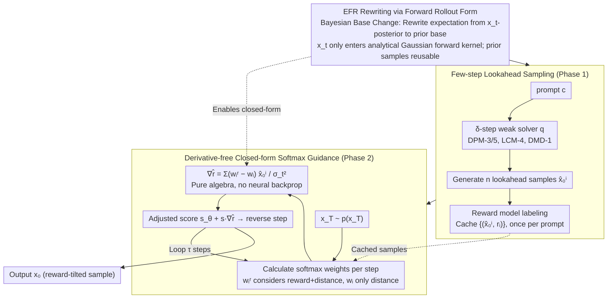

# Lookahead Sample Reward Guidance for Test-Time Scaling of Diffusion Models

**Conference**: ICML 2026 Spotlight  
**arXiv**: [2602.03211](https://arxiv.org/abs/2602.03211)  
**Code**: https://github.com/aailab-kaist/Diffusion-LiDAR-Sampling  
**Area**: Diffusion Models / Test-Time Scaling / Reward Guidance  
**Keywords**: Diffusion Models, test-time scaling, reward guidance, lookahead sampling, closed-form Stein score

## TL;DR
LiDAR rewrites the Expected Future Reward (EFR) using pre-generated lookahead samples and a forward perturbation kernel, transforming reward guidance into a closed-form softmax weighting without neural backpropagation. It matches DATE's performance on SDXL/GenEval while being 9.5× faster.

## Background & Motivation
**Background**: T2I diffusion models often generate samples that do not align with human intent. Mainstream alignment paths are divided into two categories: fine-tuning (DPO, RLHF-like) and test-time scaling. The latter trades computation for performance without additional training and has become a recent research hotspot. Its core involves pushing the distribution $p_\theta(\mathbf{x}_0\mid\mathbf{c})$ toward a reward-tilted target $p_\theta^r(\mathbf{x}_0\mid\mathbf{c}) \propto p_\theta(\mathbf{x}_0\mid\mathbf{c})\exp(\lambda r(\mathbf{x}_0,\mathbf{c}))$. Solving for the corresponding target Stein score requires estimating the **Expected Future Reward (EFR)** of any intermediate particle $\mathbf{x}_t$: $r_t^\lambda(\mathbf{x}_t,\mathbf{c}) = \log\mathbb{E}_{p_\theta(\mathbf{x}_0\mid\mathbf{x}_t,\mathbf{c})}[\exp(\lambda r(\mathbf{x}_0,\mathbf{c}))]$.

**Limitations of Prior Work**: Existing EFR estimation routes have significant drawbacks:

- **Backward rollout** (multiple rollouts to $\mathbf{x}_0$ for averaging): Requires running full reverse diffusion at every timestep, making overhead near-prohibitive.
- **Tweedie first-order Taylor approximation**: Uses $\bar{\mathbf{x}}_0 = \mathbb{E}[\mathbf{x}_0\mid\mathbf{x}_t]$ to replace samples; the error scales linearly with $\lambda$, causing distortion under strong reward signals.
- **Gradient guidance** (UG / DATE): Requires backpropagation through three neural network segments ($\mathbf{x}_t \to \mathbf{s}_\theta \to$ decoder $\to r$), necessitating differentiable rewards and often causing OOM (Out-of-Memory) on 2.6B models like SDXL.
- **SMC** methods: Use importance resampling to avoid backpropagation, but particles quickly collapse to a single high-reward sample in high-dimensional pixel space, significantly reducing diversity. Performance is also highly dependent on the particle count $N$.

**Key Challenge**: The EFR expression inherently forces $\mathbf{x}_t$ to serve as both the "neural network input" and the "gradient variable." This is the common root cause of the necessity for backpropagation, inaccurate approximations, and SMC instability.

**Goal**: Find a way to rewrite EFR such that $\mathbf{x}_t$ no longer enters any neural network as an input, while still accurately characterizing the Stein score of the reward-tilted distribution.

**Key Insight**: Noting $p_\theta(\mathbf{x}_0\mid\mathbf{x}_t,\mathbf{c}) \propto p(\mathbf{x}_t\mid\mathbf{x}_0)p_\theta(\mathbf{x}_0\mid\mathbf{c})$, can the expectation base be changed from the "posterior conditioned on $\mathbf{x}_t$" to the "prior $p_\theta(\mathbf{x}_0\mid\mathbf{c})$ weighted by the forward kernel $p(\mathbf{x}_t\mid\mathbf{x}_0)$"? In this form, $\mathbf{x}_t$ only appears in the analytical Gaussian kernel, stripping the neural dependence.

**Core Idea**: Rewrite EFR using *future marginal samples + forward perturbation kernel* (Theorem 3.1), and generate these marginal samples via cheap **lookahead sampling** using few-step ODE solvers (e.g., DPM-3/5/8, LCM-4, DMD-1). It is then proved that the Stein score in this form has a closed-form softmax solution (Theorem 3.3). This enables **LiDAR**, a reward guidance sampler without neural backpropagation and with costs nearly equal to vanilla sampling.

## Method

### Overall Architecture
LiDAR aims to push diffusion sampling toward a reward-tilted distribution at test-time without the cost of backpropagation. It decouples reward guidance into two phases (Algorithm 1/2 in the paper): First, use a cheap weak sampler to generate a batch of lookahead samples per prompt once and score them. Then, use these samples as "waypoints" during formal sampling, applying a closed-form softmax formula at each timestep to pull particle $\mathbf{x}_t$ toward high-reward samples and away from low-reward ones. The "gravitational" intensity is proportional to the reward (see Fig. 1(b)). Specifically, in Phase 1, given prompt $\mathbf{c}$, a $\delta$-step fast solver $q(\mathbf{x}_0\mid\mathbf{c})$ generates $n$ lookahead samples $\{\hat{\mathbf{x}}_0^i\}_{i=1}^n$, labeled with reward model as $\{(\hat{\mathbf{x}}_0^i, r_i)\}$; this step is independent of $\mathbf{x}_t$ and calculated once per prompt. In Phase 2, reverse iteration starts from $\mathbf{x}_T\sim p(\mathbf{x}_T)$, replacing the standard Stein score with $\mathbf{s}_\theta(\mathbf{x}_t,t,\mathbf{c}) + s\cdot\nabla_{\mathbf{x}_t}\hat r_t^\lambda$, where the gradient term is the softmax-weighted difference of lookahead samples. No backpropagation is involved, and the reward model can even be non-differentiable (e.g., ring count in discrete molecules).

### Key Designs

**1. EFR Rewriting via Forward Rollout Form (Theorem 3.1): Stripping $\mathbf{x}_t$ from Neural Networks**

The difficulty in EFR is that $\mathbf{x}_t$ must be fed into the network as input and differentiated, which is why backpropagation is mandatory and Taylor approximations are inaccurate. LiDAR resolves this via a Bayesian change of base: noting $p_\theta(\mathbf{x}_0\mid\mathbf{x}_t,\mathbf{c}) \propto p(\mathbf{x}_t\mid\mathbf{x}_0)p_\theta(\mathbf{x}_0\mid\mathbf{c})$, the expectation over the posterior $\mathbb{E}_{p_\theta(\mathbf{x}_0\mid\mathbf{x}_t,\mathbf{c})}[\exp(\lambda r)]$ is equivalently rewritten as a weighted expectation over the prior $\mathbb{E}_{p_\theta(\mathbf{x}_0\mid\mathbf{c})}\big[\tfrac{p(\mathbf{x}_t\mid\mathbf{x}_0)}{\mathbb{E}[p(\mathbf{x}_t\mid\mathbf{x}_0)]}\exp(\lambda r)\big]$. After this change, $\mathbf{x}_t$ only appears in the analytical Gaussian forward kernel $p(\mathbf{x}_t\mid\mathbf{x}_0)$, for which derivatives have a closed-form solution. The prior samples $\mathbf{x}_0\sim p_\theta(\mathbf{x}_0\mid\mathbf{c})$ are independent of $\mathbf{x}_t$ and can be reused by any timestep or particle—transforming rollout from "rerunning reverse diffusion at every step" to "one-time pre-generation, reuse everywhere." This is the core key of the paper.

**2. Few-step Lookahead Sampling + Weak-to-Strong Interpretation: Amortizing Pre-generation Cost**

Changing the base is insufficient if generating $n$ prior samples still requires the full $p_\theta$. LiDAR uses a cheap weak sampler $q(\mathbf{x}_0\mid\mathbf{c})$ (like few-step solvers DPM-3/5, LCM-4, DMD-1) to approximate the expensive $p_\theta$ for generating marginal samples. Substituting $q$ into the rewritten form (Eq. 11) yields the lookahead reward $\tilde r_t^\lambda$ (Definition 3.2), whose guidance term is exactly equivalent to $s\cdot\nabla_{\mathbf{x}_t}\log\tfrac{q^r(\mathbf{x}_t\mid\mathbf{c})}{q(\mathbf{x}_t\mid\mathbf{c})}$. This migrates the "density change under reward in the weak sampler" as a signal to the strong sampler, with guidance scale $s$ freely adjustable. This is a standard form of weak-to-strong generalization: the weak solver acts as a "probe" for reward signals, while the full 50/100-step reverse sampling acts as the "executor." The target distribution remains governed by the strong sampler, while EFR estimation cost is reduced to a one-time, cacheable pre-processing step.

**3. Derivative-free Closed-form Softmax Guidance (Theorem 3.3): Eliminating Backpropagation**

With the previous steps, the guidance gradient becomes a pure algebraic expression, no longer touching neural network backpropagation. Differentiating the finite-sample estimate of Eq. 11 yields $\nabla_{\mathbf{x}_t}\hat r_t^\lambda = \sum_{i=1}^n (w_i^r - w_i)\hat{\mathbf{x}}_0^i / \sigma_t^2$, where $w_i^r = \mathrm{Softmax}_i(\lambda r_i - \|\mathbf{x}_t-\hat{\mathbf{x}}_0^i\|^2/2\sigma_t^2)$ weights by both reward and distance to $\mathbf{x}_t$, while $w_i = \mathrm{Softmax}_i(-\|\mathbf{x}_t-\hat{\mathbf{x}}_0^i\|^2/2\sigma_t^2)$ considers only distance. The difference $w_i^r - w_i$ indicates "how much more the reward wants me to lean toward a lookahead sample compared to simple proximity": when $r_i$ is high, $w_i^r > w_i$, pulling $\mathbf{x}_t$ toward $\hat{\mathbf{x}}_0^i$, and vice versa. This closed-form allows 9.5× acceleration, constant memory, and support for black-box rewards.

### Loss & Training
LiDAR is a purely *training-free* test-time method, introducing no loss functions or parameter updates. Key hyperparameters are the lookahead solver steps $\delta$, lookahead sample count $n$, reward temperature $\lambda$, guidance scale $s$, and total target sampling steps $\tau$. The paper provides two scaling laws: $D_{TV}\le O(1/\sqrt{\delta})$ as $\delta$ increases (Theorem 3.4), and a finite-sample error converging at $1/\sqrt n$ to the lookahead target (Theorem 3.5). In practice, $n=50$ is sufficient.

## Key Experimental Results

### Main Results
All methods were tested on SD v1.5 / SDXL using ImageReward as guidance, comparing generation quality and inference cost on GenEval prompts (4 images per prompt) on a single A100 GPU:

| Backbone (sampler) | Method | IR ↑ | GenEval ↑ | Time(s) ↓ | Mem(GiB) ↓ |
|----------------|------|------|-----------|-----------|------------|
| SD v1.5 (DDPM-100) | Vanilla | -0.001 | 0.426 | 7.07 | 8.90 |
| SD v1.5 (DDPM-100) | UG (Bansal'24) | 0.326 | 0.355 | 58.36 | 28.16 |
| SD v1.5 (DDPM-100) | DATE (Na'25) | 0.364 | 0.438 | 32.89 | 24.71 |
| SD v1.5 (DDPM-100) | **LiDAR (DPM-5,n=50)** | **0.384** | **0.478** | **13.41** | **8.90** |
| SDXL (DDPM-100) | Vanilla | 0.722 | 0.545 | 42.0 | 33.84 |
| SDXL (DDPM-100) | UG | 0.749 | 0.541 | 334.4 | OOM* |
| SDXL (DDPM-100) | DATE | 0.960 | 0.570 | 272.3 | OOM* |
| SDXL (DDPM-100) | **LiDAR (DPM-8,n=50)** | 0.994 | 0.585 | **97.99** | **33.84** |
| SDXL (DDPM-100) | **LiDAR (DMD-1,n=100)** | **1.006** | **0.598** | **78.67** | **33.84** |

LiDAR achieves GenEval scores comparable to DATE on SDXL (0.585 vs 0.570) in ~30% of the time, without the OOM-inducing backpropagation memory requirements.

### Ablation Study

| Configuration | IR | GenEval | Time(s) | Notes |
|------|----|---------|---------|------|
| Vanilla SD v1.5 | -0.001 | 0.426 | 7.07 | No guidance baseline |
| DPM-3, n=3 | 0.109 | 0.439 | 7.44 | Weak lookahead, effective at near-zero cost |
| DPM-5, n=3 | 0.172 | 0.449 | 7.54 | Upgrading lookahead solver accuracy only |
| DPM-5, n=9 | 0.211 | 0.453 | 8.27 | Increasing $n$ |
| DPM-5, n=50 | 0.384 | 0.478 | 13.41 | Full configuration |
| DPO fine-tuned + DPM-5, n=50 | 0.445 | 0.489 | 13.41* | Orthogonal stacking with training-side methods |

### Key Findings
- **Lookahead accuracy $\delta$ and sample count $n$ both monotonically benefit performance**, following the $O(1/\sqrt\delta)$ and $O(1/\sqrt n)$ scaling laws (Figure 3), allowing users to adjust settings based on budget.
- **Speedup stems from the absence of backpropagation**: The bottleneck for UG/DATE is backpropagation through the 2.6B SDXL model. LiDAR's closed-form score allows memory usage to revert to vanilla levels.
- **Orthogonal to DPO fine-tuning**: Combining both improves IR (0.384 → 0.445), proving LiDAR is an additive refinement rather than just a reward hacking alternative.
- **Adaptable to non-differentiable rewards**: In UDLM discrete diffusion + QM9 molecules, using "ring count" as reward with $n=4096$ increased novel molecules from 130 to 257; on the FLUX flow matching model, IR improved from 1.019 to 1.198.
- **Minimal degradation in CLIP/HPS** indicates that guidance does not come at the cost of prompt alignment (mitigates reward hacking); notably, UG's HPS dropped from 0.263 to 0.236.

## Highlights & Insights
- **"Base change" solves all constraints at once**: Rewriting EFR from the $p_\theta(\mathbf{x}_0\mid\mathbf{x}_t)$ base to the $p_\theta(\mathbf{x}_0)$ base simultaneously enables efficient-rollout, finite i.i.d. samples, no-Taylor, and no-backprop—the true "Aha!" moment of the paper.
- **Closed-form softmax formula is highly interpretable**: $w_i^r - w_i$ is a function of both "reward difference" and "distance difference," serving as a softened version of SMC's hard sampling and UG's gradients.
- **Lookahead as a continuous generalization of "Weak-to-Strong"**: Decoupling the weak solver as a reward probe and the strong solver as an executor can be transferred to any guided generation task (video, 3D, language diffusion) requiring expensive rollouts.
- **Caching pre-generated samples**: In online services, $\{(\hat{\mathbf{x}}_0^i, r_i)\}$ for the same prompt is a one-time asset, further amortizing costs across multiple users or seeds.

## Limitations & Future Work
- **Quality ceiling capped by weak sampler**: Lookahead samples come from $q$; if a prompt falls into a region where $q$ fails (e.g., extremely long prompts), LiDAR's signals may be distorted.
- **Steep $n$ vs. Memory curve on SDXL**: $n=100$ approaches memory limits, and GenEval gains saturate on FLUX beyond $n=100$ (0.667 vs 0.668), suggesting saturation points for certain rewards.
- **Reward combination strategies underexplored**: Only simple weighting between IR and CLIP was tested; Pareto fronts for multi-reward and engineering combinations against reward hacking remain open.
- **Scaling laws are upper bounds**: The optimal trade-off between $\delta$ and $n$ still requires empirical tuning without a unified adaptive strategy.
- **Small experimental scale for discrete/flow models**: Success on QM9/FLUX is more of a PoC; large-scale validation on industrial T2V or high-res diffusion is missing.

## Related Work & Insights
- **vs UG (Bansal 2024) / DATE (Na 2025)**: Both use Tweedie 1st-order Taylor to calculate reward at $\bar{\mathbf{x}}_0$ and backpropagate to $\mathbf{x}_t$, suffering from approximation errors and differentiability requirements. LiDAR provides a closed-form EFR, 9.5× faster without approximations or backpropagation.
- **vs SMC Series (Singhal 2025, Li 2025)**: SMC also avoids backpropagation but suffers from particle collapse in high-dimensional space. LiDAR's finite i.i.d. property ensures particle count is decoupled from generation diversity.
- **vs Backward rollout (Holderrieth 2026, Potaptchik 2025)**: Rollout is conceptually correct but hindered by costs at each $t$; LiDAR amortizes these costs via one-time marginal sampling.
- **vs Fine-tuning (DPO, ReFL, etc.)**: Training-side methods require gradients, data, and compute. LiDAR is a test-time method that stack orthogonally with DPO, ideal for secondary tuning during deployment.
- **Insights**: Any guidance/control problem following the "intermediate variable $\to$ neural network $\to$ backprop" pattern (e.g., classifier guidance, controllable molecule/video generation) can attempt this "base change + analytical kernel + softmax closed-form" framework.

## Rating
- Novelty: ⭐⭐⭐⭐⭐ The "Bayesian base change + forward kernel EFR rewrite" is a genuine conceptual breakthrough.
- Experimental Thoroughness: ⭐⭐⭐⭐ Four backbones (SD v1.5/SDXL/FLUX/UDLM) plus ablation and scaling laws are comprehensive, though industrial-scale video/long-prompt validation is missing.
- Writing Quality: ⭐⭐⭐⭐⭐ Clear narrative, effectively using Table 1 to align properties and interleaving theorems with algorithms.
- Value: ⭐⭐⭐⭐⭐ 9.5× faster inference without memory increase, orthogonal to fine-tuning; high engineering value for commercial T2I services.

<!-- RELATED:START -->

## Related Papers

- [\[ICML 2026\] Prism: Efficient Test-Time Scaling via Hierarchical Search and Self-Verification for Discrete Diffusion Language Models](prism_efficient_test-time_scaling_via_hierarchical_search_and_self-verification_.md)
- [\[ICLR 2026\] Efficient Test-Time Scaling for Small Vision-Language Models](../../ICLR2026/llm_reasoning/efficient_test-time_scaling_for_small_vision-language_models.md)
- [\[ACL 2026\] Parallel Test-Time Scaling for Latent Reasoning Models](../../ACL2026/llm_reasoning/parallel_test-time_scaling_for_latent_reasoning_models.md)
- [\[ACL 2025\] Revisiting the Test-Time Scaling of o1-like Models: Do they Truly Possess Test-Time Scaling Capabilities?](../../ACL2025/llm_reasoning/revisiting_the_test-time_scaling_of_o1-like_models_do_they_truly_possess_test-ti.md)
- [\[ICML 2026\] Stabilizing Recurrent Dynamics for Test-Time Scalable Latent Reasoning in Looped Language Models](stabilizing_recurrent_dynamics_for_test-time_scalable_latent_reasoning_in_looped.md)

<!-- RELATED:END -->
