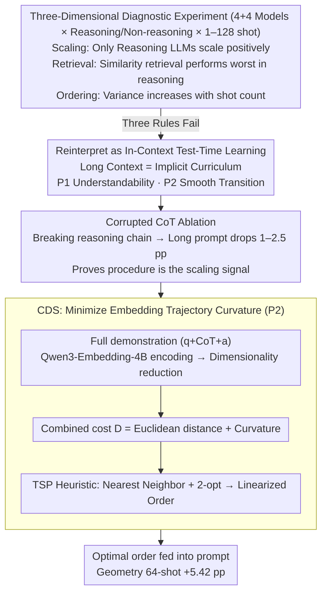

# Many-Shot CoT-ICL: Making In-Context Learning Truly Learn

**Conference**: ICML 2026  
**arXiv**: [2605.13511](https://arxiv.org/abs/2605.13511)  
**Code**: None  
**Area**: Large Model Reasoning / In-Context Learning / Chain-of-Thought  
**Keywords**: many-shot ICL, chain-of-thought, in-context test-time learning, demonstration ordering, curvature regularization

## TL;DR
This paper systematically reveals that the "rules of thumb" for many-shot ICL in non-reasoning tasks **fail entirely** in CoT reasoning—similarity retrieval is actually harmful, and order sensitivity increases with the number of shots. The study reinterprets successful many-shot CoT as "in-context test-time learning" and proposes the CDS method, which orders demonstrations by embedding trajectory curvature, achieving a 5.42 pp improvement on 64-shot geometry problems.

## Background & Motivation

**Background**: Long-context LLMs have made many-shot ICL feasible. Prior work (Bertsch et al., Baek et al.) observed three laws in non-reasoning tasks (classification, simple QA): (1) performance rises steadily with the number of shots; (2) order sensitivity decreases as the number of shots grows; and (3) similarity retrieval (top-$k$ most similar) improves performance. While Chain-of-Thought (CoT) is the standard for complex reasoning, CoT-ICL is mostly studied in few-shot settings.

**Limitations of Prior Work**: Do these three empirical laws still hold when CoT is combined with many-shot (i.e., many-shot CoT-ICL)? This has not been systematically investigated. If the laws hold, prompt engineering can continue with retrieval and stacking more shots; if they break, the entire paradigm must be reconsidered. This is not just an engineering issue but concerns the fundamental debate over whether ICL is "scaled pattern matching" or "true learning."

**Key Challenge**: CoT demonstrations are long (e.g., a single CoT in geometry tasks is ~30× longer than in BANKING77), contain internal procedural reasoning chains, and demand higher understanding from the model. These properties mean that the "more is better, retrieval is correct" intuition of many-shot ICL may not apply to CoT scenarios. If ICL is truly "learning," then demonstrations are supervision and order is the curriculum, requiring gradual progression; from a pattern-matching perspective, order should not matter.

**Goal**: (1) Systematically characterize the scaling, retrieval, and ordering behaviors of many-shot CoT-ICL; (2) identify the root causes of empirical law failures; (3) propose a new perspective to unify these phenomena and guide demonstration selection/ordering.

**Key Insight**: Treat many-shot CoT as **in-context test-time learning**. The long-context window is not a simple "retrieval cache" but an implicit curriculum, and the model forward pass is a form of gradient-free adaptation. This perspective naturally leads to two pedagogical principles: (P1) demonstrations must be **understandable to the model** to serve as effective supervision; (P2) demonstration order must **transition smoothly** to avoid abrupt conceptual jumps that disrupt the implicit learning trajectory.

**Core Idea**: Based on P2, the demonstration sequence is viewed as a trajectory in the embedding space. **Total curvature** (the sum of angles between adjacent displacements) serves as a quantitative metric for "smoothness." Minimizing the total curvature yields a coherent in-context curriculum—this is Curvilinear Demonstration Selection (CDS).

## Method

### Overall Architecture
The paper follows a "Diagnosis—Theory—Algorithm" chain. First, large-scale controlled experiments prove that the three empirical laws of many-shot ICL collapse in CoT reasoning. Second, the phenomena are reinterpreted through the lens of in-context test-time learning, treating long context as an implicit curriculum. Finally, the "smooth transition" principle is implemented as CDS. Given $n$ demonstrations, seek a permutation $O = [\mathbf{d}_{\pi(1)}, \ldots, \mathbf{d}_{\pi(n)}]$ that minimizes the total curvature of the embedding trajectory $\Theta(O) = \sum_{t=2}^{n-1} \arccos\!\left(\frac{\mathbf{v}_t \cdot \mathbf{v}_{t+1}}{\|\mathbf{v}_t\|\|\mathbf{v}_{t+1}\|}\right)$, where $\mathbf{v}_t = \tilde{\mathbf{e}}_t - \tilde{\mathbf{e}}_{t-1}$ is the displacement vector of adjacent projected embeddings. The diagnosis phase covers 4 non-reasoning LLMs (LLaMA 3.1 8B / 3.3 70B / Qwen2.5 7B / 14B) and 4 reasoning LLMs (Qwen3 8B / 14B / QwQ 32B / DeepSeek-R1 685B) across classification and reasoning tasks, sweeping 1–128 shots.

### Key Designs

**1. Three-Dimensional Diagnostic Experiment**: Many-shot engineering (stacking shots, similarity retrieval) relies on rules observed in non-reasoning tasks. The authors set up controls along **Scaling**, **Retrieval**, and **Ordering**. In Scaling, non-reasoning LLMs show unstable or declining performance as shots increase in CoT tasks; only reasoning-oriented LLMs (Qwen3, R1) show monotonic positive scaling. In Retrieval, top-$k$ similarity wins in BANKING77 (non-reasoning) but is the worst in geometry/number theory—semantic similarity does not predict procedural compatibility. In Ordering, the standard deviation across permutations decreases with shot count for non-reasoning tasks but **increases** for reasoning tasks, suggesting that path dependence deepens with scale.

**2. Corrupted CoT Ablation**: To prove the model learns the reasoning process $C$ rather than just the mapping $x \to y$, the authors constructed "procedurally corrupted" prompts $(x_i, C_0, y_i)$, where all rationales are replaced by the same chain $C_0$. Results show that for $n=128$, the corrupted version causes Qwen3-14B to drop 2.51 pp. This confirms that the procedure is the actual signal for long-context scaling.

**3. Curvilinear Demonstration Selection (CDS)**: To minimize conceptual jumps, CDS quantifies the "smoothness" of an order. It encodes full demonstrations (question + CoT + answer) using Qwen3-Embedding-4B into $\mathbf{e}_i \in \mathbb{R}^d$, projects them into a lower-dimensional subspace $\tilde{\mathbf{e}}_i$, and calculates the local curvature $\theta_i$ as the angle between displacement vectors. The total curvature $\Theta(O) = \sum_{i=2}^{n-1}\theta_i$ is minimized using a **TSP approximation** with a combined cost $D_{\text{CDS}} = D_{\text{euclidean}} + D_{\text{curvature}}$. This is calculated in under a minute for $n \leq 128$.

### Loss & Training
CDS is an **inference-time** algorithm with no training. The underlying embedding model is Qwen3-Embedding-4B. The evaluation covers LLaMA, Qwen, and DeepSeek-R1 series with contexts up to 131K tokens.

## Key Experimental Results

### Main Results
CDS improvements on Qwen3 series:

| Task | Model | Configuration | n=64 Gain |
|---|---|---|---|
| Geometry | Qwen3-14B | CDS vs. Random | **+5.42 pp** |
| Geometry | Qwen3-14B | n=128 + thinking on | 73.07% vs. 66.18% (n=16) |
| Geometry | Qwen3-14B | thinking on vs. off (n=128) | 73.07 vs. 65.76 |

### Ablation Study

| Configuration | Behavior | Description |
|---|---|---|
| CDS (low curvature) | Best | Full method |
| High-curvature baseline | Significantly worse | Same embeddings, inverted curvature goal |
| Similarity top-k | Worst in reasoning | Semantic similarity $\neq$ procedural compatibility |
| Corrupted CoT (n=128) | Significant drop | Proves procedure is key |
| Thinking mode disabled | Significant drop | Reasoning prior is necessary for scaling |

## Key Findings
- **CoT-ICL is not scaled pattern matching**: Similarity retrieval fails in reasoning tasks, refuting the retrieval hypothesis.
- **Order sensitivity increases with shot count**: More demonstrations lead to more "conceptual mutations," causing procedural incoherence.
- **Self-generated CoT can outperform ground-truth**: For weak models, self-generated CoTs (even with wrong answers) are better than dataset CoTs, validating P1 (understandability).
- **Curvature correlates with accuracy**: Total curvature is significantly negatively correlated with performance ($r \approx -0.55$).

## Highlights & Insights
- **Unified Perspective**: Reinterpreting long context as an implicit curriculum explains scaling failure (P1 violation), retrieval failure (procedure mismatch), and order sensitivity (P2 violation).
- **Self-generated CoT Advantage**: Models understand their own "language" better, suggesting a pipeline where models generate their own few-shot examples.
- **Curvature as Metric**: Quantifying "smooth transitions" as geometric curvature is intuitive and effective. The causal ablation using high curvature proves it is the smoothness, not clustering, that helps.

## Limitations & Future Work
- Dependency on embedding model quality to represent procedural content.
- Experimental focus on math and narrative reasoning; broader types like coding are unverified.
- TSP approximation limits; the gap to global curvature minimum and weight sensitivity for $D_{\text{euclidean}}$ needs study.
- Future work could explore curvature as a differentiable loss for fine-tuning.

## Related Work & Insights
- **Comparison with many-shot ICL (Bertsch et al.)**: Proves that their "laws" do not transfer to CoT.
- **vs. Auto-CoT**: Extends reasoning demonstration selection into the many-shot regime.
- **Insight**: RAG and agent memory systems should reconsider ordering as a curriculum rather than just a retrieval rank.

## Rating
- Novelty: ⭐⭐⭐⭐⭐ 
- Experimental Thoroughness: ⭐⭐⭐⭐ 
- Writing Quality: ⭐⭐⭐⭐⭐ 
- Value: ⭐⭐⭐⭐⭐ 

<!-- RELATED:START -->

## Related Papers

- [\[ACL 2025\] CoT-ICL Lab: A Synthetic Framework for Studying Chain-of-Thought Learning from In-Context Demonstrations](../../ACL2025/llm_reasoning/cot-icl_lab_a_synthetic_framework_for_studying_chain-of-thought_learning_from_in.md)
- [\[AAAI 2026\] LLMs for Game Theory: Entropy-Guided In-Context Learning and Adaptive CoT Reasoning](../../AAAI2026/llm_reasoning/llms_for_game_theory_entropy-guided_in-context_learning_and_adaptive_cot_reasoni.md)
- [\[ICML 2026\] Clustering as Reasoning: A $k$-Means Interpretation of Chain-of-Thought Graph Learning](clustering_as_reasoning_a_k-means_interpretation_of_chain-of-thought_graph_learn.md)
- [\[ICLR 2026\] CoT-RVS: Zero-Shot Chain-of-Thought Reasoning Segmentation for Videos](../../ICLR2026/llm_reasoning/cot-rvs_zero-shot_chain-of-thought_reasoning_segmentation_for_videos.md)
- [\[ICLR 2026\] Is In-Context Learning Learning?](../../ICLR2026/llm_reasoning/is_in-context_learning_learning.md)

<!-- RELATED:END -->
