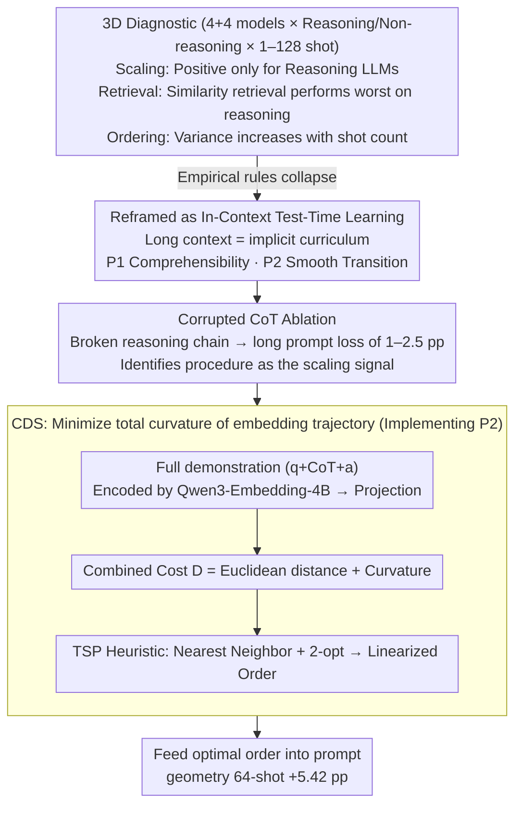

# Many-Shot CoT-ICL: Making In-Context Learning Truly Learn

**Conference**: ICML 2026  
**arXiv**: [2605.13511](https://arxiv.org/abs/2605.13511)  
**Code**: None  
**Area**: LLM Reasoning / In-Context Learning / Chain-of-Thought  
**Keywords**: many-shot ICL, chain-of-thought, in-context test-time learning, demonstration ordering, curvature regularization  

## TL;DR
This paper systematically reveals that the "rules of thumb" of many-shot ICL for non-reasoning tasks **completely fail** on CoT reasoning tasks—similarity retrieval is actually harmful, and order sensitivity increases with the number of shots. It reinterprets successful many-shot CoT as "in-context test-time learning" and proposes the Curvilinear Demonstration Selection (CDS) method, which orders demonstrations based on embedding trajectory curvature, achieving a 5.42 pp improvement on 64-shot geometry problems.

## Background & Motivation

**Background**: Long-context LLMs have made many-shot ICL possible. Prior works (Bertsch et al., Baek et al.) observed three patterns in non-reasoning tasks (classification, simple QA): (1) performance rises steadily with the number of shots; (2) sensitivity to demonstration order decreases as the number of shots increases; (3) similarity retrieval (top-k most similar) improves performance. Meanwhile, Chain-of-Thought (CoT) has become standard for complex reasoning, but CoT-ICL is mostly studied in few-shot settings.

**Limitations of Prior Work**: Whether these three empirical rules hold when CoT is combined with many-shot (i.e., many-shot CoT-ICL) remains systematically unstudied. If the rules still hold, existing engineering patterns of retrieval and shot stacking can continue; if they break, the entire prompt engineering paradigm must be reconsidered. This is not just an engineering issue but concerns the fundamental debate of whether ICL is "scaled pattern matching" or "true learning."

**Key Challenge**: CoT demonstration lengths (geometry tasks are ~30× longer than BANKING77), internal procedural reasoning chains, and higher understanding requirements on the model suggest that traditional many-shot intuitions like "more is better" and "retrieval is correct" may not hold in CoT scenarios. If ICL truly involves "learning," then demonstrations are supervision and order acts as a curriculum, requiring a step-by-step pedagogical approach; in contrast, from a pattern-matching perspective, order should not matter.

**Goal**: (1) Systematically characterize many-shot CoT-ICL across the dimensions of scaling, retrieval, and ordering; (2) identify the root causes of the failure of empirical rules; (3) propose a new perspective to unify these phenomena and guide the design of demonstration selection/ordering.

**Key Insight**: View many-shot CoT as **in-context test-time learning**. The long-context window is not a simple "retrieval cache" but an implicit curriculum, where the model's forward pass functions as a gradient-free adaptation. This perspective naturally leads to two pedagogical principles: (P1) demonstrations must be **comprehensible to the model** to serve as effective supervision; (P2) demonstration order must **transition smoothly** to avoid abrupt conceptual jumps that break the implicit learning trajectory.

**Core Idea**: Based on P2, the demonstration order is viewed as a trajectory in embedding space. The **total curvature** (sum of angles of adjacent displacements) is the quantitative metric for "smoothness." Minimizing the total curvature yields a coherent in-context curriculum—this is Curvilinear Demonstration Selection (CDS).

## Method

### Overall Architecture
The paper follows a "Diagnosis—Theory—Algorithm" chain: first, large-scale controlled experiments show that the three empirical rules of many-shot ICL collapse in CoT reasoning; then, the process is reinterpreted as in-context test-time learning, viewing long context as an implicit curriculum rather than a retrieval cache; finally, the principle of "smooth transition" is implemented as CDS. Given $n$ demonstrations, CDS seeks a permutation $O = [\mathbf{d}_{\pi(1)}, \ldots, \mathbf{d}_{\pi(n)}]$ that minimizes the total curvature of the embedding trajectory $\Theta(O) = \sum_{t=2}^{n-1} \arccos\!\left(\frac{\mathbf{v}_t \cdot \mathbf{v}_{t+1}}{\|\mathbf{v}_t\|\|\mathbf{v}_{t+1}\|}\right)$, where $\mathbf{v}_t = \tilde{\mathbf{e}}_t - \tilde{\mathbf{e}}_{t-1}$ is the displacement vector of adjacent projected embeddings. The diagnosis phase covers 4 non-reasoning LLMs (LLaMA 3.1 8B / 3.3 70B / Qwen2.5 7B / 14B) and 4 reasoning LLMs (Qwen3 8B / 14B / QwQ 32B / DeepSeek-R1 685B), tested on classification tasks (SuperGLUE, NLU, TREC, BANKING77) and math/narrative tasks (GSM8K, MATH geometry/number_theory/counting_and_probability, DetectiveQA) across 1–128 shots with exact match evaluation.

### Key Designs

**1. 3D Diagnostic Experiments: Examining many-shot conventions under the microscope to prove their failure in CoT reasoning**

Many many-shot engineering patterns (shot stacking, similarity retrieval, order indifference) are built on the three rules observed in non-reasoning tasks. The core question is whether these rules hold for CoT. The authors set controls across scaling, retrieval, and ordering. In **Scaling**, non-reasoning LLMs running geometry or number\_theory show unstable or declining performance as shots increase (e.g., LLaMA 3.3 70B shows negative gain on CoT-ICL), while only reasoning-oriented LLMs (Qwen3, QwQ, R1) show monotonic positive scaling. Table 1 shows that disabling thinking mode on Qwen3 drops geometry scores by ~7 pp, proving reasoning prior is necessary for scaling. In **Retrieval**, using embedding cosine for top-$k$ vs. bottom-$k$ shows top-$k$ is superior for BANKING77 (non-reasoning) but worst for geometry/number\_theory/DetectiveQA—semantic similarity does not predict procedural compatibility. In **Ordering**, standard deviation across 5 random permutations decreases with shots in non-reasoning tasks (order doesn't matter) but increases in reasoning tasks, indicating deep path dependence.

**2. Corrupted CoT Ablation: Proving models absorb the intermediate reasoning process, not just final answers**

Diagnosis reveals phenomena, but a sharper question remains: does the model "learn" the reasoning process $C$ or just the $x \to y$ mapping? The authors construct pairs of prompts for geometry—normal $(x_i, C_i, y_i)$ and procedurally corrupted $(x_i, C_0, y_i)$. The latter replaces all rationales with the same chain $C_0$ from the first demonstration while keeping unique questions and answers. Format, context length, and $x\to y$ are controlled. Results (Table 2) show that at $n=16$, performance is similar, but at $n=128$, the corrupted version causes Qwen3-8B to drop 1.25 pp and Qwen3-14B to drop 2.51 pp. This provides hard evidence for "in-context test-time learning": the procedure is the true signal for long-context scaling.

**3. Curvilinear Demonstration Selection (CDS): Quantifying "smooth transition" as total curvature to minimize it**

If order sensitivity stems from "conceptual jumps," smoother trajectories should help. CDS quantifies pedagogical "smoothness": each demonstration $\mathbf{d}_i$ (question + CoT + answer) is encoded by Qwen3-Embedding-4B into $\mathbf{e}_i \in \mathbb{R}^d$. Full demonstrations are used because ordering effects depend on procedural content. Embeddings are projected to a lower-dimensional subspace $\tilde{\mathbf{e}}_i \in \mathbb{R}^{d'}$ for stable curvature estimation. Local curvature is defined as the angle between adjacent displacement vectors $\theta_i = \arccos\!\left(\frac{(\tilde{\mathbf{e}}_i - \tilde{\mathbf{e}}_{i-1}) \cdot (\tilde{\mathbf{e}}_{i+1} - \tilde{\mathbf{e}}_i)}{\|\tilde{\mathbf{e}}_i - \tilde{\mathbf{e}}_{i-1}\|\,\|\tilde{\mathbf{e}}_{i+1} - \tilde{\mathbf{e}}_i\|}\right)$, and total curvature $\Theta(O) = \sum_{i=2}^{n-1}\theta_i$ is minimized. Since exact minimization is NP-hard, the authors use a **TSP approximation** with cost $D_{\text{CDS}} = D_{\text{euclidean}} + D_{\text{curvature}}$. This forces neighbors into close proximity while suppressing abrupt turns. For $n \leq 128$, this calculates within a minute on a CPU. Curvature significantly correlates with accuracy ($r=-0.547$ total). A high-curvature ablation (reversing objectives) confirms that smooth transitions, not just clustering, drive the gain.

### Loss & Training
CDS is a **test-time** algorithm with no training. The underlying embedding model is Qwen3-Embedding-4B (off-the-shelf). Evaluation models include LLaMA, Qwen2.5, Qwen3, QwQ, and DeepSeek-R1 series. Context windows reach 131K tokens, with shots $n \leq 128$.

## Key Experimental Results

### Main Results
CDS gains on Qwen3 series (Geometry / Number Theory / DetectiveQA):

| Task | Model | Configuration | n=64 Gain |
|---|---|---|---|
| Geometry | Qwen3-14B | CDS vs. Random | **+5.42 pp** |
| Geometry | Qwen3-14B | n=128 + thinking on | 73.07% vs. 66.18% (n=16) |
| Geometry | Qwen3-14B | thinking on vs. off (n=128) | 73.07 vs. 65.76 |
| Number\_theory | Qwen3-14B | thinking on vs. off (n=128) | 91.30 vs. 88.15 |
| DetectiveQA | Qwen3-8B | thinking on vs. off (n=128) | 69.48 vs. 66.88 |

### Ablation Study

| Configuration | Behavior | Description |
|---|---|---|
| CDS (low curvature) | Best | Full method |
| High-curvature baseline | Significantly worse | Same neighborhood, reversed curvature objective |
| Similarity top-k retrieval | Worse | Semantic similarity fails to predict procedural compatibility |
| Similarity bottom-k | Neutral/Mixed | Often better than top-k; counter-intuitive |
| Procedurally corrupted CoT (n=128) | Significantly worse (-1.25 to -2.51 pp) | Confirms procedure is the key signal |
| Thinking mode disabled | Significantly worse | Reasoning prior is essential for scaling |
| Non-reasoning LLM + CoT-ICL | Unstable/Negative scaling | Model class determines CoT absorption |

### Key Findings
- **CoT-ICL is not scaled pattern matching**: Similarity retrieval works for BANKING77 (non-reasoning) but is **inverse** for geometry/number\_theory/DetectiveQA, rejecting the retrieval hypothesis for reasoning.
- **Order sensitivity increases with shot count** (opposite of non-reasoning tasks): 100+ random demonstrations contain more "conceptual jumps," triggering procedural incoherence.
- **Self-generated CoT outperforms ground-truth CoT**: For weaker models, self-generated CoT (even with errors) is more beneficial than dataset CoT, validating P1 ("Comprehensibility First"). This advantage shrinks as models improve.
- **The scaling gap** between reasoning-oriented and non-reasoning LLMs lies in thinking tokens—they extract procedural supervision from demonstrations rather than just matching IO patterns.
- **Total curvature correlates negatively with accuracy** (geometry $r=-0.545$, counting $r=-0.628$), justifying curvature minimization.

## Highlights & Insights
- **In-context test-time learning is a unifying perspective**: Scaling failure (P1 violation), similarity failure (procedural mismatch), and order sensitivity (P2 violation) are all explained: long context is an implicit curriculum, not a cache.
- **Self-generated CoT superiority** is counter-intuitive: models "understand" their own CoT better. This suggests a free engineering upgrade for weak models: use self-generated CoT in the prompt.
- **Curvature as an ordering objective**: Quantifying "smooth transitions" as the sum of displacement angles is geometrically intuitive and computable. The causal smoothness ablation distinguishes it from mere clustering.
- **Full demonstration embedding** is critical: Encoding just the question loses the procedural CoT structure. Using question + CoT + answer allows curvature to reflect procedural transition difficulty.

## Limitations & Future Work
- "Smooth transition" relies on the embedding space's ability to represent procedural content; if the embedding model lacks CoT structural awareness, curvature signals may be noisy.
- Experiments focus on math and narrative; coding, theorem proving, and agentic planning are yet to be verified.
- CDS uses TSP approximations; the gap between the heuristic and the global minimum curvature is not characterized.
- The benefit of self-generated CoT shrinks for stronger models; whether they can eventually ignore self-generation requires quantification.
- Future work could explore curvature as a differentiable penalty in training (curriculum fine-tuning) or combine it with RAG for retrieval-aware curricula.

## Related Work & Insights
- **vs. Bertsch et al. / Baek et al. (many-shot ICL)**: They found scaling and order robustness in non-reasoning tasks; this work provides a key corrective by proving these fail for CoT.
- **vs. Auto-CoT (Zhang et al.) / Dr.ICL (Luo et al.)**: They focus on few-shot demonstration selection; this work tackles the unique dynamics of many-shot settings.
- **vs. Test-time scaling (Snell et al.)**: Test-time scaling usually focuses on sample-and-revise; this work views many-shot CoT as another test-time scaling form where demonstrations are in-context supervision.
- **Insights**: Projects relying on "retrieval scaling" for long context (RAG, agent memory) should reconsider ordering. Pedagogical concepts like "zone of proximal development" now have quantifiable analogs in prompt engineering.

## Rating
- Novelty: ⭐⭐⭐⭐⭐ First to systematically disprove many-shot ICL conventions for CoT and reframe it via CDS.
- Experimental Thoroughness: ⭐⭐⭐⭐ Extensive cross-model and cross-task testing, though CDS is primarily tested on Qwen3.
- Writing Quality: ⭐⭐⭐⭐⭐ Excellent "Diagnosis—Theory—Algorithm" structure with appropriate pedagogical analogies.
- Value: ⭐⭐⭐⭐⭐ A wake-up call for long-context prompt engineering; CDS provides a plug-and-play upgrade.

<!-- RELATED:START -->

## Related Papers

- [\[ACL 2025\] CoT-ICL Lab: A Synthetic Framework for Studying Chain-of-Thought Learning from In-Context Demonstrations](../../ACL2025/llm_reasoning/cot-icl_lab_a_synthetic_framework_for_studying_chain-of-thought_learning_from_in.md)
- [\[ICLR 2026\] CoT-RVS: Zero-Shot Chain-of-Thought Reasoning Segmentation for Videos](../../ICLR2026/llm_reasoning/cot-rvs_zero-shot_chain-of-thought_reasoning_segmentation_for_videos.md)
- [\[ICLR 2026\] Is In-Context Learning Learning?](../../ICLR2026/llm_reasoning/is_in-context_learning_learning.md)
- [\[AAAI 2026\] LLMs for Game Theory: Entropy-Guided In-Context Learning and Adaptive CoT Reasoning](../../AAAI2026/llm_reasoning/llms_for_game_theory_entropy-guided_in-context_learning_and_adaptive_cot_reasoni.md)
- [\[ICML 2026\] Clustering as Reasoning: A $k$-Means Interpretation of Chain-of-Thought Graph Learning](clustering_as_reasoning_a_k-means_interpretation_of_chain-of-thought_graph_learn.md)

<!-- RELATED:END -->
