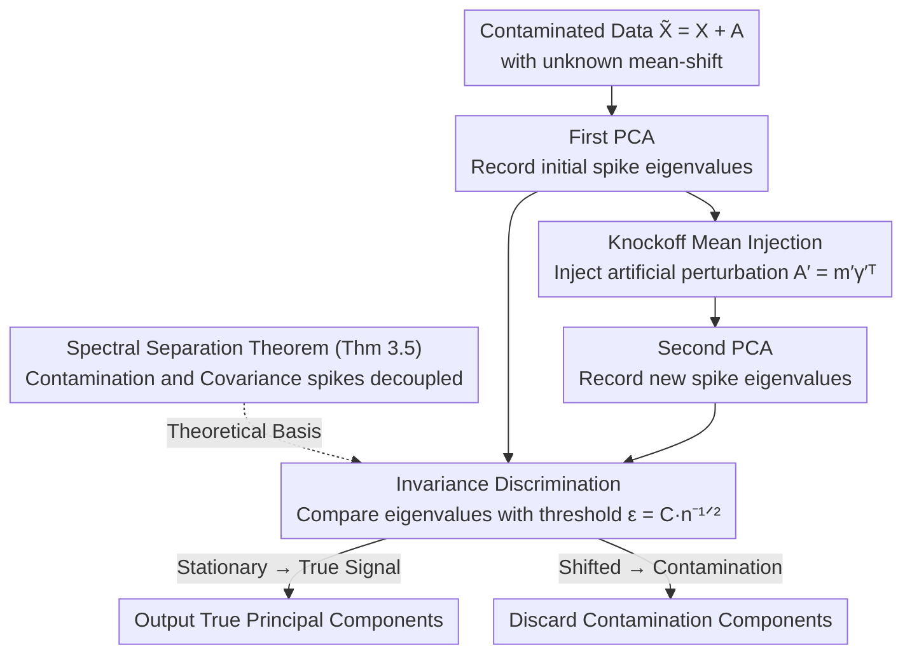

# Mean-Shift PCA by Knockoff Mean

**Conference**: ICML 2026  
**arXiv**: [2605.25460](https://arxiv.org/abs/2605.25460)  
**Code**: None  
**Area**: High-dimensional Statistics / Robust PCA / Random Matrix Theory  
**Keywords**: Principal Component Analysis, Mean-shift Contamination, Knockoff, Random Matrix Theory, Spectral Invariance

## TL;DR
This paper utilizes Random Matrix Theory to prove that "mean-shift contamination" is asymptotically independent of true covariance spikes in the spectrum of the sample covariance matrix. Based on this, the authors propose MS-PCA, a two-stage algorithm: by intentionally injecting a "knockoff mean" (decoy mean-shift) and performing a second PCA, it identifies "decoy-driven" eigenvalues as contamination and removes them, thereby recovering true principal components using only standard PCA operations in high dimensions.

## Background & Motivation

**Background**: PCA is the most fundamental dimensionality reduction tool in high-dimensional data analysis. however, it is highly sensitive to the sample mean—a small fraction of samples from a shifted sub-distribution (mean-shift mixture) can bias the sample mean and severely distort the principal component directions. A large body of Robust PCA (RPCA) variants handles contamination by decomposing the data matrix into "low-rank signal + sparse noise" (e.g., PCP by Candès et al. 2011, Outlier Pursuit, AAP by Cai et al.).

**Limitations of Prior Work**: The authors use Figure 2 to demonstrate that in high dimensions ($d/n \to c > 0$), even with only 5% mean-shift contamination, the cosine similarity between the largest PC estimated by RPCA and the ground truth tends to zero as dimensionality increases. The fundamental reason is that both core assumptions of RPCA fail: mean-shift noise is **not sparse** (it affects the entire contaminated subset) and it **is low-rank** ($\mathbf{A}_n = \sum_i \mathbf{m}_{(i)} \boldsymbol{\gamma}_{(i)}^\top$, with rank equal to the number of clusters), making it structurally indistinguishable from the true signal. Classical robust approaches like Median-of-Means PCA, $\ell_1$-PCA, and Tyler/Huber M-estimators are designed for fixed/low dimensions and fail in high-dimensional regimes due to non-negligible biases.

**Key Challenge**: Traditional "robustness" tools for low-dimensional statistics are inapplicable in the $d/n \to c$ regime, while high-dimensional RPCA mistreats the problem as a "low-rank + sparse" decomposition, ignoring the "low-rank + dense" nature of mean-shift contamination.

**Goal**: (i) Characterize how mean-shift contamination affects the spectrum and eigenvectors of sample covariance; (ii) Propose an algorithm using **only standard PCA** to recover true principal components without non-convex optimization; (iii) Provide theoretical guarantees rather than heuristic tricks.

**Key Insight**: Since adding noise is easier than removing it (as seen in diffusion priors by Daras et al. 2023), one can inject a "decoy" noise to observe the response. Leveraging the spiked covariance model in RMT and low-rank perturbation theory (Benaych-Georges & Nadakuditi 2012), it can be proven that spikes caused by mean-shifts and true covariance spikes are **asymptotically independent** in the spectrum. When an artificial mean-shift is added, the former is pushed by an $\mathcal{O}(1)$ magnitude, while the latter only fluctuates within $\mathcal{O}(n^{-1/2})$.

**Core Idea**: **"Knockoff Mean"**—Active injection of a structured mean-shift as a probe. Eigenvalues that remain "stable" across two PCA operations are identified as true signals, while those "driven by the decoy" are identified as contamination and discarded.

## Method

### Overall Architecture
The method addresses the problem where high-dimensional mean-shift contamination inserts "fake" spikes into the sample covariance spectrum, biasing true PCs, without prior knowledge of which spikes are contaminated. MS-PCA performs a "controlled experiment": first, it performs PCA on contaminated data $\widetilde{\mathbf{X}}_n = \mathbf{X}_n + \mathbf{A}_n \in \mathbb{R}^{d \times n}$ (where $\mathbf{A}_n = \sum_{i=1}^{k} \mathbf{m}_{(i)} \boldsymbol{\gamma}_{(i)}^\top$ is the mean-shift contamination and $\boldsymbol{\gamma}_{(i)}$ are cluster indicator vectors) to record spike eigenvalues $\{\tilde{\lambda}_i\}$. Second, it injects an artificial knockoff perturbation $\mathbf{A}'_n = \mathbf{m}' \boldsymbol{\gamma}'^\top$ and performs a second PCA to obtain $\{\lambda'_i\}$. Finally, it compares the results: eigenvalues that remain stationary are classified as true covariance signals, while those pushed by the decoy are identified as contamination. The validity is ensured by the spectral separation theorem, which guarantees that true signal spikes and contamination spikes do not interfere. The pipeline requires no optimization or iteration, only two top-K PCAs (via Lanczos or randomized SVD), with a complexity of $O(nd)$, значительно lower than optimization-based RPCA.

### Key Designs

**1. Spectral Separation Theorem (Theorem 3.5): Proving "One Moves, the Other Stays"**

The algorithm's validity rests on the fact that identification is only possible if true signal spikes and contamination spikes are decoupled. In a spiked covariance model $\mathbf{\Sigma} = \mathbf{I}_d + \mathbf{P}$ (rank-$r$ signal) with mean-shift contamination, the authors prove that as $d/n \to c$, the $r+k$ spike eigenvalues of the sample covariance $\widetilde{\mathbf{X}}_n \widetilde{\mathbf{X}}_n^\top / n$ asymptotically split into two independent sets. The covariance set $\Lambda_{\mathbf{P}} = \{1 + \ell_i + c(1+\ell_i)/\ell_i : \ell_i > \sqrt{c}\}$ is determined solely by the signal strength $\ell_i$, and the contamination set $\Lambda_{\mathbf{A}} = \{1 + \theta_j^2 + c(1+\theta_j^2)/\theta_j^2 : \theta_j^2 > \sqrt{c}\}$ depends only on the mean-shift intensity $\theta_j = \sqrt{\pi_j}\|\mathbf{m}_{(j)}\|$. Spikes only emerge once they exceed the BBP phase transition threshold $\sqrt{c}$. This step elevates the observation of "decoupling" to an asymptotic theorem using Stieltjes transforms and the additive low-rank perturbation framework (Lemma 3.8).

**2. Knockoff Mean Injection: Using Known Noise to Fish Out Unknown Contamination**

A sufficiently "bright" probe is required: the decoy must be strong enough to push contamination spikes in $\Lambda_{\mathbf{A}}$ significantly without disturbing true signals in $\Lambda_{\mathbf{P}}$. The authors construct $\mathbf{A}'_n = \mathbf{m}' \boldsymbol{\gamma}'^\top$ where $\mathbf{m}'$ is sampled uniformly from the unit sphere $\mathbb{S}^{d-1}$ and the intensity is set to $\theta'^2 := \pi'\|\mathbf{m}'\|^2 = 2\,g^{-1}(\tilde{\lambda}_1)$. Here $g$ is the spike-forward mapping (Proposition C.1); taking its inverse aligns the decoy's "strength" with the observed maximum spike $\tilde{\lambda}_1$, ensuring detectability while staying above the BBP threshold. Even if the decoy happens to be collinear with an existing contamination direction, SVD analysis of $\mathbf{A}_n + \mathbf{A}'_n$ shows that the spike still undergoes an $\mathcal{O}(1)$ displacement. This approach shares the spirit of knockoff filters for FDR control—creating known "fake variables" to contrast with true ones—but is applied here in the spectral domain.

**3. Invariance Discrimination (Algorithm 1, Step 5): Hard Threshold Based on Fluctuation Scale**

For each original spike $\tilde{\lambda}_i$, the algorithm checks the second PCA's eigenvalues for $\lambda'_j$ such that $|\tilde{\lambda}_i - \lambda'_j| < \epsilon$. The threshold $\epsilon = C n^{-1/2}$ is theoretically grounded: random fluctuations of stable spikes outside the bulk are $\mathcal{O}(n^{-1/2})$ (Benaych-Georges & Nadakuditi 2012), while the displacement of contamination spikes driven by the decoy is $\mathcal{O}(1)$. These two scales separate in high dimensions, allowing a fixed constant $C$ to distinguish them. In experiments, $C=1$ is used for large $d$, and $C=1/c$ for small $d$.

### Loss & Training
This method involves **no optimization and no training**. It only calls standard PCA twice plus an $\epsilon$-neighborhood matching. The only hyperparameter is the constant $C \in \{1, 1/c\}$. This distinguishes it from RPCA, MoMPCA, or M-estimators.

## Key Experimental Results

### Main Results

**Experiment 1: Two-Gaussian Mixture + Single-Spike Covariance vs. RPCA-AAP**. Configuration: $\ell_1 = 2\sqrt{c}$, $\|\mathbf{m}_{(1)}\| = 2\sqrt{\sqrt{c}/\pi_1}$. Comparison of cosine alignment $|\langle \mathbf{u}_1, \hat{\mathbf{u}}_1\rangle|$ over 25 trials:

| Setting | Contamination $\pi_1$ | MS-PCA Alignment | RPCA-AAP Alignment | Note |
|------|--------------|------------|--------------|------|
| $c=0.1$, small $d$ | 5% | ≈ Similar to RPCA (Low) | ≈ Same | Difficult case for all |
| $c=0.1$ | ≥ 25% | ≈ Perfect ($\approx 1$) | Much lower than 1 | Stronger knockoff signal |
| $c=1$, large $d$ | 5%–50% | Consistently ≈ 1 | Drops to 0 as $d \to \infty$ | RPCA fails in high dimensions |

**Experiment 2: Comparison with Robust Estimators** ($d=900, n=10^3$). MS-PCA achieves PC alignment > 95%, while Tyler M-estimator, Huber M-estimator, $\ell_1$-PCA, and others yield alignment close to random.

### Ablation Study

**Table 1: Eigenvector Residual Magnitudes**. Residual $\|\frac{1}{n}\mathbf{X}_n\mathbf{X}_n^\top \tilde{\mathbf{u}} - \tilde{\lambda}\tilde{\mathbf{u}}\|_2$ for $n=d, c=1$:

| Contamination $\pi_1$ | $d=1000$ | $d=10000$ | $d=50000$ | Decay Rate |
|--------------|---------|----------|----------|---------|
| 0.1% | $1.50\times 10^{-1}$ | $5.20\times 10^{-2}$ | $2.37\times 10^{-2}$ | $\mathcal{O}(n^{-1/2})$ |
| 10% | $1.50\times 10^{-1}$ | $4.84\times 10^{-2}$ | $2.50\times 10^{-2}$ | $\mathcal{O}(n^{-1/2})$ |
| 50% | $1.60\times 10^{-1}$ | $5.30\times 10^{-2}$ | $2.58\times 10^{-2}$ | $\mathcal{O}(n^{-1/2})$ |

**Key Findings**:
- **Heavier contamination makes recovery easier**: When $\pi_1 \geq 25\%$, perfect recovery is possible even in lower dimensions because contamination spikes are more prominent and easier for the knockoff to "nudge." This is non-intuitive compared to standard RPCA.
- **Method is insensitive to hyperparameters**: The constant $C$ follows RMT scaling laws, removing the need for cross-validation.

## Highlights & Insights
- **"Adding noise to identify noise"**: Moving the "decoy" intuition from causal inference (knockoff filters) to spectral analysis is a clever methodological trick.
- **Reducing "Robustness" to a "Controlled Experiment"**: MS-PCA avoids non-convex optimization, requiring only standard PCA and numerical comparison, making it $O(nd)$ and easy to deploy.
- **Theoretically Aligned**: The threshold $Cn^{-1/2}$ is precisely calibrated between the random fluctuation scale and the deterministic shift scale.
- **Semantic Calibration of RPCA**: The authors point out that mainstream RPCA solves "low-rank + sparse decomposition," which is not necessarily the same as "classical statistical robustness to contamination."

## Limitations & Future Work
- **First-order Moments only**: Assumes contamination is in the mean. If contamination affects the covariance (heteroscedasticity), the theoretical guarantees currently do not hold.
- **Dependence on Spikes**: Mean-shifts must exceed the phase transition $\theta^2 > \sqrt{c}$ to be detectable.
- **No Real Data**: Experiments are limited to synthetic Gaussian/spiked covariance models. Engineering challenges may arise when the Limit Spectral Distribution (LSD) is not Marčenko-Pastur.

## Related Work & Insights
- **vs RPCA / PCP**: RPCA assumes sparse noise; MS-PCA handles dense mean-shifts. MS-PCA's PC alignment does not vanish as $d$ increases compared to RPCA.
- **vs $\ell_1$-PCA**: $\ell_1$-PCA is NP-hard and exponentially complex in $d$; MS-PCA is $O(nd)$.
- **Methodological Inspiration**: Inspired by Knockoff Filters (Barber & Candès 2015). This "active injection" approach could be extended to other signal separation problems like matrix completion or robust spectral clustering.

## Rating
- Novelty: ⭐⭐⭐⭐⭐ 
- Experimental Thoroughness: ⭐⭐⭐ 
- Writing Quality: ⭐⭐⭐⭐ 
- Value: ⭐⭐⭐⭐ 

<!-- RELATED:START -->

## Related Papers

- [\[ACL 2026\] Adapt to Thrive! Adaptive Power-Mean Policy Optimization for Improved LLM Reasoning](../../ACL2026/llm_reasoning/adapt_to_thrive_adaptive_power-mean_policy_optimization_for_improved_llm_reasoni.md)
- [\[ICML 2026\] Verifying Meta-Awareness via Predictive Rewards in Reasoning Models](verifying_meta-awareness_via_predictive_rewards_in_reasoning_models.md)
- [\[ICML 2026\] Prioritize the Process, Not Just the Outcome: Rewarding Latent Thought Trajectories Improves Reasoning in Looped Language Models](prioritize_the_process_not_just_the_outcome_rewarding_latent_thought_trajectorie.md)
- [\[ICML 2026\] Many-Shot CoT-ICL: Making In-Context Learning Truly Learn](many-shot_cot-icl_making_in-context_learning_truly_learn.md)
- [\[ICML 2026\] DecepChain: Inducing Deceptive Reasoning in Large Language Models](decepchain_inducing_deceptive_reasoning_in_large_language_models.md)

<!-- RELATED:END -->
