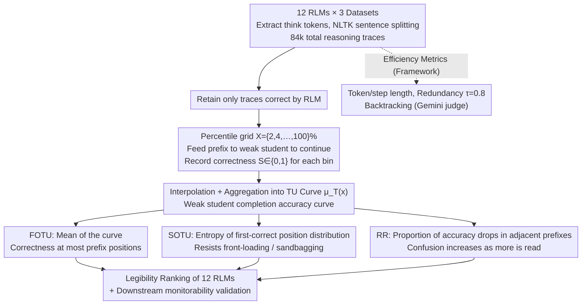

# Measuring Weak-to-Strong Legibility of Reasoning Models

**Conference**: ICML 2026  
**arXiv**: [2603.20508](https://arxiv.org/abs/2603.20508)  
**Code**: Not public (Authors committed to code release)  
**Area**: LLM Reasoning / Scalable Oversight / Multi-agent Collaboration  
**Keywords**: weak-to-strong legibility, transfer utility, reasoning trace, weak supervision, reasoning legibility

## TL;DR
This paper proposes **Transfer Utility (TU)**—a metric that measures the "weak-to-strong legibility" of reasoning traces by feeding percentile prefixes of traces from a strong Reasoning Language Model (RLM) to a weak student model and assessing the student's ability to complete the correct answer. Across 12 open-source RLMs, 3 datasets, and 85k traces, the study finds that **the traces of the most accurate and concise RLMs (e.g., GPT-OSS-120B) actually rank lowest in TU**, suggesting that RLVR training transforms reasoning traces into artifacts useful only for strong models.

## Background & Motivation

**Background**: Reasoning models (RLMs) like GPT-OSS, DeepSeek-R1, and Kimi-K2-Thinking are primarily trained using RLVR (Reinforcement Learning with Verifiable Rewards). Since reward signals only evaluate the final answer, intermediate reasoning traces are treated as "by-products"—optimized to be as short as possible or even discarded.

**Limitations of Prior Work**: In scenarios such as scalable oversight, model distillation, agent collaboration, and trace caching, weak models must "understand" the traces of strong models. However, existing legibility metrics (e.g., prover-verifier in Kirchner et al. 2024, coherence in Samineni et al. 2025, or various token/step-based efficiency metrics) lean toward "conciseness" and fail to characterize the "thoroughness" of a trace. A trace simply stating "the answer is 5" is perfect in terms of efficiency but clearly useless for transfer.

**Key Challenge**: Legibility requires a balance between **conciseness** and **thoroughness**. Conciseness reduces token costs and cognitive load, while thoroughness ensures key reasoning steps are preserved for a weak model to continue. RLVR optimization rewards only correctness, resulting in a trade-off between efficiency and transfer, a dimension that existing metrics fail to capture.

**Goal**: (i) Provide a legibility metric that does not rely on strong LLM judges or human labels; (ii) Systematically characterize 12 mainstream RLMs along the weak-to-strong dimension; (iii) Verify if the metric predicts the actual effectiveness of downstream weak supervision (monitorability).

**Key Insight**: Legibility is essentially "whether a weak model can continue the reasoning of a strong model." The authors operationalize this intuition into an interactive experiment: taking questions correctly answered by an RLM, truncating its trace to the first $x\%$, feeding it to a weak model (Phi-3-Mini 3.8B / Llama-3.2-1B), and observing if the weak model can then produce the correct answer.

**Core Idea**: The "accuracy curve of a weak student continuing from a trace prefix, $\mu_T(x)$" is used as a measurable proxy for legibility. Three complementary scalars (FOTU / SOTU / Regression Rate) are derived from this curve to quantify the "weak-model friendliness" of traces.

## Method

### Overall Architecture
The pipeline consists of three steps:

1.  **Trace Generation**: 12 RLMs solve problems from MATH, GPQA, and LSAT. Reasoning traces are extracted from "think" tokens and segmented into step sequences using NLTK, totaling 84,396 traces.
2.  **Efficiency Calculation**: For each trace, metrics such as token/step length, redundant sentence embeddings ($\tau=0.8$ threshold), and backtracking frequency (labeled by Gemini 2.5-Flash as a judge) are calculated.
3.  **Transfer Calculation (Core)**: For traces where the RLM was correct, prefixes are fed to a weak student $W$ using a grid of $X=\{2,4,\ldots,100\}\%$. The weak student is allowed 1024 additional tokens to reach an answer. Correctness $S(R_p^{(x)})\in\{0,1\}$ is recorded for each bin. Trace-level curves $f_p(x)$ are completed via linear interpolation, and the teacher-level curve $\mu_T(x)$ is the weighted mean of traces averaged across students.

### Key Designs

**1. Transfer Utility Curve $\mu_T(x)$ and FOTU: Replacing subjective legibility with completion accuracy**

Legibility is traditionally a subjective attribute requiring human or strong LLM judgment. The prover-verifier approach is adversarial and requires training the weak model, leading to circular dependencies. This work operationalizes it into a curve: for each correct trace $R_p$ from teacher $T$, prefixes are sampled every 3 steps and fed to a fixed weak student. The teacher-level curve is $\mu_T(x)=\frac{1}{|\mathcal{S}|}\sum_{W\in\mathcal{S}}\frac{1}{|P_x|}\sum_{p\in P_x}f_p^{(W)}(x)$. **First-Order Transfer Utility (FOTU)** is the mean of this curve: $\text{FOTU}(T)=\frac{1}{|X_T|}\sum_{x\in X_T}\mu_T(x)$. High values indicate the student can complete the reasoning from most prefix positions. Percentile bins ensure comparability across different lengths.

**2. Second-Order TU (SOTU): Using entropy as an "information density regularizer" against reward hacking**

FOTU has a loophole: a trace that "front-loads" the answer in the first step or "sandbags" it until the very last can produce inflated FOTU scores. **SOTU** addresses this by measuring the entropy of the "first-correct position." For each trace and student $W$, let $\tau_p^{(W)}=\min\{x:f_p^{(W)}(x)=1\}$. SOTU is the normalized entropy of this empirical distribution $h_{T,W}(x)$: $\text{SOTU}(T)=\frac{1}{|\mathcal{S}|}\sum_W \frac{-\sum_x h_{T,W}(x)\log h_{T,W}(x)}{\log|X|}\in[0,1]$. A more uniform distribution (useful information spread evenly) results in higher SOTU.

**3. Regression Rate (RR): Measuring "late-stage confusion" in weak models**

FOTU and SOTU are global position-level properties. **RR** detects local deterioration where adding more steps actually misleads the weak student. It treats the correctness sequence $y_1,\ldots,y_K$ as a time series and counts the proportion of drops: $\text{rr}(p,W)=\frac{1}{K-1}\sum_{i=1}^{K-1}\mathbb{1}[y_{i+1}<y_i]$. While backtracking is a feature of the trace itself, RR is the downstream consequence of such features on the weak student.

## Key Experimental Results

### Main Results: Ranking 12 RLMs across 6 Legibility Dimensions

| Model (Acc%) | Token Len | Redund | Backtrack | FOTU | SOTU |
|---|---|---|---|---|---|
| GPT-OSS-120B (81) | 4 | **1** | 4 | 10 | 5 |
| GPT-OSS-20B (76) | 5 | 2 | 7 | 8 | 4 |
| Kimi-K2-Thinking (70) | 10 | 11 | 8 | **1** | 8 |
| DeepSeek-R1 (70) | 11 | 8 | 6 | 3 | 10 |
| DeepSeek-R1-Distill-32B (68) | 6 | 8 | 10 | 11 | 6 |
| Qwen3-8B (57) | 7 | 10 | 10 | 6 | 9 |
| Magistral-S (62) | 2 | 4 | 3 | 12 | 3 |
| Gemma-3-27B-it (53) | 2 | 5 | 2 | 8 | **1** |
| OpenReasoning-32B (58) | 12 | 7 | 5 | 2 | 12 |
| Gemma-3-12B-it (49) | **1** | 3 | **1** | 7 | 2 |

**Key Findings**: (i) GPT-OSS-120B ranks 1st in accuracy but 10th in FOTU—**the strongest model's traces are the least friendly to weak students**; (ii) Kimi-K2 / DeepSeek-R1 / QwQ-32B follow a "long and wordy but student-friendly" path (3.8k–4.8k tokens, 16–31% redundancy). The Spearman correlation between accuracy and FOTU is $\rho=-0.35$.

### Key Findings
- **The Accuracy-Efficiency-Transfer Trade-off**: Current RLMs choose specific edges of this triangle; none rank in the top 3 for all three dimensions, suggesting RLVR single-objective optimization compromises transferability.
- **Length is not the only factor**: The rank correlation between FOTU and FOTU\|Length is +0.728, indicating that FOTU captures structural content beyond mere volume.
- **Reward models are blind to legibility**: Three tested reward models showed near-zero correlation with FOTU after controlling for accuracy ($\rho \approx -0.08$).

## Highlights & Insights
- **Operationalizing legibility via "weak model continuation"** is a sophisticated design that converts a subjective property into an objective, reproducible proxy with low requirements for the judge.
- **SOTU's use of entropy to counter reward hacking** is a pattern transferable to any position-based cumulative reward evaluation where "front-loading" or "sandbagging" is a concern.
- **The counter-intuitive discovery that high-accuracy model traces are the "worst"** serves as a warning for the scalable oversight community: as benchmark accuracy increases, the "pedagogical value" of models may be stagnating or even degrading.

## Limitations & Future Work
- **Limitations**: (i) Static single-turn evaluation only; (ii) Closed-source models are excluded due to lack of raw traces; (iii) No human evaluation to confirm model-to-model legibility aligns with human legibility.
- **Goal for Future Work**: Integrating FOTU directly into RL training as a process-level auxiliary reward—using a weak student as a cheap critic to force models to optimize for transfer utility.

## Related Work & Insights
- **vs Kirchner et al. 2024**: This work is collaborative rather than adversarial and does not require training the weak model.
- **vs Samineni et al. 2025**: This study provides quantitative downstream evidence for the "coherence-validity gap" by showing that locally smooth but globally flawed traces rank lowest in FOTU.
- **Insight**: Any work evaluating trace quality (code generation, planning, etc.) can adopt this "weak student completion" paradigm to cheaply quantify the "teaching value" of a trace.

## Rating
- Novelty: ⭐⭐⭐⭐⭐ (Moves weak-to-strong generalization from training to evaluation).
- Experimental Thoroughness: ⭐⭐⭐⭐ (Extensive models and datasets, though lacks 7B-class students).
- Writing Quality: ⭐⭐⭐⭐ (Clear definitions and compelling anti-intuitive findings).
- Value: ⭐⭐⭐⭐⭐ (Critiques current RLVR training targets and establishes legibility as a first-class property).

<!-- RELATED:START -->

## Related Papers

- [\[ICLR 2026\] The Illusion of Diminishing Returns: Measuring Long Horizon Execution in LLMs](../../ICLR2026/llm_reasoning/the_illusion_of_diminishing_returns_measuring_long_horizon_execution_in_llms.md)
- [\[ICLR 2026\] Is It Thinking or Cheating? Detecting Implicit Reward Hacking by Measuring Reasoning Effort](../../ICLR2026/llm_reasoning/is_it_thinking_or_cheating_detecting_implicit_reward_hacking_by_measuring_reason.md)
- [\[ICML 2026\] Are Large Reasoning Models Interruptible?](are_large_reasoning_models_interruptible.md)
- [\[ICML 2025\] Putnam-AXIOM: A Functional & Static Benchmark for Measuring Higher Level Mathematical Reasoning in LLMs](../../ICML2025/llm_reasoning/putnam-axiom_a_functional_and_static_benchmark_for_measuring_higher_level_mathem.md)
- [\[ICML 2026\] Verifying Meta-Awareness via Predictive Rewards in Reasoning Models](verifying_meta-awareness_via_predictive_rewards_in_reasoning_models.md)

<!-- RELATED:END -->
