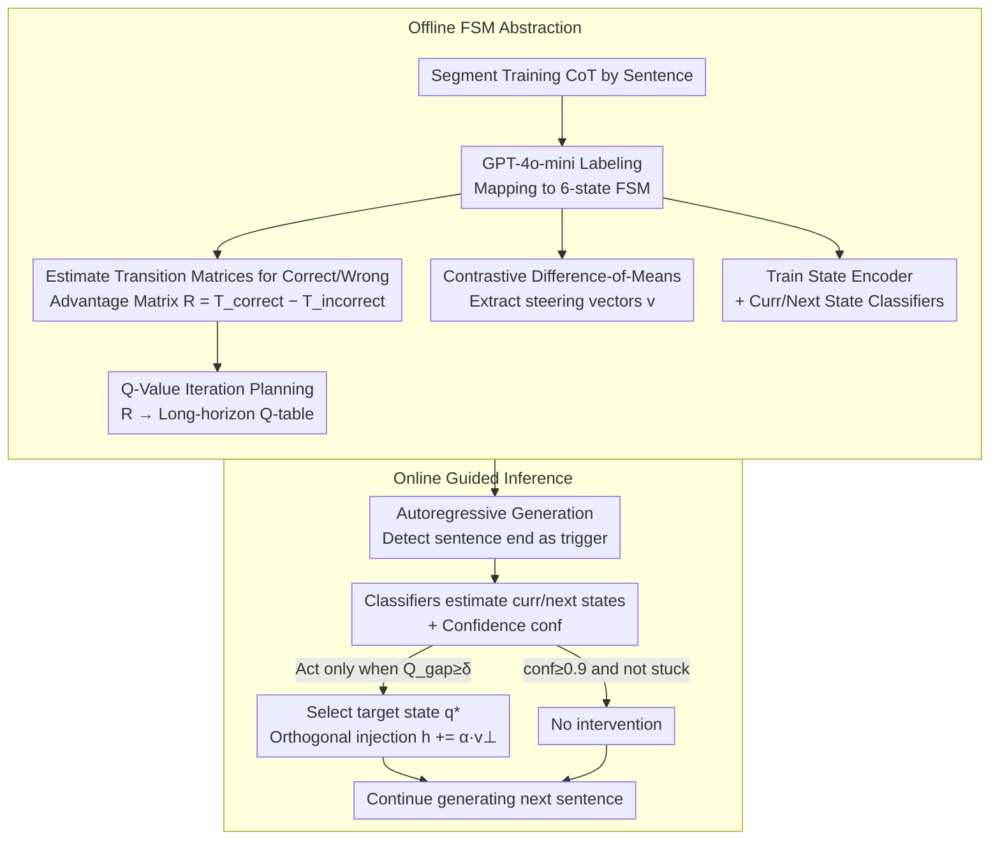

# Modeling Hierarchical Thinking in Large Reasoning Models

**Conference**: ICML2026 Oral  
**arXiv**: [2510.22437](https://arxiv.org/abs/2510.22437)  
**Code**: https://github.com/shahariar-shibli/CoT-FSM (Available)  
**Area**: LLM Reasoning  
**Keywords**: Finite State Machines, Chain-of-Thought, Activation Steering, Q-Value Planning, Interpretability

## TL;DR
The authors abstract the long Chain-of-Thought (CoT) of Large Reasoning Models (LRMs) into a 6-state Finite State Machine (FSM). By constructing a Transition Advantage Matrix from the difference in state transition probabilities between "success vs. failure" and deriving long-horizon planning strategies via Q-Value iteration, they perform sparse orthogonal activation steering at sentence boundaries. This approach improves accuracy on hard problems like AIME25 by up to +13% with approximately 25x fewer interventions.

## Background & Motivation

**Background**: LRMs complete complex reasoning tasks by generating long CoTs often exceeding thousands of tokens, exhibiting a hierarchical structure similar to human "thinking-before-answering" on tasks like AIME and GPQA. Regarding CoT interpretability, recent works have utilized activation steering for behavior-level control, such as SEAL for suppressing redundant reflection or Venhoff et al. for identifying linear directions corresponding to specific behaviors.

**Limitations of Prior Work**: Existing control methods remain at the level of "local behaviors"—either suppressing a single type of segment (e.g., reflection/transition) or merely validating that specific behaviors are steerable in the activation space. They fail to answer a critical control question: **When the model is at a certain stage of its reasoning trajectory, which cognitive state should it transition to next to maximize the probability of a correct answer?**

**Key Challenge**: There is a gap between interpretability (identifying steerable behaviors) and actionable control (deciding when and where to intervene). Token-by-token intervention disrupts content coherence and is extremely costly, while greedy one-step decisions fall into "short-sighted traps," leading the model into dead ends.

**Goal**: (1) Provide a global hierarchical characterization of CoT; (2) Quantify which cognitive transitions truly distinguish correct from incorrect outcomes; (3) Design a training-free, sparsely-intervened steering strategy with a long-term horizon.

**Key Insight**: Human problem-solving theories (Polya’s "four steps," Schoenfeld’s Episode Theory) have long partitioned problem-solving into finite high-level cognitive stages. Since LRMs are trained on human CoTs, their emergent trajectories should also be approximable by a set of discrete states.

**Core Idea**: Model the CoT as a 6-state FSM, treat the Transition Advantage Matrix $R$ (the difference between correct and incorrect transition matrices) as a reward, calculate long-horizon utility via Q-Value iteration, and perform "orthogonal component" activation steering at sentence boundaries—transforming reasoning control from "per-token fine-tuning" to "cognitive strategy planning."

## Method

### Overall Architecture
The method consists of two stages: **Offline FSM Abstraction** and **Online Guided Inference**.

Offline Stage: Generate full CoTs for the training set, segment them by sentences, and use GPT-4o-mini for automatic labeling to map each sentence to one of 6 high-level states $\mathcal{Q}=\{\text{init, deduce, augment, uncertain, backtrack, closure}\}$. Based on this, estimate two conditional transition matrices, $T^{(correct)}$ and $T^{(incorrect)}$, and derive the Transition Advantage Matrix $R = T^{(correct)} - T^{(incorrect)}$. Meanwhile, extract activation steering vectors $\mathbf{v}^{(\ell)}_{u\to v}$ for each directed transition $(u\to v)$ using contrastive difference-of-means, and train a State Encoder along with two lightweight classifiers (current state $g_{curr}$, next state $g_{next}$).

Online Stage: During autoregressive generation, detect sentence-end punctuation (`. ? !`) as intervention points. At boundaries, use classifiers to estimate the current and next states, use the Q-Value policy to decide whether to intervene and which target state $q^\star$ to guide towards, and then perform orthogonal component injection of the corresponding steering vector in the hidden space before continuing generation.

### Key Designs

**1. 6-State FSM Abstraction + Transition Advantage Matrix $R$: Compressing unstructured CoT into a discriminative transition graph**

Prior CoT control methods either applied broad behavior-based suppression or focused on single linear directions, lacking a global structure for comparison and reward modeling. This paper projects CoT sentence sequences $\mathcal{S}=(s_1,\dots,s_K)$ onto 6-state trajectories using a labeling function $\phi:\mathcal{S}\to\mathcal{Q}$ and merges self-loops (retaining only actual state transitions). These 6 states $\mathcal{Q}=\{\text{init, deduce, augment, uncertain, backtrack, closure}\}$ correspond to Polya's "Understanding-Planning-Carrying Out-Reviewing" framework, supplemented by LRM-specific uncertainty and backtracking. This aligns with human cognitive traditions and achieves high manual consistency (Cohen's Kappa 0.89).

With discrete trajectories, conditional transition probabilities $T^{(correct)}_{ij}$ and $T^{(incorrect)}_{ij}$ can be estimated from "correct" and "incorrect" samples, defining $R_{ij}=T^{(correct)}_{ij}-T^{(incorrect)}_{ij}$. $R_{ij}>0$ implies the transition from $i$ to $j$ is more common in correct trajectories (a positive transition to encourage), while $R_{ij}<0$ signals failure patterns. This $|\mathcal{Q}|\times|\mathcal{Q}|$ advantage matrix allows control to be mapped to a stable transition graph rather than relying on transient statistics from a single prompt—it serves both as a structural characterization and a reward for planning.

**2. Q-Value Iteration Planning + Confidence-Gated Sparse Triggering: Turning step-wise rewards into long-horizon utility and precisely deciding when/where to intervene**

Directly maximizing $R$ at each step (greedy) can lead the model into paths that offer high short-term rewards but lead to terminal errors—experimentally, this caused QWEN on AIME25 to drop from 83.3% to 76.67%. This work treats the FSM as a small planning problem. Using the clipped reward $R_{clip}=\text{clip}(R,[-c,+c]),\ c\in[0.2,0.3]$, Bellman-style iteration is performed:

$$Q_{k+1}(q,q'):=R(q,q')+\gamma\max_{q''}Q_k(q',q''),\quad \gamma=0.9$$

Convergence after 100 iterations yields the $Q$-table, incorporating "cumulative future returns." During inference, classifiers provide the current state $q$, the next-state probability vector $\mathbf{p}$, and confidence $\text{conf}=\max_j p_j$. The optimal target is $q^\star=\arg\max_{q'}Q(q,q')$, and the gap is $Q_{gap}=Q(q,q^\star)-Q(q,\hat q_{t+1})$. Gating is three-fold: if the model is not "stuck" (same state for 5 steps) and has $\text{conf}\ge 0.9$, it is left alone; otherwise, it intervenes only if $Q_{gap}\ge\delta=0.06$, with intensity $\alpha=\max(\beta,\,Q_{gap}\cdot\text{conf})$ dynamically adjusted ($\beta\in[0.1,1.2]$). This "long-horizon + triple-gate" approach concentrates intervention on high-leverage decision points where the model is about to deviate, reducing interventions to 0.48 per problem while maintaining performance gains.

**3. Orthogonal Component Activation Injection at Sentence Boundaries: Preserving content while shifting direction to the target state**

Once the target $q^\star$ is determined, the injection method is crucial: adding $\alpha\mathbf{v}$ directly can destroy the content information within the hidden vectors, causing the next sentence's semantics to drift. This work takes the hidden vector $\mathbf{h}^{(\ell)}_k$ at the $\ell$-th layer at the sentence-end punctuation token, normalizes it $\hat{\mathbf{h}}=\mathbf{h}/(\|\mathbf{h}\|_2+\varepsilon)$, and subtracts the component of the offline-extracted steering vector $\mathbf{v}^{(\ell)}_{u\to v}$ that is parallel to the content vector, injecting only the orthogonal part:

$$\mathbf{v}_\perp=\mathbf{v}-(\mathbf{v}^\top\hat{\mathbf{h}})\hat{\mathbf{h}},\qquad \tilde{\mathbf{h}}^{(\ell)}_k=\mathbf{h}^{(\ell)}_k+\alpha\mathbf{v}_\perp$$

This acts as a "content-preserving direction shift," using a small lateral perturbation to bias the next sentence's state distribution toward $q^\star$. Steering vectors are extracted via contrastive difference-of-means: the positive set contains hidden vectors of all transitions for that state, and the negative set contains all others. Sentence ends are chosen because they are the semantic points where the model prepares the next sentence, aligning strictly with the "last-token-of-sentence" used during steering vector extraction.

### Loss & Training
The State Encoder is a 2-layer MLP (LayerNorm + ReLU + dropout 0.1) projecting to a 512-dimensional hypersphere, trained with triplet loss $\mathcal{L}_{triplet}=\max(0,\|\mathbf{z}_a-\mathbf{z}_p\|^2-\\|\mathbf{z}_a-\mathbf{z}_n\|^2+m)$ ($m=1.1$) for 50 epochs using Adam ($lr=10^{-4}$). Current/next state classifiers are trained on an 80/20 train-test split, achieving >90% accuracy. Steering vectors are extracted layer-wise and selected via a validation set (Layer 19 for GPT-L/M, Layer 22 for PHI, Layer 30 for QWEN). Hyperparameters include Greedy $\alpha=1.0$, Weighted $\alpha\in[0.1,1.0]$, and Q-Value $\delta=0.06$. The entire pipeline does not update LRM weights.

## Key Experimental Results

### Main Results

| Dataset | Model | Default Acc | Q-Value Acc | Q-Value Interventions | Greedy Interventions |
|--------|------|------|----------|------|------|
| AIME25 | GPT-L | 43.30 | **56.67** | 55.20 | 77.60 |
| AIME25 | QWEN | 83.33 | **86.67** | 42.40 | 287.13 |
| MATH-500 | GPT-L | 79.00 | **83.20** | **0.48** | 12.17 |
| MATH-500 | GPT-M | 86.40 | **87.00** | **0.30** | 42.69 |
| GPQA-D | GPT-M | 64.14 | **67.17** | 88.12 | 246.93 |
| GSM8K | QWEN | 78.77 | **79.30** | **6.05** | 40.39 |

A standout result is GPT-L on MATH-500: Q-Value improves accuracy from 79.0% to 83.2% with only 0.48 interventions per problem on average, which is 25x more efficient than the 12.17 interventions needed for Greedy (81.2%).

### Ablation Study

| Configuration | AIME25 GPT-L Acc | MATH-500 GPT-L Acc | Description |
|------|----|----|------|
| Default | 43.30 | 79.00 | No steering |
| Greedy | 50.00 | 81.20 | Short-sighted; drops for QWEN/AIME25 |
| Weighted | 56.67 | 82.40 | Soft mixture of multiple +/- transitions |
| Q-Value | **56.67** | **83.20** | Long-horizon + confidence gating |
| Cross-Model (QWEN→GPT-L, MATH-500) | — | 82.80 (Q-Val) | 0.4 drop vs. model-specific, but interventions double |

### Key Findings
- **Intervention Sparsity ≈ Reasoning Efficiency**: Q-Value achieves similar or higher accuracy than Greedy with 25x fewer interventions (e.g., MATH-500 GPT-L 0.48 vs. 12.17), proving the FSM + planning approach locates "high-leverage decision points."
- **Greedy Strategy Backfires**: Greedy steering for QWEN on AIME25 dropped accuracy from 83.3% to 76.67% and caused minor drops for GPT-M on MATH-500, validating that "locally optimal steps $\neq$ globally optimal paths."
- **Largest Gains on Difficult Problems**: A +13.37 point improvement for GPT-L on AIME25 demonstrates that the global structure provided by FSM abstraction is most valuable for tasks requiring long-chain reasoning and backtracking.
- **Partial Cross-Model Transferability**: Using the advantage matrix from QWEN to guide GPT-L on MATH-500 still achieved 82.8%, suggesting that LRM cognitive transitions have a "universal skeleton," though fine-tuning remains model-specific.

## Highlights & Insights
- **Reframing CoT control as a 6-state planning problem**: Unlike prior activation steering which applied categorical suppression or individual directions, this work elevates the "when and where" of intervention to an RL sub-problem with a Bellman solution, providing a "strategy layer" for interpretability research.
- **Sentence Boundaries + Orthogonal Components**: By aligning intervention with sentence-end semantic points and moving only in the orthogonal direction, content coherence is decoupled from directional bias—a generalizable recipe for dialogue style control or safety alignment.
- **"Advantage Matrix - Q Table - Confidence Gating" Trio**: Converting statistical biases ($R$) into programmable rewards and using confidence to determine intervention necessity creates a clean, data-driven control framework that is more efficient than RLHF/DPO.

## Limitations & Future Work
- **Dependency on GPT-4o-mini State Labels**: The 6-state boundaries are defined by a frontier model, which might bake the annotator's cognitive bias into $R$. Different domains (e.g., code, agent tools) might require redefined state taxonomies.
- **Strong Memoryless FSM Assumption**: Real reasoning often depends on history (e.g., "how many times have I backtracked?"), which a pure Markov transition graph fails to capture. The authors propose POMDPs or augmented state machines for future work.
- **Ambiguity in Sentence Boundary Detection**: Relying on `.?!` can mistake decimals in equations or abbreviations for sentence ends, which is a common bottleneck for sentence-level intervention.
- **Risk of Suppressing Diversity**: Over-alignment to "typical successful paths" might suppress unconventional but correct solutions.
- **Offline Costs of Task-Specific Rewards**: While cross-model transfer works, it is less efficient. Generating model-specific $R$ matrices for new tasks or architectures involves significant offline costs.

## Related Work & Insights
- **vs. SEAL (Chen et al., 2025a)**: SEAL suppresses reflection/transition behaviors globally; this work dynamically chooses transitions, refining control from "behavioral categories" to "specific state transitions."
- **vs. Venhoff et al. (2025)**: They identified linear directions for behaviors; this work upgrades "isolated behavioral interventions" to "multi-step strategic control" using Q-Value gating to reduce intervention frequency.
- **vs. Bogdan et al. (2025) Thought Anchors**: This work leverages similar sentence-granularity but advances from "analysis" to "actionable steering."
- **vs. Reasoning Graph (Minegishi et al.)**: While they cluster tokens/states to analyze reasoning structures, this work takes the inverse path: defining a compact state space to enable control.

## Rating
- **Novelty**: ⭐⭐⭐⭐ Combines FSM abstraction and activation steering with Q-Value iteration into a powerful, cohesive innovation.
- **Experimental Thoroughness**: ⭐⭐⭐⭐ Evaluated across 4 benchmarks and 3 LRMs with comparisons against prompt-based steering and ablation of each design point.
- **Writing Quality**: ⭐⭐⭐⭐ Clear frameworks, qualitative cases, and rigorous derivation; grounded in human cognitive theory.
- **Value**: ⭐⭐⭐⭐ Highly practical as a training-free inference-time method, offering 25x intervention savings with better accuracy.

<!-- RELATED:START -->

## Related Papers

- [\[ICML 2026\] Inducing Overthink: Hierarchical Genetic Algorithm-based DoS Attack on Black-Box Large Language Reasoning Models](inducing_overthink_hierarchical_genetic_algorithm-based_dos_attack_on_black-box_.md)
- [\[ICML 2026\] Are Large Reasoning Models Interruptible?](are_large_reasoning_models_interruptible.md)
- [\[NeurIPS 2025\] Controlling Thinking Speed in Reasoning Models](../../NeurIPS2025/llm_reasoning/controlling_thinking_speed_in_reasoning_models.md)
- [\[ICML 2026\] Reasoning Structure of Large Language Models](reasoning_structure_of_large_language_models.md)
- [\[CVPR 2026\] VisRef: Visual Refocusing while Thinking Improves Test-Time Scaling in Multi-Modal Large Reasoning Models](../../CVPR2026/llm_reasoning/visref_visual_refocusing_test_time_scaling.md)

<!-- RELATED:END -->
