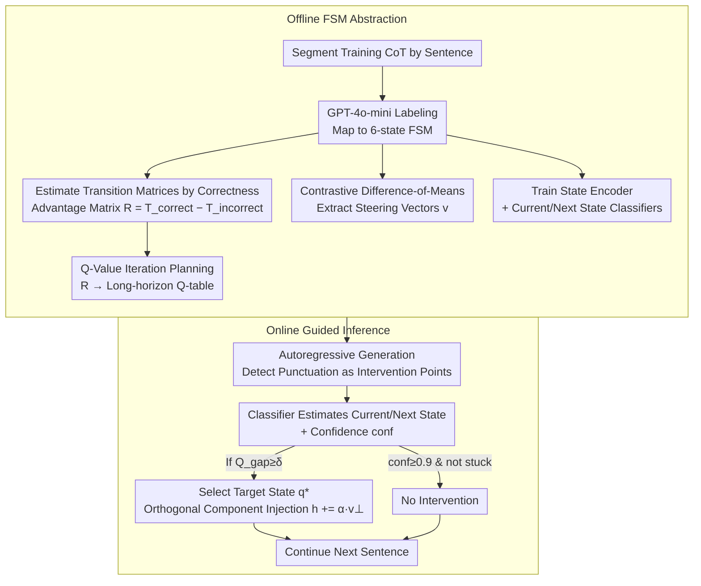

# Modeling Hierarchical Thinking in Large Reasoning Models

**Conference**: ICML2026 Oral  
**arXiv**: [2510.22437](https://arxiv.org/abs/2510.22437)  
**Code**: https://github.com/shahariar-shibli/CoT-FSM (Available)  
**Area**: LLM Reasoning  
**Keywords**: Finite State Machines, Chain-of-Thought, Activation Steering, Q-Value Planning, Reasoning Interpretability

## TL;DR
The authors abstract the long CoT of Large Reasoning Models (LRMs) into a 6-state Finite State Machine (FSM). By constructing a Transition Advantage Matrix based on the probability difference between "success vs. failure" states and using Q-Value iteration to derive a long-horizon planning strategy, they perform sparse orthogonal activation steering only at sentence boundaries. This approach improves accuracy on difficult problems like AIME25 by up to +13% while using approximately 25× fewer interventions.

## Background & Motivation

**Background**: LRMs complete complex reasoning tasks by generating long CoTs that often exceed a thousand tokens, exhibiting hierarchical structures similar to human "think-then-respond" processes in challenges like AIME and GPQA. Regarding CoT interpretability, recent work has begun using activation steering for behavior-level control, such as SEAL suppressing redundant reflections or Venhoff et al. identifying linear directions corresponding to specific behaviors.

**Limitations of Prior Work**: These control methods remain at the "local behavior" level—either suppressing a single type of segment (e.g., reflection/transition) or merely verifying that a behavior is adjustable in the activation space. They fail to answer a critical control question: **When the model is at a specific stage of a reasoning trajectory, which cognitive state is the most beneficial next step to ensure the final correct answer?**

**Key Challenge**: There is a gap between interpretability (identifying steerable behaviors) and operational control (deciding when & where to intervene). Per-token intervention disrupts content coherence and is computationally expensive; greedy one-step decisions fall into "short-sighted traps," leading the model into dead ends.

**Goal**: (1) Provide a global hierarchical structural characterization of CoT; (2) Quantify which cognitive transitions actually distinguish correct from incorrect outcomes; (3) Design a training-free, sparsely intervening steering strategy with a long-term horizon.

**Key Insight**: Human problem-solving theories (Polya’s "four-step method," Schoenfeld’s Episode Theory) have long divided the problem-solving process into finite high-level cognitive stages. Since LRMs are trained on human CoT, their emergent trajectories should also be approximable by a set of discrete states.

**Core Idea**: Model CoT as a 6-state FSM, use the difference between "correct vs. incorrect" transition matrices $R$ as a reward, calculate long-horizon utility via Q-Value iteration, and perform "orthogonal component" activation steering at sentence boundaries—transforming reasoning control from "per-token fine-tuning" into "cognitive strategy planning."

## Method

### Overall Architecture
The method consists of two phases: **Offline FSM Abstraction** and **Online Guided Inference**.

Offline Phase: Generate complete CoTs for the training set, segment them by sentence, and use GPT-4o-mini for automatic labeling to map each sentence to one of 6 high-level states $\mathcal{Q}=\{\text{init, deduce, augment, uncertain, backtrack, closure}\}$. Estimate two conditional transition matrices $T^{(correct)}$ and $T^{(incorrect)}$ to derive the Transition Advantage Matrix $R = T^{(correct)} - T^{(incorrect)}$. Use Q-Value iteration to obtain a long-horizon Q-table. Extract activation steering vectors $\mathbf{v}^{(\ell)}_{u\to v}$ for each directed transition $(u\to v)$ using contrastive difference-of-means, and train a State Encoder along with two lightweight classifiers (current state $g_{curr}$, next state $g_{next}$).

Online Phase: Detect sentence-end punctuation (`. ? !`) during autoregressive generation as intervention opportunities. At boundaries, use the classifiers to estimate the current/next state and decide whether to intervene based on the Q-Value strategy. If intervening, select the target state $q^\star$, inject the corresponding steering vector's orthogonal component into the hidden space, and then continue generation.

### Key Designs

**1. 6-state FSM Abstraction + Transition Advantage Matrix $R$: Compressing Unstructured CoT into a Discriminative Graph**

Previous CoT controls were either categorical or focused on single linear directions, lacking a global structure for reward mapping. This work projects CoT sentence sequences $\mathcal{S}=(s_1,\dots,s_K)$ into 6-state trajectories using a labeling function $\phi:\mathcal{S}\to\mathcal{Q}$ and merges self-loops. The states $\mathcal{Q}=\{\text{init, deduce, augment, uncertain, backtrack, closure}\}$ correspond to Polya's "understand-plan-carry out-review" framework, supplemented by LRM-specific uncertainty/backtracking. This aligns with cognitive traditions and yields high human agreement (Cohen's Kappa 0.89).

With discrete trajectories, conditional transition probabilities $T^{(correct)}_{ij}$ and $T^{(incorrect)}_{ij}$ are estimated. Defining $R_{ij}=T^{(correct)}_{ij}-T^{(incorrect)}_{ij}$ allows $R_{ij}>0$ to represent transitions more common in correct paths. This $|\mathcal{Q}|\times|\mathcal{Q}|$ advantage matrix provides a stable transition map for control, serving as both a cognitive characterization and a reward for planning.

**2. Q-Value Iteration + Conf-gated Sparse Trigger: Converting Step-wise Rewards into Long-horizon Utility**

Greedily maximizing $R$ can lead the model into paths that are "locally rewarding but globally incorrect"—in experiments, QWEN's AIME25 accuracy dropped from 83.3% to 76.67% using greedy control. This work treats the FSM as a small planning problem. For clipped rewards $R_{clip}=\text{clip}(R,[-c,+c]),\ c\in[0.2,0.3]$, Bellman-style iteration is performed:

$$Q_{k+1}(q,q'):=R(q,q')+\gamma\max_{q''}Q_k(q',q''),\quad \gamma=0.9$$

After 100 iterations, the Q-table incorporates cumulative future returns. During inference, if the model is not "stuck" (same state for 5 steps) and $\text{conf}\ge 0.9$, it is left alone. Otherwise, intervention occurs only if $Q_{gap} = Q(q,q^\star)-Q(q,\hat q_{t+1}) \ge \delta=0.06$. Strength $\alpha=\max(\beta,\,Q_{gap}\cdot\text{conf})$ is dynamically adjusted ($\beta\in[0.1,1.2]$). This long-horizon triple-gating concentrates intervention on high-leverage decision points.

**3. Orthogonal Component Activation Injection at Sentence Boundaries: Preserving Content while Shifting Direction**

To guide the model toward $q^\star$ without disrupting existing semantic information, the authors avoid direct addition of $\alpha\mathbf{v}$. Instead, at the sentence-end token, the hidden vector $\mathbf{h}^{(\ell)}_k$ is normalized to $\hat{\mathbf{h}}=\mathbf{h}/(\|\mathbf{h}\|_2+\varepsilon)$. The component of the steering vector $\mathbf{v}^{(\ell)}_{u\to v}$ parallel to the content is removed, leaving only the orthogonal part for injection:

$$\mathbf{v}_\perp=\mathbf{v}-(\mathbf{v}^\top\hat{\mathbf{h}})\hat{\mathbf{h}},\qquad \tilde{\mathbf{h}}^{(\ell)}_k=\mathbf{h}^{(\ell)}_k+\alpha\mathbf{v}_\perp$$

This provides a lateral perturbation toward $q^\star$ while maintaining coherence. Steering vectors are extracted via contrastive difference-of-means between the target transition and all other transitions at sentence-end hidden layers.

### Loss & Training
The State Encoder is a 2-layer MLP (LayerNorm + ReLU + dropout 0.1) projected onto a 512-dimensional unit sphere, trained with triplet loss $\mathcal{L}_{triplet}=\max(0,\|\mathbf{z}_a-\mathbf{z}_p\|^2-\\|\mathbf{z}_a-\mathbf{z}_n\|^2+m)$ ($m=1.1$) for 50 epochs using Adam ($lr=10^{-4}$). Classifiers achieve >90% test accuracy. Steering layers are selected via a validation set (GPT-L/M layer 19, PHI layer 22, QWEN layer 30). The pipeline does not update LRM weights.

## Key Experimental Results

### Main Results

| Dataset | Model | Default Acc | Q-Value Acc | Q-Value Interventions | Greedy Interventions |
|--------|------|------|----------|------|------|
| AIME25 | GPT-L | 43.30 | **56.67** | 55.20 | 77.60 |
| AIME25 | QWEN | 83.33 | **86.67** | 42.40 | 287.13 |
| MATH-500 | GPT-L | 79.00 | **83.20** | **0.48** | 12.17 |
| MATH-500 | GPT-M | 86.40 | **87.00** | **0.30** | 42.69 |
| GPQA-D | GPT-M | 64.14 | **67.17** | 88.12 | 246.93 |
| GSM8K | QWEN | 78.77 | **79.30** | **6.05** | 40.39 |

Notably, on MATH-500 with GPT-L, Q-Value improves accuracy from 79.0% to 83.2% with only 0.48 interventions per problem—25× fewer than Greedy (12.17 interventions for 81.2% accuracy).

### Ablation Study

| Configuration | AIME25 GPT-L Acc | MATH-500 GPT-L Acc | Description |
|------|----|----|------|
| Default | 43.30 | 79.00 | No steering |
| Greedy | 50.00 | 81.20 | Shortsighted; drops for QWEN/AIME25 |
| Weighted | 56.67 | 82.40 | Soft mixture of transitions |
| Q-Value | **56.67** | **83.20** | Long-horizon + gated |
| Cross-Model (QWEN→GPT-L, MATH-500) | — | 82.80 (Q-Val) | 0.4 drop vs. model-specific, but interventions doubled |

### Key Findings
- **Intervention Sparsity ≈ Reasoning Efficiency**: Q-Value achieves competitive accuracy with 25× fewer interventions than Greedy, proving that FSM + long-horizon planning pinpoints high-leverage decision points.
- **Greedy Counter-productivity**: Short-sighted decisions decreased QWEN's AIME25 performance, empirically verifying the necessity of long-horizon planning.
- **Largest Gains on Hard Tasks**: Gains of +13.37 points on AIME25 for GPT-L demonstrate that global structure is most valuable for tasks requiring extensive backtracking.
- **Cross-model Transfer**: Advantage matrices show some universality, but fine-grained calibration remains model-specific.

## Highlights & Insights
- **Reframing CoT Control as 6-state Planning**: This work elevates "when and where to intervene" to an RL sub-problem with a Bellman solution, providing a "strategy layer" for interpretability research.
- **Sentence Boundary + Orthogonality**: Aligning intervention with sentence-end semantics and using orthogonal shifts decouples content coherence from directional bias. This recipe is applicable to style control and safety alignment.
- **Advantage-to-Q-Value-Gating Triad**: Converting statistical bias into rewards and using confidence gating constitutes a clean, training-free data-driven control framework.

## Limitations & Future Work
- **Dependency on GPT-4o-mini Labels**: The 6-state boundaries are labeled by a frontier model, which may embed cognitive biases; renaming or changing domains requires re-validation.
- **Strong Markov Assumption**: FSMs lack history (e.g., how many times has it backtracked?). Future work targets POMDPs or FSMs with memory.
- **Ambiguous Sentence Detection**: Relying on `.?!` can mistake decimals or abbreviations for boundaries.
- **Suppression of Diversity**: Aligning to "typical" successful paths might inhibit unconventional but correct solutions.
- **Cross-model Costs**: Transferability is imperfect, suggesting model-specific $R$ matrices are needed to maximize performance.

## Related Work & Insights
- **vs. SEAL (Chen et al., 2025a)**: Unlike SEAL's categorical suppression of reflection/transition, this work dynamically selects steps based on state, refining control from "categories" to "specific transitions."
- **vs. Venhoff et al. (2025)**: While they identify steering directions, this work upgrades "isolated behaviors" to "strategy-level control" using learned classifiers and Q-Value gating.
- **vs. Bogdan et al. (2025)**: Uses sentence-level analysis like thought anchors but progresses from "analysis" to "intervention" with executable strategies.
- **vs. Minegishi/Matsutani/Xiong**: Instead of analyzing latent clusters, this work defines a compact state space and applies planning for closed-loop control.

## Rating
- Novelty: ⭐⭐⭐⭐ Combines CoT abstraction with Q-Value iteration for a complete control framework.
- Experimental Thoroughness: ⭐⭐⭐⭐ Comprehensive testing across benchmarks and models with cross-model and prompt-based comparisons.
- Writing Quality: ⭐⭐⭐⭐ Clear diagrams, rigorous formulas, and well-supported cognitive grounding.
- Value: ⭐⭐⭐⭐ Highly practical as a training-free inference-time control method with 25× efficiency gains.

<!-- RELATED:START -->

## Related Papers

- [\[ICLR 2026\] On the Thinking-Language Modeling Gap in Large Language Models](../../ICLR2026/llm_reasoning/on_the_thinking-language_modeling_gap_in_large_language_models.md)
- [\[ICML 2026\] Inducing Overthink: Hierarchical Genetic Algorithm-based DoS Attack on Black-Box Large Language Reasoning Models](inducing_overthink_hierarchical_genetic_algorithm-based_dos_attack_on_black-box_.md)
- [\[ICLR 2026\] TSLM: Tree-Structured Language Modeling for Divergent Thinking](../../ICLR2026/llm_reasoning/tslm_tree-structured_language_modeling_for_divergent_thinking.md)
- [\[ICML 2026\] Are Large Reasoning Models Interruptible?](are_large_reasoning_models_interruptible.md)
- [\[ICML 2026\] Reasoning Structure of Large Language Models](reasoning_structure_of_large_language_models.md)

<!-- RELATED:END -->
