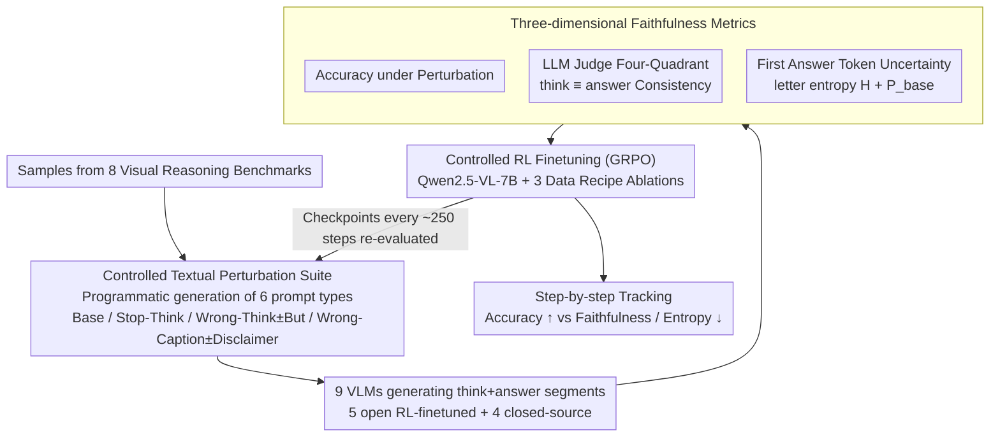

# On Robustness and Chain-of-Thought Consistency of RL-Finetuned VLMs

**Conference**: ICML 2026  
**arXiv**: [2602.12506](https://arxiv.org/abs/2602.12506)  
**Code**: None  
**Area**: LLM Reasoning / Multimodal VLM / RL Post-training Evaluation  
**Keywords**: RL Finetuning, Vision-Language Models, CoT Faithfulness, Robustness, Textual Perturbations

## TL;DR
This paper systematically exposes the vulnerability of open-source VLMs in visual grounding and Chain-of-Thought (CoT) faithfulness after RL finetuning by injecting two types of controlled textual perturbations—"misleading captions" and "wrong CoT prefixes"—into visual reasoning benchmarks. It reveals an explicit trade-off between "accuracy $\uparrow$ vs. CoT faithfulness $\downarrow$" under RL optimization and demonstrates that neither data augmentation nor faithfulness rewards can simultaneously resolve both issues.

## Background & Motivation

**Background**: RL finetuning represented by verifiable rewards like GRPO has become a standard post-training method for LLM reasoning in math and code. This has been further extended to multimodal Large Language Models (such as Vision-R1, Video-R1, VLAA-Thinker, ViGoRL-Spatial, and SpaceR, which are RL-finetuned variants based on Qwen2.5-VL-7B-Instruct) to replicate the success of "explicit CoT + verifiable rewards" in visual reasoning.

**Limitations of Prior Work**: While headline accuracy on visual reasoning benchmarks continues to rise, these numbers mask three "underlying conditions": weak visual grounding, hallucinations, and over-reliance on text. Previous works isolated these issues individually, but there is a lack of systematic evaluation across the "perturbation–accuracy–uncertainty–faithfulness" quad, and these issues have not been linked to RL training dynamics.

**Key Challenge**: On the evaluation side, focus only on the "final option correctness" rewards models both for "getting it right via vision" and "being misled by wrong CoT but guessing correctly." On the training side, using only verifiable answer rewards means models can learn a shortcut where "answers are decoupled from reasoning"—in principle, accuracy and CoT faithfulness can drift in opposite directions.

**Goal**: Decomposed into three sub-questions: (1) Can simple textual perturbations expose visual grounding defects in current open/closed-source RL reasoning VLMs? (2) Are these defects amplified or suppressed during the RL finetuning process? (3) Can common remedies like data augmentation and faithfulness rewards simultaneously improve robustness and faithfulness?

**Key Insight**: Borrowing from adversarial logic (disturbing the model without confusing humans), the authors construct minimalist textual interference—prepending a caption that conflicts with the image or pre-filling the `<think>` section with incorrect reasoning. They also include "disclaimer" variants (e.g., "but I could be wrong") to observe if the model can "self-correct."

**Core Idea**: Upgrade the evaluation of RL-finetuned VLMs from "clean-accuracy" to a three-dimensional joint metric: "perturbation accuracy + answer entropy + LLM-as-judge faithfulness." Use controlled RL training experiments to make the trade-off explicit, proving that the current accuracy-only training paradigm is insufficient for producing "robust and faithful" visual reasoning models.

## Method

### Overall Architecture

Ours does not propose a new model but builds a diagnostic framework based on four metrics: "perturbation, accuracy, uncertainty, and faithfulness." It branches into **Evaluation** and **Training** tracks to answer "what VLMs truly learn from RL finetuning." The evaluation track programmatically generates multiple textual perturbation variants for samples across 8 visual reasoning benchmarks, requiring 5 open-source RL-finetuned VLMs and 4 closed-source models to generate complete `<think>…</think><answer>…</answer>` sequences. An LLM judge then maps each generation into a four-quadrant matrix of "answer correctness $\times$ reasoning consistency," while measuring two uncertainty metrics on the first answer token. The training track brings the vulnerabilities observed in evaluation back to GRPO training, tracking how accuracy, entropy, and faithfulness curves drift per checkpoint to confirm "evaluation phenomena" as "training dynamics."

Specifically, evaluation covers 3DSRBench, CV-Bench, Spatial-MM Obj/Multihop, WhatsUp, V\*-Bench, MME-RealWorld-Lite, and MMBench. Each sample generates six prompt types: Base, Stop-Think, Wrong-Think, Wrong-Think+"But", Wrong-Caption, and Wrong-Caption+Disclaimer. The judge uses Qwen3-32B, cross-validated by GPT-OSS-120B and Llama-3.1-70B (Fleiss' $\kappa \approx 0.85$). The training track starts from Qwen2.5-VL-7B-Instruct using verl-implemented GRPO, with datasets SAT2 (32K) + Pixmo-Count (15K). Ablations are performed on Geometry3K (2.1K) and "caption/think data augmentation" toggles. Checkpoints are taken every ~250 steps for full evaluation to close the loop.

### Key Designs

**1. Controlled Textual Perturbation Suite: Exposing Grounding Weaknesses via Minimal Text Editing**

While headline accuracy rises, it is unclear if models truly see the image or are led by text. Ours modifies only the prompt without touching the image, constructing three minimalist interferences: "Stop-Think" appends `<think>Okay let's see. This should be the final answer.</think>` to block intermediate reasoning; "Wrong-Think" pre-fills the `<think>` section with reasoning asserting the wrong option; "Wrong-Caption" prepends a description strongly suggesting the wrong option (e.g., "the right side of the dog is facing the camera"). Each perturbation includes a "recovery variant"—adding "but I think" after Wrong-Think or "but I could be wrong" after Wrong-Caption. Appendix results confirm that drops stem from "misleading content" rather than "format disruption" through dual "correct caption/think" experiments. Since humans can ignore these cues by looking at the image, any model performance drop indicates "reading text" over "reading images." Disclaimer variants further decouple whether the problem lies in capability or alignment.

**2. Three-dimensional Faithfulness Metrics: Decoupling Correct Answers from Trustworthy Reasoning**

Looking only at final option correctness conflates "getting it right via vision" with "getting it right by chance while following wrong CoT." Ours uses three concurrent metrics. For faithfulness, three independent LLM judges determine if the "internal final judgment" matches the "external answer" ($Fleiss' \kappa \approx 0.85$). For uncertainty, a constrained distribution is computed on the first answer letter token—projecting vocabulary logits to $\{A, B, C, D\}$, normalizing them, and calculating Shannon letter entropy $H = -\sum_i p_i \log p_i$ and target letter probability $P_{\text{base}}$. These metrics predict vulnerability: $P_{\text{base}}$ under the Default prompt predicts whether a sample remains correct under perturbation with an AUROC up to 0.94+ (SpaceR), whereas $-H$ only achieves 0.6–0.75. This shows that the "mass allocated to the correct option" causes robustness, while "low entropy" is merely a result. Models can be confidently wrong.

**3. Controlled RL Finetuning Experiments: Validating Remedies in Training Dynamics**

To prove these issues aren't just minor "tuning" problems, Ours runs GRPO for 1k+ steps across three configurations: (i) SAT2+Pixmo, (ii) +Geometry3K, (iii) +Geometry3K+caption/think augmentation. Results show data augmentation recovers accuracy under Wrong-Caption to near-Base levels but fails to fix Wrong-Think (models still follow the wrong forced CoT). Meanwhile, letter entropy decreases monotonically in all configurations, even for unseen Stop-Think prompts, indicating RL entropy reduction is a global sharpening rather than prompt-specific. Incorporating the Qwen3-judge consistency signal into the reward—weighting only rollouts where "think ≡ answer"—aligns the faithfulness curve with the accuracy curve. However, when combined with data augmentation, training becomes unstable and triggers reward hacking: models learn the shortcut of producing extremely short or templated CoT to game the consistency reward, causing robustness to stagnate.

### Loss & Training

Ours utilizes GRPO, sampling $G=8$ rollouts per prompt. The baseline reward is $R = \mathbb{1}[\text{format}] \cdot 0.1 + \mathbb{1}[\text{answer correct}] \cdot 1.0$. The faithfulness variant multiplies this by a judge-determined consistency indicator $\mathbb{1}[\text{think}\equiv\text{answer}]$. During augmentation, {Correct think, Wrong think, Correct caption, Wrong caption} are injected with 10% probability each to prevent the model from regressing to a trivial strategy of "blindly flipping the context." All training emphasizes multi-seed runs, as single-seed experiments in RL finetuning can be highly misleading due to variance exceeding data recipe differences.

## Key Experimental Results

### Main Results

| Model / Setting | 3DSRBench Base | 3DSRBench Wrong-Think | CVBench Base | CVBench Wrong-Think |
|---|---|---|---|---|
| Qwen2.5-VL-7B (Start) | 55.25 | — | 78.60 | — |
| SpaceR | 56.66 | Significant drop | 78.12 | Significant drop |
| Video-R1 | 56.56 | Same as above | 72.68 | Same as above |
| Vision-R1 | 54.22 | P(Correct) $\approx$ 0 under Wrong-Think | 73.84 | Same as above |
| VLAA-Thinker | 57.59 | Same as above | 77.01 | Same as above |
| ViGoRL-Spatial | 53.27 | Relatively most stable | 82.29 | Relatively most stable |
| Closed-source (o3 / Gemini-3.1-Pro) | Significantly higher | Minor drop | Significantly higher | Minor drop |

(Data from Table 1; specific values for Wrong-Think are in Figure 3 of the original paper, with drops ranging from 5–40 percentage points.)

The magnitude of perturbation under Wrong-Think is systematically larger than Wrong-Caption. Closed-source models exhibit much less degradation and explicitly acknowledge conflicts between captions and images in their CoT.

### Ablation Study

| Configuration | Base Acc | Wrong-Caption Acc | Wrong-Think Acc | Faithfulness |
|---|---|---|---|---|
| SAT2+Pixmo | $\uparrow$ over Qwen | Significant drop | Significant drop | Drops with steps |
| +Geometry3K | Further $\uparrow$ (Max gain Base/Wrong-Think) | Still drops | Slight improvement | Drops with steps |
| +Geometry3K + aug | $\approx$ Same as above | $\approx$ Base level (Robustness recovered) | Limited improvement | Still drops |
| Prev row + faithfulness reward | Base Acc stable | Robustness gain stalls | Unstable training | Returns to Acc level under Base |

Judge Consistency (Table 3): Strict 3-way agreement of 89–94% with Fleiss' $\kappa = 0.81\text{--}0.88$ verifies the reliability of the Qwen3-judge faithfulness signal.

### Key Findings
- **Accuracy-Faithfulness Trade-off**: RL finetuning almost always increases Base accuracy, but the "think ≡ answer" ratio measured by Qwen3-judge declines simultaneously. Wrong-Caption augmentation fixes robustness but not faithfulness, proving they are distinct issues.
- **Global Entropy Collapse**: Letter entropy decreases monotonically across all training configurations, including for Stop-Think prompts never seen during training, suggesting RL entropy reduction is global sharpening.
- **$P_{\text{base}}$ Predicts Robustness Better**: AUROC for predicting robustness using target letter probability under Default prompt was 0.94+ (SpaceR), whereas $-H$ was only 0.6–0.75. "Stubborn experts" (SpaceR, ViGoRL) maintain accuracy by ignoring wrong CoTs at the cost of faithfulness; "Brittle confidence" models (Vision-R1, VLAA-Thinker) more faithfully follow wrong CoT to wrong answers.
- **Abstinence Fails**: Adding an "I'm not sure" option caused accuracy to drop further under Wrong-Caption/Wrong-Think (averaging 3–6 points drop), indicating failure results from being actively misled, not uncertainty.
- **Closed vs. Open Source**: Closed-source models also hallucinate or overthink but show significantly higher faithfulness and can explicitly acknowledge conflicts in reasoning. This suggests current open-source RL recipes are limited, not that the task is impossible.

## Highlights & Insights
- **Faithfulness simplified**: By defining faithfulness as external consistency between "think" and "answer," Ours bypasses the difficulties of mechanistic evaluation while scaling to thousands of samples with high judge agreement.
- **Lightweight diagnostic tools**: Two uncertainty metrics on the letter-token ($H$ and $P_{\text{base}}$) allow estimating whether a sample will fail under perturbation with a single forward pass, applicable for inference-time rejection.
- **Trade-off is structural**: Instead of just reporting negative results, the authors demonstrate that even with faithfulness rewards and augmentation, training triggers instabilities and reward hacking. This frames the issue as a structural flaw of current GRPO+verifiable-reward paradigms.
- **Emphasis on Multi-seed**: The paper highlights that single-seed conclusions in RL finetuning are misleading, providing a needed empirical standard for RL-for-VLM research.

## Limitations & Future Work
- Training only verified the Qwen2.5-VL-7B backbone and GRPO. Whether these conclusions hold for other scales, backbones, or RL variants like PPO/DPO remains to be seen.
- Using a same-family LLM judge (Qwen3-32B) may introduce judge bias or coupling with reward gaming. No "hacking-resistant" reward shaping was provided.
- Perturbations focused on text; visual adversarial attacks (image noise, distractors, composition) were not covered.
- Conclusions are based on multiple-choice VQA; applicability to open-ended grounding (e.g., RefCOCO bounding boxes) is not yet clear.

## Related Work & Insights
- **Vs. RL-finetuned VLMs (Vision-R1, SpaceR, etc.)**: Ours serves as a "health report" for these models, pointing out that while they hit SOTA on clean benchmarks, CoT faithfulness is systematically degrading.
- **Vs. LLM Faithfulness (Lanham et al. 2023, etc.)**: Ours extends the definition of external consistency to VLMs and introduces vision-text modality conflict as a new source of vulnerability.
- **Vs. Robustness Enhancement (ViGoRL, etc.)**: Instead of just adding grounding rewards, Ours compares the stackability of augmentation and faithfulness rewards, providing a stronger "negative result" showing both are not simultaneously solved.
- **Vs. RL Entropy Studies (Cui et al. 2025, etc.)**: Ours replicates entropy collapse in VLMs and links it to faithfulness drift, offering a unified narrative of "entropy reduction → overconfidence → reasoning detachment."

## Rating
- Novelty: ⭐⭐⭐⭐ Perturbation designs aren't entirely new, but the "3D joint metrics + RL dynamics + double negative result" combination is a first for systemizing RL-VLM evaluation.
- Experimental Thoroughness: ⭐⭐⭐⭐⭐ 5 open + 4 closed models × 8 benchmarks × 6 prompt variants × 3 judges × multi-seed RL curves. High coverage and rigor.
- Writing Quality: ⭐⭐⭐⭐ Clear arguments and temperate language; mechanistic explanations for the trade-off are mostly empirical.
- Value: ⭐⭐⭐⭐⭐ Directly challenges the mainstream assumption that "accuracy-only evaluation + verifiable rewards" is a sufficient recipe for RL-VLMs, setting clear targets for reward design and evaluation reform.

<!-- RELATED:START -->

## Related Papers

- [\[ICLR 2026\] VERICOT: Neuro-Symbolic Chain-of-Thought Validation via Logical Consistency Checks](../../ICLR2026/llm_reasoning/vericot_neuro-symbolic_chain-of-thought_validation_via_logical_consistency_check.md)
- [\[ICML 2026\] A Formal Comparison Between Chain of Thought and Latent Thought](a_formal_comparison_between_chain_of_thought_and_latent_thought.md)
- [\[ICML 2026\] Clustering as Reasoning: A $k$-Means Interpretation of Chain-of-Thought Graph Learning](clustering_as_reasoning_a_k-means_interpretation_of_chain-of-thought_graph_learn.md)
- [\[CVPR 2026\] Scaling Agentic Reinforcement Learning for Tool-Integrated Reasoning in VLMs](../../CVPR2026/llm_reasoning/scaling_agentic_reinforcement_learning_for_tool-integrated_reasoning_in_vlms.md)
- [\[ICML 2026\] The Expressive Power of Low Precision Softmax Transformers with (Summarized) Chain-of-Thought](the_expressive_power_of_low_precision_softmax_transformers_with_summarized_chain.md)

<!-- RELATED:END -->
