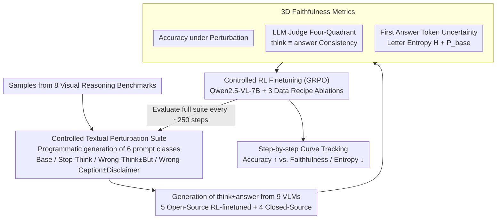

# On Robustness and Chain-of-Thought Consistency of RL-Finetuned VLMs

**Conference**: ICML 2026  
**arXiv**: [2602.12506](https://arxiv.org/abs/2602.12506)  
**Code**: None  
**Area**: LLM Reasoning / Multimodal VLM / RL Post-training Evaluation  
**Keywords**: RL Finetuning, Visual Language Model, CoT Faithfulness, Robustness, Textual Perturbation

## TL;DR
This paper systematically exposes the vulnerability of open-source RL-finetuned VLMs in visual grounding and Chain-of-Thought (CoT) faithfulness by injecting controlled textual perturbations—"misleading captions" and "incorrect CoT prefixes"—into visual reasoning benchmarks. It reveals an explicit trade-off between "Accuracy ↑ vs. CoT Faithfulness ↓" under RL optimization and demonstrates that neither data augmentation nor faithfulness rewards can simultaneously resolve both issues.

## Background & Motivation

**Background**: RL finetuning represented by verifiable rewards like GRPO has become the standard post-training method for LLM reasoning in math and code. This approach is further being extended to multimodal large models (e.g., Vision-R1, Video-R1, VLAA-Thinker, ViGoRL-Spatial, SpaceR, and other RL-finetuned variants based on Qwen2.5-VL-7B-Instruct) in hopes of replicating the success of "explicit CoT + verifiable rewards" in visual reasoning.

**Limitations of Prior Work**: While headline accuracy on visual reasoning benchmarks continues to rise, these numbers mask three "underlying pathologies": weak visual grounding, hallucination, and over-reliance on text. Prior works have identified these issues in isolation, but they lack a systematic "perturbation-accuracy-uncertainty-faithfulness" quadruple evaluation framework, nor have they linked these issues to RL training dynamics.

**Key Challenge**: The evaluation side focuses only on whether the "final choice is correct," which simultaneously rewards models that answer correctly based on vision and those that "follow incorrect CoT but happen to guess right." On the training side, the use of only verifiable answer rewards means models can easily learn "shortcuts" where the answer is decoupled from the reasoning—principally allowing accuracy and CoT faithfulness to drift in opposite directions.

**Goal**: The study is decomposed into three sub-questions: (1) Can simple textual perturbations expose visual grounding defects in current open/closed-source RL reasoning VLMs? (2) Are these defects amplified or suppressed during the RL finetuning process? (3) Can common remedies like data augmentation and faithfulness rewards simultaneously improve robustness and faithfulness?

**Key Insight**: The authors adopt an adversarial approach—creating "distractions that do not interfere with humans but perturb models"—by constructing minimalist textual interference. This includes prefixing questions with image-conflicting captions or pre-filling the `<think>` block with incorrect reasoning, combined with "disclaimer" variants (e.g., "but I could be wrong") to observe the model's capacity for "self-correction."

**Core Idea**: Upgrade the evaluation of RL-finetuned VLMs from "clean-accuracy" to a three-dimensional joint metric: "perturbed accuracy + answer entropy + LLM-as-judge faithfulness." By using controlled RL training experiments, the paper makes the trade-off explicit, proving that the current accuracy-only training paradigm is insufficient for producing visual reasoning models that are both robust and faithful.

## Method

### Overall Architecture

Rather than proposing a new model, this paper establishes a "perturbation-accuracy-uncertainty-faithfulness" quadruple diagnostic framework. It is divided into an **Evaluation side** and a **Training side** to answer what VLMs actually learn through RL finetuning. The evaluation side programmatically generates various textual perturbation variants for each sample across 8 visual reasoning benchmarks, requiring 5 open-source and 4 closed-source models to generate complete `<think>…</think><answer>…</answer>` sequences. An LLM judge then categorizes each generation into a four-quadrant matrix based on "answer correctness × reasoning consistency," while reading two uncertainty metrics from the first answer token. The training side brings the vulnerabilities observed in evaluation back into GRPO training, tracking how accuracy, entropy, and faithfulness curves drift per checkpoint/step to ground the "evaluation phenomena" as "training dynamics."

Specifically, the evaluation side covers 3DSRBench, CV-Bench, Spatial-MM Obj/Multihop, WhatsUp, V*-Bench, MME-RealWorld-Lite, and MMBench. Each sample generates six types of prompts: Base, Stop-Think, Wrong-Think, Wrong-Think+"But", Wrong-Caption, and Wrong-Caption+Disclaimer. The judge uses Qwen3-32B, cross-validated by GPT-OSS-120B and Llama-3.1-70B (Fleiss' κ ≈ 0.85). The training side starts from Qwen2.5-VL-7B-Instruct using GRPO implemented via verl. The data consists of SAT2 (32K) + Pixmo-Count (15K), with ablations on Geometry3K (2.1K) and "caption/think data augmentation" toggles. Checkpoints are evaluated every ~250 steps to create a closed loop between training and evaluation.

### Key Designs

**1. Controlled Textual Perturbation Suite: Exposing Grounding Weaknesses with Minimal Text Editing**

While headline accuracy on visual reasoning benchmarks rises, it remains unclear if models truly "see" the image or are led by the text. The authors modify only the prompt—leaving the image untouched—to construct three types of minimalist interference: **Stop-Think** forcibly appends `<think>Okay let's see. This should be the final answer.</think>` to block intermediate reasoning; **Wrong-Think** pre-fills the `<think>` block with reasoning asserting a wrong choice, forcing the model to continue from that point; **Wrong-Caption** prefixes the question with a description strongly hinting at a wrong option. Every perturbation has a "repair variant"—adding "but I think" after Wrong-Think or "but I could be wrong" after Wrong-Caption. These designs allow for direct attribution: since humans can ignore these cues by looking at the image, a drop in model accuracy proves it is "reading text" rather than "reading images." The disclaimer variants further decouple "capability" from "alignment" to see if the model knows it should ignore the text but is unable to do so.

**2. 3D Faithfulness Metrics: Decoupling Correct Answers from Credible Reasoning**

Relying solely on final answer correctness treats "correct via vision" and "correct via luck despite wrong CoT" identically. The authors introduce three parallel metrics. For **Faithfulness**, three independent LLM judges determine if the "internal final judgment in `<think>` vs. external `<answer>`" are consistent (Fleiss' κ ≈ 0.85). For **Uncertainty**, they analyze the constrained distribution of the first answer letter token—normalizing logits projected onto $\{A,B,C,D\}$ to calculate Shannon entropy $H = -\sum_i p_i \log p_i$ and the target letter probability $P_{\text{base}}$. This metric predicts vulnerability: $P_{\text{base}}$ under the Default prompt achieves an AUROC of 0.94+ (SpaceR) for predicting if a sample remains correct under perturbation, whereas $-H$ only achieves 0.6–0.75. This indicates that the mass assigned to the correct option is the cause of robustness, while low entropy is merely an effect; models can be "confidently wrong."

**3. Controlled RL Finetuning Experiments: Verifying the Additivity of Remedies**

The authors run ~1k steps of GRPO across three configurations: (i) SAT2+Pixmo, (ii) +Geometry3K, and (iii) +Geometry3K+caption/think augmentation. Results show that data augmentation can restore accuracy under Wrong-Caption to near-Base levels but fails to fix Wrong-Think (models still follow the forced wrong CoT). Simultaneously, letter entropy decreases monotonically in all configurations, even for Stop-Think prompts not seen during training, suggesting that RL entropy collapse is a global sharpening rather than prompt-specific. Incorporating the Qwen3-judge consistency signal into the reward—weighting rollouts where "think ≡ answer"—shifts the faithfulness curve back toward the accuracy curve. However, when combined with data augmentation, training becomes unstable and triggers "reward hacking": the model learns to produce extremely short or templated CoT to gain consistency rewards, causing robustness to stagnate.

### Loss & Training

GRPO is used with $G=8$ rollouts per prompt. The baseline reward is $R = \mathbb{1}[\text{format}] \cdot 0.1 + \mathbb{1}[\text{answer correct}] \cdot 1.0$. The faithfulness variant multiplies this by a judge-determined consistency indicator $\mathbb{1}[\text{think}\equiv\text{answer}]$. During augmentation, {correct think, wrong think, correct caption, wrong caption} are injected with 10% probability each to ensure the model does not adopt a trivial "always invert context" strategy. Multiple-seed reruns are emphasized to avoid misleading stability conclusions.

## Key Experimental Results

### Main Results

| Model / Setting | 3DSRBench Base | 3DSRBench Wrong-Think | CVBench Base | CVBench Wrong-Think |
|---|---|---|---|---|
| Qwen2.5-VL-7B (Initial Point) | 55.25 | — | 78.60 | — |
| SpaceR | 56.66 | Massive Drop | 78.12 | Massive Drop |
| Video-R1 | 56.56 | Massive Drop | 72.68 | Massive Drop |
| Vision-R1 | 54.22 | P(Correct)≈0 | 73.84 | P(Correct)≈0 |
| VLAA-Thinker | 57.59 | P(Correct)≈0 | 77.01 | P(Correct)≈0 |
| ViGoRL-Spatial | 53.27 | Relatively Stable | 82.29 | Relatively Stable |
| Closed-Source (o3 / Gemini-3.1-Pro) | Significantly Higher | Minor Drop | Significantly Higher | Minor Drop |

(Values from Figure 3 and Table 1 of the original paper. Drops range from 5–40 percentage points.)

The perturbation magnitude under Wrong-Think is systematically larger than under Wrong-Caption. Closed-source models show a lower magnitude of degradation and their CoT explicitly acknowledges conflicts between the caption and the image.

### Ablation Study

| Configuration | Base Acc | Wrong-Caption Acc | Wrong-Think Acc | Faithfulness |
|---|---|---|---|---|
| SAT2+Pixmo | ↑ over Qwen | Massive Drop | Massive Drop | ↓ with steps |
| +Geometry3K | Further ↑ | Still Drops | Slight Improvement | ↓ with steps |
| +Geom3K + cap/think Aug | ≈ Same | ≈ Base Level (Robustness recovery) | Limited improvement | ↓ with steps |
| Prev + Faithfulness reward | Stable Base Acc | Robustness Gain Stagnates | Unstable Training | Returns to Acc curve |

Judge consistency (Table 3): Strict 3-way agreement reached 89–94% with Fleiss' κ 0.81–0.88, validating the reliability of the Qwen3-judge.

### Key Findings
- **Accuracy-Faithfulness Trade-off**: RL finetuning almost always improves Base accuracy while simultaneously decreasing the "think ≡ answer" ratio. Wrong-Caption augmentation fixes robustness but not faithfulness.
- **Global Entropy Collapse**: Letter entropy decreases monotonically across all configurations and prompts; RL sharpening is a global phenomenon, not prompt-specific.
- **$P_{\text{base}}$ as a Robustness Predictor**: $P_{\text{base}}$ for the correct letter under default prompts predicts robustness (AUROC 0.94+) better than $-H$. "Stubborn experts" (SpaceR) ignore wrong CoT at the cost of faithfulness, while "brittle confidence" models (Vision-R1) follow wrong CoT into wrong answers.
- **Abstention Fails**: Adding an "I'm not sure" option causes accuracy under Wrong-Think to drop further (average 3–6 points), indicating failure is due to being "led by text" rather than genuine uncertainty.
- **Closed vs. Open Source**: Closed-source models also hallucinate or overthink but maintain significantly higher faithfulness and can explicitly acknowledge conflicts in reasoning.

## Highlights & Insights
- **Faithfulness simplified**: Reduces the interpretability challenge of faithfulness to "external consistency between think and answer," allowing for large-scale evaluation using LLM judges.
- **Uncertainty as a lightweight diagnostic**: $P_{\text{base}}$ enables estimating the probability of a model "failing under perturbation" with a single forward pass, providing a metric for inference-time rejection.
- **Trade-offs as structural defects**: The paper demonstrates that remedies like faithfulness rewards and augmentation are not easily additive, highlighting structural flaws in the current GRPO+verifiable-reward paradigm.
- **Multi-seed importance**: Explicitly points out that single-seed results in RL finetuning are highly misleading.

## Limitations & Future Work
- The training side only verified the Qwen2.5-VL-7B backbone and GRPO algorithm; testing on larger models or different RL variants (PPO/DPO) remains for future work.
- Using a judge from the same model family as the reward signal (Qwen3-32B) may introduce judge bias or reward hacking.
- Perturbations focused on text; visual adversarial perturbations (image noise, distractor objects) were not covered.
- Conclusions are based on multiple-choice VQA; applicability to open-ended grounding (e.g., RefCOCO) is yet to be fully explored.

## Related Work & Insights
- **vs. Vision-R1 / SpaceR / ViGoRL-Spatial**: These works focus on SOTA rankings; this paper serves as their "medical report," showing that CoT faithfulness is systematically degrading as accuracy increases.
- **vs. Lanham et al. 2023 / Chen et al. 2025**: Extends the definition of consistency from pure-text LLMs to VLMs, introducing multimodal conflict as a new source of vulnerability.
- **vs. Cui et al. 2025 / Kirk et al. 2024**: Replicates entropy collapse in VLMs and links it to faithfulness drift, providing a narrative of "sharpening → overconfidence → decoupled reasoning."

## Rating
- Novelty: ⭐⭐⭐⭐ While perturbation is established, the "3D metric + RL dynamics + non-additive negative results" combination is a first for systematic RL-VLM evaluation.
- Experimental Thoroughness: ⭐⭐⭐⭐⭐ Extremely high coverage across multiple benchmarks, models, perturbation classes, and training seeds.
- Writing Quality: ⭐⭐⭐⭐ Clear argumentation and disciplined terminology.
- Value: ⭐⭐⭐⭐⭐ Challenges the mainstream assumption of accuracy-only evaluation in RL-VLM, setting a clear target for reward design and evaluation protocols.

<!-- RELATED:START -->

## Related Papers

- [\[ICML 2026\] A Formal Comparison Between Chain of Thought and Latent Thought](a_formal_comparison_between_chain_of_thought_and_latent_thought.md)
- [\[CVPR 2026\] Scaling Agentic Reinforcement Learning for Tool-Integrated Reasoning in VLMs](../../CVPR2026/llm_reasoning/scaling_agentic_reinforcement_learning_for_tool-integrated_reasoning_in_vlms.md)
- [\[ICML 2026\] Beyond Two-Stage Training: Cooperative SFT and RL for LLM Reasoning](beyond_two-stage_training_cooperative_sft_and_rl_for_llm_reasoning.md)
- [\[ICML 2026\] ETS: Energy-Guided Test-Time Scaling for Training-Free RL Alignment](ets_energy-guided_test-time_scaling_for_training-free_rl_alignment.md)
- [\[ICML 2026\] Clustering as Reasoning: A $k$-Means Interpretation of Chain-of-Thought Graph Learning](clustering_as_reasoning_a_k-means_interpretation_of_chain-of-thought_graph_learn.md)

<!-- RELATED:END -->
