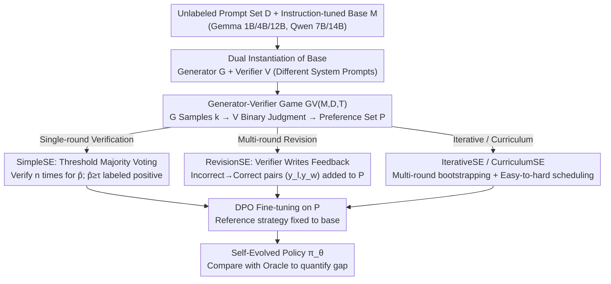

# On the Generalization Gap in Self-Evolving Language Model Reasoning

**Conference**: ICML 2026  
**arXiv**: [2606.01075](https://arxiv.org/abs/2606.01075)  
**Code**: None  
**Area**: LLM Reasoning / Self-Evolution / Preference Learning  
**Keywords**: Closed-loop Self-Evolution, DPO, Generator–Verifier Game, Knights & Knaves, Reasoning Generalization

## TL;DR
Under a strict closed-loop setting of "unlabeled prompts + base model," this paper systematically compares four self-evolution (SE) strategies (Simple verification, Revision, Iterative training, and Curriculum learning) with oracle supervision. On Knights & Knaves logical reasoning, SE improves Gemma 3 4B from 31.0% to 44.8%, yet a persistent gap of 8–13% remains compared to the oracle's 53.3%. Only RevisionSE on a 12B model can approach the oracle (52.8% vs 53.6%).

## Background & Motivation

**Background**: LLM post-training is shifting from SFT/RLHF/RLVR paradigms—which rely on human labels or verifiable rewards—toward "Self-Evolution" (SE). This allows models to improve using self-generated supervision, such as self-verification, generative feedback, or internal confidence rewards (e.g., INTUITOR, Absolute Zero, R-Zero, EMPO).

**Limitations of Prior Work**: Existing SE studies often use disparate settings and reporting metrics, making it difficult to determine how closely SE can approach oracle supervision under clean closed-loop constraints. Conversely, other research warns of model collapse, the generator–verifier gap, and theoretical barriers to learning from synthetic data. Conflicting conclusions exist without a horizontal comparison under a unified framework.

**Key Challenge**: SE requires the "model's internal verification capability $\geq$ the supervision quality needed for training." However, since the verifier is the generator itself, verification errors contaminate preference pairs, limiting the optimization space for DPO. The fundamental question is: **how accurate is the internal verifier, and can it truly replace ground-truth?**

**Goal**: Systematically characterize the generalization gap between SE and oracle supervision under strict closed-loop constraints (given only unlabeled prompts $\mathcal{D}$ and a base model $\mathcal{M}$, where all reasoning traces/rewards/feedback must be self-produced). The study analyzes how this gap is determined by model scale, task verifiability, training compute, and curriculum ordering.

**Key Insight**: All closed-loop SE methods are abstracted into a "Generator–Verifier Game" $\mathsf{GV}(\mathcal{M},\mathcal{D},T)$, differing only in how signals are extracted, reused, and structured. Knights & Knaves (KK) is selected as the primary testbed due to its deterministic verifiability, parameterized difficulty (2–8 people), and lack of data contamination, providing a clean environment for easy-to-hard generalization study.

**Core Idea**: Gradually approach the oracle using a unified GV framework with increasingly complex SE variants (SimpleSE → RevisionSE → IterativeSE → CurriculumSE) to quantify whether additional compute or structure can ultimately close the gap between closed-loop SE and oracle supervision.

## Method

### Overall Architecture
To answer how closely self-evolution approaches oracle supervision, four SE methods are integrated into the same Generator-Verifier Game $\mathsf{GV}(\mathcal{M},\mathcal{D},T)\rightarrow\mathcal{P}$. The same base model $\mathcal{M}$ is instantiated as a generator $\mathcal{G}$ and a verifier $\mathcal{V}$ using different system prompts. For each prompt $q$, $\mathcal{G}$ samples $k$ candidates $\{\hat{y}_1,\dots,\hat{y}_k\}$ and $\mathcal{V}$ provides binary judgments. A preference pair $(y_w,y_l)$ is included in $\mathcal{P}$ only if $\mathcal{V}(q,y_w)=\texttt{Correct}$ and $\mathcal{V}(q,y_l)=\texttt{Incorrect}$. Finally, $\mathcal{M}$ is fine-tuned using DPO on $\mathcal{P}$. The process uses unlabeled prompts and instruction-tuned bases (Gemma 3 1B/4B/12B, Qwen 2.5 7B/14B). The variants differ in how $\mathcal{P}$ is constructed within this framework.

### Key Designs

**1. SimpleSE + Threshold Majority Voting: Mining high-confidence preference pairs**

Pure binary verification is noisy, as misjudgments contaminate the preference set and bias DPO. Here, for each candidate $\hat{y}$, the verifier runs $n$ independent trials to calculate an empirical accuracy $\hat{p}(q,\hat{y})=\frac{1}{n}\sum_j \mathbf{1}\{\mathcal{V}^{(j)}=\texttt{Correct}\}$. Candidates are labeled Positive only if $\hat{p}\geq\tau$ and Negative if $1-\hat{p}\geq\tau$; ambiguous samples are discarded. Training proceeds with standard DPO loss: $\mathcal{L}_{\text{DPO}}=-\mathbb{E}[\log\sigma(\beta\log\frac{\pi_\theta(y_w|x)}{\pi_{\text{ref}}(y_w|x)}-\beta\log\frac{\pi_\theta(y_l|x)}{\pi_{\text{ref}}(y_l|x)})]$. The threshold $\tau$ acts as a denoising knob; $\tau=0.7$ provides the best precision/recall balance for 4B models. Discarding low-confidence samples raises the effective verifier accuracy to a level the training process can digest, which is a prerequisite for positive self-evolution.

**2. RevisionSE: Upgrading the verifier from "labeling" to "critiquing"**

Single-round verification uses only one bit of information. RevisionSE expands the game to $T>1$ rounds. Subsequent candidates are generated via $\hat{y}^{(t+1)}\sim\mathcal{G}(\cdot\mid q, f(\mathcal{V}(q,\hat{y}^{(t)})))$, where $f$ maps judgments to textual feedback. A pair $(y_l,y_w)$ is added to $\mathcal{P}$ if and only if $\mathcal{V}(q,\hat{y}^{(t)})=\texttt{Incorrect}$ and $\mathcal{V}(q,\hat{y}^{(t+1)})=\texttt{Correct}$. This leverages the verifier's discriminative power into structured training data. This is the only configuration capable of approaching oracle performance (52.8% vs 53.6% on 12B). However, it has a clear scale threshold: on 1B models, it performs worse than SimpleSE (22.4% vs 23.8%) because small models often revise correct answers into incorrect ones.

**3. IterativeSE / CurriculumSE: Multi-round bootstrapping and difficulty scheduling**

The iterative version starts from $\mathcal{M}_0=\mathcal{M}$ and performs $\mathcal{P}_t=\mathsf{GV}(\mathcal{M}_{t-1},\mathcal{D}_t,T)$ followed by $\mathcal{M}_t=\texttt{Finetune}(\mathcal{M}_{t-1},\mathcal{P}_t)$ offline. It relies on a positive feedback loop: "better model → more accurate verification → cleaner data." The curriculum version partitions $\mathcal{D}$ by the number of people in the KK task, running SimpleSE on KK23 before KK45. This "easy-to-hard" scheduling reduces early verifier noise and explicitly tests generalization. While both strategies outperform random mixing, a ~5% gap relative to the oracle persists, suggesting that optimized data scheduling cannot fully compensate for inherent verifier limitations.

### Loss & Training
The process uses DPO with the reference policy fixed to the base model. $\beta$ controls the sharpness of alignment. Evaluation uses exact-match accuracy with temperature 0.7 (1 sample) averaged over 4 random seeds. Compute analysis shows that increasing verifier passes ($n_2$) is more cost-effective than increasing generator candidates ($n_1$).

## Key Experimental Results

### Main Results: Gap between SE and Oracle on KK (Gemma 3 4B)

| Method | 2–3 ppl | 4–5 ppl | 6–8 ppl | All | vs Oracle |
|------|---------|---------|---------|-----|-----------|
| Baseline (gemma-3-4b-it) | 62.0 | 31.0 | 10.3 | 31.0 | −22.3 |
| SimpleSE ($\tau=0.6$) | 70.9 | 45.4 | 17.5 | 40.7 | −12.6 |
| RevisionSE | 75.8 | 46.4 | 17.1 | 42.2 | −11.1 |
| Iterative SimpleSE ×3 | 75.2 | 49.6 | 19.7 | 44.1 | −9.2 |
| Curriculum SimpleSE (KK23→KK45) | 76.2 | 49.7 | 20.6 | 44.8 | −8.5 |
| **Oracle Verifier (KK23→KK45)** | **80.8** | **60.9** | **29.8** | **53.3** | — |

### Scale Ablation: RevisionSE gap narrows as model scale increases

| Model | Baseline | Best SimpleSE | RevisionSE | Oracle | RevisionSE vs Oracle Gap |
|------|----------|---------------|------------|--------|--------------------------|
| Gemma 3 1B | 7.8 | 8.4 ($\tau=0.8$) | 7.8 | 12.5 | −4.7 (Negative in small) |
| Gemma 3 4B | 31.0 | 40.7 | 42.2 | 46.6 | −4.4 |
| Gemma 3 12B | 47.5 | 51.1 | **52.8** | 53.6 | **−0.8 (Closed)** |

### Key Findings
- **Persistent Gap = 8–13%**: Except for 12B RevisionSE, all SE variants on the 4B model maintain an 8–13% gap compared to the oracle. Additional iterations yield diminishing returns; only an final oracle round significantly pushes the limit (44.1→53.2 on 4B).
- **Capability Threshold**: 1B models show negligible or negative gains from SE, whereas 4B models achieve stable positive returns. Self-verification requires a base accuracy of $\approx \ge 30\%$ to bootstrap.
- **Task Verifiability Limits the Ceiling**: On open inference tasks (GSM8K, MATH500, etc.), the 4B model gain shrinks (+10% on KK vs +1.6% on MATH500). Without deterministic answers, internal verifiers struggle to distinguish "plausible but incorrect" responses.
- **Compute Allocation**: Grid searches for $n_1$ (generation) vs $n_2$ (verification) indicate that verifier passes are more impactful. $\tau=0.7$ represents the sweet spot for precision and recall.
- **Sharpening Hypothesis**: Pass@1 increases while Pass@32 remains stagnant. This suggests closed-loop SE "amplifies" existing high-probability correct paths rather than teaching new reasoning capabilities, leading to limited OOD (6–8 ppl) performance.

## Highlights & Insights
- **Standardizing SE Research**: The progression from SimpleSE → RevisionSE → IterativeSE → CurriculumSE aligns with increasing "signal richness × compute cost." This provides a clear framework for quantifying the oracle gap and identifying where specific SE methods are situated.
- **RevisionSE at Scale**: The near-closure of the gap at 12B is a surprising empirical result. It implies that if a model is large enough to "critique its own work," closed-loop SE may match oracle supervision. This shifts the research focus from new algorithms to the scaling laws of verifier capability.
- **Transferable Tricks**: Threshold majority voting + DPO is a robust denoising module for any pipeline using a model as a verifier. A final "oracle round" is a cost-effective strategy to maximize SE performance in budget-constrained settings.

## Limitations & Future Work
- The evaluation is primarily tied to Knights & Knaves, with open reasoning as a secondary check. Only offline DPO is used, without exploring online RL. Tests are limited to Gemma and Qwen instruction models.
- **Observation**: (1) The "closed-loop" definition is strict—no code interpreters or external tools are allowed. (2) If the baseline accuracy is below 30%, SE may yield negative returns. (3) KK is a "closed" task where verifiers perform boolean logic; the performance of internal verifiers on "process-based rewards" remains unanswered.
- **Future Directions**: Quantifying the sharpening hypothesis using Pass@32 as a monitor; optimizing "oracle round" schedules as a learning problem; modeling scaling laws for verifier capability vs. model size.

## Related Work & Insights
- **vs Absolute Zero (AZR)**: AZR uses online self-play and code execution for rewards. SimpleSE (offline, no environment) outperforms AZR on several benchmarks, suggesting that starting from instruction-tuned models with offline DPO is more stable than online RL from base models.
- **vs INTUITOR**: INTUITOR uses self-certainty as an online RL reward. SimpleSE is slightly superior on most benchmarks and provides the broader conclusion that the SE ceiling is tied to the oracle and model scale.
- **vs Song et al. (2024)**: This paper quantifies the theoretical generation–verification gap into concrete numbers (8–13%) and confirms that the gap is driven by internal verifier accuracy.

## Rating
- Novelty: ⭐⭐⭐⭐ While the algorithms are known, the systematic quantification of the "closed-loop SE gap" is a significant framework contribution.
- Experimental Thoroughness: ⭐⭐⭐⭐⭐ Comprehensive coverage across 4 SE methods, 3 model scales, various thresholds, and 5 reasoning benchmarks.
- Writing Quality: ⭐⭐⭐⭐ Clear structure and high information density, though some notations overlap slightly.
- Value: ⭐⭐⭐⭐⭐ Provides a standard "floor and ceiling" reference for the self-evolution field, preventing unnecessary effort on overestimated gaps.

<!-- RELATED:START -->

## Related Papers

- [\[AAAI 2026\] Incorporating Self-Rewriting into Large Language Model Reasoning Reinforcement](../../AAAI2026/llm_reasoning/incorporating_self-rewriting_into_large_language_model_reasoning_reinforcement.md)
- [\[ICML 2026\] SmartThinker: Progressive Chain-of-Thought Length Calibration for Efficient Large Language Model Reasoning](smartthinker_progressive_chain-of-thought_length_calibration_for_efficient_large.md)
- [\[ICLR 2026\] Why is Your Language Model a Poor Implicit Reward Model?](../../ICLR2026/llm_reasoning/why_is_your_language_model_a_poor_implicit_reward_model.md)
- [\[ICML 2026\] GRPO is Secretly a Process Reward Model](grpo_is_secretly_a_process_reward_model.md)
- [\[ICML 2026\] Prism: Efficient Test-Time Scaling via Hierarchical Search and Self-Verification for Discrete Diffusion Language Models](prism_efficient_test-time_scaling_via_hierarchical_search_and_self-verification_.md)

<!-- RELATED:END -->
