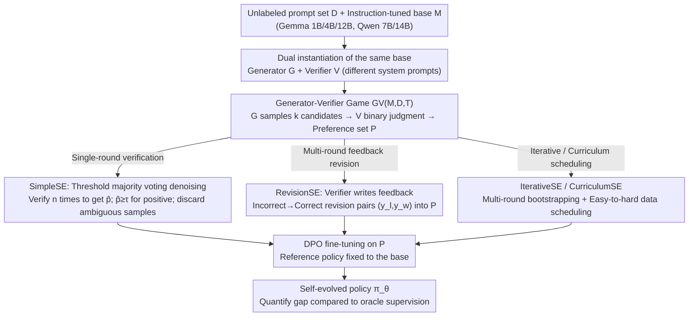

# On the Generalization Gap in Self-Evolving Language Model Reasoning

**Conference**: ICML 2026  
**arXiv**: [2606.01075](https://arxiv.org/abs/2606.01075)  
**Code**: None  
**Area**: LLM Reasoning / Self-Evolution / Preference Learning  
**Keywords**: Closed-loop self-evolution, DPO, Generator-Verifier Game, Knights & Knaves, Reasoning Generalization

## TL;DR
Under the strict closed-loop setting of "unlabeled prompts + base model" only, this paper systematically compares four self-evolution (SE) strategies (single-round verification, multi-round revision, iterative training, curriculum learning) against oracle supervision. It finds that on Knights & Knaves logical reasoning, SE improves Gemma 3 4B from 31.0% to 44.8%, yet a persistent gap of 8–13% remains relative to the oracle's 53.3%. Only RevisionSE with a 12B model approaches oracle performance (52.8% vs. 53.6%).

## Background & Motivation

**Background**: LLM post-training is shifting from paradigms relying on human annotations or verifiable rewards (SFT/RLHF/RLVR) toward "Self-Evolution" (SE)—where models improve themselves using self-generated supervision signals, such as self-verification, generative feedback, and internal confidence rewards (e.g., INTUITOR, Absolute Zero, R-Zero, EMPO).

**Limitations of Prior Work**: Existing SE studies often use idiosyncratic settings and reporting metrics, making it difficult to determine how much SE can actually approximate oracle supervision under the cleanest closed-loop constraints. Simultaneously, another branch of research warns of model collapse, the generator–verifier gap, and theoretical barriers to learning from synthetic data. Conflicting conclusions exist without horizontal comparison in a unified framework.

**Key Challenge**: SE assumes that "the model's internal verification capability $\ge$ the supervision quality required for training." However, since the verifier is the generator itself, verification errors can pollute preference pairs, thereby limiting the headroom for DPO. The fundamental question is: **how accurate can the internal verifier be, and can it truly replace ground-truth?**

**Goal**: Systematically characterize the generalization gap between SE and oracle supervision under strict closed-loop constraints (given only an unlabeled prompt set $\mathcal{D}$ and base model $\mathcal{M}$, where all reasoning traces/rewards/feedback/preference labels must be self-produced by $\mathcal{M}$) and analyze the factors determining this gap (model scale, task verifiability, training compute, curriculum order).

**Key Insight**: Abstract all closed-loop SE methods into a unified "Generator–Verifier Game" $\mathsf{GV}(\mathcal{M},\mathcal{D},T)$, where differences lie only in how signals are extracted, reused, and structured. Knights & Knaves (KK) is chosen as the primary testing platform—it is deterministically verifiable, parameterized by difficulty (number of people 2–8), and virtually free of data contamination, making it a clean testbed for easy-to-hard generalization.

**Core Idea**: Use the unified GV framework and increasingly complex SE variants (SimpleSE → RevisionSE → IterativeSE → CurriculumSE) to step-wise approach the oracle, quantifying whether closed-loop SE can completely close the gap with additional compute or structure.

## Method

### Overall Architecture
To answer how closely self-evolution can approximate oracle supervision under strict closed-loop constraints, four SE methods are unified into a single Generator–Verifier game $\mathsf{GV}(\mathcal{M},\mathcal{D},T)\rightarrow\mathcal{P}$. The same base $\mathcal{M}$ is instantiated as a generator $\mathcal{G}$ and a verifier $\mathcal{V}$ using different system prompts. For each prompt $q$, $\mathcal{G}$ samples $k$ candidates $\{\hat{y}_1,\dots,\hat{y}_k\}$; $\mathcal{V}$ provides binary judgments. A preference pair $(y_w,y_l)$ is added to $\mathcal{P}$ only if $\mathcal{V}(q,y_w)=\texttt{Correct}$ and $\mathcal{V}(q,y_l)=\texttt{Incorrect}$. Finally, the model is tuned using DPO on $\mathcal{P}$. The inputs are unlabeled prompts and instruction-tuned bases (Gemma-3-it 1B/4B/12B, Qwen-2.5-Instruct 7B/14B), and the output is the post-DPO policy $\pi_\theta$. The variants differ only in how $\mathcal{P}$ is constructed.

### Key Designs

**1. SimpleSE + Threshold Majority Voting Denoising: Upgrading single-round verification to high-confidence preference mining**

The most naive approach is to use the verifier's single judgment as a label. However, single-round verification is noisy, and misjudgments directly pollute the preference set, misguiding DPO. Instead, for each candidate $\hat{y}$, the verifier runs $n$ independent trials to calculate an empirical accuracy $\hat{p}(q,\hat{y})=\frac{1}{n}\sum_j \mathbf{1}\{\mathcal{V}^{(j)}=\texttt{Correct}\}$. A candidate is labeled Positive only if $\hat{p}\geq\tau$ and Negative if $1-\hat{p}\geq\tau$; ambiguous samples in between are discarded. Training then uses the standard DPO loss: $\mathcal{L}_{\text{DPO}}=-\mathbb{E}[\log\sigma(\beta\log\frac{\pi_\theta(y_w|x)}{\pi_{\text{ref}}(y_w|x)}-\beta\log\frac{\pi_\theta(y_l|x)}{\pi_{\text{ref}}(y_l|x)})]$. The threshold $\tau$ acts as a denoising knob: $\tau=0.5$ degrades to standard majority voting, while $\tau=0.7$ provides the best precision/recall balance for 4B models. This is effective because discarding low-confidence samples pulls the verifier's effective accuracy to a level the model can digest (Fig 2a), providing the prerequisite for positive self-evolution.

**2. RevisionSE (Multi-round feedback revision): Upgrading verifiers from "labelers" to "critics"**

Single-round verification utilizes only one bit ("correct/incorrect"), wasting the model's ability to explain "why it is wrong." RevisionSE extends the game to $T>1$ rounds. Subsequent candidates are generated as $\hat{y}^{(t+1)}\sim\mathcal{G}(\cdot\mid q, f(\mathcal{V}(q,\hat{y}^{(t)})))$, where $f$ maps the verifier's judgment into textual feedback. A preference pair $(y_l,y_w)$ is added to $\mathcal{P}$ if and only if $\mathcal{V}(q,\hat{y}^{(t)})=\texttt{Incorrect}$ and $\mathcal{V}(q,\hat{y}^{(t+1)})=\texttt{Correct}$ (the revision fixed the error). This amplifies the verifier's implicit discriminative power into interpretable structured training data. This is the only setting that approaches the oracle (52.8% vs. 53.6% on 12B). However, it has a clear scale threshold: on 1B, it underperforms SimpleSE (22.4% vs. 23.8%) because small models often revise correct answers into incorrect ones.

**3. IterativeSE / CurriculumSE (Data ordering and iterations): Expanding SE rounds and difficulty scheduling**

Single-round SE has a ceiling on preference pair quantity and quality. IterativeSE starts from $\mathcal{M}_0=\mathcal{M}$ and performs $\mathcal{P}_t=\mathsf{GV}(\mathcal{M}_{t-1},\mathcal{D}_t,T)$ and $\mathcal{M}_t=\texttt{Finetune}(\mathcal{M}_{t-1},\mathcal{P}_t)$ iteratively (offline). This relies on a positive feedback loop: better models lead to more accurate verification and cleaner data. CurriculumSE splits $\mathcal{D}$ by KK population size into $\mathcal{D}_{\text{easy}}\cup\mathcal{D}_{\text{hard}}$, running SimpleSE on KK23 before KK45. This "easy-to-hard" scheduling reduces early verifier noise and explicitly tests easy-to-hard generalization. Both strategies outperform random mixing but still leave a ~5% gap compared to the oracle, suggesting that data scheduling cannot compensate for the inherent limitations of the verifier's capability.

### Loss & Training
Standard DPO is used throughout, with the reference policy fixed as the base model and $\beta>0$ controlling preference alignment sharpness. Evaluation uses exact-match accuracy with temperature 0.7 (single sample, averaged over 4 seeds). Compute analysis indicates $n_1$ (generations per query) and $n_2$ (verifications per candidate). Grid search concludes that "increasing verifier compute is more cost-effective than increasing generator compute."

## Key Experimental Results

### Main Results: Gap between 4 SE variants and Oracle on KK (Gemma 3 4B)

| Method | 2–3 ppl | 4–5 ppl | 6–8 ppl | All | vs Oracle |
|------|---------|---------|---------|-----|-----------|
| Baseline (gemma-3-4b-it) | 62.0 | 31.0 | 10.3 | 31.0 | −22.3 |
| SimpleSE ($\tau=0.6$) | 70.9 | 45.4 | 17.5 | 40.7 | −12.6 |
| RevisionSE | 75.8 | 46.4 | 17.1 | 42.2 | −11.1 |
| Iterative SimpleSE ×3 | 75.2 | 49.6 | 19.7 | 44.1 | −9.2 |
| Curriculum SimpleSE (KK23→KK45) | 76.2 | 49.7 | 20.6 | 44.8 | −8.5 |
| **Oracle Verifier (KK23→KK45)** | **80.8** | **60.9** | **29.8** | **53.3** | — |

### Ablation Study: RevisionSE vs. Oracle gap narrows with model scale

| Model | Baseline | Best SimpleSE | RevisionSE | Oracle | RevisionSE vs Oracle Gap |
|------|----------|---------------|------------|--------|--------------------------|
| Gemma 3 1B | 7.8 | 8.4 ($\tau=0.8$) | 7.8 | 12.5 | −4.7 (Negative for small model) |
| Gemma 3 4B | 31.0 | 40.7 | 42.2 | 46.6 | −4.4 |
| Gemma 3 12B | 47.5 | 51.1 | **52.8** | 53.6 | **−0.8 (Nearly closed)** |

### Key Findings
- **Persistent Gap = 8–13%**: Except for 12B RevisionSE, all SE variants on 4B leave an 8–13% gap compared to the oracle. Increasing iterations yields diminishing marginal returns; the only significant jump comes from "adding one final oracle round" (44.1→53.2 on 4B).
- **Capability Threshold**: 1B models rarely move or even regress under SE (RevisionSE often breaks correct answers). A base accuracy of $\ge 30\%$ is typically required for positive bootstrapping.
- **Task Verifiability Determines the Ceiling**: Transitioning SimpleSE to OpenThoughts3 + five open reasoning tasks (GSM8K/MATH500/MATHHard/TabMWP/KK) shows that gains for the 4B model shrink from +10% in KK to +1.6% in MATH500 and +2.9% in TabMWP. This is because open tasks lack deterministic answers, and internal verifiers are weak at distinguishing "plausible but incorrect" solutions.
- **Compute Allocation Insight**: Grid searching $n_1$ (sampling) vs. $n_2$ (verification) shows adding verifier passes is more cost-effective than adding generator candidates. $\tau=0.7$ is the "sweet spot" for precision/recall.
- **Pass@1 ↑ but Pass@32 ≈**: Results support the "sharpening hypothesis"—closed-loop SE "amplifies" existing high-probability correct paths rather than teaching new reasoning logic. Consequently, its ability to improve on OOD difficulty (6–8 people) is limited.

## Highlights & Insights
- **Standardizing SE research**: Mapping SimpleSE → RevisionSE → IterativeSE → CurriculumSE along an axis of "signal richness × computational cost" provides a clear benchmark. Each step results in a quantized reduction of the oracle gap.
- **Closing the gap at 12B**: The fact that RevisionSE nearly closes the gap at 12B is the most surprising empirical result. it suggests that once a model is large enough to "self-grade" effectively, closed-loop SE can rival oracle supervision. This shifts the focus from "new algorithms" to "scaling verifier capability."
- **Transferable tricks**: Threshold majority voting + DPO is a plug-and-play denoising module for any internal verifier pipeline. Finishing with a single oracle round is an efficient way to maximize performance under a budget.

## Limitations & Future Work
- The evaluation is primarily focused on Knights & Knaves, with open reasoning as a secondary check. It uses offline DPO and excludes online RL. It tests only the Gemma and Qwen instruction families; base model behavior remains unknown.
- *Ours*: (1) The "closed-loop" definition is quite strict by disabling code execution, external tools, or larger models. This makes the "gap" almost inevitable. (2) The 4B baseline score of 31% is right at the threshold for bootstrapping; on weaker models, SE might yield negative returns. (3) KK is too "closed." Verifiers only perform boolean checks, leaving open how internal verifiers handle "process-based rewards."
- Future Work: Quantify the sharpening hypothesis using Pass@32; treat sparse oracle insertion as a scheduled learning problem; study the scaling law between verifier capability and model size to predict when the gap officially closes.

## Related Work & Insights
- **vs. Absolute Zero (AZR)**: AZR uses online self-play + code execution for verifiable rewards. SimpleSE (offline, no environment) outperforms AZR-Coder on several benchmarks with the Qwen2.5-7B base, suggesting that "instruction tuning + offline DPO" is a more stable starting point than online RL from base models.
- **vs. INTUITOR**: INTUITOR uses self-certainty as an online RL reward. SimpleSE is slightly superior on most benchmarks and provides a more generalizable conclusion about the oracle ceiling.
- **vs. Song et al. (2024)**: This paper quantifies the theoretical "generation–verification gap" into concrete numbers (8–13%) and identifies internal verifier accuracy as the key pivot.
- **vs. Self-Refinement**: RevisionSE distills the revision process into training data rather than just using it at inference time.

## Rating
- Novelty: ⭐⭐⭐⭐ Does not propose a brand-new algorithm but provides a systematic quantification of the "closed-loop SE gap."
- Experimental Thoroughness: ⭐⭐⭐⭐⭐ 4 SE variants × 3 scales × multiple thresholds × 5 benchmarks.
- Writing Quality: ⭐⭐⭐⭐ Clear framework and high information density.
- Value: ⭐⭐⭐⭐⭐ Provides a crucial "floor/ceiling" reference for the self-evolution subfield.

<!-- RELATED:START -->

## Related Papers

- [\[AAAI 2026\] Incorporating Self-Rewriting into Large Language Model Reasoning Reinforcement](../../AAAI2026/llm_reasoning/incorporating_self-rewriting_into_large_language_model_reasoning_reinforcement.md)
- [\[ICML 2026\] SmartThinker: Progressive Chain-of-Thought Length Calibration for Efficient Large Language Model Reasoning](smartthinker_progressive_chain-of-thought_length_calibration_for_efficient_large.md)
- [\[ICML 2026\] Prism: Efficient Test-Time Scaling via Hierarchical Search and Self-Verification for Discrete Diffusion Language Models](prism_efficient_test-time_scaling_via_hierarchical_search_and_self-verification_.md)
- [\[ICML 2026\] GRPO is Secretly a Process Reward Model](grpo_is_secretly_a_process_reward_model.md)
- [\[ACL 2026\] Dissecting Failure Dynamics in Large Language Model Reasoning](../../ACL2026/llm_reasoning/dissecting_failure_dynamics_in_large_language_model_reasoning.md)

<!-- RELATED:END -->
