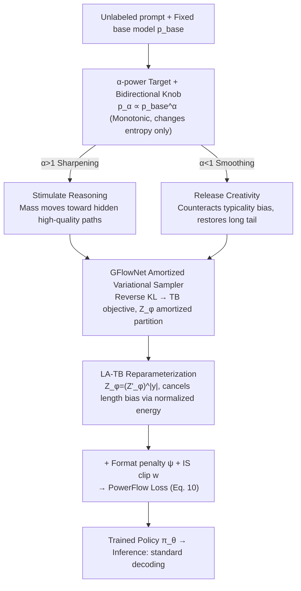

# PowerFlow: Unlocking the Dual Nature of LLMs via Principled Distribution Matching

**Conference**: ICML 2026  
**arXiv**: [2603.18363](https://arxiv.org/abs/2603.18363)  
**Code**: https://github.com/Chenruishuo/PowerFlow (Available)  
**Area**: LLM Inference / Unsupervised Fine-tuning / Distribution Matching  
**Keywords**: RLIF, GFlowNet, $\alpha$-power distribution, length bias, creativity  

## TL;DR
This paper reformulates unsupervised LLM fine-tuning as a problem of "matching the base model's $\alpha$-power distribution," utilizing the GFlowNet Trajectory-Balance objective as an amortized sampler. By introducing a length-aware LA-TB reparameterization, it eliminates structural length bias in autoregressive generation. A single control knob $\alpha$ governs the direction: $\alpha>1$ sharpens the distribution to stimulate reasoning (matching or exceeding supervised GRPO), while $\alpha<1$ flattens the distribution to release suppressed creativity in aligned models, simultaneously improving both quality and diversity on the Pareto frontier.

## Background & Motivation
**Background**: Current efforts to "extract potential" from LLMs primarily follow two paths: RLVR (e.g., DeepSeek-R1, GRPO), which uses verifiable rewards to drive post-training, and RLIF (e.g., Intuitor, EMPO, TTRL), which uses internal signals (self-consistency, token entropy, majority voting) as intrinsic rewards to stimulate reasoning without external labels.

**Limitations of Prior Work**: RLIF rewards are often heuristic combinations lacking a unified theoretical objective. This leads to frequent pathological behaviors during training: length collapse or explosion (reported in Intuitor and majority voting), mode collapse, overconfidence, and majority-voting reward hacking. Researchers are forced to "patch" these issues after the fact rather than explaining the reward design choices beforehand.

**Key Challenge**: Recent work attributes the gains of RL post-training to "distribution sharpening"—reconcentrating probability mass on high-quality paths already known to the base model. In essence, RLIF implicitly sharpens the distribution, but existing methods lack a clear "target shape" objective, causing all reward biases (including length bias) to be amplified blindly. Simultaneously, for already aligned models, excessive sharpening stifles creativity—a manifestation of typicality bias.

**Goal**: To find a **principled target distribution** where both sharpening and smoothing are controlled by a single parameter, and to design a training algorithm capable of optimizing this objective without being poisoned by length bias.

**Key Insight**: The authors select the $\alpha$-power (escort) distribution as the target: $p_\alpha(y|q) \propto p_{\text{base}}(y|q)^\alpha$. This distribution is classic in statistical mechanics; its key property is **monotonic transformation**—it alters entropy while strictly preserving the relative probability rankings and multimodal structure of the base model. $\alpha>1$ pushes mass toward high-probability modes (reasoning), while $\alpha<1$ pushes mass toward the long tail (creativity), corresponding to the "dual nature" of LLMs.

**Core Idea**: Use GFlowNet to amortize the task of "matching the $\alpha$-power distribution" into an on-policy training objective. Reparameterize the standard prompt-level partition function $Z_\phi(q)$ as a token-level $(Z'_\phi(q))^{|y|}$ to ensure gradient scale invariance across trajectories of varying lengths, thereby truly eliminating length bias.

## Method

### Overall Architecture
PowerFlow formalizes unsupervised fine-tuning as the objective of "matching the policy to the base model's $\alpha$-power distribution." It leverages GFlowNet to transform this into a direct optimization loss that is immune to length bias. Given an unlabeled prompt dataset $\mathcal{D}$, a fixed base model $p_{\text{base}}$, and a user-specified $\alpha$, it trains a policy $\pi_\theta$ to approximate a length-normalized version of $p_{\text{base}}^\alpha$. The pipeline involves: expressing the target as minimizing reverse KL divergence toward the $\alpha$-power distribution, utilizing the Trajectory-Balance objective to amortize the intractable partition function into a learnable module $Z_\phi$, and finally using LA-TB reparameterization to eliminate length bias while incorporating a format penalty for instruction-following. Inference remains standard single-pass decoding with zero additional overhead, much more efficient than MCMC-based methods like PowerSampling.

### Key Designs

**1. $\alpha$-power Target + Bidirectional Knob: Controlling Reasoning and Creativity via a Single Scalar**

Prior RLIF rewards were disjointed heuristics. PowerFlow unifies these under a single target distribution $p_\alpha(y|q) = p_{\text{base}}(y|q)^\alpha / Z(q,\alpha)$. Since exponentiation is a monotonic transformation, it only changes entropy without altering the base model's relative probability rankings or multimodal structure. This is a critical difference from RLHF/GRPO, which can "drift" mass outside the base model's support. When $\alpha>1$, the distribution sharpens, moving mass toward hidden correct paths (leveraging the "verification-generation asymmetry"). When $\alpha<1$, the distribution flattens; for an aligned model, this cancels typicality bias and restores buried creative paths. Theorem F.1 proves that empirical majority-voting RLIF is a limit of the $\alpha$-power distribution as $\alpha \to \infty$.

**2. GFlowNet as an Amortized Variational Sampler: Making Distribution Matching Computable**

Directly minimizing reverse KL divergence is hindered by the intractable partition function $Z(q)$. Expanding KL as $\mathbb{D}_{\text{KL}}(\pi_\theta \| p_{\text{target}}) = \mathbb{E}_{y\sim\pi_\theta}[\log \pi_\theta(y|q) / \tilde{p}_{\text{target}}(y|q)] + \log Z(q)$, the last term is independent of $\theta$. The GFlowNet Trajectory-Balance (TB) loss serves as a variational proxy for this KL. Since LLM autoregressive generation is naturally a tree-structured DAG, the backward policy $P_B \equiv 1$, simplifying the TB loss to $\mathcal{L}_{\text{TB}} = (\log Z_\phi(q) + \sum_t \log \pi_\theta(y_t|y_{<t},q) - \log \tilde{p}_{\text{target}}(y|q))^2$. Its gradient equals $2\nabla_\theta \mathbb{D}_{\text{KL}}(P_F \| p_{\text{target}})$, ensuring strict distribution matching. Unlike PPO/GRPO, GFlowNet doesn't require a reward model to match unnormalized densities, and the learnable $Z_\phi$ significantly reduces gradient variance.

**3. Length-Aware TB Reparameterization (LA-TB): Uprooting Length Bias**

Autoregressive log-probabilities are approximately linear with sequence length. Consequently, any prompt-level scalar partition function causes energy drift: sharpening results in length collapse (short paths), while smoothing results in length explosion (repetitive tokens). LA-TB reparameterizes the partition function into a length-aware form $Z_\phi(q,y) = (Z'_\phi(q))^{|y|}$ and divides the log-mismatch by $|y|$, resulting in $\mathcal{L}_{\text{LA-TB}} = (\log Z'_\phi(q) + \tfrac{1}{|y|}\log(\pi_\theta(y|q)/\tilde{p}_{\text{target}}(y|q)))^2$. Its convergence point $\pi^*(y|q) \propto \tilde{p}_{\text{target}}(y|q) \cdot e^{-\lambda_q |y|}$ is a 1D exponential tilt on length. Prop 3.2 shows LA-TB is an I-projection of $\tilde{p}_{\text{target}}$ under a given expected length constraint. Prop 3.3 shows the global KL distortion is a second-order infinitesimal of $\lambda_q$. Coupled with a format penalty $\psi(y)$ and PPO-style importance ratio clipping, it forms the full objective.

### Loss & Training
The final objective (Eq. 10):

$$\mathcal{L}_{\text{PowerFlow}} = w \cdot \left(\log Z'_\phi(q) + \tfrac{1}{|y|}\log\pi_\theta(y|q) - \alpha\left[\tfrac{1}{|y|}\log p_{\text{base}}(y|q) + \psi(y)\right]\right)^2$$

Where $w$ is the detached clipped IS ratio. Reasoning tasks use $\alpha=4$ (base) or $\alpha=2$ (instruct), while creative tasks use $\alpha=0.5$. Data: 18k NuminaMath-CoT queries (reasoning) / 300 prompts (creative).

## Key Experimental Results

### Main Results
Comparison between RLIF baselines and supervised GRPO across model sizes (avg@16, %):

| Model | Method | MATH500 | AIME25 | AMC23 | Average |
|------|------|---------|--------|-------|---------|
| Qwen2.5-1.5B | Intuitor | 47.4 | 0.8 | 22.3 | 18.95 |
| Qwen2.5-1.5B | **PowerFlow** | **49.3** | **1.5** | **23.8** | **19.85** |
| Qwen2.5-1.5B | GRPO (sup) | 45.4 | 0.4 | 21.9 | 18.13 |
| Qwen2.5-Math-1.5B| EMPO | 69.9 | 4.6 | 46.2 | 32.45 |
| Qwen2.5-Math-1.5B| **PowerFlow** | **70.9** | **10.0** | **53.3** | **34.30** |
| Qwen2.5-Math-1.5B| GRPO (sup) | 71.4 | 6.7 | 49.5 | 32.75 |
| Qwen2.5-Math-7B | EMPO | 79.3 | 12.3 | 60.2 | 40.88 |
| Qwen2.5-Math-7B | **PowerFlow** | 78.1 | **14.4** | **63.4** | **42.17** |
| Qwen2.5-Math-7B | GRPO (sup) | 78.4 | 12.9 | 63.4 | 42.38 |

PowerFlow **outperforms supervised GRPO** on Qwen2.5-1.5B and Qwen2.5-Math-1.5B (gap > 1σ) and matches it on Qwen2.5-Math-7B.

### Ablation Study
Figure 3 compares four strategies for handling length bias:

| Configuration | Behavior | Description |
|------|------|------|
| TB-traj / RL-traj | Instant collapse | Directly matches trajectory-level $\alpha$-power; model picks short paths |
| TB-token / RL-token | Rise then crash | Token-log-prob average heuristic; model hacks via repetitive tokens |
| **LA-TB / PowerFlow** | **Stable growth** | Length-normalized energy surface + monotonic convergence |

For creative tasks (Figure 5), PowerFlow ($\alpha=0.5$) is the **only method that simultaneously improves quality and semantic diversity**.

### Key Findings
- LA-TB is a **systemic cure for length bias**: Trajectory matching collapses instantly, while token-averaging is prone to reward hacking. Only embedding length into the partition function ensures stability.
- PowerFlow **preserves higher diversity in solution paths** compared to GRPO: On AIME, PowerFlow diversity score is 4.05, higher than GRPO (3.93) and EMPO (3.80). Unsupervised sharpening avoids mode collapse better than supervised RL.
- Using $\alpha=2$ for instruct models is better than $\alpha=4$, suggesting that alignment processes have already sharpened the distribution once.

## Highlights & Insights
- **Unifying RLIF rewards** under the $\alpha$-power objective is an elegant theoretical contribution, explaining disparate methods as approximations of the same goal.
- **Length bias stemming from the linearity of log-probs** makes scalar partition functions ineffective; using $(Z'_\phi)^{|y|}$ to match dimensionality with length is a simple yet powerful engineering solution.
- **Explaining the dual nature via one mechanism**: Reasoning gains come from sharpening toward hidden modes, while creativity loss comes from over-sharpening. $\alpha$ converts this into a continuous spectrum.
- **Unsupervised beating supervised GRPO** provides strong evidence that RL post-training gains come from "distribution reshaping" rather than "knowledge injection."

## Limitations & Future Work
- The parameter $\alpha$ is currently manually tuned. Optimal $\alpha$ likely relates to intrinsic entropy; automatic scheduling is left for future work.
- The target in LA-TB is technically a length-tilted version of $\alpha$-power rather than the exact distribution.
- RLIF baselines used official checkpoints rather than retraining under a unified recipe due to compute constraints.
- Smoothing ($\alpha<1$) may revive unsafe long-tail behaviors removed by RLHF, necessitating safety guardrails.

## Related Work & Insights
- **vs. Intuitor / EMPO**: PowerFlow provides a rigorous optimization target instead of heuristic intrinsic rewards.
- **vs. PowerSampling**: PowerFlow amortizes the cost into training, allowing standard single-pass decoding during inference.
- **vs. GRPO**: PowerFlow is fully unsupervised and achieves better diversity and competitive performance without verifiable rewards.
- **vs. Standard GFlowNet**: LA-TB is the key modification that makes GFlowNet viable for autoregressive LLM generation by solving the inherent length bias.

## Rating
- Novelty: ⭐⭐⭐⭐⭐ 
- Experimental Thoroughness: ⭐⭐⭐⭐ 
- Writing Quality: ⭐⭐⭐⭐⭐ 
- Value: ⭐⭐⭐⭐⭐ 

<!-- RELATED:START -->

## Related Papers

- [\[ICLR 2026\] String Seed of Thought: Prompting LLMs for Distribution-Faithful and Diverse Generation](../../ICLR2026/llm_reasoning/string_seed_of_thought_prompting_llms_for_distribution-faithful_and_diverse_gene.md)
- [\[NeurIPS 2025\] Is Chain-of-Thought Reasoning of LLMs a Mirage? A Data Distribution Lens](../../NeurIPS2025/llm_reasoning/is_chain-of-thought_reasoning_of_llms_a_mirage_a_data_distribution_lens.md)
- [\[ICML 2026\] Are Tools Always Beneficial? Learning to Invoke Tools Adaptively for Dual-Mode Multimodal LLM Reasoning](are_tools_always_beneficial_learning_to_invoke_tools_adaptively_for_dual-mode_mu.md)
- [\[ICML 2026\] Evaluating Relational Reasoning in LLMs with REL](evaluating_relational_reasoning_in_llms_with_rel.md)
- [\[ICML 2026\] FloorplanQA: A Benchmark for Spatial Reasoning in LLMs Using Structured Representations](floorplanqa_a_benchmark_for_spatial_reasoning_in_llms_using_structured_represent.md)

<!-- RELATED:END -->
