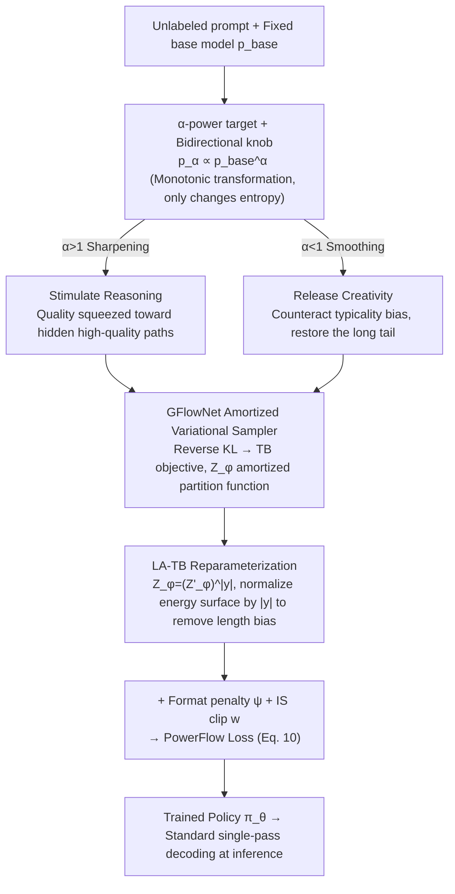

# PowerFlow: Unlocking the Dual Nature of LLMs via Principled Distribution Matching

**Conference**: ICML 2026  
**arXiv**: [2603.18363](https://arxiv.org/abs/2603.18363)  
**Code**: https://github.com/Chenruishuo/PowerFlow (Available)  
**Area**: LLM Inference / Unsupervised Fine-tuning / Distribution Matching  
**Keywords**: RLIF, GFlowNet, $\alpha$-power distribution, length bias, creativity

## TL;DR
This paper reformulates unsupervised LLM fine-tuning as a problem of "matching the $\alpha$-power distribution of a base model," employing the Trajectory-Balance objective of GFlowNet as an amortized sampler. By introducing a length-aware LA-TB reparameterization, it eliminates structural length bias inherent in autoregressive generation. A single knob $\alpha$ controls the direction—$\alpha>1$ sharpens the distribution to stimulate reasoning (matching or exceeding supervised GRPO), while $\alpha<1$ flattens the distribution to release the suppressed creativity of aligned models, simultaneously improving both quality and diversity on the Pareto frontier.

## Background & Motivation
**Background**: Current efforts to "extract potential" from LLMs primarily follow two paths. One is RLVR (e.g., DeepSeek-R1, GRPO) driven by verifiable rewards during post-training; the other is RLIF (e.g., Intuitor, EMPO, TTRL) using internal signals (self-consistency, token entropy, majority voting) as intrinsic rewards, claiming to stimulate reasoning without external labels.

**Limitations of Prior Work**: RLIF rewards are often heuristic combinations lacking a unified theoretical objective. Consequently, pathological behaviors frequently emerge during training: length collapse or explosion (reported in Intuitor and majority voting), mode collapse, overconfidence, and majority-voting reward hacking. Researchers are forced to "patch" these issues post-hoc without a prior explanation of the reward design.

**Key Challenge**: Recent studies attribute the gains in RL post-training to "distribution sharpening"—reconcentrating probability mass onto existing high-quality paths of the base model. In other words, RLIF essentially performs implicit distribution sharpening, but existing methods lack an explicit target of "what shape the distribution should become," leading to the mindless amplification of all biases (including length bias) within the rewards. Furthermore, for pre-aligned models, excessive sharpening stifles creativity—another facet of typicality bias.

**Goal**: To find a **principled target distribution** where both sharpening and smoothing are governed by a controllable parameter, and to design a training algorithm capable of directly optimizing this target without being poisoned by length bias.

**Key Insight**: The authors select the $\alpha$-power (escort) distribution as the target: $p_\alpha(y|q) \propto p_{\text{base}}(y|q)^\alpha$. This distribution is classic in statistical mechanics, with the key property being a **monotonic transformation**—it alters entropy but strictly preserves the relative probability ranking and multimodal structure of the base model. $\alpha>1$ squeezes mass toward high-probability modes (reasoning), while $\alpha<1$ pushes mass toward the long tail (creativity). This perfectly corresponds to the "dual nature" of LLMs.

**Core Idea**: Use GFlowNet to amortize "matching the $\alpha$-power distribution" into an on-policy training objective; then reparameterize the standard prompt-level partition function $Z_\phi(q)$ in GFlowNet into a token-level $(Z'_\phi(q))^{|y|}$ to maintain scale invariance of gradients across trajectories of different lengths, thereby truly eliminating length bias.

## Method

### Overall Architecture
PowerFlow formalizes unsupervised fine-tuning as the objective of "making the policy match the $\alpha$-power distribution of the base model," then transforms it via GFlowNet into a training loss that can be directly optimized without length bias. Given an unlabeled prompt dataset $\mathcal{D}$, a fixed base model $p_{\text{base}}$, and a user-specified $\alpha$, it trains a policy $\pi_\theta$ such that its distribution approximates a length-normalized version of $p_{\text{base}}^\alpha$. The pipeline is: first, formulate the objective as "minimizing the reverse KL divergence to the $\alpha$-power distribution," then use the Trajectory-Balance (TB) objective to amortize the intractable partition function into a learnable module $Z_\phi$, and finally apply LA-TB reparameterization to eliminate length bias while adding a format penalty to ensure instruction-following. Inference remains standard single-pass decoding with zero additional overhead, which is significantly more efficient than schemes like PowerSampling that run MCMC during inference.

### Key Designs

**1. $\alpha$-power target + Bidirectional knob: Coordinating "Stimulating Reasoning" and "Releasing Creativity" with a single scalar.**

Previous RLIF rewards were handcrafted—one for reasoning and another for diversity, often disconnected and lacking theoretical guarantees. PowerFlow encapsulates both into a single target distribution $p_\alpha(y|q) = p_{\text{base}}(y|q)^\alpha / Z(q,\alpha)$. Since the power operation is a monotonic transformation, it only changes entropy without disturbing the relative probability rankings or the multimodal structure of the base model. This is a key distinction from external reward methods like RLHF/GRPO, which can "drift" probability mass outside the base model's support. When $\alpha>1$, the distribution is sharpened; combined with the "verification-generation asymmetry" hypothesis (verification is easier than generation), quality is pushed toward hidden correct paths. When $\alpha<1$, the distribution is smoothed; since an RLHF-aligned model is already essentially in an $\alpha>1$ power distribution of the reference model, flattening it counteracts typicality bias and restores buried creative long-tail paths. The paper further proves (Theorem F.1) that empirically effective majority-voting RLIF is a limit of the $\alpha$-power distribution as $\alpha \to \infty$, making PowerFlow its generalized form.

**2. GFlowNet as an Amortized Variational Sampler: Turning distribution matching into a computable on-policy objective.**

Directly minimizing reverse KL divergence hits the wall of the intractable partition function $Z(q)$. Expanding KL as $\mathbb{D}_{\text{KL}}(\pi_\theta \| p_{\text{target}}) = \mathbb{E}_{y\sim\pi_\theta}[\log \pi_\theta(y|q) / \tilde{p}_{\text{target}}(y|q)] + \log Z(q)$, the last term is independent of $\theta$, leaving only the first half to optimize. Zimmermann et al. (2023) proved that the GFlowNet Trajectory-Balance loss is a variational surrogate for this KL; since LLM autoregressive generation is naturally a tree-structured DAG where the backward policy $P_B \equiv 1$, the TB loss simplifies to $\mathcal{L}_{\text{TB}} = (\log Z_\phi(q) + \sum_t \log \pi_\theta(y_t|y_{<t},q) - \log \tilde{p}_{\text{target}}(y|q))^2$. Its gradient is exactly $2\nabla_\theta \mathbb{D}_{\text{KL}}(P_F \| p_{\text{target}})$, so minimizing it performs strict distribution matching. Unlike the policy-gradient + KL-penalty approach in PPO/GRPO, GFlowNet allows precise matching of any unnormalized density without a reward model, while the learnable $Z_\phi$ amortizes partition function estimation, significantly reducing gradient variance.

**3. Length-Aware TB Reparameterization (LA-TB): Eradicating length bias from the partition function.**

Autoregressive log-probabilities are approximately linear with sequence length, so any prompt-level scalar partition function causes energy to drift with length—during sharpening, the model collapses into short sequences; during smoothing, the model inflates with repeated tokens to lower average energy. LA-TB addresses this by defining the partition function in a length-aware form $Z_\phi(q,y) = (Z'_\phi(q))^{|y|}$ and dividing the entire log-mismatch by $|y|$, yielding $\mathcal{L}_{\text{LA-TB}} = (\log Z'_\phi(q) + \tfrac{1}{|y|}\log(\pi_\theta(y|q)/\tilde{p}_{\text{target}}(y|q)))^2$. Its convergence point is $\pi^*(y|q) \propto \tilde{p}_{\text{target}}(y|q) \cdot e^{-\lambda_q |y|}$, which is a 1D exponential tilt on length. The paper provides two guarantees: Prop 3.2 states that LA-TB is the I-projection of $\tilde{p}_{\text{target}}$ under a given expected length constraint; Prop 3.3 states the global KL distortion is only $\tfrac{1}{2}\lambda_q^2 \text{Var}_{\tilde{p}_{\text{target}}}(|y|) + O(|\lambda_q|^3)$, a second-order small quantity of $\lambda_q$. Coupled with a format penalty $\psi(y)$ (e.g., -0.5 for missing \boxed{}) and PPO-style importance ratio clipping, it forms the complete objective. In practice, trajectory-level TB/RL collapses in a few steps, while token-level averaging is exploited by repeating tokens, but LA-TB eliminates length bias without destroying semantics—measuring a pairwise inversion rate of only 0.09 on Qwen2.5-Math-1.5B, meaning 91% of the $\alpha$-power ranking is preserved.

### Loss & Training
The final objective is shown in Equation (10):

$$\mathcal{L}_{\text{PowerFlow}} = w \cdot \left(\log Z'_\phi(q) + \tfrac{1}{|y|}\log\pi_\theta(y|q) - \alpha\left[\tfrac{1}{|y|}\log p_{\text{base}}(y|q) + \psi(y)\right]\right)^2$$

where $w$ is the detached clipped IS ratio (off-policy compatible). Reasoning tasks default to $\alpha=4$ (base models) or $\alpha=2$ (instruct models), while creative tasks use $\alpha=0.5$. Training data: 18k NuminaMath-CoT queries (reasoning) / 300 prompts (creative, from PoemHunter, BookMIA, Reddit r/DadJokes). The recipe follows EMPO for fair comparison.

## Key Experimental Results

### Main Results
Comparison of RLIF baselines and supervised GRPO across various model sizes and benchmarks (numbers are avg@16, in %):

| Model | Method | MATH500 | AIME25 | AMC23 | Average |
|------|------|---------|--------|-------|---------|
| Qwen2.5-1.5B | Intuitor | 47.4 | 0.8 | 22.3 | 18.95 |
| Qwen2.5-1.5B | **PowerFlow** | **49.3** | **1.5** | **23.8** | **19.85** |
| Qwen2.5-1.5B | GRPO (sup) | 45.4 | 0.4 | 21.9 | 18.13 |
| Qwen2.5-Math-1.5B | EMPO | 69.9 | 4.6 | 46.2 | 32.45 |
| Qwen2.5-Math-1.5B | **PowerFlow** | **70.9** | **10.0** | **53.3** | **34.30** |
| Qwen2.5-Math-1.5B | GRPO (sup) | 71.4 | 6.7 | 49.5 | 32.75 |
| Qwen2.5-Math-7B | EMPO | 79.3 | 12.3 | 60.2 | 40.88 |
| Qwen2.5-Math-7B | **PowerFlow** | 78.1 | **14.4** | **63.4** | **42.17** |
| Qwen2.5-Math-7B | GRPO (sup) | 78.4 | 12.9 | 63.4 | 42.38 |

PowerFlow **outperforms supervised GRPO** on Qwen2.5-1.5B, Qwen2.5-Math-1.5B, and Llama-3.2-3B-Instruct (gap > 1σ), and matches performance on Qwen2.5-Math-7B.

### Ablation Study
Figure 3 compares four strategies for "eliminating length bias":

| Configuration | Behavior | Description |
|------|------|------|
| TB-traj / RL-traj | Immediate length collapse | Directly matching trajectory-level $\alpha$-power; model picks short paths |
| TB-token / RL-token | Rise then crash | Heuristic token log-prob averaging; model exploits repeated tokens |
| **LA-TB / PowerFlow** | **Steady and stable rise** | Length-normalized energy surface + monotonic convergence |

Creative tasks (Figure 5): PowerFlow ($\alpha=0.5$) is the **only method that simultaneously improves quality and semantic diversity**; high-temperature increases diversity but degrades quality; VS-Standard degrades quality on models $\le$ 7B.

### Key Findings
- LA-TB is a **root solution for length bias**: Trajectory matching collapses almost immediately, and token-level averaging is eventually hacked; only a length-aware partition function ensures stability.
- PowerFlow not only matches GRPO but **retains higher solution path diversity**: On AIME24/25, PowerFlow achieves a diversity score of 4.05, higher than GRPO (3.93) and EMPO (3.80). Unsupervised sharpening is less prone to "mode collapse" than supervised reward fine-tuning.
- For instruct models, $\alpha=2$ is superior to $\alpha=4$, suggesting that the alignment process already sharpens the distribution once; stacking too much sharpening becomes counterproductive. This provides direct empirical evidence for the "alignment = implicit $\alpha>1$ sharpening" hypothesis.

## Highlights & Insights
- **Unified Theory**: Viewing all RLIF rewards as approximations of the same $\alpha$-power target is an elegant unification: majority voting is the $\alpha \to \infty$ limit, and token entropy/self-consistency are different approximations.
- **Engineering Logic**: Recognizing that **length bias = linear relationship between autoregressive log-prob and length** leads to the insight that prompt-level scalar partition functions cannot overcome gradient variance. Using $(Z'_\phi)^{|y|}$ to explicitly match dimensions with length is a simple yet brilliant engineering contribution.
- **Dual Nature**: A single mechanism explains both "why sharpening boosts reasoning" and "why alignment kills creativity"—the former pushes mass to hidden good modes, while the latter pushes too far and suppresses the long tail.
- **Paradigm Shift**: The fact that an **unsupervised method beats supervised GRPO** is a strong signal that RL post-training gains currently stem more from "reshaping distribution geometry" than "injecting new knowledge."

## Limitations & Future Work
- The parameter $\alpha$ is currently hand-tuned ($\alpha=4$ for base, $\alpha=2$ for instruct, $\alpha=0.5$ for creative). The optimal $\alpha$ should relate to the model's intrinsic entropy; automatic scheduling is left for future work.
- The target distribution of LA-TB is strictly a length-tilted version of $\alpha$-power. While the KL deviation is a second-order small quantity $O(\lambda_q^2)$, it may be insufficient for tasks with extreme length disparities.
- Safety Guardrails: As mentioned in the impact statement, $\alpha<1$ might resurrect unsafe long rails suppressed by RLHF, requiring additional safety layers.

## Related Work & Insights
- **vs Intuitor / EMPO / TTRL**: These use handcrafted intrinsic rewards; PowerFlow explains them as implicit approximations of a unified $\alpha$-power target.
- **vs PowerSampling (Karan & Du, 2025)**: Same target distribution but uses MCMC at inference, which is costly; PowerFlow amortizes the cost into training.
- **vs GRPO**: GRPO requires verifiable rewards; PowerFlow is entirely unsupervised and often matches or exceeds its performance with higher diversity.
- **vs Standard GFlowNet (Malkin et al. 2022)**: Standard GFlowNet suffers from length bias in LLMs; LA-TB is a critical contribution for making GFlowNet viable for autoregressive generation.

## Rating
- Novelty: ⭐⭐⭐⭐⭐ Unifying RLIF as $\alpha$-power matching + LA-TB reparameterization is a clean theoretical narrative.
- Experimental Thoroughness: ⭐⭐⭐⭐ Covers 4 model families across 6 reasoning benchmarks + creative tasks, though misses adaptive $\alpha$ exploration.
- Writing Quality: ⭐⭐⭐⭐⭐ The story is extremely clear, progressing logically from RLIF status to $\alpha$-power and then to LA-TB.
- Value: ⭐⭐⭐⭐⭐ "Unsupervised beating supervised GRPO" is strong evidence for the current shift in RL post-training philosophy (geometry engineering > knowledge injection).

<!-- RELATED:START -->

## Related Papers

- [\[ICLR 2026\] String Seed of Thought: Prompting LLMs for Distribution-Faithful and Diverse Generation](../../ICLR2026/llm_reasoning/string_seed_of_thought_prompting_llms_for_distribution-faithful_and_diverse_gene.md)
- [\[ICML 2026\] Select to Think: Unlocking SLM Potential with Local Sufficiency](select_to_think_unlocking_slm_potential_with_local_sufficiency.md)
- [\[ICLR 2026\] FlowRL: Matching Reward Distributions for LLM Reasoning](../../ICLR2026/llm_reasoning/flowrl_matching_reward_distributions_for_llm_reasoning.md)
- [\[NeurIPS 2025\] Note 1: Is CoT a Hallucination? A Data Distribution Perspective](../../NeurIPS2025/llm_reasoning/is_chain-of-thought_reasoning_of_llms_a_mirage_a_data_distribution_lens.md)
- [\[ICML 2026\] Evaluating Relational Reasoning in LLMs with REL](evaluating_relational_reasoning_in_llms_with_rel.md)

<!-- RELATED:END -->
