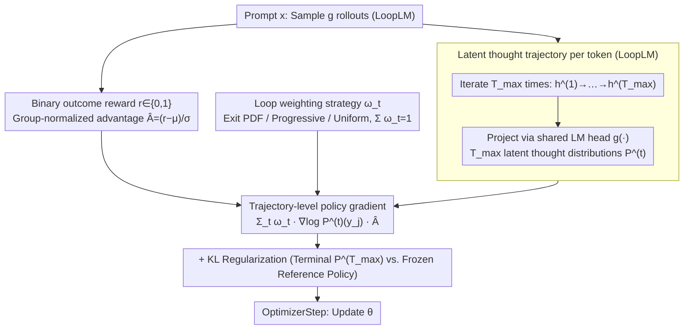

# Prioritize the Process, Not Just the Outcome: Rewarding Latent Thought Trajectories Improves Reasoning in Looped Language Models

**Conference**: ICML 2026  
**arXiv**: [2602.10520](https://arxiv.org/abs/2602.10520)  
**Code**: https://github.com/jonwill8/RLTT.git  
**Area**: LLM Reasoning / Reinforcement Learning / Looped Transformer  
**Keywords**: Looped Language Model, Implicit Reasoning, Trajectory-level Credit Assignment, GRPO, Process Reward

## TL;DR
Addressing the characteristic of Looped Language Models (LoopLM) iteratively refining latent representations $T_{\max}$ times before outputting each token, this paper proposes RLTT. By modifying the policy gradient in GRPO from "rewarding only the final loop" to "scoring the next-token distribution of every loop with weight $\omega_t$", RLTT improves the average accuracy of Ouro-2.6B on MATH/AIME/BeyondAIME by +10.9% without external verifiers or additional computational overhead. It also yields side benefits including a 10% reduction in training time and spontaneously shortened response lengths.

## Background & Motivation

**Background**: The mainstream "long-chain reasoning" approach relies on explicit Chain-of-Thought (CoT) tokens to externalize the thinking process, followed by RL with verifiable rewards (e.g., GRPO) to backpropagate gradients based on answer correctness. Another approach is **implicit reasoning**: LoopLMs like Ouro and Huginn execute the same set of transformer weights $T_{\max}$ times before emitting each token, allowing the model to "think" in hidden space. These models match explicit CoT performance with fewer parameters.

**Limitations of Prior Work**: Directly applying GRPO to LoopLM yields almost no gain—the original Ouro paper admitted that RL provided nearly zero improvement over SFT. LSRL attempted to provide process rewards for intermediate states using GPT-4.1 nano, but this required decoding hidden states into text and calling external APIs, resulting in extreme engineering overhead and cost.

**Key Challenge**: The policy gradient of GRPO, $\nabla_\theta \log P_\theta^{(T_{\max})}(y_j\mid x,y_{<j}) \hat{A}_i$, is a function only of the final loop's output distribution, **implicitly assuming each token involves a single decision step**. However, a LoopLM undergoes a full trajectory $h_j^{(1)}\to\cdots\to h_j^{(T_{\max})}$. Reward signals must traverse all intermediate loops to reach early representations, creating a "credit assignment bottleneck."

**Goal**: Design a policy gradient framework that can directly replace GRPO, requires no external verifier, and allows RL signals to act simultaneously on all implicit distributions across loops.

**Key Insight**: LoopLM architectures offer a neglected convenience—**the hidden state $h_j^{(t)}$ of every loop can be projected onto the vocabulary via a shared language modeling head $g(\cdot)$**, yielding $T_{\max}$ "latent thought distributions" for free. Since these distributions are already calculated during forward passes, incorporating them into the policy gradient adds almost no computational cost.

**Core Idea**: Use a weight sequence $\{\omega_t\}_{t=1}^{T_{\max}}$ ($\sum \omega_t = 1$) to calculate a weighted sum of $\log P_\theta^{(t)}$ for every loop, replacing the terminal-only $\log P_\theta^{(T_{\max})}$ in GRPO. This assigns credit directly to the "thinking trajectory" rather than just the "thinking endpoint."

## Method

### Overall Architecture
RLTT addresses the failure of GRPO in LoopLM contexts by providing a plug-and-play replacement. The workflow is isomorphic to GRPO: for a prompt $x$, sample $g$ rollouts $\{y_i\}$ and calculate the group-normalized advantage $\hat{A}_i=(r_i-\mu)/\sigma$ based on binary correctness $r_i\in\{0,1\}$. The only modification is the form of the policy gradient. While GRPO computes $\nabla_\theta\log P$ only for the final loop of each token, RLTT weights the next-token distributions produced across all $T_{\max}$ cycles by $\omega_t$, enabling the reward signal to act directly on the entire "thinking trajectory."

### Key Designs

**1. Trajectory-level Policy Gradient: Credit to every loop, not just the last**

The GRPO policy gradient $\nabla_\theta\log P_\theta^{(T_{\max})}(y_j\mid x,y_{<j})\hat{A}_i$ treats each token as a single decision. In LoopLM, the reward must backpropagate through all $h_j^{(t)}$ states, hit a bottleneck. RLTT replaces the single-loop gradient with a weighted sum $\sum_{t=1}^{T_{\max}}\omega_t\nabla_\theta\log P_\theta^{(t)}(y_j\mid x,y_{<j})\hat{A}_i$. Since $h_j^{(t)}$ is projected via $g(\cdot)$ anyway, this calculation is nearly free. This forces the entire trajectory $P_\theta^{(1)}\to\cdots\to P_\theta^{(T_{\max})}$ toward high-advantage predictions, effectively shortening the credit assignment horizon from $T_{\max}$ steps to 1 and encouraging "early convergence" in latent space.

**2. Three Loop Weighting Strategies $\{\omega_t\}$**

The weight sequence $\{\omega_t\}_{t=1}^{T_{\max}}$ (where $\sum_t\omega_t=1$) determines the credit contribution of each loop. Three strategies are proposed: **Exit PDF** sets $\omega_t=p_{\text{exit}}(t\mid x)$, reusing the learned early-exit head probabilities from Ouro; **Progressive** sets $\omega_t=t^\alpha/\sum_s s^\alpha$, following the intuition that later refinements are closer to the true distribution; **Uniform** sets $\omega_t=1/T_{\max}$, forcing the model to form and maintain correct distributions as early as possible. Empirical results show <1% variance between these, suggesting the gain comes from "exposing the trajectory" rather than specific scheduling.

### Loss & Training
The final loss (Eq. 5–7) combines the trajectory-weighted term with GRPO-style KL regularization:

$$J_{\text{RLTT}}(\theta) = -\mathbb{E}\Big[\frac{1}{g|y_i|}\sum_{i,j,t} \omega_t \log P_\theta^{(t)}(y_{i,j}\mid x,y_{<j})\hat{A}_i\Big] + \beta D_{\mathrm{KL}}(\pi_\theta \| \pi_{\mathrm{ref}})$$

Rewards are binary outcome-based (exact match → 1, else 0), using MATH for training and z-score normalization for advantages. KL regularization is computed only between the final loop $P_\theta^{(T_{\max})}$ and the frozen reference $P_{\mathrm{ref}}^{(T_{\max})}$ to save memory.

## Key Experimental Results

### Main Results

Rollout budget, optimizer, reward function, advantage normalization, and KL coefficients were strictly aligned with GRPO. Due to storing per-loop log-probabilities, `ppo_max_token_len_per_gpu` was halved to 8192 for RLTT, and GRPO was given a longer token budget during evaluation (3072 vs 2048) to ensure fairness.

| Model | MATH-500 | AIME24 | AIME26 | BeyondAIME | GSM8K | Math Avg | Non-Math Avg |
|---|---|---|---|---|---|---|---|
| Ouro-1.4B-Thinking | 73.2 | 16.7 | 13.3 | 4.0 | 90.7 | 39.6 | 58.7 |
| + GRPO | 77.4 | 16.7 | 16.7 | 6.0 | 91.7 | 41.7 | 59.5 |
| **+ RLTT (Ours)** | **81.2** | **26.7** | **20.0** | **12.0** | 90.3 | **46.0 (+5.8)** | **64.8 (+5.3)** |
| Ouro-2.6B-Thinking | 75.6 | 13.3 | 6.67 | 5.0 | 93.6 | 38.8 | 64.5 |
| + GRPO | 79.0 | 16.7 | 16.7 | 6.0 | 93.9 | 42.5 | 65.2 |
| **+ RLTT (Ours)** | **86.0** | **33.3** | **26.7** | **16.0** | **94.0** | **51.2 (+10.9)** | **71.8 (+6.6)** |

Ouro-2.6B+RLTT gains +16.6%, +10.0%, and +10.0% over GRPO on AIME24, AIME26, and BeyondAIME respectively. Paired t-tests show significant improvements (p<0.05) on 8/9 benchmarks for the 2.6B model.

### Ablation Study

| Metric | GRPO | RLTT | Note |
|---|---|---|---|
| Training Time (140 steps) | 54.42 hrs | 49.05 hrs | RLTT spontaneously shortens responses → -10% time |
| Min/Step | 23.3 ± 8.31 | 21.1 ± 9.87 | Same as above |
| Response Length Trend | Stable | Decreasing | Emergent behavior without brevity incentive |
| Terminal Entropy Drop | Slow | Steeper/Sustained | Combined with Pass@k, rules out entropy collapse |
| Loop weighting strategy | n/a | Exit/Prog/Unif < 1% diff | Gain is from trajectory exposure |
| GPQA (zero-shot) | 19.7 (2.6B) | 38.4 (2.6B) | Multi-hop reasoning nearly doubled |
| 1-2 loop evaluation | Major degradation | Still better than GRPO | Early loop reasoning is genuinely reinforced |

### Key Findings
- **Spontaneous response shortening**: Although the reward only concerns answer correctness, RLTT encourages "early convergence" in latent space, naturally leading to shorter responses without requiring token-level length penalties.
- **GPQA performance doubling**: Despite training only on MATH, the massive gain in GPQA (fact-based multi-hop) suggests RLTT significantly improves the stability of reasoning trajectories within a fixed token budget.
- **Theoretical Support (Theorem A.5)**: Under assumptions of loop refinement and linear uncertainty costs, it is proved that RLTT requires fewer tokens than GRPO to reach a correct solution.
- **GSNR Improvement**: Gradient Signal-to-Noise Ratio (GSNR) is significantly higher for RLTT on difficult tasks like AIME24, providing direct evidence for "richer gradient signals."

## Highlights & Insights
- **Architecture-Aligned RL**: By identifying the mismatch between GRPO's "single-step" assumption and LoopLM's multi-step latent reasoning, RLTT serves as a paradigm for aligning RL algorithms with specific model computation patterns.
- **Internal Process Rewards**: Unlike LSRL which relies on GPT-4, RLTT uses the model's own per-loop distributions as process signals, achieving a self-sufficient process reward system.
- **Efficiency as a Byproduct**: The reduction in response length and training time was an unoptimized emergent property. This suggests that process alignment inherently addresses the "overthinking" issues common in explicit CoT models.

## Limitations & Future Work
- **Limitations**: (i) Storing per-loop log-probabilities doubles VRAM usage, limiting batching; (ii) Specialized for LoopLM architectures; (iii) Training uses a fixed loop depth, sacrificing adaptive early-exit capabilities.
- **Potential Improvements**: (i) Use gradient checkpointing or FP8 to mitigate memory bottlenecks; (ii) Integrate RLTT with adaptive halting to restore per-token compute flexibility; (iii) Validate on other implicit reasoning architectures like Huginn or Coconut.

## Related Work & Insights
- **vs GRPO**: RLTT outperforms GRPO across the board with nearly identical compute, although it has higher memory requirements.
- **vs LSRL (Ren, 2025)**: LSRL uses external LLMs to score decoded hidden states; RLTT is more efficient and provides significantly higher gains (+10.9% vs +4.27%) without external dependencies.
- **vs Ouro (Zhu et al., 2025b)**: RLTT completes the Ouro framework by solving the previously acknowledged failure of RL in looped models.

## Rating
- **Novelty**: ⭐⭐⭐⭐ Simple but precise alignment of RL policy gradients with the inherent mechanics of looped architectures.
- **Experimental Thoroughness**: ⭐⭐⭐⭐⭐ Comprehensive scaling (1.4B/2.6B), 9 benchmarks, GSNR analysis, and rigorous theoretical grounding.
- **Writing Quality**: ⭐⭐⭐⭐ Clear structure, though the core mechanism (Eq. 4) follows a somewhat lengthy setup.
- **Value**: ⭐⭐⭐⭐⭐ Establishes a strong baseline for latent reasoning and RL, likely influencing future "process-aligned" RL research.

<!-- RELATED:START -->

## Related Papers

- [\[ICML 2026\] Stabilizing Recurrent Dynamics for Test-Time Scalable Latent Reasoning in Looped Language Models](stabilizing_recurrent_dynamics_for_test-time_scalable_latent_reasoning_in_looped.md)
- [\[ICML 2026\] GRPO is Secretly a Process Reward Model](grpo_is_secretly_a_process_reward_model.md)
- [\[ICLR 2026\] Co-rewarding: Stable Self-supervised RL for Eliciting Reasoning in Large Language Models](../../ICLR2026/llm_reasoning/co-rewarding_stable_self-supervised_rl_for_eliciting_reasoning_in_large_language.md)
- [\[ACL 2026\] Large Reasoning Models Are (Not Yet) Multilingual Latent Reasoners](../../ACL2026/llm_reasoning/large_reasoning_models_are_not_yet_multilingual_latent_reasoners.md)
- [\[NeurIPS 2025\] Smaller Models, Smarter Rewards: A Two-Sided Approach to Process and Outcome Rewards](../../NeurIPS2025/llm_reasoning/smaller_models_smarter_rewards_a_two-sided_approach_to_process_and_outcome_rewar.md)

<!-- RELATED:END -->
