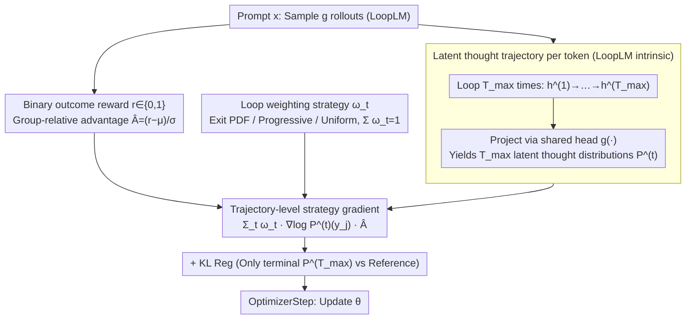

# Prioritize the Process, Not Just the Outcome: Rewarding Latent Thought Trajectories Improves Reasoning in Looped Language Models

**Conference**: ICML 2026  
**arXiv**: [2602.10520](https://arxiv.org/abs/2602.10520)  
**Code**: https://github.com/jonwill8/RLTT.git  
**Area**: LLM Reasoning / Reinforcement Learning / Looped Transformer  
**Keywords**: Looped Language Model, Implicit Reasoning, Trajectory-level Credit Assignment, GRPO, Process Reward

## TL;DR
Aiming at the characteristic of Looped Language Models (LoopLM) iteratively regenerating latent representations $T_{\max}$ times before each token output, this paper proposes RLTT. By modifying the "final-loop-only" strategy gradient in GRPO to "weight each loop's next-token distribution $P^{(t)}$ with $\omega_t$," the method improves the average accuracy of Ouro-2.6B on MATH/AIME/BeyondAIME by +10.9% without external verifiers or additional inference overhead. It also yields spontaneous decreases in training time (-10%) and response lengths.

## Background & Motivation

**Background**: Mainstream "long-chain reasoning" relies on explicit chain-of-thought (CoT) tokens, followed by RL with verifiable rewards (e.g., GRPO) based on final answer correctness. An alternative is **implicit reasoning**: LoopLMs (e.g., Ouro, Huginn) execute the same transformer weights $T_{\max}$ times before each output token, allowing the model to "think" in hidden space. These models achieve performance comparable to explicit CoT with significantly fewer parameters.

**Limitations of Prior Work**: Directly applying GRPO to LoopLMs yields minimal gains; the original Ouro paper noted that RL barely improved over SFT. LSRL attempted to provide process rewards for each loop's intermediate state using GPT-4.1 nano, but required decoding hidden states into text and calling external APIs, leading to prohibitive engineering overhead and costs.

**Key Challenge**: The GRPO strategy gradient $\nabla_\theta \log P_\theta^{(T_{\max})}(y_j\mid x,y_{<j}) \hat{A}_i$ is a function only of the final loop's distribution, **implicitly assuming a single-step decision per token**. However, LoopLMs undergo a full trajectory $h_j^{(1)}\to\cdots\to h_j^{(T_{\max})}$. Reward signals must traverse all intermediate loops to backpropagate to early representations, creating a "credit assignment bottleneck."

**Goal**: Design a strategy gradient framework that serves as a drop-in replacement for GRPO, requires no external verifier, and applies RL signals simultaneously to implicit distributions across all loops.

**Key Insight**: LoopLM architectures offer a neglected convenience—**the hidden state $h_j^{(t)}$ of every loop can be projected onto the vocabulary via the shared language modeling head $g(\cdot)$**, generating $T_{\max}$ "latent thought distributions" for free. Since these are computed during the forward pass, incorporating them into the strategy gradient adds virtually no computational cost.

**Core Idea**: Use a weight sequence $\{\omega_t\}_{t=1}^{T_{\max}}$ ($\sum \omega_t = 1$) to calculate a weighted sum of $\log P_\theta^{(t)}$ for all loops, replacing the final-distribution-only $\log P_\theta^{(T_{\max})}$ in GRPO. This assigns credit directly to the "thought trajectory" rather than just the "thought endpoint."

## Method

### Overall Architecture
RLTT addresses the failure of GRPO in LoopLMs with a plug-and-play replacement. The workflow is isomorphic to GRPO: for a prompt $x$, sample $g$ rollouts $\{y_i\}$, calculate binary correctness rewards $r_i\in\{0,1\}$, and compute group-normalized advantages $\hat{A}_i=(r_i-\mu)/\sigma$. The sole modification lies in the strategy gradient's form. Instead of taking the gradient of only the final loop, RLTT weights the next-token distributions produced across all $T_{\max}$ loops, ensuring the reward signal acts on the entire "thinking trajectory."

### Key Designs

**1. Trajectory-level Strategy Gradient: Assigning credit to every loop**

Standard GRPO gradients $\nabla_\theta \log P_\theta^{(T_{\max})}(y_j\mid x,y_{<j})\hat{A}_i$ treat the token as a single decision. In LoopLMs, the reward must backpropagate through all loops to reach early representations, causing a bottleneck. RLTT replaces the single-loop gradient with a weighted sum $\sum_{t=1}^{T_{\max}}\omega_t\nabla_\theta\log P_\theta^{(t)}(y_j\mid x,y_{<j})\hat{A}_i$. This makes the gradient a direct function of all intermediate implicit distributions. This is feasible because $h_j^{(t)}$ is projected to the vocabulary in every loop during the forward pass. This encourages the entire trajectory $P_\theta^{(1)}\to\cdots\to P_\theta^{(T_{\max})}$ toward high-advantage predictions, effectively shortening the credit assignment horizon from $T_{\max}$ steps to 1 step and encouraging "early convergence."

**2. Three Loop Weighting Strategies $\{\omega_t\}$**

The weight sequence $\{\omega_t\}_{t=1}^{T_{\max}}$ (where $\sum_t\omega_t=1$) determines the contribution of each loop. Three strategies are proposed: **Exit PDF** uses $\omega_t=p_{\text{exit}}(t\mid x)$, reusing Ouro's early-exit head probabilities as "confidence"; **Progressive** uses $\omega_t=t^\alpha/\sum_s s^\alpha$, reflecting the intuition that later refinements are more accurate; **Uniform** uses $\omega_t=1/T_{\max}$, forcing the model to form and maintain correct distributions as early as possible. Experiments show differences between these are $< 1\%$, suggesting gains stem from "exposing the trajectory" rather than specific scheduling.

### Loss & Training
The final loss (Equations 5–7) combines the trajectory-weighted term with GRPO-style KL regularization:

$$J_{\text{RLTT}}(\theta) = -\mathbb{E}\Big[\frac{1}{g|y_i|}\sum_{i,j,t} \omega_t \log P_\theta^{(t)}(y_{i,j}\mid x,y_{<j})\hat{A}_i\Big] + \beta D_{\mathrm{KL}}(\pi_\theta \| \pi_{\mathrm{ref}})$$

Rewards are binary based on exact match. The advantage $\hat{A}_i$ uses group-relative z-score normalization. To manage VRAM, KL regularization is computed only between the final loop $P_\theta^{(T_{\max})}$ and the frozen reference policy $P_{\mathrm{ref}}^{(T_{\max})}$.

## Key Experimental Results

### Main Results

Experiments compared RLTT against GRPO under identical hyperparameters (rollout budget, reward function, advantage normalization, 140 steps). To store $T_{\max}$ log-probs, `ppo_max_token_len_per_gpu` was halved to 8192 for RLTT.

| Model | MATH-500 | AIME24 | AIME26 | BeyondAIME | GSM8K | Math Avg | Non-Math Avg |
|---|---|---|---|---|---|---|---|
| Ouro-1.4B-Thinking | 73.2 | 16.7 | 13.3 | 4.0 | 90.7 | 39.6 | 58.7 |
| + GRPO | 77.4 | 16.7 | 16.7 | 6.0 | 91.7 | 41.7 | 59.5 |
| **+ RLTT (Ours)** | **81.2** | **26.7** | **20.0** | **12.0** | 90.3 | **46.0 (+5.8)** | **64.8 (+5.3)** |
| Ouro-2.6B-Thinking | 75.6 | 13.3 | 6.67 | 5.0 | 93.6 | 38.8 | 64.5 |
| + GRPO | 79.0 | 16.7 | 16.7 | 6.0 | 93.9 | 42.5 | 65.2 |
| **+ RLTT (Ours)** | **86.0** | **33.3** | **26.7** | **16.0** | **94.0** | **51.2 (+10.9)** | **71.8 (+6.6)** |

Ouro-2.6B+RLTT outperformed GRPO by +16.6%, +10.0%, and +10.0% on AIME24, AIME26, and BeyondAIME, respectively. Paired t-tests show significant improvements (p<0.05) across most benchmarks.

### Ablation Study

| Metric | GRPO | RLTT | Remarks |
|---|---|---|---|
| Training Time (140 steps) | 54.42 hrs | 49.05 hrs | Spontaneous shorter responses → -10% time |
| Min/Step | 23.3 ± 8.31 | 21.1 ± 9.87 | Same as above |
| Response Length | Stable | Decreasing | No brevity incentive in reward; pure emergence |
| Terminal Entropy | Slow decline | Steeper decline | Pass@k confirms no entropy collapse |
| Loop weighting | n/a | Diff < 1% | Gain from trajectory exposure, not scheduling |
| GPQA (zero-shot) | 19.7 (2.6B) | 38.4 (2.6B) | Implicit multi-hop reasoning nearly doubled |

### Key Findings
- **Emergent Brevity**: Despite binary outcome rewards, RLTT forces credit assignment across all loops, compelling "early convergence" in latent space and spontaneously reducing token lengths.
- **Improved Generalization**: GPQA performance nearly doubled. Since GPQA is highly sensitive to reasoning trajectory stability within a token budget, RLTT's trajectory-level reinforcement proves exceptionally robust.
- **Theoretical Support (Theorem A.5)**: Under assumptions of uncertainty reduction via refinement and concave length-reward trade-offs, RLTT is proven to require fewer tokens for correct solutions compared to GRPO.
- **Higher GSNR**: Gradient Signal-to-Noise Ratio was significantly higher for RLTT on difficult tasks (e.g., AIME), validating the hypothesis of a "richer gradient signal."

## Highlights & Insights
- **Architecture-Aligned RL**: RLTT identifies the mismatch between GRPO's single-step assumption and LoopLM's multi-step latent reasoning. By aligning the algorithm with the model's actual compute graph (using per-loop logits), it provides a paradigm for RL that respects architectural semantics.
- **Process Rewards Without Verifiers**: Unlike LSRL which requires external LLM APIs to score intermediate states, RLTT treats the model's own internal trajectory as the process signal, creating a self-sufficient process-reward mechanism.
- **Process Alignment Drives Efficiency**: The reduction in response length and training time—unoptimized by the reward function—suggests RLTT improves "how the model thinks," potentially mitigating "overthinking" issues common in explicit CoT models.

## Limitations & Future Work
- **VRAM Overhead**: Storing log-probs for $T_{\max}$ loops doubles VRAM requirements, limiting batch packing.
- **Architecture Specificity**: The method is exclusive to Looped LMs and cannot be directly applied to standard non-recurrent transformers.
- **Fixed Depth**: Current RL training uses a fixed loop depth, sacrificing Ouro's adaptive early-exit capabilities during optimization.
- **Future Directions**: Implementing gradient checkpointing or FP8 for per-loop log-probs; integrating RLTT with adaptive halting; and validating the framework on other latent reasoning architectures like Coconut or Huginn.

## Related Work & Insights
- **vs. GRPO**: RLTT is a direct extension that shifts from terminal-only to trajectory-weighted credit assignment, yielding significantly higher gains with similar compute.
- **vs. LSRL (Ren, 2025)**: While both target LoopLM process rewards, LSRL relies on expensive decoding and external LLM scoring (+4.27% on GSM8K); RLTT is internal, zero-cost, and more effective (+5.8-10.9% on Math).
- **vs. Ouro (Zhu et al., 2025b)**: Ouro provided the architecture but failed to make RL work. RLTT provides the missing RL recipe for the Looped LM family.

## Rating
- Novelty: ⭐⭐⭐⭐ Simple but precise alignment between algorithm and architecture.
- Experimental Thoroughness: ⭐⭐⭐⭐⭐ Rigorous comparisons, significant benchmarks, and deep diagnostic analysis.
- Writing Quality: ⭐⭐⭐⭐ Clear structure; strong logical flow from motivation to theory.
- Value: ⭐⭐⭐⭐⭐ Establishes a strong baseline for the latent reasoning + RL trajectory.

<!-- RELATED:START -->

## Related Papers

- [\[ICML 2026\] Stabilizing Recurrent Dynamics for Test-Time Scalable Latent Reasoning in Looped Language Models](stabilizing_recurrent_dynamics_for_test-time_scalable_latent_reasoning_in_looped.md)
- [\[ICML 2026\] GRPO is Secretly a Process Reward Model](grpo_is_secretly_a_process_reward_model.md)
- [\[ACL 2026\] Large Reasoning Models Are (Not Yet) Multilingual Latent Reasoners](../../ACL2026/llm_reasoning/large_reasoning_models_are_not_yet_multilingual_latent_reasoners.md)
- [\[NeurIPS 2025\] Smaller Models, Smarter Rewards: A Two-Sided Approach to Process and Outcome Rewards](../../NeurIPS2025/llm_reasoning/smaller_models_smarter_rewards_a_two-sided_approach_to_process_and_outcome_rewar.md)
- [\[ICML 2026\] Reward Modeling from Natural Language Human Feedback](reward_modeling_from_natural_language_human_feedback.md)

<!-- RELATED:END -->
