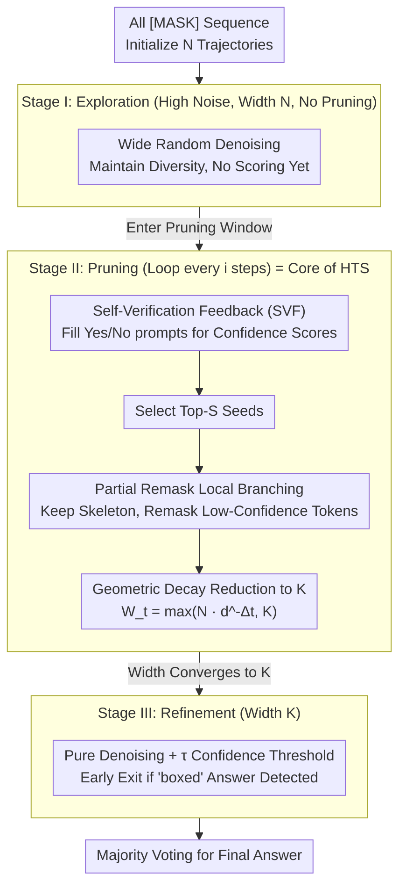

# Prism: Efficient Test-Time Scaling via Hierarchical Search and Self-Verification for Discrete Diffusion Language Models

**Conference**: ICML 2026  
**arXiv**: [2602.01842](https://arxiv.org/abs/2602.01842)  
**Code**: https://github.com/viiika/Prism  
**Area**: LLM Inference / Test-time scaling / Discrete Diffusion Language Models  
**Keywords**: dLLM, test-time scaling, hierarchical trajectory search, self-verification, partial remask

## TL;DR
The authors decompose the problem of "efficient test-time scaling for discrete diffusion language models (dLLMs)" into three components: Hierarchical Trajectory Search (HTS) to allocate computation via an "exploration → progressive pruning → refinement" schedule, local branching via partial remasking to preserve high-confidence "logic skeletons," and using the dLLM itself as a Yes/No validator (SVF). Ultimately, Prism achieves comparable or superior accuracy to best-of-$N$ with significantly fewer Number of Function Evaluations (NFE) across four math and code benchmarks on three dLLMs.

## Background & Motivation

**Background**: Test-time scaling (TTS) has become a mainstream tool for enhancing LLM reasoning capabilities. Chain-of-thought, self-consistency, best-of-$N$, and PRM-guided search are almost exclusively built on autoregressive (AR) decoding, which unfolds a search tree from left to right, making it difficult to backtrack once a prefix is fixed. Recently emerged discrete diffusion language models (dLLMs), such as LLaDA 8B, Dream 7B, and LLaDA 2.0-mini, operate differently: they start from an all-[MASK] sequence and perform parallel denoising with bidirectional context visibility at each step, which appears more suitable for planning and self-correction.

**Limitations of Prior Work**: Directly applying AR-era TTS to dLLMs faces two specific issues: (1) dLLM decoding steps are typically locked to the sequence length (one step per token), leaving little room for "length scaling" unlike image diffusion (10–50 steps); this leaves only "width scaling" (running multiple trajectories). (2) Naive best-of-$N$ requires $O(NT)$ NFEs for $N$ trajectories and $T$ denoising steps. Adding an external PRM/ORM verifier further consumes significant GPU memory and computation. While schedule integration like HEX is useful, it still requires running all trajectories to completion.

**Key Challenge**: The dynamics of dLLM parallel denoising—where "early-stage entropy is high and late-stage logic skeletons form"—differ completely from AR models. Allocating computing power uniformly across all trajectories and time steps is equivalent to paying "full price" for unformed drafts in the high-entropy phase and wasting GPU resources on stabilized trajectories later on. Furthermore, AR-trained PRMs are optimized for well-formed prefixes and are not calibrated for dLLM intermediate states where most tokens are still [MASK].

**Goal**: To decompose the problem into: (i) *non-uniform* allocation of trajectories across $T$ denoising steps; (ii) increasing *local* diversity without re-sampling from scratch or discarding formed structures; (iii) providing a reliable scoring signal for partially masked states without an external PRM.

**Key Insight**: The authors observe that dLLM entropy is highest in the early-to-mid stages and collapses into a logic skeleton later. Best-of-$N$ delays scoring until the end, which is highly wasteful. It is more efficient to perform coarse pruning in the mid-stage using the dLLM’s own Yes/No prompting (reusing one forward pass + one token cost).

**Core Idea**: Use "Hierarchical Trajectory Search (HTS) + partial remask local branching + Self-Verification Feedback (SVF)" to compress dLLM TTS complexity from $O(NT)$ to near-linear $O(N+KT)$, where $K\ll N$ is the final refinement width.

## Method

### Overall Architecture
Prism segments a dLLM denoising trajectory into a three-stage pipeline: "wide exploration, aggressive pruning, and final refinement" (the HTS schedule). Denoising proceeds from $t=T$ (all [MASK]) to $t=1$. Stage I uses a large width $N$ for random exploration to ensure diversity. Stage II uses a "pruning window" to reduce active trajectories to $K$ at a geometric rate. Stage III performs pure denoising on these $K$ trajectories followed by majority voting. The window is defined by hyperparameters $W=[w_{\min},w_{\max}]$, corresponding to thresholds $T_p=\lceil w_{\max} T\rceil$ and $T_r=\lceil w_{\min} T\rceil$. Stage II involves two operations: scoring via SVF and local branching via partial remasking.

### Key Designs

**1. Hierarchical Trajectory Search (HTS): Concentrating Compute on the Mid-term Logic Skeleton Window**

Best-of-$N$ runs all trajectories for $T$ steps, resulting in $O(NT)$ complexity. However, dLLM entropy decreases monotonically with $t$: early $\hat{\mathbf{z}}_0$ are divergent, mid-stage logic begins to form, and late stages are highly converged. HTS adjusts the active width across three stages: Stage I (high noise) maintains $N$ trajectories for exploration without pruning (as $\hat{\mathbf{z}}_0$ is unstable for scoring). Stage II (pruning window) performs "SVF scoring → keep top-$S$ seeds → generate $b_t=\lceil W_{t-1}/S\rceil$ children per seed" every $i$ steps. The active pool shrinks via geometric decay $W_t=\max(\lfloor N\cdot d^{-(T_p-t)}\rfloor,\,K)$. Stage III refines the remaining $K$ trajectories with early-exit acceleration. Total computation:

$$C_{\mathrm{HTS}}=N(T-T_p)+\sum_{t=T_r+1}^{T_p}|\mathcal{P}_t|+KT_r\approx O(N+KT),$$

This transitions best-of-$N$ from multiplicative $O(NT)$ to additive complexity. As long as $K\ll N$, NFE stays nearly constant as $N$ increases.

**2. Local Branching via Partial Remasking: Refining Details on Formed Skeletons**

Stage II keeps only top-$S$ seeds. Directly duplicating them leads to identical children that collapse to local optima. Conversely, re-sampling from $[m]^L$ as in best-of-$N$ discards the logic structure and wastes compute. Local branching offers a compromise: for a survivor state $\mathbf{z}_t$, a draft $\hat{\mathbf{z}}_0=\mathcal{C}_\theta(\mathbf{z}_t,c,t)$ is estimated. Tokens with high confidence (e.g., low entropy) are kept as the "logic skeleton," while a low-confidence subset $\mathcal{I}_t\subseteq\{1,\dots,L\}$ is re-masked using $\mathbf{z}_t^{\exp}=\mathrm{Remask}(\mathbf{z}_t;\mathcal{I}_t)$. Sampling different $\mathcal{I}_t$ for each child creates diversity within the same "mode," leveraging the unique bidirectional capability of dLLMs.

**3. Self-Verification Feedback (SVF): Using dLLM as an Internal Yes/No Verifier**

Traditional PRMs/ORMs are trained on clean prefixes and are uncalibrated for dLLM masked states. SVF uses the dLLM itself: for each trajectory $\mathbf{z}_t^{(i)}$, it takes the argmax full draft $\hat{\mathbf{z}}_0^{(i)}$, inserts it into a Yes/No verification prompt $\pi(c,\hat{\mathbf{z}}_0^{(i)})$, and extracts the maximum logits $s_{\text{Yes}},s_{\text{No}}$ for the corresponding tokens. The score is defined as:

$$\Phi_{\mathrm{SVF}}(\mathbf{z}_t^{(i)};c)=\frac{\exp(s_{\text{Yes}})}{\exp(s_{\text{Yes}})+\exp(s_{\text{No}})}.$$

Since the evaluated object is always the completed draft $\hat{\mathbf{z}}_0$, the score is insensitive to the mask level. This reuses pre-trained knowledge, saves memory, and is significantly cheaper than a denoising step.

## Key Experimental Results

### Main Results
Comparison with best-of-$N$ ($N\in\{4,8,16\}$) across 4 benchmarks and 3 dLLMs. Prism fixed $N=16$ and $S=K/2$. Representative data for LLaDA 8B Instruct:

| Setting | GSM8K Acc / NFE | MATH500 / NFE | HumanEval / NFE | MBPP / NFE |
|------|----------------|---------------|------------------|------------|
| $N=1$ Baseline | $67.58$ / $256$ | $26.40$ / $256$ | $54.88$ / $512$ | $21.80$ / $512$ |
| best-of-$16$ | $87.50$ / $4096$ | $38.00$ / $4096$ | $82.32$ / $8192$ | $35.20$ / $8192$ |
| Prism $K=2$ | $74.24$ / $283$ | $30.16$ / $334$ | $71.34$ / $549$ | $29.40$ / $561$ |
| Prism $K=4$ | $75.30$ / $509$ | $37.70$ / $622$ | $76.19$ / $1133$ | $32.40$ / $1196$ |
| Prism $K=8$ | $85.30$ / $1048$ | $42.80$ / $1304$ | $79.27$ / $2480$ | $38.20$ / $2576$ |

Prism $K=4$ on MATH500 achieves $37.70$ with ~622 NFE, close to best-of-16 ($38.00$) using only $\sim 1/7$ of the compute. On MBPP, Prism $K=8$ ($38.20$) even outperforms best-of-16 ($35.20$).

### Ablation Study

| Configuration | Key Observations |
|------|---------|
| Full Prism | Best performance across all metrics. |
| w/o HTS (best-of-$N$) | NFE increases $N\times$ with wasted computation. |
| w/o SVF (external PRM) | High memory usage; poor calibration for masks. |
| w/o Local Branching | Explored early stages redundantly; loss of logic. |

### Key Findings
- Concentrating compute on the mid-stage is a crucial insight for dLLMs compared to AR models.
- SVF overhead is marginal compared to NFE (prefill + 1 token decode).
- Geometric decay ($d>1$) is effective for pruning when paired with local branching to maintain diversity.

## Highlights & Insights
- **Self-scoring Efficiency**: dLLMs naturally perform parallel token prediction; reusing the forward pass for verification is more efficient than external 7B PRMs.
- **Bi-directional Advantage**: Local branching "swapping details within the same mode" is a unique advantage of dLLMs that AR models cannot easily replicate.
- **$O(N+KT)$ Complexity**: Converting the multiplicative relationship of best-of-$N$ to an additive one allows for massive exploration ($N$) at minimal cost.

## Limitations & Future Work
- **Hyperparameter Sensitivity**: The framework introduces several parameters ($N, K, d, i$, etc.) that may require tuning for different tasks.
- **Hallucination Consistency**: If the model systematically hallucinates, SVF may provide false positive scores.
- **Task Scope**: Primarily validated on tasks with verifiable answers (Math/Code); open-ended generation remains untested.

## Related Work & Insights
- **vs Best-of-$N$**: Prism reduces best-of-$N$ complexity from $O(NT)$ to $O(N+KT)$, saving $4\text{--}8\times$ NFE at similar accuracy levels.
- **vs PG-DLM (SMC for dLLM)**: Whereas PG-DLM uses SMC-style importance resampling, Prism uses heuristic pruning and partial remask mutation, which is more engineered for reasoning tasks.

## Rating
- Novelty: ⭐⭐⭐⭐
- Experimental Thoroughness: ⭐⭐⭐⭐
- Writing Quality: ⭐⭐⭐⭐
- Value: ⭐⭐⭐⭐⭐ (Highly practical for inference serving without retraining).

<!-- RELATED:START -->

## Related Papers

- [\[ICML 2026\] Lookahead Sample Reward Guidance for Test-Time Scaling of Diffusion Models](lookahead_sample_reward_guidance_for_test-time_scaling_of_diffusion_models.md)
- [\[ICLR 2026\] Efficient Test-Time Scaling for Small Vision-Language Models](../../ICLR2026/llm_reasoning/efficient_test-time_scaling_for_small_vision-language_models.md)
- [\[ICML 2026\] Stabilizing Recurrent Dynamics for Test-Time Scalable Latent Reasoning in Looped Language Models](stabilizing_recurrent_dynamics_for_test-time_scalable_latent_reasoning_in_looped.md)
- [\[ICML 2026\] Less Diverse, Less Safe: The Indirect But Pervasive Risk of Test-Time Scaling in Large Language Models](less_diverse_less_safe_the_indirect_but_pervasive_risk_of_test-time_scaling_in_l.md)
- [\[NeurIPS 2025\] Rethinking Optimal Verification Granularity for Compute-Efficient Test-Time Scaling](../../NeurIPS2025/llm_reasoning/rethinking_optimal_verification_granularity_for_compute-efficient_test-time_scal.md)

<!-- RELATED:END -->
