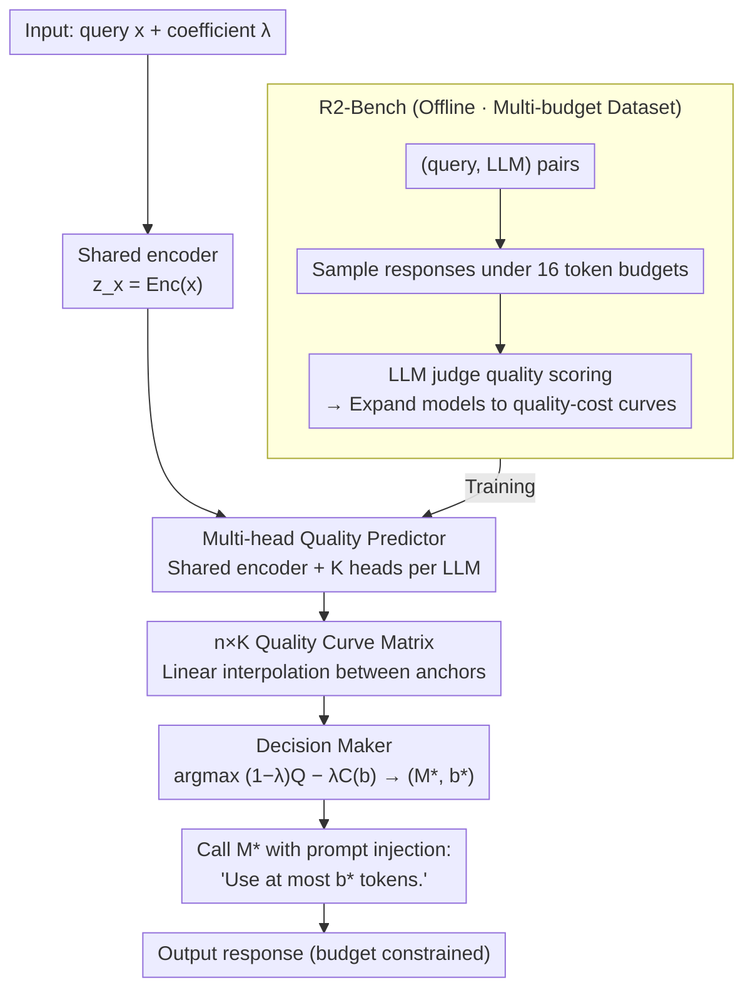

# R2-Router: A New Paradigm for LLM Routing with Reasoning

**Conference**: ICML 2026  
**arXiv**: [2602.02823](https://arxiv.org/abs/2602.02823)  
**Code**: https://github.com/UCF-ML-Research/R2-Router (Yes)  
**Area**: LLM Reasoning / LLM Routing / Inference-time Computing  
**Keywords**: LLM Routing, Output Length Budget, Quality-Cost Curve, Reasoning Routing, Length-Constraint Prompting

## TL;DR
This paper proposes R2-Router, which transforms "output token budget" from a passive estimate into a controllable variable. By enabling the router to search in the joint (LLM, budget) space and using a lightweight multi-head quality predictor to extend each LLM from a static point into a quality-cost curve, it achieves comparable quality to existing routers at 4–5× lower cost.

## Background & Motivation
**Background**: With the explosion in the number of LLMs, deciding "which model to use for a given query" has become a system-level problem. The mainstream approach is LLM Routing: using a small model to predict the quality $Q$ and cost $C$ of each candidate LLM for a given query, and selecting the one with the highest score $S=(1-\lambda)Q-\lambda C$. Representative works include FrugalGPT / AutoMix (cascading), and CARROT, MIRT, UniRouter (predictive).

**Limitations of Prior Work**: All existing routers treat each LLM as a static "quality-cost point." If a strong model's (e.g., Qwen3-235B) predicted cost exceeds the budget, the router excludes it directly, missing the opportunity to obtain high-quality responses with shorter outputs. The essence of the problem is that **the quality of the same LLM varies with output length**, but this curve does not exist in existing routing frameworks.

**Key Challenge**: The router's search space is locked within $\mathcal{S}_{reactive}=\{(M_i,\hat{c}_i)\}$, whereas the true optimal solution likely falls within a larger Cartesian product space $\mathcal{S}_{reasoning}=\{(M_i,b_j)\mid M_i\in\mathcal{M},b_j\in\mathcal{B}\}$. The former is a proper subset of the latter, but passive routing lacks the capability to explore the latter.

**Goal**: (i) Redefine the routing problem by treating output length budget $b$ as a decision variable on par with LLM selection; (ii) provide a lightweight, data-efficient predictor implementation; (iii) construct a dataset that reveals the quality-cost curve to make this mechanism trainable and evaluatable.

**Key Insight**: The authors draw on empirical findings from recent efficient reasoning research: LLM response quality grows with output length but saturates quickly, and output length can be stably controlled via length-constraint prompts such as "use at most $k$ tokens" (validated in Appendix A). This implies $b$ is a truly controllable knob.

**Core Idea**: Upgrade routing from "routing on points" to "routing on curves"—predicting the quality curve of each LLM across multiple budgets, selecting the combination that maximizes $S$ in the joint (LLM, budget) space, and passing the budget constraint to the selected LLM via prompts.

## Method

### Overall Architecture
R2-Router addresses the issue where passive routing vetoes strong models based on static cost estimation by promoting the output length budget $b$ to a decision variable equal in status to the LLM choice. It consists of offline and online stages: Offline, R2-Bench is constructed by sampling responses for each (query, LLM) pair under 16 different token budgets and using an LLM judge for quality scoring, effectively unfolding each model into a quality-cost curve. This multi-budget data is used to train the predictor. Online, given a query $x$ and trade-off coefficient $\lambda$, a shared encoder first encodes $z_x=\text{Enc}(x)$. A family of multi-head MLPs for each LLM predicts quality for all (LLM, budget) combinations simultaneously to form an $n\times K$ curve matrix. The Decision Maker selects the optimal combination based on the reformulated objective $(M^*,b^*)=\arg\max\bigl((1-\lambda)Q-\lambda C(b)\bigr)$. Finally, $M^*$ is called with "Use at most $b^*$ tokens." injected into the prompt to enforce the output length constraint.

### Key Designs

**1. Problem Reformulation of Output Length as a Decision Variable: Enabling Strong Models under Appropriate Budgets**

Existing routers fix each LLM as a static quality-cost point and exclude them if predicted costs exceed budgets. However, model quality inherently varies with output length. R2-Router reformulates the objective from the traditional $\arg\max_{M_i}\,(1-\lambda)\hat{Q}_i-\lambda\hat{C}_i$ to $(M^*,b^*)=\arg\max_{M\in\mathcal{M},\,b\in\mathcal{B}}\bigl((1-\lambda)Q(x,M,b)-\lambda C(b)\bigr)$, where $C(b)$ is an analytical function of unit price multiplied by budget $b$. The key is that cost is no longer a "predicted scalar" but a "controllable quantity." Using length-constraint prompts ("use at most $k$ tokens"), $b$ is effectively implemented, making both predicted $\hat{Q}(x,M,b)$ and actual cost $C(b)$ deterministically controllable. Theorem 4.3 shows that because the reactive search space $\mathcal{S}_{reactive}$ is a subset of the reasoning space $\mathcal{S}_{reasoning}$, the maximum utility of reasoning-based routing is never inferior to reactive routing. By converting $b$ from a passive estimate to a knob, strong models are no longer vetoed for being "too expensive."

**2. Multi-head Quality Predictor + Sparse Anchors + Linear Interpolation: Approximating Curves with Few Training Points**

To search the joint (LLM, budget) space, the quality curve must be predicted. To avoid data explosion from training heads for every continuous budget, R2-Router uses a shared encoder for general query semantics and $K$ independent heads per LLM $M_i$ for specific budget behaviors. The $k$-th head $g_{i,k}$ is a three-layer MLP (hidden layers [256, 128, 64] + ReLU + Sigmoid) outputting $\hat{Q}(x,M_i,b_k)=\sigma(g_{i,k}(z_x))$, optimized independently using MSE loss $\mathcal{L}_{i,k}=\mathrm{MSE}(\hat{Q}(x,M_i,b_k),Q^{\text{true}}(x,M_i,b_k))$ at anchor budgets. Any budget between anchors is approximated via piecewise linear interpolation: $\hat{Q}(x,M,b')=(1-\alpha)\hat{Q}(x,M,b_k)+\alpha\hat{Q}(x,M,b_{k+1})$, where $\alpha=(b'-b_k)/(b_{k+1}-b_k)$. This "sparse anchors + interpolation" strategy balances data efficiency and search granularity; empirically, $K=6{\sim}8$ anchors are sufficient, and even $K=4$ outperforms point-based baselines. Training for 15 LLMs takes 30 minutes on a single RTX 3090, with routing overhead <400 ms.

**3. R2-Bench: A Multi-budget Dataset for Observing "Curves"**

Effective trainers and evaluators require data that reveals these curves. Existing benchmarks like RouterBench or RouterEval sample only one response per (query, LLM). R2-Bench systematically varies output budgets to fill this gap: it aggregates 30,968 queries across 6 public benchmarks (GPQA, MuSR, MMLU-Pro, MATH, OpenHermes, RAGBench) for 15 LLMs under 16 budgets. Each triplet (query, LLM, budget) records quality scores and actual token consumption. Quality scores are provided by an LLM-as-a-judge following the Zheng et al. 2023 protocol. After evaluating 4 candidate judges with 30 annotators across 500 samples, Qwen3-80B-Instruct was selected as the final judge due to its Pearson correlation ($\rho=0.82$). R2-Bench exposes a larger optimization space (Oracle AUDC improved from 0.85 to 0.98), and R2-Router provides the mechanism to search it.

### Loss & Training
MSE regression is performed independently for each (LLM $i$, budget anchor $k$): $\theta_{i,k}^*=\arg\min_{\theta_{i,k}}\mathcal{L}_{i,k}$. The Adam optimizer is used with a learning rate of $1\times 10^{-4}$ for 100 epochs. The query encoder uses Qwen3-Embedding-0.6B to encode queries into 1024-dimensional vectors. All heads share the encoder output but maintain independent parameters, facilitating incremental updates for new LLMs.

## Key Experimental Results

### Main Results

| Dataset / Setting | Metric | R2-Router | Prev. SOTA | Gain |
|--------|------|------|----------|------|
| R2-Bench (Main) | Cost to reach quality≈0.8 | $0.5\times 10^{-3}$ | $2{\sim}2.5\times 10^{-3}$ (MIRT / CARROT) | 4–5× cheaper |
| MMLU-Pro OOD (Non-STEM) | AUDC ↑ | 0.71 | 0.67 (CARROT-L) | +0.04 |
| MMLU-Pro OOD | QNC ↓ | 0.26 | 0.56 (CARROT-L) | −54% |
| Uni-R2Router vs UniRouter (5 new LLMs) | AUDC ↑ | 0.623 | 0.590 | +5.6% |
| Uni-R2Router vs UniRouter | QNC ↓ | — | — | −80% |
| RouterArena Leaderboard | Rank | 1st (at submission) | — | — |

### Ablation Study

| Configuration | AUDC ↑ | QNC ↓ | Peak Acc ↑ | Note |
|------|--------|-------|------------|------|
| Default (Qwen3-Embed + MLP head + Qwen3 judge) | ≈0.80 | ≈0.12 | ≈0.83 | Full model |
| Replace MiniLM-L6-v2 embedding | 0.76 | 0.32 | 0.79 | Small encoder still beats point baselines |
| Replace with LGBM as predictor head | 0.80 | 0.29 | 0.81 | Architecture agnostic; gain from curve search |
| Replace with DeepSeek-V3.1 as judge | 0.80 | 0.35 | 0.90 | Stable lead regardless of judge model |
| Anchor count $K=4$ | — | ≈0.20 | — | Still exceeds MIRT (0.43) / CARROT-L (0.32) |
| Anchor count $K=6{\sim}8$ | — | ≈0.12 | — | Approaches optimal |
| Adding "Be concise" prompt to reactive baseline | < R2-Router | — | — | Prompt changes output but not routing logic |

### Key Findings
- **Leverage lies on the router side, not the LLM side**: Simply adding "Be concise" to baselines does not work—reactive routers still exclude strong models based on static cost estimates. "Curve perspective" must be introduced at the decision layer.
- **Sparse anchors are sufficient**: $K=6{\sim}8$ anchors with linear interpolation approximate continuous curve optimality well, proving the quality-cost curve is relatively smooth in the query embedding space.
- **Orthogonal and additive**: Integrating with UniRouter (Uni-R2Router) showed a 5% AUDC increase and 80% QNC decrease for 5 unseen LLMs, demonstrating "curving" as a general enhancement for various routing frameworks.
- **Dataset Oracle upper bound increased by 15%**: R2-Bench pushed Oracle AUDC from 0.85 to 0.98, indicating that existing benchmarks were measuring an artificially compressed problem space.

## Highlights & Insights
- **Problem reformulation from "passive estimation" to "active control"**: R2-Router recognizes that since the budget is just a prompt instruction, it should be a decision variable. This "control instead of predict" mindset is transferable to other system + ML scenarios.
- **Theorem 4.3 provides a clean theoretical guarantee**: The fact that $\mathcal{S}_{reactive}\subseteq\mathcal{S}_{reasoning}$ makes the superiority of R2-Router an algebraic fact rather than just an empirical observation.
- **Compelling "Routing as Reasoning" nomenclature**: Comparisons to thinking depth in models like Gemini resonate well, while clearly distinguishing it as router deliberation in the (LLM, budget) space.
- **Reusable trick: Multi-head shared encoder**: Using a shared encoder with small MLP heads to model behaviors under different conditions is a general pattern applicable to multi-temperature or multi-objective tasks.

## Limitations & Future Work
- **Dependency on instruction following**: The methodology relies on "use at most $k$ tokens" being strictly followed. For weak instruction-following models, this assumption may fail.
- **Judge bias**: Quality supervision relies on Qwen3-80B-Instruct scoring ~7.4M samples. Despite robustness checks with DeepSeek-V3.1, judge-specific biases in certain subdomains may exist.
- **Granularity of budgets**: Linear interpolation may overestimate quality if cost-quality curves exhibit non-linear "steps" (e.g., when a model requires a minimum token count to "think"). Monotonic neural networks or spline predictors could be improvements.
- **Exclusion of latency and concurrency**: Costs are calculated based on token fees. In production, latency and throughput are critical; incorporating latency into $C(\cdot)$ is a necessary extension.

## Related Work & Insights
- **vs CARROT / MIRT / NIRT**: These predict $\hat{Q}_i$ and $\hat{T}_i$ at fixed points. R2-Router converts cost into a controllable variable, strictly expanding the search space.
- **vs UniRouter**: UniRouter handles dynamic LLM pools using error vectors. R2-Router is orthogonal; Uni-R2Router extends error vectors across multiple costs to create curve representations.
- **vs Route-To-Reason / BEST-Route**: Route-To-Reason routes to strategy pairs without explicit cost control. R2-Router reduces costs monotonically through prompts without increasing call sequences.
- **vs Semantic Router / Think When Needed**: These select internal inference modes. R2-Router selects (model, budget) pairs across multiple LLMs, offering a larger search space.
- **vs FrugalGPT / AutoMix**: Cascading models have high latency. R2-Router uses a single-pass predictive decision (<400ms).

## Rating
- Novelty: ⭐⭐⭐⭐⭐ Redefining output length as a controllable decision variable is a paradigm shift for LLM routing.
- Experimental Thoroughness: ⭐⭐⭐⭐⭐ Extensive coverage across 15 LLMs, 16 budgets, and 30k queries, supported by OOD and dynamic pool tests.
- Writing Quality: ⭐⭐⭐⭐⭐ Clear visual comparisons and solid algebraic proofs make the narrative easy to follow.
- Value: ⭐⭐⭐⭐⭐ Significant cost reduction with minimal training overhead; directly applicable to commercial routing platforms.

<!-- RELATED:START -->

## Related Papers

- [\[AAAI 2026\] A Reasoning Paradigm for Named Entity Recognition](../../AAAI2026/llm_reasoning/a_reasoning_paradigm_for_named_entity_recognition.md)
- [\[AAAI 2026\] Intention Chain-of-Thought Prompting with Dynamic Routing for Code Generation](../../AAAI2026/llm_reasoning/intention_chain-of-thought_prompting_with_dynamic_routing_for_code_generation.md)
- [\[ICML 2026\] TRACE: 用 Toulmin 论证模型评 LLM CoT 推理过程质量](trace_toulmin-based_reasoning_assessment_through_constructive_elements_for_llm_c.md)
- [\[ICML 2026\] Beyond Two-Stage Training: Cooperative SFT and RL for LLM Reasoning](beyond_two-stage_training_cooperative_sft_and_rl_for_llm_reasoning.md)
- [\[ICML 2026\] Beyond Test-Time Memory: State-Space Optimal Control for LLM Reasoning](beyond_test-time_memory_state-space_optimal_control_for_llm_reasoning.md)

<!-- RELATED:END -->
