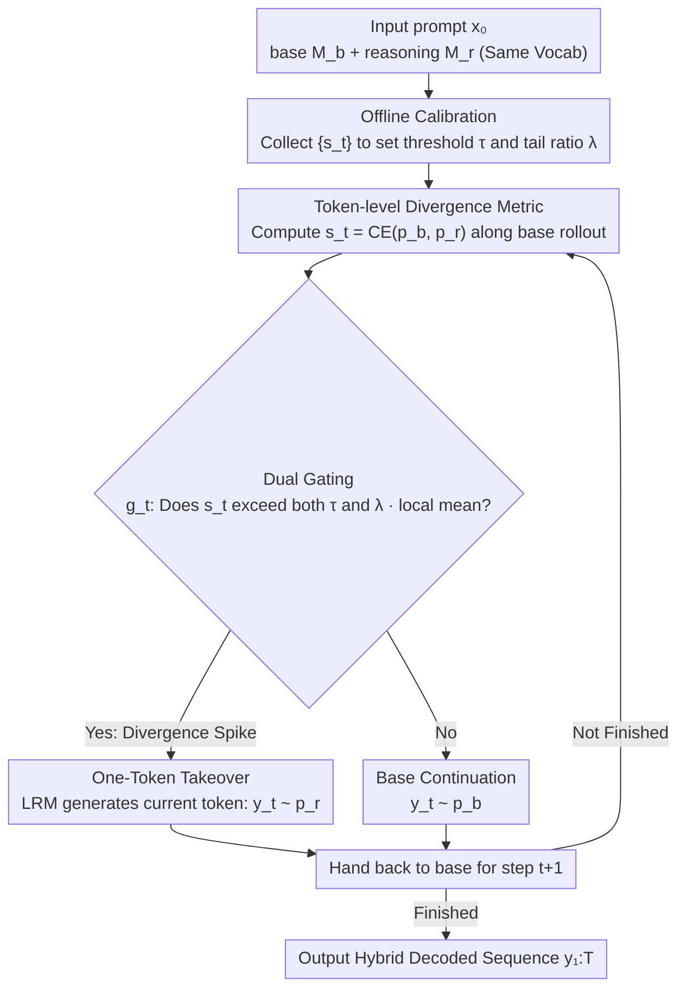

# Reasoning Can Be Restored by Correcting a Few Decision Tokens

**Conference**: ICML 2026  
**arXiv**: [2605.16874](https://arxiv.org/abs/2605.16874)  
**Code**: https://github.com/AlphaLab-USTC/RRTokenIntervention  
**Area**: LLM Reasoning  
**Keywords**: Reasoning Gap, Token-level Intervention, Sparse Control, Planning Tokens, Inference-time Collaborative Decoding

## TL;DR
The authors quantify the gap between base LLMs and reasoning LRMs using token-level distribution divergence. They find that the gap is highly concentrated in a small number of early, planning-related tokens where the base model is inherently uncertain (accounting for ~8% of tokens). Based on this, they propose "Divergence-Gated Single-Token Takeover"—letting the LRM generate only one token at divergence spikes before immediately handing control back to the base model. With an intervention budget of ~4-13%, this method recovers or even exceeds the performance of same-sized thinking models.

## Background & Motivation

**Background**: From OpenAI o1 and DeepSeek-R1 to Qwen3-Thinking, the dominant paradigm for enhancing reasoning capabilities is large-scale RLVR post-training, which allows LRMs to significantly outperform their base versions in mathematics and competitive programming. Simultaneously, a "potential-oriented" perspective (activation steering, self-rewarding, one-shot activation) suggests that base models already possess reasoning machinery, and post-training merely activates or amplifies it.

**Limitations of Prior Work**: Explanations from the training side are macro-level and fail to answer **generation-level** questions—precisely where in the generation sequence does the base model go wrong? Is it a uniform drift or a few critical decisions? Without a token-level causal "ledger," hypotheses about why "reasoning mode works" remain speculative.

**Key Challenge**: One must either admit that reasoning capability is scattered across every step of a long chain, requiring full takeover (expensive), or believe that key decisions are sparse but lack actionable signals to locate them. The former contradicts experimental observations that "small parameter subspaces are sufficient to trigger reasoning," while the latter has lacked explicit token-level metrics.

**Goal**: (1) Define and measure the token-level behavioral gap between base LLMs and LRMs; (2) Characterize the quantity, position, and semantic nature of these "gap tokens"; (3) Verify the hypothesis that "correcting a few critical tokens can restore reasoning."

**Key Insight**: By using a base model $\mathcal{M}_b$ and a strong reasoning model $\mathcal{M}_r$ with the same vocabulary, one can compute the likelihood divergence $s_t = \mathcal{D}_f(p_b(\cdot|x_t), p_r(\cdot|x_t))$ (defaulting to cross-entropy) along the base model's rollout. This metric does not require training and exposes, token-by-token, where the two models diverge.

**Core Idea**: The reasoning gap is **sparse, early, planning-related, and aligned with base uncertainty**. Therefore, a globally calibrated divergence threshold can serve as a gate. At divergence spikes, the LRM takes over for exactly one token before passing control back to the base model, leveraging a minimal budget to pivot the entire trajectory.

## Method

### Overall Architecture
The work centers on a single question: at which steps does the base LLM deviate during reasoning chain generation? The method consists of two sequential phases. First is **Diagnosis**: calculating a divergence score $s_t$ between the base $\mathcal{M}_b$ and reasoning $\mathcal{M}_r$ along the base model's rollout, then analyzing its sparsity, position, semantics, and predictive power for errors. Second is **Intervention**: converting the "divergence spikes" found in the diagnosis into an inference-time gate $g_t$. At each step, this gate decides whether the base model continues or the LRM provides a single token. The input is a prompt $x_0$, and the output is a hybrid decoded sequence $y_{1:T}$. Model parameters and hidden states remain unchanged; only the token selection authority at specific positions is modified.

### Key Designs

**1. Token-level Divergence Metric: Mapping the "Reasoning Gap" to Every Step**

Training-side explanations (RLVR, CoT, backtracking) are too macro-level to specify where the base model deviates. The authors calculate a likelihood divergence $s_t = -\sum_{y} p_b(y|x_t)\log p_r(y|x_t)$ at each step $t$ along the base rollout. While cross-entropy is the default, the authors also discuss reverse KL, which satisfies $D_{\text{rKL}}=\mathcal{D}_{\text{CE}}-H_b$. This metric requires no training and directly exposes where the models part ways.

Empirical results reveal four properties that support "sparse control": (i) High concentration—the Lorenz curve is far from the diagonal with a Gini coefficient $G \approx 0.936$, meaning the gap is compressed into ~1-8% of tokens; (ii) Early bias—top-1% divergence tokens are heavily left-skewed across normalized positions $u=t/T$, with density peaking at $u \approx 0.05$; (iii) Alignment with uncertainty—these tokens have high IoU overlap with the top-p% Shannon entropy $H_b(t)$ of the base model, and the proportion of planning words increases from 1.89% (global) to 14.13% (divergence), an enrichment of $\sim$7.5–8.3$\times$; (iv) Predictive power—the mean of top-100 divergence scores predicts final failures (GSM8K AUROC 0.851, outperforming the entropy baseline of 0.817). In short, the gap is sparse and located at early planning points.

**2. Globally Calibrated Dual Gating: Converting Spikes into Controllable Switches**

Knowing that divergence is concentrated is insufficient; a real-time rule for decoding is needed. The authors collect divergence scores $\mathcal{S}=\{s_t\}$ on a calibration set, setting a global threshold $\tau = Q_{1-r}(\mathcal{S})$ at the $(1-r)$ quantile. They also calculate the tail-to-global mean ratio $\lambda = \mathbb{E}[s|s>\tau]/\mathbb{E}[s]$. At runtime, the gate is a conjunction of two conditions: $g_t = \mathbb{I}[s_t>\tau \land s_t>\lambda\cdot\bar{s}_{t,W}]$, where $\bar{s}_{t,W}=\frac{1}{W}\sum_{i=1}^W s_{t-i}$ is the local mean within a sliding window.

The dual condition prevents budget drift across different prompts and suppresses continuous false triggering in high-divergence regions, discretizing takeovers into distinct "spikes." The authors verify that calibrated $\tau$ values remain consistent across benchmarks.

**3. Sparse Delegated Decoding with One-Token Takeover: Modifying Points, Not Trajectories**

The decoding rule is simple: $y_t \sim p_r(\cdot|x_t)$ if $g_t=1$, else $y_t \sim p_b(\cdot|x_t)$. Each takeover generates only the next token before immediately returning control to the base model. This maintains a stable takeover rate $\rho = \frac{1}{T}\sum_t g_t$ with low variance across problems. A cheaper "degraded version" using only $H_b(t)$ as a trigger is also provided, which avoids online queries to $p_r$ while still recovering most of the Pass@8 performance.

Limiting the takeover to "one token" ensures the causal mechanism is minimal: the authors argue that a few planning tokens redirect the subsequent trajectory. This explains why guided intervention with $\sim$4% budget outperforms 25% random or early injection—**the key is which token is changed, not how many.**

### Loss & Training
This is strictly an inference-time intervention; **no parameters are updated**. The only "training" is calibration: running base rollouts on a small batch of prompts to collect $\{s_t\}$ and determine $\tau$ and $\lambda$. Hyperparameters include sliding window length $W$ and spike ratio $r$.

## Key Experimental Results

### Main Results
Evaluation Setup: Base $p_b$ = Qwen3-0.6B/1.7B-Base, guide $p_r$ = Qwen3-8B (Thinking), six math benchmarks. Recovery is defined as $(P_{\text{Guided}}-P_{\text{Base}})/(P_{\text{Thinking}}-P_{\text{Base}})$.

| Model | Setup | Avg Acc / Pass@8 | Recovery |
|-------|-------|-------------------|----------|
| Qwen3-0.6B-Base | — | 13.0 / 36.0 | — |
| Qwen3-0.6B-Base | +Guided $\bar{\rho}\!\approx\!0.04$ | 29.1 / 61.4 | 91% |
| Qwen3-0.6B-Base | +Guided $\bar{\rho}\!\approx\!0.13$ | 52.4 / 80.0 | **157%** |
| Qwen3-0.6B (Thinking) | — | 43.4 / 64.1 | 100% baseline |
| Qwen3-1.7B-Base | +Guided $\bar{\rho}\!\approx\!0.16$ | 62.1 / 83.8 | 112% |
| Qwen3-1.7B (Thinking) | — | 64.1 / 80.3 | — |
| Qwen3-8B (Thinking) | — | 78.1 / 87.3 | Upper bound |

With only 13% takeover budget, 0.6B-Base + Guided **surpasses** the same-sized thinking model (Pass@8 80.0 vs 64.1). A recovery of 157% suggests a collaborative effect between the base and teacher models in hybrid decoding. AIME24 jumped from 0.4/3.3 to 32.5/70.0.

### Ablation Study

| Config | Budget $\rho$ | Avg Acc | Avg Pass@8 | Note |
|--------|------------|---------|-----------|------|
| Base | 0.00 | 13.0 | 36.0 | Baseline |
| +Random | 0.25 | 26.4 | 55.2 | 6× Budget |
| +Early-only | 0.25 | 25.7 | 58.4 | 6× Budget |
| +Guided (Ours) | **0.04** | **29.1** | **61.4** | 1× Budget |

| Category | Global | Takeover Set | Enrichment |
|----------|--------|------------|------------|
| Planning | 1.9% | **33.3%** | **17.6×** |
| Execution | 98.1% | 66.7% | 0.7× |

Sample-level flips: Out of 400 questions, 152 flipped from wrong to right, while only 3 flipped from right to wrong.

### Key Findings
- **Position > Injection**: Guided intervention with 1× budget outperforms random/early baselines with 6× budget. Correcting the **right token** is critical; simply being "early" is insufficient if it doesn't hit a divergence spike.
- **Pass@8 vs. $\rho$ is a Non-linear "Knee Curve"**: The first few percentage points of takeover yield massive gains (41% to 61% at $\rho \approx 3\%$). Performance reaches the 0.6B-Thinking level at 7-8%, after which marginal returns diminish.
- **Planning Semantics**: Planning tokens are enriched 17.6× in the intervention set. Qualitative analysis shows the LRM often inserts "stop-and-check" disambiguation before handing control back for routine calculation.
- **Cross-family Generalization**: Using LLaMA-3.1-8B as the base and DeepSeek-R1-Distill-Llama-8B as the guide, ~20% takeover recovers 91% of the gap.

## Highlights & Insights
- **Translating RL Efficacy into Token-level Facts**: While previous explanations for the reasoning gap (CoT, low-rank subspaces) focused on training, this work uses CE divergence. It discovers that ~8% of early planning tokens account for ~94% of the gap (Gini 0.936).
- **Self-contained Diagnostic/Intervention Signal**: The top-K divergence serves as both a failure predictor (AUROC 0.851) and an intervention trigger, eliminating the need for an independent verifier.
- **Entropy-based Proxy for Deployment**: The discovery that "base model uncertainty" ($H_b$) carries significant positional information allows for a low-cost version of the method suitable for real-world deployment.
- **Budget < Performance Heuristics**: The "sparse delegation + single-token takeover" template is transferable to speculative decoding, agent routing, and on-policy distillation filtering.

## Limitations & Future Work
- The main experiments are limited to the Qwen3 series and math problems. While LLaMA and GPQA-Diamond provide transfer evidence, coding, multi-hop QA, and larger models have not been systematically tested.
- Runtime exige requiring both $p_b$ and $p_r$ can be expensive. The paper acknowledges this as a "diagnostic sparse control" study rather than a production-optimized system.
- Calibration depends on a hold-out set; the robustness of $\tau$ and $\lambda$ under significant distribution shifts remains to be explored.
- The 157% recovery suggests an ensemble effect between models that warrants further investigation.

## Related Work & Insights
- **vs. High-entropy policy update (Wang et al., 2025a)**: Both emphasize reasoning concentration in high-entropy tokens, but that work uses it for RL training constraints. This work focuses on inference-time intervention and shows cross-model divergence is a more precise signal than internal entropy.
- **vs. Speculative decoding / RouteLLM**: Speculative decoding typically uses a drafter for speed while maintaining teacher equivalence. This work uses the base as a drafter but allows the LRM to **change** the output at spikes to restore capability.
- **vs. RelayLLM (Huang et al., 2026)**: RelayLLM transfers difficult steps to a large model. This work uses finer token-level divergence rather than heuristic risk thresholds and takes over only a single token.

## Rating
- Novelty: ⭐⭐⭐⭐ Quantifying the "reasoning gap" via CE divergence along rollouts is a clear and insightful perspective.
- Experimental Thoroughness: ⭐⭐⭐⭐ Covering multiple benchmarks, base sizes, cross-family pairs, and semantic analysis provides a complete chain of evidence.
- Writing Quality: ⭐⭐⭐⭐ The narrative cleanly maps findings to design choices, supplemented by high-impact visualizations.
- Value: ⭐⭐⭐⭐ Provides rare token-level causal evidence for why reasoning modes work and suggests sparse intervention schemes for various LLM fields.

<!-- RELATED:START -->

## Related Papers

- [\[ACL 2025\] DeFine: Decision-Making with Analogical Reasoning over Factor Profiles](../../ACL2025/llm_reasoning/define_decision-making_with_analogical_reasoning_over_factor_profiles.md)
- [\[NeurIPS 2025\] KTAE: A Model-Free Algorithm to Key-Tokens Advantage Estimation in Mathematical Reasoning](../../NeurIPS2025/llm_reasoning/ktae_a_model-free_algorithm_to_key-tokens_advantage_estimation_in_mathematical_r.md)
- [\[NeurIPS 2025\] Beyond the 80/20 Rule: High-Entropy Minority Tokens Drive Effective Reinforcement Learning for LLM Reasoning](../../NeurIPS2025/llm_reasoning/beyond_the_8020_rule_highentropy_minority_tokens_drive_effec.md)
- [\[ACL 2026\] Can Reasoning Path still be Effective as Input? Bridging Post-Reasoning to Chain-of-Thought Compression](../../ACL2026/llm_reasoning/can_reasoning_path_still_be_effective_as_input_bridging_post-reasoning_to_chain-.md)
- [\[ACL 2026\] Is Chain-of-Thought Really Not Explainability? Chain-of-Thought Can Be Faithful without Hint Verbalization](../../ACL2026/llm_reasoning/is_chain-of-thought_really_not_explainability_chain-of-thought_can_be_faithful_w.md)

<!-- RELATED:END -->
