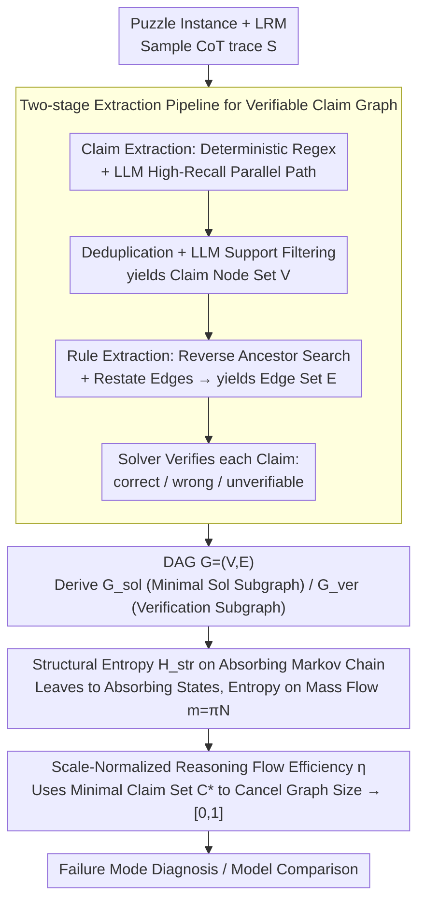

# Reasoning Structure of Large Language Models

**Conference**: ICML2026  
**arXiv**: [2606.03883](https://arxiv.org/abs/2606.03883)  
**Code**: https://github.com/ETH-DISCO/llm-reasoning-efficiency  
**Area**: LLM Reasoning  
**Keywords**: Reasoning Graph, Structural Entropy, Efficiency Metrics, Logic Puzzles, Process Evaluation

## TL;DR
This paper converts the free-text Chain-of-Thought (CoT) of Large Reasoning Models (LRMs) into a verifiable DAG of "atomic claims + deductive dependencies." By defining a reasoning flow efficiency metric $\eta$ based on the structural entropy of absorbing Markov chains, it demonstrates that even in regions where accuracy and token counts are saturated or overlapping, $\eta$ can still distinguish between "focused reasoning" and "divergent exploration," serving as a fine-grained tool for diagnosing LRM failure modes.

## Background & Motivation

**Background**: Current evaluations of LRMs focus almost exclusively on two one-dimensional figures: final answer accuracy and generated token count. A few works (Tree-of-Thoughts, Graph-of-Thoughts, RLVR) improve the "elicitation method" of reasoning rather than providing a measure for the reasoning process itself.

**Limitations of Prior Work**: Identical accuracy and token counts may hide completely different reasoning structures. One trace might be a nearly linear deduction, while another might involve extensive backtracking, repetitive verification, or even drifting along incorrect hypotheses for a long time before correction. These two behaviors have vastly different implications for RL training, failure mode diagnosis, and model selection, yet existing metrics obscure them.

**Key Challenge**: To perform "process-level" evaluation, there must be machine-verifiable intermediate states; however, free-text CoT is neither structured nor easily aligned with the environment. Existing reasoning-graph works (Xiong et al. 2025; Minegishi et al. 2025) either lack external verification for graph nodes or rely purely on hidden state inference, making it impossible to determine the correctness of individual claims.

**Goal**: (1) Provide a benchmark with controllable difficulty and executable verification; (2) Automatically reconstruct free-text traces into machine-verifiable DAGs; (3) Propose a "structural" efficiency metric that is independent of graph size and decoupled from accuracy.

**Key Insight**: The authors select 21 of Simon Tatham's 2D grid puzzles as the carrier—the rules are fully formalized, executable for verification, and difficulty can be scaled smoothly. At the same time, the reasoning process is modeled as "logical mass flow" on absorbing Markov chains, using entropy to measure "focus vs. divergence" inspired by structural information theory.

**Core Idea**: Use a DAG consisting of "atomic claim nodes + deductive edges" to represent reasoning. After normalization, the graph is mapped onto an absorbing Markov chain to calculate structural entropy $H_{\text{str}}$. Scale normalization is then applied using a minimal claim set $C^*$ to obtain an efficiency score $\eta \in [0, 1]$. This ensures the metric is decoupled from graph scale and token count, reflecting only the "concentration of logical flow relative to the minimal solution skeleton."

## Method

### Overall Architecture
This paper aims to transform the unstructured free-text CoT of LRMs into a reasoning graph where each sentence is machine-verifiable, and then derive a scalar indicating "logical flow focus." The input is a trace $S=(s_1,s_2,\dots)$ generated by the model on a puzzle instance. The pipeline follows four steps: first, sample the trace from the model in an executable puzzle environment; second, use a hybrid pipeline of "deterministic extraction + LLM extraction" to segment the trace into atomic claim nodes $V$; third, have an LLM identify the antecedent dependencies for each claim to generate the edge set $E$, and link restated claims back to their first occurrence; finally, use a puzzle solver to label each verifiable claim as correct/wrong/unverifiable. This results in a DAG $G=(V,E)$, from which a "minimal solution subgraph" $G_{\text{sol}}$ (nodes supporting the solution and their ancestors) and a "verification subgraph" $G_{\text{ver}}$ (descendants of solution nodes and their redirected ancestors) are derived. All structural metrics and efficiency $\eta$ are calculated on these three graphs.

### Key Designs

**1. Two-stage Extraction Pipeline for Verifiable Claim Graph: Decoupling the Evaluator from the Evaluated Model**

The first hurdle in process-level evaluation is that free-text CoT is unstructured and unaligned with the environment; a single extractor might also bake its own bias into the graph. The authors use a "parallel path" for claim extraction: one path uses a high-precision deterministic regex template (tailored to each puzzle's claim schema) followed by LLM-based schema repair; the other is a rule-free, high-recall LLM extraction. Results are merged and deduplicated within token-balanced chunks, and an LLM performs support checks on batches of 200 claims to discard hallucinations. Rule extraction processes each non-temporary claim in trace order, providing the LLM with a prefix up to the last supporting sentence of that claim, requiring it to either return a "antecedent claim → current claim" rule application or label it a "direct statement." If a required premise is missing from the trace, a placeholder claim is inserted to explicitly mark the gap. Finally, all verifiable claims are sent back to the executable puzzle environment for deterministic validation (correct/wrong/unverifiable). Crucially, roles are separated—GPT-5.2 is used for claim extraction and GPT-5-mini for rule extraction, both different from the evaluated models. Ablations across six extractors show that $\eta$ fluctuates by only 1.9%, and manual audits of 200 rules showed 75.5% were strictly correct, indicating the structural metric is robust to pipeline choice.

**2. Structural Entropy on Absorbing Markov Chains: Translating "Graph Topology" to "Logical Flow Focus"**

A graph alone is insufficient—traditional statistics (depth, diameter, width) are strongly coupled with graph scale; harder puzzles naturally produce larger graphs, which might be misinterpreted as "poor reasoning quality." The authors instead use a measure insensitive to graph scale: each claim node is treated as a transient state, and a single absorbing state $a$ is added with edges from all leaf nodes (out-degree 0) to form an augmented graph $G_{\text{abs}}$. Its row-normalized adjacency matrix is partitioned as $P=\begin{pmatrix}Q & R\\ 0 & 1\end{pmatrix}$, where $Q$ transitions between transient states and $R$ transitions to absorption. Initial "logical mass" $\pi$ is uniformly distributed over all source nodes (in-degree 0) and evolves as $\pi Q^t$, with total accumulated mass $m=\pi N$, where $N=\sum_t Q^t$ is the fundamental matrix. Structural entropy is defined over this mass flow distribution:

$$H_{\text{str}}(G)=-\sum_v \frac{m(v)}{\|m\|}\log\frac{m(v)}{\|m\|}$$

Linear reasoning concentrates mass on few nodes (low entropy), while divergent reasoning spreads mass across many branches and restatements (high entropy), automatically penalizing unused claims and redundant restatements. In other words, the evaluation target shifts from "graph shape" to "probability distribution focus along paths," capturing the true "focus vs. divergence."

**3. Scale-Normalized Reasoning Flow Efficiency $\eta$: Decoupling Graph Size for Direct Comparability**

Structural entropy inherently carries a scale of $\log|V|$, preventing horizontal comparisons. The authors normalize it using the minimal solution skeleton to bound the metric in $[0,1]$:

$$\eta=\frac{\log|V|-H_{\text{str}}(G)}{\log|V|-\log|C^*|}$$

The numerator is the "reduction in actual entropy relative to the maximum possible $\log|V|$," and the denominator is the "maximum possible reduction achievable by an ideal minimal solution skeleton," where $|C^*|$ is the minimum number of claims needed to reconstruct the solution. $\eta \approx 1$ indicates logical flow is almost entirely concentrated on the minimal skeleton, while a low $\eta$ signifies mass spread over verification and divergent exploration. This normalization allows the $\eta$ of a 4×4 Tents puzzle to be compared directly to a 7×7 Sudoku. Its value is validated in Table 2: while Width, $|V|$, and tokens are strongly negatively correlated with accuracy (and each other), essentially just tracking "problem difficulty," $\eta$ is both "positively correlated with accuracy" and "decoupled from token count" ($r=-0.05, p=0.64$), proving it captures structural signals beyond problem difficulty.

### Training Strategy
This paper does not train models but evaluates existing ones. All LRMs are sampled using the same solver prompt at temperature $T=1$. For 21 puzzles, there are 4 difficulty levels with 5 fixed instances each. Claim extraction uses GPT-5.2, and rule extraction uses GPT-5-mini. Graph extraction is performed only on open-source models (DeepSeek V3.2, Qwen3 235B, Kimi K2); closed-source GPT-5 only participates in accuracy/token comparisons due to trace availability.

## Key Experimental Results

### Main Results
Accuracy and average completion tokens for 21 puzzles × 4 difficulties:

| Model | Trivial Acc/Tok | Human easy | Human normal | Human hard | Mean Acc / Tok |
|------|-----------------|------------|--------------|------------|-----------------|
| GPT-5 | 83.8 / 4.2k | 69.5 / 10.2k | 58.1 / 17.3k | 5.7 / 19.9k | 54.3 / 12.9k |
| Qwen3 235B | 69.5 / 10.3k | 44.8 / 19.0k | 21.0 / 23.1k | 0.0 / 23.6k | 33.8 / 19.0k |
| DeepSeek V3.2 | 77.1 / 7.7k | 53.3 / 20.6k | 44.8 / 27.0k | 0.0 / 36.8k | 43.8 / 23.0k |
| Kimi K2 | 77.1 / 10.6k | 56.2 / 29.7k | 41.0 / 43.8k | 1.0 / 61.3k | 43.8 / 36.3k |

GPT-5 is consistently the most accurate across all difficulties and the most token-efficient. Kimi K2 used the most tokens but failed to surpass GPT-5. Almost all models failed on the "Human hard" level (max 5.7%), showing that simply adding tokens does not solve the hardest instances—a structural bottleneck for current LRMs.

### Ablation Study / Structural Metric Comparison
Pearson correlation of $\eta$ versus traditional graph statistics (calculated on the same set of graphs):

| Metric | vs. Claim Accuracy | vs. $\eta$ |
|------|-------------------|------------|
| Depth | −0.263 | +0.046 |
| Diameter | −0.329 | +0.010 |
| Avg. path length | −0.182 | +0.051 |
| Width | −0.618 | −0.431 |
| $|V|$ | −0.666 | −0.419 |
| Tokens | −0.576 | −0.120 |
| $\eta$ | **+0.368** | — |

While width, $|V|$, and tokens are strongly negatively correlated with accuracy, their correlations are dominated by "problem difficulty." $\eta$ is uniquely both positively correlated with accuracy and decoupled from token count ($r=-0.05, p=0.64$), proving it captures structural signals independent of difficulty.

### Key Findings
- **Extra tokens primarily flow to verification overhead**: The correlation between token count and $|V_{\text{ver}}|/|V_{\text{sol}}|$ is as high as $r=0.53\ (p=3\times10^{-9})$, indicating that increasing tokens doesn't extend the core solution chain but leads to repeated checking—refuting the naive assumption that "longer CoT = better reasoning."
- **Early errors leads to inefficiency**: The deeper the first incorrect claim appears, the higher the $\eta$ ($r=0.28, p=0.015$). Early errors trigger long corrective explorations, thinning the logical flow.
- **Moderate restatement is beneficial**: The average number of restatements per unique claim is positively correlated with $\eta$ ($r=0.27, p=0.0078$), suggesting "restatement anchoring" of key constraints is a part of structured reasoning, not waste.
- **Discriminatory power in saturated regions**: Figure 6 shows that on small puzzles where all models achieve 100% accuracy, $\eta$ can still differentiate model performance—proving its utility in accuracy-saturated and token-overlapping regions.
- **Generalization to failure traces**: On Tents failure traces, $\eta$ drops by more than half, graphs become larger and more scattered, and first errors occur earlier—indicating $\eta$ measures reasoning quality, not just "correctness."

## Highlights & Insights
- **Paradigm of quantifying "reasoning process"**: Using executable puzzle environments for ground-truth verification + LLM for syntactic/semantic extraction bypasses the manual annotation bottleneck of Process Reward Models (PRMs). The structural layer (graph construction, Markov chains, $\eta$) is puzzle-agnostic and could be ported to math (symbolic verification), code (unit tests), or agentic tool-use.
- **Elegant Scale-normalization of Structural Entropy**: Using $\log|V|-\log|C^*|$ as the denominator cancels out both graph size and minimal solution complexity, allowing direct comparison of $\eta$ between different puzzle types and difficulties.
- **Transferable Trick**: The method of adding an absorbing state to any DAG and calculating mass flow via the fundamental matrix $N=(I-Q)^{-1}$ can be applied to "exploration concentration of action DAGs" in RL or "divergence of tool-call graphs" in agent frameworks.
- **Training Signal Potential**: The authors suggest that if extraction can be made fast enough, $\eta$ could serve as an auxiliary shaping reward for RLVR—encouraging models to maintain accuracy while reducing structural entropy, a potential path to reducing overthinking.

## Limitations & Future Work
- **LLM Noise in Extraction Pipeline**: Claim/rule extraction relies on LLMs, which introduces theoretical self-bias. While the authors use multiple extractors and manual audits to argue for robustness, the process remains non-deterministic and can fail on traces with weak reasoning markers.
- **Customized Schemas Required per Puzzle**: Although the structural layer is puzzle-agnostic, onboarding a new domain still requires writing claim schemas and rule templates.
- **Small Sample Size**: The dataset includes 420 instances, and structural analysis was performed only on open-source models; further scaling is needed.
- **Risk of Gameability**: If $\eta$ becomes a standalone leaderboard metric, models might learn to omit verification and rush to answers to inflate scores. It is recommended to report $\eta$ alongside accuracy and calibration.
- **Future Directions**: Extending the structural layer to math (using SymPy/Lean as step verifiers) and code (using unit tests as partial verifiers), and using $\eta$ as an RLVR shaping reward.

## Related Work & Insights
- **vs. ZebraLogic / SATBench (Lin et al. 2025; Wei et al. 2025)**: These also use controllable logic puzzles but only verify the final answer. This paper adds a claim-level verifier and structural metrics, upgrading the "benchmark" to a "reasoning microscope."
- **vs. Shojaee et al. 2025 (Apple Illusion of Thinking)**: That work also observes LRM collapse at high difficulty and counter-intuitive drops in "reasoning effort." This paper provides a theoretically grounded, puzzle-agnostic definition for "reasoning effort" via $\eta$.
- **vs. Reasoning Graph Works (Xiong et al. 2025; Minegishi et al. 2025; Zhang et al. 2026; Zeng et al. 2025)**: Those works often use hidden states or task-specific DAGs without external verification of claim nodes. This paper's advantage lies in hard verification of graph nodes by executable environments.
- **vs. Overthinking / Underthinking Studies (Chen et al. 2025b; Wang et al. 2025; Dang et al. 2025; Fan et al. 2025)**: Those works primarily describe behavioral phenomena; this paper quantifies them via $\eta$ and provides actionable insights like "extra tokens are almost entirely used for verification."

## Rating
- Novelty: ⭐⭐⭐⭐ Combining structural entropy of absorbing Markov chains with scale-normalization for reasoning evaluation is a clean and rare perspective.
- Experimental Thoroughness: ⭐⭐⭐ Wide coverage of models and puzzles, but structural analysis is limited to open-source models and a relatively small instance set.
- Writing Quality: ⭐⭐⭐⭐ Precise definitions; Figure 1, Figure 5, and Table 2 effectively support the conclusions.
- Value: ⭐⭐⭐⭐ A puzzle-agnostic structural metric with open code is immediately useful for RL training and failure diagnosis.

<!-- RELATED:START -->

## Related Papers

- [\[ICML 2026\] Scaling-Aware Adapter for Structure-Grounded LLM Reasoning](scaling-aware_adapter_for_structure-grounded_llm_reasoning.md)
- [\[ICML 2026\] DecepChain: Inducing Deceptive Reasoning in Large Language Models](decepchain_inducing_deceptive_reasoning_in_large_language_models.md)
- [\[ACL 2026\] SeLaR: Selective Latent Reasoning in Large Language Models](../../ACL2026/llm_reasoning/selar_selective_latent_reasoning_in_large_language_models.md)
- [\[ACL 2026\] Foresight Optimization for Strategic Reasoning in Large Language Models](../../ACL2026/llm_reasoning/foresight_optimization_for_strategic_reasoning_in_large_language_models.md)
- [\[ICML 2026\] Are Large Reasoning Models Interruptible?](are_large_reasoning_models_interruptible.md)

<!-- RELATED:END -->
