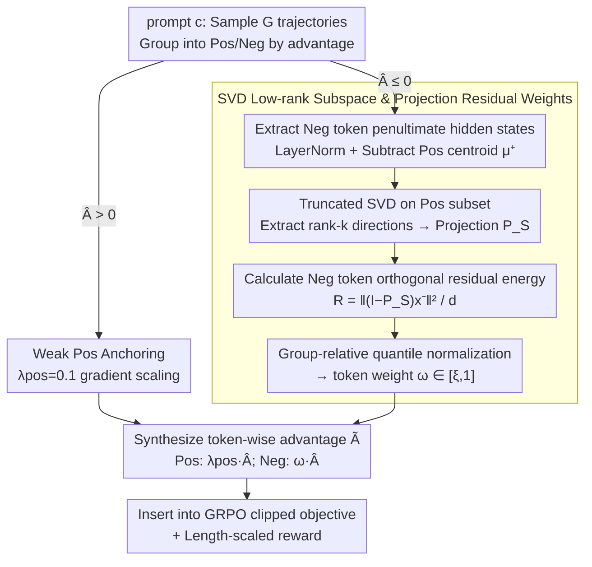

# ResRL: Boosting LLM Reasoning via Negative Sample Projection Residual Reinforcement Learning

**Conference**: ICML 2026  
**arXiv**: [2605.00380](https://arxiv.org/abs/2605.00380)  
**Code**: https://github.com/1229095296/ResRL.git (Available)  
**Area**: Reinforcement Learning / LLM Reasoning / RLVR  
**Keywords**: GRPO, Negative Sample Projection, SVD Subspace, Lazy Likelihood Displacement, Pass@k

## TL;DR
ResRL theoretically decomposes the "negative sample gradient contaminating positive samples" phenomenon (Lazy Likelihood Displacement, LLD) in RLVR into "logit × representation" components. It then utilizes the SVD low-rank subspace of positive samples at the representation layer to compute projection residuals. Based on the "orthogonal component energy" of each negative token, a gradient weight in the $[\xi, 1]$ interval is assigned—lighter penalties for representations similar to positive samples (smaller residuals) and heavy penalties for purely erroneous components. This preserves Pass@1 while maintaining Pass@k diversity. On Qwen3-4B mathematical tasks, it achieves a 9.4% improvement in Avg@16 and a 7.0% improvement in Pass@128 compared to NSR.

## Background & Motivation

**Background**: RLVR (Reinforcement Learning with Verifiable Rewards) has become the mainstream for LLM post-training—DeepSeek-R1 utilized GRPO to significantly enhance complex reasoning. Its variant, NSR (Negative Sample Reinforcement), improves Pass@1 while maintaining diversity (Pass@k) by increasing the gradient weight of negative samples.

**Limitations of Prior Work**: Both GRPO and NSR penalize negative sample tokens indiscriminately. However, positive and negative responses highly overlap in grammar, partial reasoning steps, and common expressions. When NSR intensifies the suppression of negative samples, these **shared valid token distributions** are also suppressed, making critical tokens in positive samples harder to generate. This is the LLD (Lazy Likelihood Displacement) phenomenon: $\ln \pi(y^+|c)$ actually decreases after training. Due to larger negative weights, NSR suffers more severely from this side effect than vanilla GRPO, leading to limited Pass@1 (Avg@1) gains despite strong Pass@k.

**Key Challenge**: Semantic distributions of positive and negative samples overlap significantly in the token representation space, but the gradient direction "attacks all tokens in the response." There is no mechanism to distinguish whether a token is a "unique error pattern (to be heavily penalized)" or a "shared valid expression (to be lightly penalized)." The ideal approach is to penalize only the portion of the gradient direction that is "orthogonal to positive samples."

**Goal**: To truly unlock Pass@1 performance while maintaining the Pass@k advantages of NSR by designing a token-level, representation-aware gradient modulation mechanism that restricts negative sample penalties to directions orthogonal to positive sample representations.

**Key Insight**: Starting from the first-order expansion of LLD, the authors strictly prove that LLD is proportional to the "inner product of output head gradients between positive and negative samples" (Eq. 2). Utilizing the structure of the linear output head $z=Wx$, they prove that the gradient inner product can be decomposed into $\langle \delta_1, \delta_2 \rangle \cdot \langle x_1, x_2 \rangle$ (Lemma 1)—a logit component and a representation component. The logit component represents the "backprop signal" shape known during the forward pass, which is costly to compute; however, the **representation component can be estimated via a single forward pass**. Empirically, Transformer representations exhibit anisotropy and approximate low-rank properties, allowing for approximation using SVD subspaces.

**Core Idea**: The orthogonal component energy $e(x)$ of each negative token's hidden representation relative to the "positive sample SVD low-rank subspace" is used as a proxy for its "alignment with positive sample representations." Low alignment (large orthogonal residual) results in a heavy penalty, while high alignment (falling within the positive sample subspace) results in a light penalty—thereby protecting shared semantics and suppressing only independent errors.

## Method

### Overall Architecture
ResRL is a token-wise advantage reweighting extension of GRPO. For a prompt $c$, $G$ trajectories are sampled. The positive sample group $\mathcal{P}$ (advantage $>0$) uses a small constant $\lambda_{\text{pos}} = 0.1$ for weak anchoring (preventing mode collapse). Each token in the negative sample group (advantage $\leq 0$) is assigned a dynamic weight $\omega_{i,t} \in [\xi, 1]$ derived from a three-step process: (1) Extract the penultimate hidden state $h_{i,t}$, then apply LayerNorm and subtract the positive sample centroid $\mu^+$ to obtain the centered representation $x_{i,t}$. (2) Perform truncated SVD on the positive sample subset $\hat{X}^+$ to obtain rank-$k$ principal directions $V_k$ and construct the projection $P_S = V_k V_k^\top$. (3) Calculate the orthogonal residual energy $\mathcal{R}_{i,t} = \frac{1}{d}\|(I-P_S) x_{i,t}^-\|_2^2$, then map it to $[\xi, 1]$ via group-relative quantile normalization to produce the final token-wise weight. This process introduces no additional trainable parameters. The data flow for "grouping → negative representation weighting → synthesized advantage" is shown below:

### Key Designs

1.  **Theoretical Framework: LLD and Gradient Decomposition**:
    - **Function**: Proves why the projection residual is a valid proxy using first-order Taylor expansion and the algebraic structure of linear heads.
    - **Mechanism**: **(a)** Defines the change in positive sample log-likelihood before and after training as $\Delta(c) = \ln \pi_{\theta_{\text{fin}}}(y^+|c) - \ln \pi_{\theta_{\text{init}}}(y^+|c)$. The first-order approximation $\Delta(c) \approx -\eta \sum_{(i,t) \in \mathcal{N}(c)} \langle \nabla_W \ell^+, g^-_{i,t} \rangle$ shows that LLD is determined by the "inner product of positive and negative output head gradients" (Eq. 2). **(b)** Lemma 1: Given $\nabla_W \ell = \delta x^\top$ (where $\delta$ is the backprop signal at the logit and $x$ is the representation), then $\langle \nabla_W \ell_1, \nabla_W \ell_2 \rangle = \langle \delta_1, \delta_2 \rangle \cdot \langle x_1, x_2 \rangle$—the gradient inner product decomposes into the product of logit and representation terms. **(c)** Lemma 2 (Alignment bound): For $x^+ \in S$ within a subspace, $\langle x, x^+ \rangle^2 \leq \|x^+\|^2 (\|x\|^2 - d \cdot e(x))$—increasing orthogonal energy $e(x)$ monotonically decreases the upper bound of similarity to any positive representation. **(d)** Theorem 1: Combining Lemma 1 and 2, $e(x^-)$ becomes a conservative upper bound proxy for the gradient inner product under the assumption that the subspace sufficiently covers positive samples.
    - **Design Motivation**: This theory transforms the use of projection residuals from a heuristic into a provable "upper bound proxy," requiring only a single forward pass estimation, thus significantly improving computational feasibility.

2.  **SVD Low-rank Subspace Construction + Projection Residual Token Weights**:
    - **Function**: Converts the theoretical $e(x)$ proxy into a lightweight operator computable online within the GRPO training loop.
    - **Mechanism**: Within each prompt group, **(1)** $M$ tokens are uniformly sampled from the positive sample pool. After LayerNorm and centroid subtraction, the matrix $\hat{X}^+ \in \mathbb{R}^{M \times d}$ undergoes truncated SVD to extract $V_k \in \mathbb{R}^{d \times k}$ and the projector $P_S = V_k V_k^\top$. **(2)** For each negative token, $\mathcal{R}_{i,t} = \frac{1}{d}\|(I-P_S) x^-_{i,t}\|^2$ is calculated. **(3)** Robust normalization uses group-relative quantiles $q_{\text{low}} = \mathcal{Q}(\mathbf{D}, \alpha)$ and $q_{\text{high}} = \mathcal{Q}(\mathbf{D}, \beta)$ instead of min/max. **(4)** Mapping to $[\xi, 1]$ via $\omega_{i,t} = \xi + (1-\xi) z_{i,t}$. **(5)** Token-wise advantage: $\tilde{A}_{i,t} = \lambda_{\text{pos}} \hat{A}_i$ if $\hat{A}_i > 0$, and $\omega_{i,t} \hat{A}_i$ if $\hat{A}_i \leq 0$.
    - **Design Motivation**: Sampling and low-rank SVD reduce complexity; quantile normalization prevents outliers from skewing weights; the $[\xi, 1]$ interval ensures a minimum penalty even for perfectly aligned representations. The penultimate layer is used because the final layer is directly biased by the token prediction objective.

3.  **Weak Positive Selection + Length-scaled Reward**:
    - **Function**: Prevents mode collapse when positive samples are not reinforced while curbing generation verbosity.
    - **Mechanism**: Positive advantage tokens are scaled by $\lambda_{\text{pos}} = 0.1$, retaining a small "weak reward anchor." A length-scaled reward mechanism serves as a "safety valve" to ensure ResRL does not produce excessively long chains-of-thought.
    - **Design Motivation**: Following NSR, retaining some positive gradient stabilizes training. Length rewards are necessary because diversity-focused RL often induces verbose generation.

### Loss & Training
$$
\mathcal{L}_{\text{ResRL}}(\theta) = \mathbb{E}_{x, \mathcal{G}}\left[\frac{1}{G}\sum_i \frac{1}{T_i} \sum_t \min(\rho_{i,t} \tilde{A}_{i,t}, \text{clip}(\rho_{i,t}, 1-\epsilon, 1+\epsilon) \tilde{A}_{i,t}) \right]
$$
- Experimental Setup: Qwen3-1.7B/4B/8B backbones, 4096 max response length, SVD rank $k$, sample size $M$, and quantiles $(\alpha, \beta)$ were grid-searched in the ablation study.

## Key Experimental Results

### Main Results

| Method (Qwen3-4B) | AIME24 | AIME25 | AMC23 | MATH500 | Minerva | Olympiad | Avg |
|---|---|---|---|---|---|---|---|
| Backbone | 20.0 | 17.3 | 56.9 | 77.8 | 36.9 | 48.2 | 35.5 |
| GRPO | 37.1 | 27.7 | 87.2 | 79.9 | 31.5 | 55.1 | 53.1 |
| DAPO | 23.5 | 18.9 | 63.4 | 80.8 | 39.1 | 51.2 | 46.2 |
| FlowRL | 35.4 | 30.2 | 74.5 | 84.7 | 38.9 | 58.1 | 53.6 |
| NSR | 38.5 | 33.1 | 79.8 | 77.4 | 33.5 | 50.1 | 52.1 |
| **ResRL** | **45.2** | **38.6** | **89.4** | 77.8 | **38.6** | 52.3 | **57.0** |

| Code (Qwen3-4B) | LiveCodeBench Avg/Pass@16 | CodeForces Rating (Pct.) | HumanEval+ Pass@16 |
|---|---|---|---|
| Backbone | 30.5 / 40.9 | 578.8 (1.2) | 89.0 |
| GRPO | 39.5 / 55.1 | 1267.9 (63.1) | 95.7 |
| NSR | 32.8 / 52.3 | 1340.9 (69.3) | 96.9 |
| **ResRL** | **43.2 / 59.9** | **1469.5 (78.9)** | **97.0** |

### Ablation Study

| Key Hyperparameter | Conclusion |
|---|---|
| Rank $k$ | Too low (k=1) lacks representation depth; too high (k≈d) degrades to no projection. $k \approx 8-16$ is optimal. |
| Penultimate vs. Final layer | Penultimate is significantly better, validating the "prediction objective bias" hypothesis. |
| Quantile $(\alpha, \beta)$ | (0.1, 0.9) is more robust than (0, 1) min-max normalization. |
| $\xi$ (Min Weight) | $\xi \approx 0.3-0.5$ is most stable; $\xi=0$ causes representational drift. |

### Key Findings
- **Simultaneous Improvement in Pass@1 and Pass@128**: ResRL solves the NSR bottleneck, improving Avg@16 by 9.4% and Pass@128 by 7.0% on Qwen3-4B Math.
- **Theory-Practice Consistency**: Theorem 1's prediction regarding $e(x^-)$ as a conservative bound is empirically validated by the effectiveness of quantile normalization.
- **Cross-task Universality**: SOTA results in Math, Code, Long-horizon Agent, and Function Calling suggest that projection residual weighting is a general RL improvement.
- **CodeForces +9.6% Rating**: The jump from NSR (1340) to ResRL (1469) demonstrates that "protecting shared semantics" is crucial for structured code generation.

## Highlights & Insights
- **Lemma 1 Gradient Decomposition**: $\langle \nabla_W \ell_1, \nabla_W \ell_2 \rangle = \langle \delta_1, \delta_2 \rangle \cdot \langle x_1, x_2 \rangle$ provides a beautiful theoretical foundation for using single-forward passes to proxy token-wise gradient interactions.
- **Positive SVD Subspace as "Valid Semantic Manifold"**: Explicitly defining "acceptable tokens" via a low-rank subspace and penalizing energy outside this manifold is more interpretable than pure geometric gradient angles.
- **Group-relative Quantile Gating**: Applying normalization independently per prompt group prevents scale differences across prompts from polluting the threshold, maintaining the spirit of GRPO at the token level.

## Limitations & Future Work
- SVD must be performed for each prompt group; though sampling helps, computational overhead may increase for very large groups or sequences.
- Sensitivity to hyperparameters ($k, M, \alpha, \beta, \xi$) increases the tuning burden for practical deployment.
- The "semantic" hypothesis of the penultimate hidden state has not been systematically validated across other architectures (Mistral, Llama).
- The study focuses on RLVR (binary rewards); applicability to dense rewards or preference learning (DPO) remains unexplored.

## Related Work & Insights
- **vs. GRPO / DAPO**: These do not distinguish between shared and independent tokens; ResRL adds representation-aware weighting to negative tokens.
- **vs. NSR**: NSR fails to address LLD; ResRL selectively suppresses tokens to preserve Pass@1 while keeping NSR's diversity.
- **vs. LLD Studies**: While others identified LLD, ResRL is the first to proxy and incorporate the gradient inner product into the GRPO training cycle.

## Rating
- Novelty: ⭐⭐⭐⭐⭐ 
- Experimental Thoroughness: ⭐⭐⭐⭐⭐ 
- Writing Quality: ⭐⭐⭐⭐ 
- Value: ⭐⭐⭐⭐⭐ 

<!-- RELATED:START -->

## Related Papers

- [\[NeurIPS 2025\] The Surprising Effectiveness of Negative Reinforcement in LLM Reasoning](../../NeurIPS2025/llm_reasoning/the_surprising_effectiveness_of_negative_reinforcement_in_llm_reasoning.md)
- [\[ICLR 2026\] Stabilizing Policy Gradients for Sample-Efficient Reinforcement Learning in LLM Reasoning](../../ICLR2026/llm_reasoning/stabilizing_policy_gradients_for_sample-efficient_reinforcement_learning_in_llm_.md)
- [\[ACL 2026\] TemplateRL: Structured Template-Guided Reinforcement Learning for LLM Reasoning](../../ACL2026/llm_reasoning/templaterl_structured_template-guided_reinforcement_learning_for_llm_reasoning.md)
- [\[AAAI 2026\] Well Begun, Half Done: Reinforcement Learning with Prefix Optimization for LLM Reasoning](../../AAAI2026/llm_reasoning/well_begun_half_done_reinforcement_learning_with_prefix_optimization_for_llm_rea.md)
- [\[ICML 2026\] Deliberate Evolution: Agentic Reasoning for Sample-Efficient Symbolic Regression with LLMs](deliberate_evolution_agentic_reasoning_for_sample-efficient_symbolic_regression_.md)

<!-- RELATED:END -->
