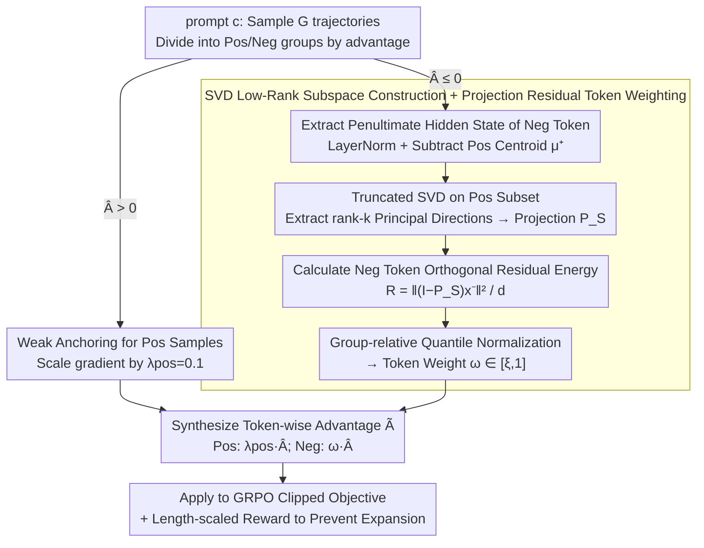

# ResRL: Boosting LLM Reasoning via Negative Sample Projection Residual Reinforcement Learning

**Conference**: ICML 2026  
**arXiv**: [2605.00380](https://arxiv.org/abs/2605.00380)  
**Code**: https://github.com/1229095296/ResRL.git (Available)  
**Area**: Reinforcement Learning / LLM Reasoning / RLVR  
**Keywords**: GRPO, Negative Sample Projection, SVD Subspace, Lazy Likelihood Displacement, Pass@k

## TL;DR
ResRL theoretically decomposes the phenomenon of "negative sample gradients contaminating positive samples" (Lazy Likelihood Displacement) in RLVR into two components: "logit × representation." It then uses the SVD low-rank subspace of positive samples at the representation layer to calculate projection residuals. Based on the "orthogonal component energy" of each negative token, it assigns a gradient weight within the interval $[\xi, 1]$. Tokens that resemble positive samples (smaller residuals) receive lighter penalties, while purely incorrect components are heavily penalized. This maintains Pass@1 without sacrificing Pass@k diversity. On Qwen3-4B mathematics tasks, it achieves a 9.4% gain in Avg@16 and a 7.0% gain in Pass@128 compared to NSR.

## Background & Motivation

**Background**: RLVR (Reinforcement Learning with Verifiable Rewards) has become a mainstream LLM post-training approach, with DeepSeek-R1 significantly enhancing complex reasoning via GRPO. Its variant, NSR (Negative Sample Reinforcement), improves Pass@1 while maintaining diversity (Pass@k) by increasing gradient weights for negative samples.

**Limitations of Prior Work**: Both GRPO and NSR penalize all tokens in a negative sample equally. however, "the answers of positive and negative samples highly overlap in grammar, certain reasoning steps, and common expressions." When NSR intensifies the suppression of negative samples, these **shared valid token distributions** are also suppressed. This makes the generation of critical tokens corresponding to positive samples more difficult, a phenomenon termed LLD (Lazy Likelihood Displacement): where $\ln \pi(y^+|c)$ actually decreases after training. Due to the larger negative weights in NSR, this side effect is even more severe than in vanilla GRPO, resulting in limited Pass@1 (i.e., Avg@1) gains despite strong Pass@k performance.

**Key Challenge**: The semantic distributions of positive and negative samples overlap significantly in the token representation space, but the gradient direction is "to penalize all tokens of the entire response." There is no mechanism to distinguish whether "this token is an error pattern unique to the negative sample (deserving a heavy penalty)" or "this token is a valid expression shared by both positive and negative samples (deserving a light penalty)." Ideally, only the gradient direction of the negative sample that is "orthogonal to the positive sample" should be penalized.

**Goal**: To achieve substantial Pass@1 improvements while maintaining the Pass@k advantages of NSR by designing a token-level, representation-aware gradient modulation mechanism that limits negative sample penalties to directions orthogonal to positive sample representations.

**Key Insight**: Starting from the first-order expansion of LLD, the authors rigorously prove that LLD is proportional to the "inner product of output head gradients between positive and negative samples" (Eq.2). Utilizing the structure of a linear output head $z=Wx$, they prove that the gradient inner product can be decomposed into $\langle \delta_1, \delta_2 \rangle \cdot \langle x_1, x_2 \rangle$ (Lemma 1)—a logit component and a representation component. While the logit component (backprop signal shape) is known during forward passes and is computationally expensive to use directly, the **representation component can be estimated via a single forward pass**. Empirically, Transformer representations exhibit anisotropy and approximate low-rank properties, which can be effectively approximated using an SVD subspace.

**Core Idea**: The orthogonal component energy $e(x)$ of each negative token's hidden representation relative to the "positive sample SVD low-rank subspace" is used as a proxy for its alignment with positive samples. Low alignment (large orthogonal residual) leads to heavy penalties, while high alignment (falling within the positive sample subspace) leads to light penalties. This protects shared semantics and only suppresses independent errors.

## Method

### Overall Architecture
ResRL is a token-wise advantage re-weighting extension of GRPO. For a prompt $c$, $G$ trajectories are sampled. The positive sample group $\mathcal{P}$ (advantage $>0$) uses a small constant $\lambda_{\text{pos}} = 0.1$ for weak anchoring to prevent mode collapse. Each token in the negative sample group (advantage $\leq 0$) is assigned a dynamic weight $\omega_{i,t} \in [\xi, 1]$ via a three-step process: (1) extracting the penultimate hidden state $h_{i,t}$, then applying LayerNorm and subtracting the positive sample centroid $\mu^+$ to obtain the centered representation $x_{i,t}$; (2) performing truncated SVD on the positive sample subset $\hat{X}^+$ to obtain rank-$k$ principal directions $V_k$ and constructing the projection $P_S = V_k V_k^\top$; (3) calculating the orthogonal residual energy $\mathcal{R}_{i,t} = \frac{1}{d}\|(I-P_S) x_{i,t}^-\|_2^2$ for each negative token, followed by group-relative quantile normalization to map it to $[\xi, 1]$ as the final token-wise weight. This process introduces no additional trainable parameters and only modifies the shape of the advantage. The following diagram illustrates this data flow:

### Key Designs

1.  **Theoretical Framework: LLD and Gradient Decomposition**:
    *   **Function**: Proving why the projection residual is a reasonable proxy based on first-order Taylor expansion and the algebraic structure of linear heads.
    *   **Mechanism**: **(a)** Defining the change in positive sample log-likelihood before and after training as $\Delta(c) = \ln \pi_{\theta_{\text{fin}}}(y^+|c) - \ln \pi_{\theta_{\text{init}}}(y^+|c)$, the first-order approximation yields $\Delta(c) \approx -\eta \sum_{(i,t) \in \mathcal{N}(c)} \langle \nabla_W \ell^+, g^-_{i,t} \rangle$, indicating LLD is determined by the "inner product of positive and negative output head gradients" (Eq.2). **(b)** Lemma 1: From $\nabla_W \ell = \delta x^\top$ (where $\delta$ is the logit backprop signal and $x$ is the representation), it follows that $\langle \nabla_W \ell_1, \nabla_W \ell_2 \rangle = \langle \delta_1, \delta_2 \rangle \cdot \langle x_1, x_2 \rangle$—the gradient inner product decomposes cleanly into logit and representation terms. **(c)** Lemma 2 (Alignment bound): For $x^+ \in S$ within a subspace, $\langle x, x^+ \rangle^2 \leq \|x^+\|^2 (\|x\|^2 - d \cdot e(x))$—increasing the orthogonal component energy $e(x)$ monotonically decreases the upper bound of similarity with any positive sample representation. **(d)** Theorem 1: Combining Lemmas 1+2 yields $|\langle x^-, x^+ \rangle| \leq \|P_S x^+\|_2 \sqrt{\|x^-\|^2 - d\cdot e(x^-)} + \|x^-\|_2 \sqrt{d \cdot e(x^+)}$, where $e(x^-)$ becomes a conservative upper bound proxy for the gradient inner product under the assumption that the subspace sufficiently covers positive samples ($e(x^+) \leq \varepsilon_+$).
    *   **Design Motivation**: This theory transforms "why use projection residuals" from a heuristic into a provable "upper bound proxy." Furthermore, it only requires a single forward pass estimation, making it computationally feasible unlike methods requiring token-wise full-parameter gradient calculations.

2.  **SVD Low-Rank Subspace Construction + Projection Residual Token Weighting**:
    *   **Function**: Converting the theoretical $e(x)$ proxy into a lightweight online operator within the GRPO training loop.
    *   **Mechanism**: Within each prompt group, **(1)** $M$ tokens are sampled uniformly from the positive sample pool. After LayerNorm and centroid subtraction, they form the matrix $\hat{X}^+ \in \mathbb{R}^{M \times d}$. Truncated SVD is performed: $\hat{X}^+ = U \Sigma V^\top$, using the top $k$ right singular vectors to construct $V_k \in \mathbb{R}^{d \times k}$ and the projector $P_S = V_k V_k^\top$. **(2)** For each negative token, $\mathcal{R}_{i,t} = \frac{1}{d}\|(I-P_S) x^-_{i,t}\|^2$ is calculated. **(3)** Robust normalization is performed using group-relative quantiles $q_{\text{low}} = \mathcal{Q}(\mathbf{D}, \alpha)$ and $q_{\text{high}} = \mathcal{Q}(\mathbf{D}, \beta)$ instead of min/max: $z_{i,t} = \text{clamp}((\mathcal{R}_{i,t} - q_{\text{low}}) / (q_{\text{high}} - q_{\text{low}} + \epsilon), 0, 1)$. **(4)** Mapping to [ξ, 1]: $\omega_{i,t} = \xi + (1-\xi) z_{i,t}$. **(5)** Token-wise advantage: $\tilde{A}_{i,t} = \lambda_{\text{pos}} \hat{A}_i$ if $\hat{A}_i > 0$, and $\omega_{i,t} \hat{A}_i$ if $\hat{A}_i \leq 0$, which is then substituted into the standard GRPO clipped objective.
    *   **Design Motivation**: Sampling and low-rank SVD (rather than full token/full rank calculation) keep complexity manageable. Quantile normalization prevents outliers from skewing the weight distribution. The [ξ, 1] range ensures a minimum penalty (where ξ is the lower bound) even for perfectly aligned representations, preventing the model from ignoring those errors. The penultimate layer is chosen because the final layer directly feeds the output head and is biased by the token prediction objective; the penultimate layer better represents "semantic abstraction."

3.  **Positive Sample Weak Anchoring + Length-Scaled Reward**:
    *   **Function**: Preventing mode collapse by ensuring positive samples are not "left unreinforced" while suppressing the verbosity often induced by RL training.
    *   **Mechanism**: A scale of $\lambda_{\text{pos}} = 0.1$ is applied to positive advantage tokens—not removing the positive gradient entirely, but leaving a small "weak reward anchor" to prevent the policy from merely "avoiding errors" while forgetting how to "reach the correct answer." Simultaneously, a length-scaled reward mechanism (formula in the appendix) acts as an "anti-expansion valve" to ensure ResRL does not produce excessively long chains-of-thought.
    *   **Design Motivation**: The authors adopt the "small positive anchor" approach from Zhu 2025a (NSR), as complete removal of positive gradients causes training instability. Length rewards are used as a safeguard because diversity-focused RL often induces verbose generation, which degrades inference speed and effectiveness.

### Loss & Training
$$
\mathcal{L}_{\text{ResRL}}(\theta) = \mathbb{E}_{x, \mathcal{G}}\left[\frac{1}{G}\sum_i \frac{1}{T_i} \sum_t \min(\rho_{i,t} \tilde{A}_{i,t}, \text{clip}(\rho_{i,t}, 1-\epsilon, 1+\epsilon) \tilde{A}_{i,t}) \right]
$$
- **Experimental Configuration**: Qwen3-1.7B/4B/8B backbone, 4096 max response length, group size $G$ following GRPO defaults. SVD rank $k$, sample size $M$, quantiles $(\alpha, \beta)$, and $\xi$ were determined via grid search in ablation studies.

## Key Experimental Results

### Main Results

| Method (Qwen3-4B) | AIME24 | AIME25 | AMC23 | MATH500 | Minerva | Olympiad | Avg |
|---|---|---|---|---|---|---|---|
| Backbone | 20.0 | 17.3 | 56.9 | 77.8 | 36.9 | 48.2 | 35.5 |
| GRPO | 37.1 | 27.7 | 87.2 | 79.9 | 31.5 | 55.1 | 53.1 |
| DAPO | 23.5 | 18.9 | 63.4 | 80.8 | 39.1 | 51.2 | 46.2 |
| FlowRL | 35.4 | 30.2 | 74.5 | 84.7 | 38.9 | 58.1 | 53.6 |
| NSR | 38.5 | 33.1 | 79.8 | 77.4 | 33.5 | 50.1 | 52.1 |
| **ResRL** | **45.2** | **38.6** | **89.4** | 77.8 | **38.6** | 52.3 | **57.0** |

| Method (Qwen3-8B) | AIME24 | AIME25 | AMC23 | MATH500 | Minerva | Olympiad | Avg |
|---|---|---|---|---|---|---|---|
| Backbone | 25.4 | 18.1 | 61.4 | 77.6 | 39.2 | 48.6 | 45.1 |
| GRPO | 36.3 | 29.2 | 78.0 | 89.4 | 42.1 | 62.0 | 56.2 |
| FlowRL | 47.7 | 33.3 | 85.8 | 92.1 | 44.6 | 68.5 | 62.1 |
| NSR | 55.4 | 38.5 | 89.8 | 87.3 | 40.0 | 60.6 | 61.9 |
| **ResRL** | 50.8 | **41.1** | 89.7 | **92.7** | **46.0** | 68.1 | **64.7** |

| Code (Qwen3-4B) | LiveCodeBench Avg/Pass@16 | CodeForces Rating (Pct.) | HumanEval+ Pass@16 |
|---|---|---|---|
| Backbone | 30.5 / 40.9 | 578.8 (1.2) | 89.0 |
| GRPO | 39.5 / 55.1 | 1267.9 (63.1) | 95.7 |
| NSR | 32.8 / 52.3 | 1340.9 (69.3) | 96.9 |
| **ResRL** | **43.2 / 59.9** | **1469.5 (78.9)** | **97.0** |

| Agent / Tool Use | ALFWorld All | WebShop Succ. | BFCL Overall |
|---|---|---|---|
| Prompting ReAct | 31.2 | 19.5 | - |
| PPO | 80.4 | 68.7 | - |
| EMPG | 78.5 | 69.3 | - |
| ResT-8B | - | - | High on many |
| **ResRL** | **86.7** | **71.5** | Best on many |

### Ablation Study
The authors conducted multiple ablations on rank $k$, sample size $M$, hidden layer choice, quantiles $(\alpha, \beta)$, and $\xi$. Core findings include:

| Key Hyperparameter | Conclusion |
|---|---|
| Rank $k$ | Too low (k=1) lacks expression; too high (k≈d) degrades to no projection. $k \approx 8-16$ is optimal. |
| Penultimate vs final layer | Penultimate is significantly better, validating the "prediction objective bias" hypothesis. |
| Quantile $(\alpha, \beta)$ | (0.1, 0.9) is more robust than (0, 1) min-max normalization. |
| $\xi$ (Min. Weight) | $\xi \approx 0.3-0.5$ is most stable. $\xi=0$ can lead to drift due to lack of supervision on some tokens. |

### Key Findings
- **Simultaneous improvement of Pass@1 (Avg@16) and Pass@128**: While NSR primarily excels at Pass@k, ResRL hits new highs in both dimensions—achieving +9.4% in Avg@16 and +7.0% in Pass@128 on Qwen3-4B math, effectively solving the NSR pain point.
- **Consistency between Theory and Implementation**: Theorem 1 predicts that larger $e(x^-)$ leads to a tighter gradient alignment bound and should be penalized more; empirical results for quantile normalization and the $\xi$ lower bound align with this.
- **Cross-Task Generality**: SOTA results across Mathematics, Code, long-horizon Agents, and Function Calling demonstrate that "projection residual weighting" is a general RL improvement rather than a task-specific trick.
- **+9.6% CodeForces Rating**: Improving from NSR's 1340 to ResRL's 1469 (69% to 78% percentile) represents a significant leap in coding capability, suggesting that "protecting shared semantics" is crucial for structured code generation.
- **$\lambda_{\text{pos}}=0.1$ is Critical**: Completely removing positive gradients leads to immediate collapse; retaining a weak anchor ensures stability.

## Highlights & Insights
- **Lemma 1 Gradient Decomposition**: $\langle \nabla_W \ell_1, \nabla_W \ell_2 \rangle = \langle \delta_1, \delta_2 \rangle \cdot \langle x_1, x_2 \rangle$. This elegant equation provides the theoretical foundation for using a single forward pass as a proxy for token-wise gradient interactions.
- **Positive SVD Subspace as a "Valid Semantic Manifold"**: The concept explicitly represents "acceptable tokens" as a low-rank subspace. Large energy outside the projection is defined as an "independent error" to be penalized, which is more interpretable than pure geometric "gradient direction angles."
- **Group-relative Quantile Gating**: Normalizing independently within each prompt group prevents scale differences across prompts from polluting the thresholds, extending the spirit of GRPO to the token level.
- **Penultimate vs. Final Layer**: This detail reflects which layer's representations best capture semantics without being skewed by the prediction bias, a valuable insight for future representation engineering.
- **Theoretical and Empirical Synergy**: Theorem 1 provides a conservative bound which is then tuned via experimentation, offering a more persuasive paradigm than purely empirical or purely theoretical work.

## Limitations & Future Work
- SVD must be performed for each prompt group; despite sampling and low-rank approximation, computational overhead remains. Wall-clock time comparisons for large group sizes or long sequences are missing.
- Four interacting hyperparameters ($k$, $M$, quantiles, $\xi$) require grid searching, increasing the tuning burden for practical deployment.
- The "semantic" assumption for penultimate hidden states is empirical and has not been systematically validated across other LLM architectures (e.g., Mistral, Llama, GLM).
- While length-scaled rewards are a safeguard, there is no comparison showing what happens without them—ResRL might inherently lean towards verbosity.
- Evaluation is limited to the RLVR (binary reward) setting; applicability to dense rewards or preference learning (DPO/RLHF) is not discussed.
- Comparisons against other representation-focused RL algorithms (e.g., ConsisCo, RPO) or PRM-based methods are relatively simple.

## Related Work & Insights
- **vs GRPO (DeepSeek-R1) / DAPO**: These determine token-wise advantages via group normalization without distinguishing shared vs. independent tokens; ResRL adds representation-aware weights to negative tokens.
- **vs NSR (Zhu 2025a)**: NSR increases negative gradients but fails to solve LLD, limiting Pass@1 gains. ResRL selectively suppresses tokens via projection residuals to retain NSR's diversity while enabling Pass@1.
- **vs FlowRL (Zhu 2025b)**: FlowRL controls policy distribution via flow matching, whereas ResRL uses representation geometry. ResRL shows better 8B performance (64.7 vs 62.1).
- **vs LLD Research (Deng 2025c, 2025b)**: These identified the LLD phenomenon; ResRL is the first to proxy, differentiate, and integrate the "gradient inner product" into the GRPO training loop—moving from diagnosis to treatment.
- **vs Token-level loss balancing / Curriculum**: These use heuristics (loss magnitude, length); ResRL's weights are based on theoretical upper bounds.
- **vs Representation Engineering (Repeng, Steering Vectors)**: Those works modify activations during inference, whereas ResRL modifies gradients during training.

## Rating
- **Novelty**: ⭐⭐⭐⭐⭐ principled framework combining gradient decomposition, SVD projection, and group-relative gating.
- **Experimental Thoroughness**: ⭐⭐⭐⭐⭐ Coverage across 12 benchmarks, 4 task types, and 3 model scales.
- **Writing Quality**: ⭐⭐⭐⭐ Clear logical chain from Lemma to Theorem to Algorithm, though正文 is dense.
- **Value**: ⭐⭐⭐⭐⭐ Provides an actionable improvement for the RLVR community and a theoretical template for representation-aware RL.

<!-- RELATED:START -->

## Related Papers

- [\[ICLR 2026\] Stabilizing Policy Gradients for Sample-Efficient Reinforcement Learning in LLM Reasoning](../../ICLR2026/llm_reasoning/stabilizing_policy_gradients_for_sample-efficient_reinforcement_learning_in_llm_.md)
- [\[NeurIPS 2025\] The Surprising Effectiveness of Negative Reinforcement in LLM Reasoning](../../NeurIPS2025/llm_reasoning/the_surprising_effectiveness_of_negative_reinforcement_in_llm_reasoning.md)
- [\[ACL 2026\] TemplateRL: Structured Template-Guided Reinforcement Learning for LLM Reasoning](../../ACL2026/llm_reasoning/templaterl_structured_template-guided_reinforcement_learning_for_llm_reasoning.md)
- [\[ICLR 2026\] Temperature as a Meta-Policy: Adaptive Temperature in LLM Reinforcement Learning](../../ICLR2026/llm_reasoning/temperature_as_a_meta-policy_adaptive_temperature_in_llm_reinforcement_learning.md)
- [\[AAAI 2026\] Well Begun, Half Done: Reinforcement Learning with Prefix Optimization for LLM Reasoning](../../AAAI2026/llm_reasoning/well_begun_half_done_reinforcement_learning_with_prefix_optimization_for_llm_rea.md)

<!-- RELATED:END -->
