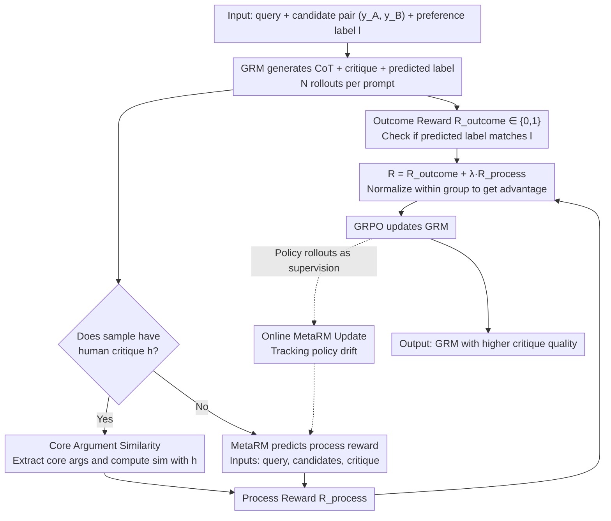

# Reward Modeling from Natural Language Human Feedback

**Conference**: ICML 2026  
**arXiv**: [2601.07349](https://arxiv.org/abs/2601.07349)  
**Code**: Not disclosed  
**Area**: LLM Alignment / Reward Modeling / RLHF  
**Keywords**: Generative Reward Model (GRM), Process Reward, Natural Language Feedback, MetaRM, GRPO

## TL;DR
This paper identifies a significant outcome-process inconsistency (20-30%, up to 44%) in Generative Reward Models (GRM) trained on binary preference rewards, where models "guess the preference correctly but provide an incorrect critique." It proposes RM-NLHF, which utilizes the similarity between the core arguments of model critiques and human critiques as an additional process reward. By using MetaRM to automatically predict process rewards with online on-policy updates, the method consistently outperforms SOTA GRMs trained via outcome-only GRPO across multiple benchmarks.

## Background & Motivation

**Background**: Generative Reward Models (GRM) are becoming mainstream in LLM alignment and RLHF because they output critiques alongside preference labels, offering better robustness and interpretability than traditional scalar RMs. Training typically employs RLVR + GRPO: the model generates reasoning and a critique for a pair of responses, followed by an A/B label. The binary reward $R_{\text{outcome}} \in \{0,1\}$ is derived from whether the label matches the ground truth.

**Limitations of Prior Work**: The authors conducted comparative experiments on MATH-500 (math, large solution space) and HelpSteer3 (pairwise reward, binary solution space). In mathematical tasks, correct outcomes almost always imply correct processes. However, in pairwise rewarding, RM-R1-DeepSeek-Distilled-Qwen-7B shows a 44.24% rate of "correct outcome / incorrect critique," with Gemini-2.5-Pro at 26.1% and Claude-3.7-Sonnet at 33.6%. This phenomenon of "guessing the label without a correct critique" injects significant pseudo-rewards, causing RL to converge toward policies that generate incorrect critiques.

**Key Challenge**: The size of the solution space determines the reliability of outcome supervision. Mathematical tasks have a vast answer space (getting "42" almost certainly requires correct reasoning), whereas binary preference tasks have a solution space of only $\{A, B\}$, allowing a 50% hit rate by guessing. This makes the outcome signal extremely noisy. However, binary decisions cannot be easily rewritten into fill-in-the-blank formats to expand the solution space like math problems.

**Goal**: To introduce a credible process reward for GRMs in binary preference tasks without altering the task structure, allowing critique quality to enter the training loop directly while overcoming the scalability bottleneck of scarce human critique data.

**Key Insight**: Natural language feedback (critique) provided by humans is inherently process supervision. The overlap of core arguments between model and human critiques serves as a direct proxy for critique validity. Furthermore, a MetaRM can be trained to synthesize "pseudo-critique" data from human critique samples.

**Core Idea**: Use the "similarity between core arguments of GRM critique and human critique" as a process reward, overlaid with the outcome reward for GRPO training. MetaRM is then used to extrapolate this reward signal from small human-annotated subsets to unlabelled data, with MetaRM being updated online during RL training to keep pace with policy drift.

## Method

### Overall Architecture
RM-NLHF aims to supplement binary preference tasks with a process reward for critique validity without being limited by the scarcity of human critique data. The baseline remains GRPO: for a query $q$ with candidate pairs $y_A, y_B$ and a preference label $l \in \{A, B\}$, the GRM $\pi_\theta$ generates CoT + critique + predicted label $\hat{l}$. Each prompt is rolled out $N$ times to calculate the outcome reward $R_{\text{outcome}}^i$, which is then normalized into an advantage $\hat{A}_i$. A parallel process reward is added: data with human critiques $h$ use core argument similarity between the model's critique $\hat{c}$ and $h$; data without $h$ rely on a MetaRM for prediction. MetaRM is updated online throughout training to follow the policy.

### Key Designs

**1. Similarity w/ Core HC: Quantifying Critique Validity as a Numerical Reward**

Outcome-only supervision is unreliable in binary tasks (50% guessing rate). Critique quality must be explicitly measured. However, "LLM-as-a-judge" for critique validity is often affected by style bias, and "point-by-point comparison" can be penalized by nitpicky critiques. The authors use an external strong LLM (Gemini-2.5-Pro) to extract core arguments from both human critique $h$ and model critique $\hat{c}$, then compute the similarity $R_{\text{process}} = \text{sim}(\text{core}(h), \text{core}(\hat{c}))$. Testing on a 49-sample human-annotated subset showed that Core HC similarity aligns best with human labels by preserving semantic judgment while filtering out nitpicky noise. It outputs a single scalar, naturally compatible with the RLVR verifier framework.

**2. MetaRM: Extrapolating Process Supervision to Full Datasets**

Human critique labels are expensive (even HelpSteer3 only partially includes them), while major preference datasets like UltraFeedback mostly provide outcome labels. Relying solely on small critique-labeled datasets cannot match the scale of outcome-only RL. Thus, the authors train a MetaRM that takes $(q, y_A, y_B, \hat{c})$ as input and outputs a process reward estimate. It is trained on the human-critique subset to fit the "core similarity between $\hat{c}$ and $h$" and scores unlabelled data during inference. This effectively distills critique evaluation capability into a lightweight model.

**3. Online MetaRM: Synchronizing Reward Models to Prevent Reward Hacking**

Static MetaRMs suffer from reward hacking as the policy distribution shifts during RLHF. The authors adopt an alternating update schedule: the GRM performs a GRPO step, and the current policy rolls out $\hat{c}$ on a new batch of prompts. These $\hat{c}$ outputs are paired with ground-truth $h$ to update the MetaRM for one step. This ensures MetaRM always tracks the real output distribution of the current policy, mitigating the Goodhart's law problem. Experiments show Online MetaRM approaches the upper bound of "full human critique supervision" while significantly reducing annotation requirements.

### Loss & Training
The foundation is GRPO (Equations 1-3): group-normalized advantage $\hat{A}_i = (R_i - \bar{R}) / \sigma$, updated with a clipped policy gradient and KL regularization. RM-NLHF replaces the reward with $R = R_{\text{outcome}} + \lambda \cdot R_{\text{process}}$, where the process reward comes from Core HC similarity or MetaRM predictions. Online MetaRM is supervised via MSE or ranking loss and updated every $k$ GRPO steps. MetaRM and GRM share a backbone but use independent heads (though fully independent models are also feasible).

## Key Experimental Results

### Main Results
Comparisons were conducted on HelpSteer3, RewardBench, and PandaLM. Base GRMs included RM-R1 series, Qwen internal GRMs, and closed-source Gemini/Claude.

| Training Paradigm | Critique Quality (Core Arg F1) | Outcome Accuracy | Notes |
|----------|----------------------------|----------------|------|
| Outcome-only GRPO (SOTA Baseline) | Low | High but 20–44% inconsistency | Standard approach |
| RM-NLHF + Full Human Critique | Highest | Significant Gain | Upper-bound check |
| RM-NLHF + Offline MetaRM | Close to Full Human | Significantly > Outcome-only | Save annotation |
| **RM-NLHF + Online MetaRM** | Closest to Full Human | Significantly > Outcome-only | Practical optimum |

### Ablation Study (Process Reward Selection, 49-Sample Subset)

| Process Reward Scheme | Accuracy vs. Human Label |
|--------------|---------------------|
| LLM-as-a-Meta-Judge | Low |
| Similarity w/ All HC (F1) | Medium |
| Similarity w/ All HC (Recall) | Medium-Low |
| Similarity w/ All HC (Precision) | Medium |
| **Similarity w/ Core HC** | Highest |

### Key Findings
- Math tasks show nearly 100% outcome-process correspondence. Binary pairwise tasks show 20–44% inconsistency even for SOTA GRMs, proving outcome-only supervision is fundamentally unreliable for small solution spaces.
- "Core HC similarity" consistently outperforms "All HC" and "Direct LLM judging," indicating that filtering out nitpicky critiques is crucial for process reward design.
- Online MetaRM approaches the performance of full human supervision with significantly fewer annotations; offline MetaRM performs worse due to distribution shift.
- Even if outcome accuracy gains are modest, the significant boost in critique quality makes the GRM a much better reward provider for downstream RLHF, as policies benefit more from critique signals than labels alone.

## Highlights & Insights
- **Diagnosis of Inconsistency**: Explained why GRMs "guess" using the theoretical framework of solution space size—large spaces provide implicit verification, while small spaces require explicit process supervision.
- **Core Argument Similarity as Process Reward**: Avoiding sensitivity to nitpicky details is a key insight for critique-based reward design, applicable to LLM-as-a-judge and QA evaluation.
- **Online MetaRM for Reward Drift**: Addresses the classic Goodhart problem in RLHF with an actionable engineering protocol (alternating policy and MetaRM updates).
- **Extremely Low Annotation Requirement**: Using a 49-sample subset to validate proxies and a small portion for MetaRM training represents a cost-efficient alignment design.

## Limitations & Future Work
- The assumption that "likelihood = correctness" for process rewards is not strictly true; models with styles similar to human critiques may receive artificially high rewards.
- Core HC extraction relies on a strong external LLM (Gemini-2.5-Pro), introducing extra cost and potential bias, which might be amplified during self-distillation into MetaRM.
- Online MetaRM increases training complexity (alternating models) and wall-clock time; specific efficiency analyses are missing.
- Validation is limited to pairwise reward tasks; it is unclear if the solution space bias holds for listwise or scalar reward tasks.
- Lack of human evaluation for actual critique quality in comparison with verifier-based RL (e.g., updated RM-R1 families).

## Related Work & Insights
- **vs. Outcome-only GRPO GRM (RM-R1, Wang 2025c)**: Directly uses these SOTAs as baselines, quantifies their critique failure rates, and provides a dual-reward fix.
- **vs. PRM (Process Reward Model) in Math Reasoning**: While PRMs provide stepwise rewards, this work provides critique-level rewards; both share the philosophy of process-over-result supervision.
- **vs. RLAIF / Constitutional AI**: Replaces AI self-evaluation with a pipeline that distills human critique ground truth into a MetaRM, offering better interpretability and control.
- **Cross-task Inspiration**: The Online MetaRM approach can be generalized to any scenario where reward models fail during RL training (agent reward shaping, code RM, video generation RM).

## Rating
- Novelty: ⭐⭐⭐⭐ The framework linking solution space to supervision quality, combined with Core HC similarity and Online MetaRM, is original, though individual components have precursors.
- Experimental Thoroughness: ⭐⭐⭐⭐ Multiple benchmarks, proxy comparisons, and critique quality analysis; however, lacks large-scale human evaluation.
- Writing Quality: ⭐⭐⭐⭐ Intuitive motivation (Figures 1/2), clear formulas, and contributions; terminology is slightly dense.
- Value: ⭐⭐⭐⭐ Provides the missing process supervision for GRM training. The method is directly transferable to existing RLHF/RLAIF pipelines and significantly impacts the reward modeling community.

<!-- RELATED:START -->

## Related Papers

- [\[ICML 2026\] GRPO is Secretly a Process Reward Model](grpo_is_secretly_a_process_reward_model.md)
- [\[ACL 2026\] C2: Scalable Rubric-Augmented Reward Modeling from Binary Preferences](../../ACL2026/llm_reasoning/c2_scalable_rubric-augmented_reward_modeling_from_binary_preferences.md)
- [\[ACL 2026\] Efficient Process Reward Modeling via Contrastive Mutual Information](../../ACL2026/llm_reasoning/efficient_process_reward_modeling_via_contrastive_mutual_information.md)
- [\[ICLR 2026\] Fixing the Broken Compass: Diagnosing and Improving Inference-Time Reward Modeling](../../ICLR2026/llm_reasoning/fixing_the_broken_compass_diagnosing_and_improving_inference-time_reward_modelin.md)
- [\[ACL 2025\] Dynamic and Generalizable Process Reward Modeling (DG-PRM)](../../ACL2025/llm_reasoning/dgprm_dynamic_process_reward.md)

<!-- RELATED:END -->
