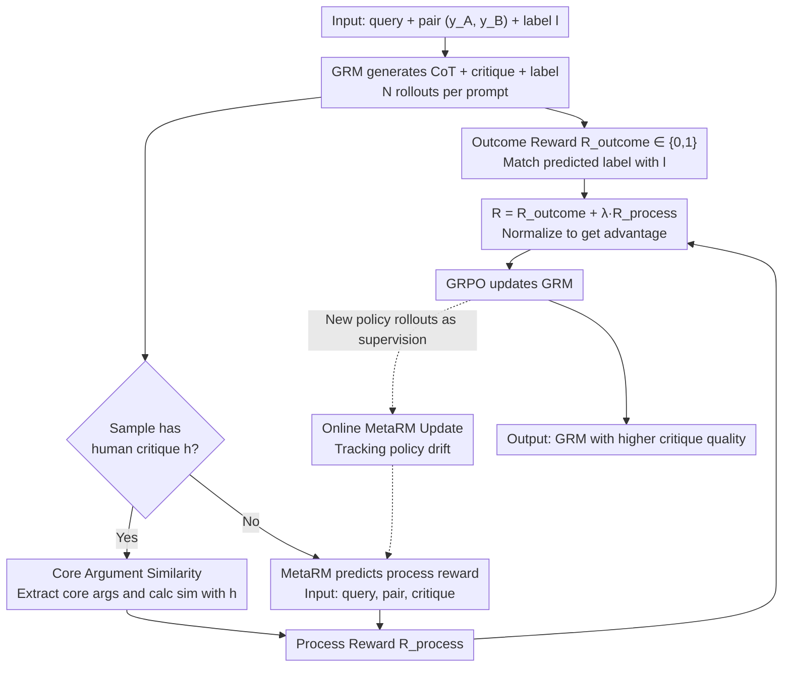

# Reward Modeling from Natural Language Human Feedback

**Conference**: ICML 2026  
**arXiv**: [2601.07349](https://arxiv.org/abs/2601.07349)  
**Code**: Undisclosed  
**Area**: LLM Alignment / Reward Modeling / RLHF  
**Keywords**: Generative Reward Model (GRM), Process Reward, Natural Language Feedback, MetaRM, GRPO

## TL;DR
This paper identifies a severe outcome-process inconsistency in generative reward models (GRMs) trained on binary preference rewards—where models "predict the preference correctly but provide incorrect critiques" (20–30%, up to 44%). It proposes RM-NLHF: using the similarity of core arguments between model critiques and human critiques as an additional process reward, and using MetaRM to automatically predict process rewards with online on-policy updates. This approach consistently outperforms SOTA GRMs trained via outcome-only GRPO across multiple benchmarks.

## Background & Motivation

**Background**: Generative Reward Models (GRMs) are mainstream in LLM alignment and RLHF because they output critiques alongside preference labels, making them more robust and interpretable than traditional scalar RMs. Training typically employs RLVR + GRPO: the model generates reasoning and critiques for a pair of responses, followed by an A/B label. The binary reward $R_{\text{outcome}} \in \{0, 1\}$ is derived from whether the label matches the ground truth.

**Limitations of Prior Work**: The authors conducted comparative experiments on MATH-500 (mathematics, large solution space) and HelpSteer3 (pairwise rewards, binary solution space). In math tasks, outcome correctness almost always implies process correctness. However, in pairwise rewarding, RM-R1-DeepSeek-Distilled-Qwen-7B shows a 44.24% "correct outcome / wrong critique" rate, with Gemini-2.5-Pro at 26.1% and Claude-3.7-Sonnet at 33.6%. This phenomenon of "guessing the label without correct reasoning" injects significant pseudo-rewards, causing the RL policy to converge toward generating incorrect critiques.

**Key Challenge**: The size of the solution space determines the reliability of outcome supervision. In math, the answer space is vast (obtaining "42" almost certainly requires correct reasoning), while binary preference tasks have a solution space of only $\{A, B\}$, allowing a 50% success rate by chance. This makes the outcome signal extremely noisy. Furthermore, binary classification cannot be easily reformulated like math problems into fill-in-the-blank formats to expand the solution space.

**Goal**: To introduce a credible process reward for GRMs without altering the pairwise task structure, ensuring critique quality enters the training loop while overcoming the scalability bottleneck of scarce human critique data.

**Key Insight**: Natural language feedback (critiques) provided by humans naturally serves as process supervision. The overlap of core arguments between a model's critique and a human's critique is the most direct proxy for critique validity. Additionally, a MetaRM can be trained to "generate" pseudo-critique data from existing human critique datasets.

**Core Idea**: Use the "similarity between GRM critiques and human critiques on core arguments" as a process reward, combined with outcome rewards for GRPO. Use MetaRM to extrapolate this reward signal from small-scale human data to unlabeled data, updating MetaRM online during RL training to track policy drift.

## Method

### Overall Architecture
RM-NLHF adds a process reward to binary preference tasks to evaluate "whether the critique is correct" without being limited by the scarcity of human critique data. The baseline remains GRPO: given a query $q$ with candidate pairs $y_A, y_B$ and a preference label $l \in \{A, B\}$, the GRM $\pi_\theta$ generates CoT + critique + predicted label $\hat l$. Each prompt is rolled out $N$ times to calculate $R_{\text{outcome}}^i$, which is then normalized into an advantage $\hat A_i$. On top of this, a process reward path is added: for data with human critiques $h$, the similarity between the model's critique $\hat c$ and $h$ is calculated. For data without $h$, an auxiliary MetaRM predicts the process reward. MetaRM is updated online throughout the training alongside the policy.

### Key Designs

**1. Similarity w/ Core HC: compressing "critique validity" into a computable numerical reward**
Outcome-only supervision is unreliable in binary tasks. Explicitly measuring critique quality is necessary, but simply using an LLM to judge $\hat c$ is prone to bias and stylistic interference. Comparing all arguments can also be skewed by "nitpicky" critiques. The authors use a strong external LLM (Gemini-2.5-Pro) to extract "core arguments" from both $h$ and $\hat c$ (removing trivial details), then calculate the similarity between these core arguments as the process reward $R_{\text{process}} = \text{sim}(\text{core}(h), \text{core}(\hat c))$. Among F1, Recall, and Precision variants, Core HC similarity aligns best with human labels by preserving semantic judgment while filtering noise. This numerical value is naturally compatible with the RLVR verifier framework.

**2. MetaRM: extrapolating process supervision using limited human critiques**
Human critiques are expensive, and most mainstream datasets (UltraFeedback, HelpSteer) primarily provide outcome labels. To scale beyond a few thousand human critiques, the authors train a MetaRM. It takes $(q, y_A, y_B, \hat c)$ as input and outputs an estimated process reward, fitting the "core similarity" between $\hat c$ and $h$ on the annotated subset. This distills critique evaluation capability into a lightweight model, providing process supervision for the entire dataset.

**3. Online MetaRM: synchronized evolution to prevent reward hacking**
Static reward models in RLHF often fail when the policy drifts. To combat reward hacking, the authors use an alternating update scheme: after a GRPO step for the GRM, the current policy's rollouts are paired with ground-truth $h$ from the annotated subset to update the MetaRM. This ensures the MetaRM is always calibrated to the current policy's output distribution, mitigating the Goodhart Effect.

### Loss & Training
The framework is based on GRPO (Equations 1-3), where the advantage is $\hat A_i = (R_i - \bar R) / \sigma$. The policy is updated using a clipped policy gradient with KL regularization. RM-NLHF replaces the reward with $R = R_{\text{outcome}} + \lambda \cdot R_{\text{process}}$, where the process reward comes from either Core HC similarity or MetaRM. MetaRM is trained using MSE or ranking loss and updated every $k$ GRPO steps. MetaRM can share the backbone with GRM but uses an independent head.

## Key Experimental Results

### Main Results
Comparisons across HelpSteer3, RewardBench, and PandaLM involve base GRMs such as the RM-R1 series, Qwen's proprietary GRM, and closed-source models like Gemini/Claude.

| Training Paradigm | Critique Quality (Core F1) | Outcome Accuracy | Remarks |
|:---:|:---:|:---:|:---:|
| Outcome-only GRPO (SOTA baseline) | Lower | High (inc. 20–44% inconsistency) | Current standard |
| RM-NLHF + All Human Critiques | Highest | Significant Gain | Upper-bound control |
| RM-NLHF + Offline MetaRM | Close to human | Significant Gain over baseline | Label-efficient |
| **RM-NLHF + Online MetaRM** | Near human upper-bound | Significant Gain over baseline | Practical Optimum |

### Ablation Study (Process Reward Proxy, 49 human-labeled samples)

| Process Reward Scheme | Accuracy w/ Human Labels |
|:---:|:---:|
| LLM-as-a-Meta-Judge (Direct) | Lower |
| Similarity w/ All HC (F1) | Medium |
| Similarity w/ All HC (Recall) | Low-Medium |
| Similarity w/ All HC (Precision) | Medium |
| **Similarity w/ Core HC** | Highest |

### Key Findings
- In math tasks, outcome $\Rightarrow$ process mapping is nearly 100%. In pairwise tasks, SOTA GRMs show 20–44% inconsistency, proving outcome-only supervision is fundamentally unreliable for binary tasks.
- "Core HC similarity" consistently outperforms "All HC" and "LLM-as-a-Judge," indicating that removing nitpicky noise is crucial for process reward design.
- Online MetaRM achieves performance close to full human supervision while significantly reducing annotation requirements.
- Even if outcome accuracy increases are modest, the major improvement in critique quality makes the GRM a much better reward provider for downstream RLHF, as policies benefit more from critique signals.

## Highlights & Insights
- **Diagnosis of Inconsistency**: Explains why GRMs "guess" using the framework of solution space size—large spaces have inherent verification, while small spaces require explicit process supervision.
- **Core Argument Similarity**: A key insight to avoid sensitivity to nitpicky critiques, applicable to LLM-as-a-Judge and general QA evaluation.
- **Online MetaRM for Drift**: Provides an actionable protocol (alternating policy and MetaRM updates) to solve the classic Goodhart problem in RLHF.
- **Data Efficiency**: Efficient alignment design using only 49 samples for proxy validation and a small subset for MetaRM training.

## Limitations & Future Work
- The assumption that "likelihood = correctness" is not strictly true; models with styles similar to human annotators might receive inflated rewards.
- Extraction of Core HC depends on strong external LLMs, introducing costs and potential biases that MetaRM might amplify.
- Online MetaRM increases training complexity and wall-clock time; detailed efficiency analysis is missing.
- Verification is limited to pairwise tasks; it remains to be seen if solution space bias exists in listwise or scalar tasks.
- Lack of human evaluation for actual critique quality in strict comparison with verifier-based RL (e.g., updated RM-R1).

## Related Work & Insights
- **vs. Outcome-only GRPO GRM (RM-R1, Wang 2025c)**: Directly uses these as baselines, quantifies their critique failure rates, and provides a dual-reward fix.
- **vs. PRM (Process Reward Model)**: While PRMs provide stepwise rewards for math, this work provides critique-level rewards; both share the philosophy that process supervision is superior.
- **vs. RLAIF / Constitutional AI**: Uses human critiques as a ground truth to distill into MetaRM, offering better interpretability and control than pure AI feedback.
- **Cross-task Insight**: Online MetaRM updates can be generalized to any scenario where reward models fail due to policy drift (agent reward shaping, code, video generation).

## Rating
- Novelty: ⭐⭐⭐⭐ (Framework connecting solution space to supervision quality + Core HC + Online MetaRM).
- Experimental Thoroughness: ⭐⭐⭐⭐ (Multi-benchmark + proxy comparison + critique analysis; lacks large-scale human eval).
- Writing Quality: ⭐⭐⭐⭐ (Intuitive motivation, clear equations, and contributions).
- Value: ⭐⭐⭐⭐ (Addresses missing process supervision in GRMs with high transferability to existing RLHF pipelines).

<!-- RELATED:START -->

## Related Papers

- [\[ICML 2026\] Critique-GRPO: Advancing LLM Reasoning with Natural Language and Numerical Feedback](critique-grpo_advancing_llm_reasoning_with_natural_language_and_numerical_feedba.md)
- [\[ICML 2026\] GRPO is Secretly a Process Reward Model](grpo_is_secretly_a_process_reward_model.md)
- [\[ACL 2026\] C2: Scalable Rubric-Augmented Reward Modeling from Binary Preferences](../../ACL2026/llm_reasoning/c2_scalable_rubric-augmented_reward_modeling_from_binary_preferences.md)
- [\[ICML 2026\] Prioritize the Process, Not Just the Outcome: Rewarding Latent Thought Trajectories Improves Reasoning in Looped Language Models](prioritize_the_process_not_just_the_outcome_rewarding_latent_thought_trajectorie.md)
- [\[ACL 2026\] Efficient Process Reward Modeling via Contrastive Mutual Information](../../ACL2026/llm_reasoning/efficient_process_reward_modeling_via_contrastive_mutual_information.md)

<!-- RELATED:END -->
