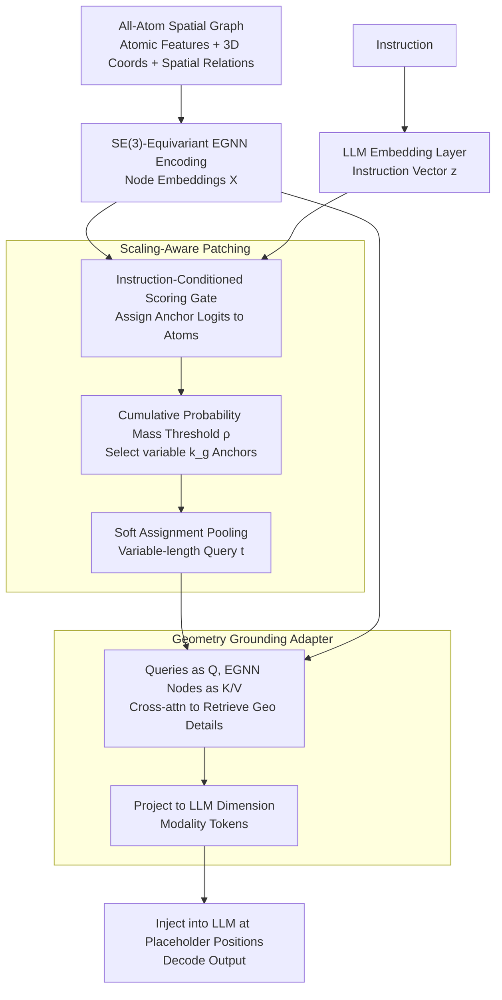

# Scaling-Aware Adapter for Structure-Grounded LLM Reasoning

**Conference**: ICML2026  
**arXiv**: [2602.02780](https://arxiv.org/abs/2602.02780)  
**Code**: https://github.com/zihao-jing/Cuttlefish  
**Area**: Multimodal VLM / Structure-Language Alignment / All-Atom LLM  
**Keywords**: Cuttlefish, Scaling-Aware Patching, Geometry Grounding, Structural Hallucination, EGNN, Q-Former Alternative

## TL;DR
Cuttlefish replaces the "fixed-length query tokens" of Q-Former with "instruction-conditioned patch tokens" that grow adaptively based on structural complexity. It utilizes cross-attention to inject geometric features extracted by an EGNN as modality tokens into the LLM, simultaneously reducing hallucinations and supporting scaling across four all-atom modalities: molecules, proteins, DNA, and RNA, outperforming various modality-specific baselines.

## Background & Motivation

**Background**: When extending LLMs to "scientific structure" modalities such as molecules, proteins, and nucleic acids, mainstream approaches generally fall into two categories: feeding SMILES or amino acid sequences directly as text (MolT5, ProtST, RNA-GPT), or using Q-Former-style "fixed-length learnable query tokens" to compress graph structures into a fixed set of tokens for the LLM (3D-MoLM, Mol-Llama, ProtChatGPT, etc.).

**Limitations of Prior Work**: The authors expose the weaknesses of the Q-Former approach through a straightforward Mol-Instructions captioning experiment (Fig. 1). When molecules are binned by length, **all metrics collapse on long molecules**. The cause is fundamental: a fixed 32/64 query tokens is "wasteful" for small molecules and "over-compressed" for large ones. Furthermore, hallucination tests in Table 1 show that sequence-only models (without geometry) exhibit hallucination rates as high as 0.28–0.34 on 200 molecules/proteins, significantly higher than versions with structure (0.06–0.12).

**Key Challenge**: (1) **Budget scaling**: Structural complexity spans tens to thousands of atoms, making fixed query lengths naturally mismatched. (2) **Structural hallucination**: Sequence inputs lack geometric encoding, forcing the LLM to "hallucinate" long-range spatial relationships. Q-Former couples these contradictions, making neither solvable.

**Goal**: To resolve both budget adaptation and geometric grounding within a unified connector that can generalize across four all-atom modalities.

**Key Insight**: The authors observe that query tokens should be "instruction-conditioned"—given different questions, the subset of atoms to focus on for the same molecule differs. Moreover, the number of queries should "grow" with the amount of structural information rather than being fixed a priori.

**Core Idea**: An instruction-conditioned gate selects anchor atoms, and a cumulative probability mass threshold $\rho$ determines how many anchors to take for each graph. After soft-assigning patches, weighted pooling generates variable-length queries. These queries then "retrieve" geometric details from the full-node EGNN embeddings via cross-attention before being projected as modality tokens into the LLM.

## Method

### Overall Architecture
Cuttlefish aims to replace the "fixed-length query" connector of Q-Former. Given an all-atom spatial graph (atomic features + 3D coordinates + spatial relationships) and an instruction, it compresses the graph into a set of modality tokens whose **quantity varies with structural complexity** and contains verifiable geometric evidence. Specifically: the spatial graph is first processed by an SE(3)-equivariant EGNN to encode node embeddings $\boldsymbol{X}\in\mathbb{R}^{N\times D_{enc}}$, and the instruction tokens pass through the LLM embedding layer to get $\boldsymbol{z}$. An instruction-conditioned scoring gate assigns anchor logits to each atom. Using a cumulative probability mass threshold $\rho$, a variable number of $k_g$ anchors are selected and pooled into variable-length queries $\boldsymbol{t}$ via soft assignment. These queries then "retrieve" geometric details averaged out during pooling through cross-attention from the full-node EGNN embeddings, refining them into modality tokens $\widehat{\boldsymbol{T}}$. These are inserted into the LLM at placeholder positions in the instruction sequence for decoding. The entire connector is implemented through a three-stage frozen training protocol.

### Key Designs

**1. Scaling-Aware Patching: Letting Query Quantity "Grow" with Structural Information**

Fixed 32/64 query tokens are wasteful for small molecules and over-compressed for large ones, leading to performance collapse on long molecules—this is the first pain point solved here. Cuttlefish makes the query count a function of the instruction: a scoring gate calculates anchor logits $\boldsymbol{\ell}=G_{anc}(\boldsymbol{z},\boldsymbol{X},\boldsymbol{b})$. After applying $\mathrm{Softmax}$ for each graph, they are sorted by probability, and the **minimum $k_g$ is chosen such that the cumulative probability mass reaches a target** $\sum_{j=1}^{k_g}\boldsymbol{prob}_{\pi_j}\geq \rho$. This step is crucial—$k_g$ is no longer a hyperparameter but is determined by "how many anchors are needed to satisfy information density $\rho$." A sparse small molecule might only need $k_g=4$, while a complex protein automatically scales to dozens. After selecting anchors, each is expanded into a soft patch using spatial distance and semantic bias for soft assignment weights:

$$\boldsymbol{W}_{i,a}=\frac{\exp(-\|\mathbf{P}_i-\mathbf{P}_a\|_2^2+\boldsymbol{\ell}_a)}{\sum_{a'}\exp(-\|\mathbf{P}_i-\mathbf{P}_{a'}\|_2^2+\boldsymbol{\ell}_{a'})}$$

Finally, normalized pooling produces variable-length queries $\boldsymbol{t}_a=\sum_i \boldsymbol{W}_{i,a}\boldsymbol{X}_i/\sum_j\boldsymbol{W}_{j,a}$. Notably, the anchor logit $\boldsymbol{\ell}_a$ enters in two places: determining "which atoms to select as anchors" and acting as a softmax bias for "how large a territory each anchor covers." Highly relevant anchors automatically gain larger receptive fields, effectively coupling "attention" and "territory size" with the same set of logits.

**2. Geometry Grounding Adapter: Retrieving Geometric Details Lost in Pooling**

The second pain point is structural hallucination—sequence-only inputs do not encode geometry, forcing the LLM to invent long-range spatial relationships. Even with the previous pooling step, in-patch weighted averaging flattens high-resolution geometric features like bond angles, distances, and long-range contacts. This step is not a second anchor selection but a retrieval-and-refinement process: summary queries $\boldsymbol{t}$ are projected to $\mathcal{Q}$, and full-node EGNN embeddings $\boldsymbol{X}$ are projected to $\mathcal{K},\mathcal{V}$. Through $L_f$ layers of fusion blocks (self-attn → cross-attn → FFN), they are projected to the LLM dimension $D_{LLM}$ to obtain $\widehat{\boldsymbol{T}}$. During injection, the modality placeholders $y_{ins}$ in the instruction sequence are located at position $\boldsymbol{p}$, where $\widehat{\boldsymbol{T}}$ is embedded with synchronized attention/label masks. Since anchors have already locked onto instruction-relevant regions, the cross-attn focuses on restoring the averaged geometric evidence within those regions. This is the physical basis for reducing hallucinations: each modality token corresponds to verifiable geometric details rather than an abstract learnable vector.

**3. Three-Stage Training Protocol: Encoder, then Connector, then LLM**

To align new modalities without destroying the LLM's language priors, training is split into three frozen stages. First, the EGNN encoder is pre-trained independently, optimizing atom type prediction, distance regression, and directional noise denoising goals: $\mathcal{L}_{enc}=\mathcal{L}_{type}+\lambda_d\mathcal{L}_{dist}+\lambda_u\mathcal{L}_{dir}$. Next, in the Modality Alignment phase, EGNN and LLM are frozen, training only the Scaling-Aware Patching and Geometry Grounding Adapter. Finally, in the LLM Adaptation phase, a small learning rate is used to unfreeze the LLM for final fine-tuning. Unlike the Q-Former lineage, which necessitates heavy contrastive pre-training for alignment, Cuttlefish's queries are dynamically generated with intrinsic geometric semantics, allowing alignment through instruction supervision alone and ensuring language priors are preserved.

### Loss & Training
The encoder phase is as described; the subsequent two phases use standard next-token cross-entropy for instruction tuning on the custom GEO-AT dataset. The paper also provides two theoretical analyses in the appendix—"Instruction-Weighted Compression Distortion Bound" and "Geometry Grounding Reduces Bayes Risk"—providing formal support for variable-length patching and geometric injection.

## Key Experimental Results

### Main Results

Comparison against general LLM baselines on the custom GEO-AT all-atom benchmark (METEOR / BERTScore, averaged across 4 modalities):

| Backbone | Molecule METEOR | Protein METEOR | DNA METEOR | RNA METEOR | Average METEOR |
|---|---|---|---|---|---|
| Llama-3.1-8B-Instruct (Sequence only) | 0.229 | 0.178 | 0.175 | 0.175 | 0.186 |
| Mistral-3-8B-Reasoning (Reasoning, tokenizer-enhanced) | 0.185 | 0.192 | 0.149 | 0.288 | 0.220 |
| **Cuttlefish + Llama-3.1-8B** | **0.391** | **0.417** | **0.529** | 0.403 | **0.428** |
| **Cuttlefish + Qwen3-8B** | 0.389 | 0.377 | 0.391 | **0.491** | **0.428** |

On the Mol-Instructions captioning task (the length-binning scenario where Q-Former failed), Cuttlefish flattens the metrics across all length bins, with particularly significant gains in the long-molecule range compared to Mol-Llama. In functional group hallucination tests, Mol-Llama with Cuttlefish reduced HR from 0.28 to 0.12, and ProtChatGPT reduced it from 0.34 to 0.10.

### Ablation Study

Core ablations provided in the paper focus on the two main modules and training stages:

| Configuration | Phenomenon | Explanation |
|---|---|---|
| Complete Cuttlefish | Avg METEOR 0.428 | Standard configuration |
| w/o Scaling-Aware Patching (revert to fixed queries) | Significant drop in long molecules | Confirms Q-Former's failure mode in Fig. 1 |
| w/o Geometry Grounding Adapter | Hallucination rate increases | Cross-attn for geometric detail retrieval is essential |
| Skip LLM Adaptation phase (train connector only) | Performance drop | The language side also needs adaptation space for new modalities |
| Cross backbone (Qwen2.5/Llama-3/Mistral-3/GLM-4/Qwen3/R1) | Consistent improvement | Indicates connector design is decoupled from specific LLMs |

### Key Findings
- **Variable-length query is key**: Fixed query lengths are wasteful for small molecules and collapse for large ones; adaptive allocation via cumulative probability mass flattens performance across all length intervals.
- **Geometric grounding directly reduces hallucinations**: Across all 4 modalities, Cuttlefish reduces hallucination rates to 1/2 or 1/3 of non-structural models, a benefit obtained "for free" without explicit anti-hallucination loss.
- **No contrastive pre-training required**: Unlike Q-Former series which require heavy alignment, Cuttlefish queries carry intrinsic geometric semantics, allowing alignment via direct instruction tuning, which is much more efficient.
- **Backbone agnostic**: Benefits are observed from 7B to 9B, and for both reasoning and non-reasoning models (Qwen / Llama / Mistral / GLM), indicating a universal "connector layer" improvement.

## Highlights & Insights
- **Challenge to Q-Former's "Fixed Budget"**: While query count was previously treated as a hyperparameter, this work makes it a "function of instruction-conditioned cumulative probability mass," effectively turning the token budget into a learnable adaptive quantity—a concept that could benefit general VLMs (assigning more tokens to complex images or videos).
- **Dual Role of Anchor Logits**: Reusing the same set of logits to drive both selection and soft assignment weights ($\boldsymbol{W}_{i,a}$ bias) elegantly couples "importance" with "receptive field."
- **Observability of Geometric Hallucinations**: By constructing functional group hallucination tests (HR/HPM/AR), the authors make "structural hallucination" a quantifiable metric—a highly valuable benchmarking approach for scientific LLMs.
- **Three-Stage Frozen Strategy**: Decoupling "alignment" from "language capability preservation" by training the connector before LLM fine-tuning allows for easy migration to any project adding new modalities to an LLM.

## Limitations & Future Work
- **Dependence on Structure Availability**: Proteins rely on AlphaFold2 fallbacks, and molecules/nucleic acids also require 3D coordinates. In sequence-only scenarios, geometric grounding reverts to pure sequence encoding.
- **Manual mass threshold $\rho$**: While $k_g$ is adaptive, the threshold $\rho$ itself remains a hyperparameter, and the paper does not detail its sensitivity regarding the budget-performance trade-off.
- **EGNN Capacity as a Bottleneck**: All geometric information passes through the EGNN; the expressiveness of equivariant GNNs on massive protein complexes is an open question. Replacing it with a stronger equivariant Transformer might further raise the performance ceiling.
- **Lack of Inference-Time Budget Control**: Variable-length queries mean different samples occupy different amounts of KV-cache, posing engineering challenges for batching and latency control during deployment.

## Related Work & Insights
- **vs Q-Former / 3D-MoLM / Mol-Llama**: While they use a fixed number of learnable query tokens, Cuttlefish makes the quantity a function of cumulative probability mass, turning the "compression bottleneck" from an architectural constant into a data-dependent variable. Queries are no longer abstract learnable vectors but pooled results of anchor patches with geometric meaning.
- **vs Graph2Token**: Graph2Token mitigates fixed capacity issues with a discretized bridge but still suffers quantization loss; Cuttlefish employs "continuous variable length + soft assignment," theoretically preserving more information.
- **vs ChatNT**: ChatNT unified DNA/RNA/Protein but relied on sequence-only inputs. Cuttlefish extends the scope to all-atom structures including geometry and deepens the "unified interface."

## Rating
- Novelty: ⭐⭐⭐⭐ Reimagining the modality connector with "variable-length instruction-conditioned queries" is a significant refinement of the Q-Former paradigm.
- Experimental Thoroughness: ⭐⭐⭐⭐⭐ Extremely comprehensive with 4 modalities × multiple backbones × analyses on hallucination/scaling/ablation/structural availability.
- Writing Quality: ⭐⭐⭐⭐ The opening with Challenge 1/2 + Fig. 1/Tab. 1 is very persuasive; the method is clearly explained via algorithmic diagrams and formulas.
- Value: ⭐⭐⭐⭐ Provides a universal connector for "LLM + Scientific Structure" and the underlying concepts (variable-length queries, geometric retrieval) are transferable to general VLMs.

<!-- RELATED:START -->

## Related Papers

- [\[ICML 2026\] Reasoning Structure of Large Language Models](reasoning_structure_of_large_language_models.md)
- [\[ACL 2026\] Budget-Aware Anytime Reasoning with LLM-Synthesized Preference Data](../../ACL2026/llm_reasoning/budget-aware_anytime_reasoning_with_llm-synthesized_preference_data.md)
- [\[ICLR 2026\] From Assumptions to Actions: Turning LLM Reasoning into Uncertainty-Aware Planning](../../ICLR2026/llm_reasoning/from_assumptions_to_actions_turning_llm_reasoning_into_uncertainty-aware_plannin.md)
- [\[ICLR 2026\] SceneCOT: Eliciting Grounded Chain-of-Thought Reasoning in 3D Scenes](../../ICLR2026/llm_reasoning/scenecot_eliciting_grounded_chain-of-thought_reasoning_in_3d_scenes.md)
- [\[ACL 2026\] SHAPE: Stage-aware Hierarchical Advantage via Potential Estimation for LLM Reasoning](../../ACL2026/llm_reasoning/shape_stage-aware_hierarchical_advantage_via_potential_estimation_for_llm_reason.md)

<!-- RELATED:END -->
