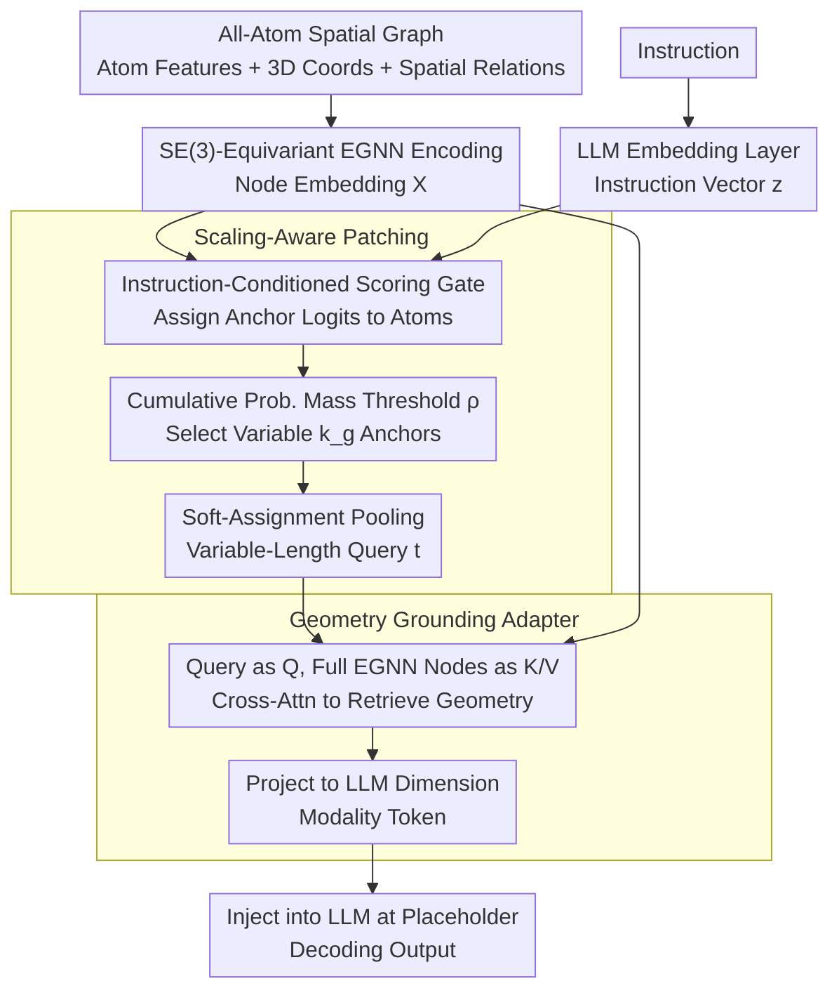

# Scaling-Aware Adapter for Structure-Grounded LLM Reasoning

**Conference**: ICML2026  
**arXiv**: [2602.02780](https://arxiv.org/abs/2602.02780)  
**Code**: https://github.com/zihao-jing/Cuttlefish  
**Area**: Multimodal VLM / Structure-Language Alignment / All-Atom LLM  
**Keywords**: Cuttlefish, Scaling-Aware Patching, Geometry Grounding, Structural Hallucination, EGNN, Q-Former Alternative  

## TL;DR
Cuttlefish replaces the "fixed-length query tokens" typical of Q-Former with "instruction-conditioned patch tokens" that grow adaptively based on structural complexity. It utilizes cross-attention to inject geometric features extracted by an EGNN as modality tokens into the LLM, effectively reducing hallucinations and handling scaling across four all-atom modalities: molecules, proteins, DNA, and RNA, outperforming several modality-specific baselines.

## Background & Motivation

**Background**: When extending LLMs to "scientific structure" modalities such as molecules, proteins, and nucleic acids, mainstream approaches generally fall into two categories: feeding SMILES or amino acid sequences directly as text (e.g., MolT5, ProtST, RNA-GPT), or using Q-Former-style "fixed-length learnable query tokens" to compress graph structures into a fixed set of tokens for the LLM (e.g., 3D-MoLM, Mol-Llama, ProtChatGPT).

**Limitations of Prior Work**: The authors expose the weaknesses of the Q-Former approach through a direct Mol-Instructions captioning experiment (Fig. 1). After binning molecules by length, **all metrics collapse on long molecules**. The reason is clear: fixed 32/64 query tokens result in "extravagance" for small molecules and "over-compression" for large ones. Simultaneously, hallucination tests in Table 1 show that sequence-only models (without geometry) exhibit hallucination rates as high as 0.28–0.34 on 200 molecules/proteins, significantly higher than structure-aware versions (0.06–0.12).

**Key Challenge**: (1) **Budget scaling**: Structural complexity spans from dozens to thousands of atoms, making fixed query lengths inherently mismatched. (2) **Structural hallucination**: Sequence inputs fail to encode geometry, forcing the LLM to "hallucinate" long-range spatial relationships. Q-Former couples these two contradictions, making neither solvable.

**Goal**: To simultaneously address budget adaptation and geometric grounding within a unified connector capable of handling four all-atom modalities.

**Key Insight**: The authors observe that query tokens should be "instruction-conditioned"—given different questions, the subset of atoms to focus on for the same molecule should differ. Furthermore, the number of queries should "grow" with the amount of structural information rather than being fixed in advance.

**Core Idea**: An instruction-conditioned gate selects anchor atoms, and a cumulative probability mass threshold $\rho$ determines the number of anchors per graph. After soft-patch assignment, weighted pooling yields variable-length queries. These queries then "retrieve" geometric details from EGNN node embeddings via cross-attention, finally being projected as modality tokens for LLM injection.

## Method

### Overall Architecture
Cuttlefish aims to replace the "fixed-length query" connector of Q-Former. Given an all-atom spatial graph (atomic features + 3D coordinates + spatial relations) and an instruction, it compresses the graph into a set of modality tokens whose **quantity varies with structural complexity** and which carry verifiable geometric evidence. The spatial graph first passes through an SE(3)-equivariant EGNN to encode node embeddings $\boldsymbol{X}\in\mathbb{R}^{N\times D_{enc}}$, while instruction tokens pass through the LLM embedding layer to get $\boldsymbol{z}$. Subsequently, an instruction-conditioned scoring gate assigns anchor logits to each atom. A cumulative probability mass threshold $\rho$ selects $k_g$ anchors to perform soft-assignment pooling into variable-length queries $\boldsymbol{t}$. These queries then "retrieve" geometric details smoothed out by pooling from the full EGNN node embeddings via cross-attention, refining them into modality tokens $\widehat{\boldsymbol{T}}$, which are inserted into the placeholder positions within the instruction sequence for LLM decoding. The entire connector is implemented through a three-stage frozen training protocol.

### Key Designs

**1. Scaling-Aware Patching: Allowing query counts to "grow" with structural information**

Fixed 32/64 query tokens lead to waste for small molecules and over-compression for large ones, causing metrics to collapse on long molecules—the first pain point this paper addresses. Cuttlefish makes the query count a function of the instruction: first, a scoring gate computes anchor logits $\boldsymbol{\ell}=G_{anc}(\boldsymbol{z},\boldsymbol{X},\boldsymbol{b})$. After applying $\mathrm{Softmax}$ for each graph and sorting probabilities in descending order, it selects the **minimum $k_g$ such that the cumulative probability mass reaches the threshold**: $\sum_{j=1}^{k_g}\boldsymbol{prob}_{\pi_j}\geq \rho$. This step is critical—$k_g$ is no longer a hyperparameter but is determined by "how many anchors are needed to satisfy information mass $\rho$." Sparse small molecules might only need $k_g=4$, while complex proteins automatically scale to dozens. After selecting anchors, each is expanded into a soft patch, using spatial distance and semantic bias to calculate soft-assignment weights:

$$\boldsymbol{W}_{i,a}=\frac{\exp(-\|\mathbf{P}_i-\mathbf{P}_a\|_2^2+\boldsymbol{\ell}_a)}{\sum_{a'}\exp(-\|\mathbf{P}_i-\mathbf{P}_{a'}\|_2^2+\boldsymbol{\ell}_{a'})}$$

Finally, normalized pooling creates variable-length queries $\boldsymbol{t}_a=\sum_i \boldsymbol{W}_{i,a}\boldsymbol{X}_i/\sum_j\boldsymbol{W}_{j,a}$. Notably, the anchor logit $\boldsymbol{\ell}_a$ enters two places: it determines "which atoms to select as anchors" and acts as a softmax bias to determine "how large a territory each anchor covers"—highly relevant anchors automatically gain a larger receptive field, effectively binding "attention" and "territory size" with the same logit set.

**2. Geometry Grounding Adapter: Retrieving geometric details lost during pooling**

The second pain point is structural hallucination—sequence-only inputs lack geometric encoding, forcing the LLM to invent long-range spatial relations. Even with the previous pooling step, in-patch weighted averaging flattens high-resolution geometry like bond angles, distances, and long-range contacts. This step is a retrieval-and-refinement process: summary queries $\boldsymbol{t}$ are projected to $\mathcal{Q}$, and full EGNN node embeddings $\boldsymbol{X}$ are projected to $\mathcal{K},\mathcal{V}$. Through $L_f$ layers of fusion blocks (self-attn → cross-attn → FFN), they are projected to the LLM dimension $D_{LLM}$ to obtain $\widehat{\boldsymbol{T}}$. During injection, modality placeholders $y_{ins}$ are located at positions $\boldsymbol{p}$ in the instruction sequence, and $\widehat{\boldsymbol{T}}$ is embedded with synchronized attention/label masks. Since anchors have already locked onto instruction-relevant regions, the cross-attn's job is to recover averaged-out geometric evidence within those regions. This is the physical basis for reducing hallucinations: each modality token corresponds to verifiable geometric details rather than an abstract learnable vector.

**3. Three-stage Training Protocol: Encoder first, then connector, finally LLM**

To align new modalities without destroying the LLM's language prior, training is split into three frozen stages. First, the EGNN encoder is pre-trained independently, optimizing atom type prediction, distance regression, and directional noise denoising: $\mathcal{L}_{enc}=\mathcal{L}_{type}+\lambda_d\mathcal{L}_{dist}+\lambda_u\mathcal{L}_{dir}$. Second, in the Modality Alignment phase, both EGNN and LLM are frozen, while only Scaling-Aware Patching and the Geometry Grounding Adapter are trained. Finally, in the LLM Adaptation phase, a small learning rate is used to unfreeze the LLM for final fine-tuning. Unlike the Q-Former lineage, which requires heavy contrastive pre-training for alignment, Cuttlefish queries are structurally dynamic and carry geometric semantics, allowing alignment via direct instruction supervision and ensuring language priors are preserved through staged freezing.

### Loss & Training
The encoder phase is as described; the latter two stages use standard instruction tuning with next-token cross-entropy, trained on the self-collected GEO-AT dataset. The paper also provides two theoretical analyses in the appendix—"Instruction-Weighted Compression Distortion Bound" and "Geometry Grounding Reduces Bayes Risk"—providing formal support for variable-length patching and geometric injection.

## Key Experimental Results

### Main Results

Comparison against general LLM baselines on the GEO-AT all-atom benchmark (METEOR / BERTScore, average across 4 modalities):

| Backbone | Molecule METEOR | Protein METEOR | DNA METEOR | RNA METEOR | Average METEOR |
|---|---|---|---|---|---|
| Llama-3.1-8B-Instruct (Sequence-only) | 0.229 | 0.178 | 0.175 | 0.175 | 0.186 |
| Mistral-3-8B-Reasoning (Reasoning, Tokenizer-enhanced) | 0.185 | 0.192 | 0.149 | 0.288 | 0.220 |
| **Ours + Llama-3.1-8B** | **0.391** | **0.417** | **0.529** | 0.403 | **0.428** |
| **Ours + Qwen3-8B** | 0.389 | 0.377 | 0.391 | **0.491** | **0.428** |

On the Mol-Instructions captioning task (the length-binning scenario where Q-Former models collapsed), Cuttlefish levels the metrics across all length bins, with particularly significant gains in the long-molecule range compared to Mol-Llama. In functional group hallucination tests, Mol-Llama equipped with Cuttlefish reduced HR from 0.28 to 0.12, and ProtChatGPT reduced it from 0.34 to 0.10.

### Ablation Study

Core ablations provided in the paper focus on the two main modules and training stages:

| Configuration | Observation | Explanation |
|---|---|---|
| Full Cuttlefish | Avg METEOR 0.428 | Standard configuration |
| w/o Scaling-Aware Patching (Fix query length) | Significant drop in long molecules | Confirms Q-Former failure mode in Fig. 1 |
| w/o Geometry Grounding Adapter | Increased hallucination rate | Cross-attn for geometric detail retrieval is essential |
| Skip LLM Adaptation Phase (Linker only) | Performance degradation | Language side also requires adaptation for new modalities |
| Across Backbones (Qwen, Llama, Mistral, etc.) | Consistent Gain | Shows connector design is decoupled from specific LLM |

### Key Findings
- **Variable-length query is key**: Fixed lengths are wasteful for small structures and fail for large ones; adaptive allocation via cumulative mass levels performance across all length intervals.
- **Geometry grounding directly reduces hallucination**: Across all 4 modalities, Cuttlefish reduces hallucination rates to 1/2 or 1/3 of non-structural models, achieved "for free" without an explicit anti-hallucination loss.
- **No contrastive pre-training required**: Unlike Q-Former series which require heavy alignment, Cuttlefish queries possess inherent geometric semantics, allowing alignment through simple instruction tuning, which is much more efficient.
- **Cross-backbone generality**: Benefits are seen from 7B to 9B models, across reasoning and non-reasoning types, and throughout the Qwen/Llama/Mistral/GLM families, proving it a universal enhancement for the "connector layer."

## Highlights & Insights
- **Heavily challenges the "fixed budget" of Q-Former**: While query count was previously treated as a hyperparameter, this work makes it a "function of instruction-conditioned cumulative mass threshold," essentially turning the token budget into a learnable adaptive quantity—a concept that could benefit general VLMs (e.g., more tokens for complex images/videos).
- **Dual-use anchor logits**: Reusing the same logit set for both selection and soft-assignment weights ($\boldsymbol{W}_{i,a}$ bias) naturally couples "importance" with "receptive field."
- **Observability of geometric hallucination**: The authors specifically constructed hallucination tests for functional groups (HR/HPM/AR), making "structural hallucination" a quantifiable metric—a highly valuable benchmarking approach for scientific LLMs.
- **Three-stage freezing strategy**: Moving from connector-only to LLM fine-tuning decouples "alignment" from "language capability preservation," which is transferable to any project adding new modalities to LLMs.

## Limitations & Future Work
- **Reliance on structural availability**: Proteins rely on AlphaFold2 fallbacks, and molecules/nucleic acids require 3D coordinates. In sequence-only real-world scenarios, geometry grounding degrades to pure sequence encoding, diminishing advantages.
- **Mass threshold $\rho$ is hand-tuned**: While $k_g$ is adaptive, the threshold $\rho$ itself remains a hyperparameter, and its sensitivity regarding the budget-performance trade-off is not discussed in detail.
- **EGNN capacity as a bottleneck**: All geometric info passes through the EGNN first; the expressiveness of equivariant GNNs on massive protein complexes is an open question. Replacing it with a stronger equivariant Transformer might raise the performance ceiling.
- **Lack of inference-time budget control**: Variable-length queries mean different samples consume different amounts of KV-cache, posing engineering challenges for batching and maximum latency control during deployment.

## Related Work & Insights
- **vs Q-Former / 3D-MoLM / Mol-Llama**: These use fixed numbers of learnable queries, whereas Cuttlefish makes the count a function of cumulative mass, turning the compression bottleneck from an architectural constant into a data-dependent variable; queries are also pooled anchor patches with geometric meaning rather than abstract vectors.
- **vs Graph2Token**: Graph2Token uses a discretization bridge to mitigate fixed capacity issues but still suffers from quantization loss; Cuttlefish employs "continuous variable length + soft assignment," theoretically preserving more information.
- **vs ChatNT**: ChatNT unifies DNA/RNA/Protein but uses sequence-only input; Cuttlefish extends the modality range to all-atom structures with geometry and deepens the "unified interface."

## Rating
- Novelty: ⭐⭐⭐⭐ Implementing "variable instruction-conditioned queries" into the modality connector is a serious refinement of the Q-Former paradigm.
- Experimental Thoroughness: ⭐⭐⭐⭐⭐ 4 modalities × multiple backbones × hallucination/scaling/ablation/structural availability analyses make for a complete evaluation.
- Writing Quality: ⭐⭐⭐⭐ The opening with Challenge 1/2 and Fig 1/Tab 1 is very persuasive; the method is clearly explained via algorithmic diagrams and formulas.
- Value: ⭐⭐⭐⭐ Provides a universal connector for the "LLM + Scientific Structure" direction; concepts (variable query, geometric retrieval) are transferable to general VLMs.

<!-- RELATED:START -->

## Related Papers

- [\[ICML 2026\] Reasoning Structure of Large Language Models](reasoning_structure_of_large_language_models.md)
- [\[ACL 2026\] Budget-Aware Anytime Reasoning with LLM-Synthesized Preference Data](../../ACL2026/llm_reasoning/budget-aware_anytime_reasoning_with_llm-synthesized_preference_data.md)
- [\[ACL 2026\] SHAPE: Stage-aware Hierarchical Advantage via Potential Estimation for LLM Reasoning](../../ACL2026/llm_reasoning/shape_stage-aware_hierarchical_advantage_via_potential_estimation_for_llm_reason.md)
- [\[ACL 2026\] Reliability-Aware Adaptive Self-Consistency for Efficient Sampling in LLM Reasoning](../../ACL2026/llm_reasoning/reliability-aware_adaptive_self-consistency_for_efficient_sampling_in_llm_reason.md)
- [\[ICML 2026\] Dynamics Within Latent Chain-of-Thought: An Empirical Study of Causal Structure](dynamics_within_latent_chain-of-thought_an_empirical_study_of_causal_structure.md)

<!-- RELATED:END -->
