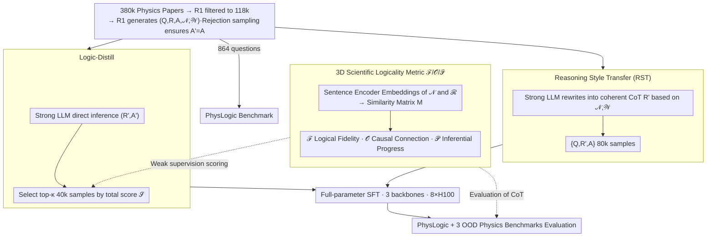

# Scientific Logicality Enriched Methodology for LLM Reasoning: A Practice in Physics

**Conference**: ICML2026  
**arXiv**: [2605.17104](https://arxiv.org/abs/2605.17104)  
**Code**: https://github.com/ScienceOne-AI/PhysLogic  
**Area**: LLM Reasoning / Scientific Reasoning / Physics QA  
**Keywords**: Scientific Logicality, Logicality Evaluation, SFT Data Filtering, Physics Reasoning, PhysLogic

## TL;DR
This paper introduces the first systematic study of "logicality" in LLM scientific reasoning. It proposes a three-dimensional evaluation metric—"Logical Fidelity / Causal Connection / Inferential Progress"—and constructs two SFT data sampling methods based on these metrics: Style Transfer (RST) and Logic Distillation (Logic-Distill). These methods significantly improve both logicality and answer accuracy for 7B models on the self-built PhysLogic benchmark and three public physics benchmarks.

## Background & Motivation

**Background**: Current research applying LLMs to scientific QA primarily focuses on "scaling data + scaling long CoT." By collecting larger-scale math/physics/chemistry corpora with long chains of thought to perform SFT or RL on reasoning models like DeepSeek-R1 or o1, researchers use the final accuracy on QA benchmarks like GPQA, SciBench, and PhysReason as the sole evaluation metric.

**Limitations of Prior Work**: The authors observe that while reasoning chains of models like R1 on physics problems are long, they are often a patchwork of "recall + repetition + self-reflection." They lack the rigorous "logical chain" used by professionals, which spans problem formalization, model construction, evidence generation, evidence evaluation, and conclusion. Figure 1 juxtaposes R1's reasoning process with that of a physicist on the same problem, showing a visible difference.

**Key Challenge**: The essence of scientific reasoning (logicality)—a set of concepts, methods, and principles ensuring valid reasoning steps and reliable conclusions—has been completely lost in existing "end-to-end NLP task" modeling. Relying solely on final answer correctness cannot explain where a CoT fails, nor can it guide training to improve reasoning quality.

**Goal**: (1) Establish a quantifiable scientific logicality evaluation method; (2) Construct high-logicality SFT data based on these metrics; (3) Verify whether stronger logicality translates into better answer performance.

**Key Insight**: Drawing from Fischer et al.'s definition of "cognitive activities" in scientific inquiry, the solving process of a scientific problem is decomposed into several "logical nexuses" $\mathcal{N}=\{\nu_1,\dots,\nu_n\}$ assigned with importance weights $\mathcal{W}=\{w_1,\dots,w_n\}$. The model's CoT is segmented into a sentence-level sequence $\mathcal{R}=\{r_1,\dots,r_m\}$. Both are embedded into a vector space using a sentence encoder, converting "logicality" into computable geometric relationships.

**Core Idea**: A similarity matrix $M\in\mathbb{R}^{n\times m}$ between "sentences vs. logical nexuses" is used to characterize *content coverage, causal order, and forward progress*, serving as a filtering signal for SFT training data.

## Method

### Overall Architecture
The core objective is to quantify CoT logicality and use it to select training data. The method follows two main paths. **Evaluation Path**: Given a scientific problem with ground-truth logical nexuses $(\mathcal{N},\mathcal{W})$ and a model's reasoning $\mathcal{R}$, all-MiniLM-L6-v2 encodes nexuses and sentences into vectors $V_\mathcal{N}, V_\mathcal{R}$ to compute the similarity matrix $M$. Three scores $\mathcal{F}, \mathcal{O}, \mathcal{P}$ are then derived from $M$. **Data Path**: 380k physics papers are crawled from arXiv and journals. R1 filters out reviews/tools, leaving 118k papers. R1 then generates $(Q,R,A,\mathcal{N},\mathcal{W})$ quintuples via multi-turn dialogue (rejection sampling ensures $A'=A$ with up to 5 retries). 864 items are kept for the PhysLogic benchmark, while the remaining 80k and 40k are used for RST and Logic-Distill sampling strategies for SFT. Finally, full-parameter SFT (lr $5\times10^{-6}$, cosine, 2 epochs, cutoff 32768) is performed via LlamaFactory on 8×H100 for three backbones: Llama-3.1-8B, Qwen2.5-7B-Instruct, and DeepSeek-R1-Distill-Qwen-7B, followed by closed-loop evaluation.

### Key Designs

**1. 3D Scientific Logicality Metrics $\mathcal{F}, \mathcal{O}, \mathcal{P}$**: Decomposing logicality into independent components.
Traditional accuracy only judges the final answer, while process metrics (like ProcessBench) only look at local step correctness. Both fail to distinguish between "correct answer with random reasoning" and "correct answer with rigorous reasoning." This method performs greedy one-to-one matching on $M$ (threshold $\tau$) to obtain a set of matched pairs $\mathcal{C}$, then calculates three components. **Logical Fidelity** ($\mathcal{F}$) uses the harmonic mean of weighted recall $\rho=\sum_{(i,j)\in\mathcal{C}} w_i M_{ij}/\sum_k w_k$ and precision $\pi=|\mathcal{C}|/m$, measuring the completeness of nexus coverage. **Causal Connection** ($\mathcal{O}$) calculates the "semantic center of gravity" $P_i=\sum_j j\cdot M_{ij}/\sum_j M_{ij}$ for each nexus $\nu_i$ to determine its sentence position, then computes the weighted proportion of nexus pairs where the actual order matches the ground truth. **Inferential Progress** ($\mathcal{P}$) represents each step $r_j$ as a similarity vector $\vec{S_j}$ against all nexuses, defining the novelty of a step as $1-\max_{k<j}\cos(\vec{S_j},\vec{S_k})$. $\mathcal{P}$ is the average novelty across the path. This identifies failures like "missing key steps," "inverted order," and "self-looping without progress."

**2. Reasoning Style Transfer (RST)**: Translating discrete logical skeletons into physicist-style natural CoT.
Direct distillation of R1's native CoT (Direct-Distill) risks inheriting bad habits like repetition and self-doubt. Conversely, listing nexuses as bullets lacks natural flow. RST adopts a middle path: a strong reasoning LLM $\mathcal{L}$ performs style transfer $R'=\mathcal{L}(Q,\mathcal{N},\mathcal{W})$, writing a coherent, first-person reasoning chain with `<think>` tags. The final SFT sample is $\{Q,R',A\}$, where $A$ is taken from the paper. This ensures the sample occupies both "rigorous logic from the paper" and "natural language from a strong model."

**3. Logic-Distill**: Using 3D scores as weak supervision to select rigorous CoTs.
RST requires ground-truth nexuses, which is computationally expensive. Logic-Distill uses the 3D metrics as a "ranking-only" weak supervision signal: $\mathcal{L}$ directly infers $(R',A')$ for $Q$, and $\pi,\rho,\mathcal{O},\mathcal{P}$ are computed for $R'$. To eliminate scale differences, z-score normalization and sigmoid transformation are applied to each component: $\tilde X=\sigma((X-\mu_X)/\sigma_X)$. These are fused into a total score:
$$\mathcal{S}=\delta_\mathcal{F}\cdot\frac{2\tilde\pi\tilde\rho}{\tilde\pi+\tilde\rho}+\delta_\mathcal{O}\tilde{\mathcal{O}}+\delta_\mathcal{P}\tilde{\mathcal{P}}$$
Samples are selected using the top-$\kappa$ percentile. This identifies the 40k samples that *happen to be logically rigorous* from the strong model's output, approaching the performance of full distillation with half the data.

### Loss & Training
Standard cross-entropy SFT is used without auxiliary losses. Logicality is injected via data selection. Full-parameter fine-tuning uses LlamaFactory, BF16, DeepSpeed ZeRO-3, FlashAttention-2, gradient checkpointing, per-device batch=1, grad accum=2, cutoff 32768, 2 epochs, seed 42, and warmup 0.03 on 8×H100.

## Key Experimental Results

### Main Results (In-domain, PhysLogic benchmark)
Ours (RST) Gain over the best baseline (Averages of $\mathcal{F},\mathcal{O},\mathcal{P}$ and Final Acc):

| Backbone | Runner-up Baseline | Avg Logicality Δ | Acc Δ |
|----------|----------------|--------------|-------|
| Llama-3.1-8B | MegaScience (42.35 / 31.02) | **+3.59** → 45.94 | **+13.65** → 44.67 |
| Qwen2.5-7B-Instruct | MegaScience (43.12 / 39.81) | **+1.94** → 45.06 | **+3.01** → 42.82 |
| R1-Distill-Qwen-7B | SCP-116k (42.68 / 46.30) | **+3.30** → 45.98 | **+1.15** → 47.45 |

Average accuracy on Out-of-Domain (OOD) physics benchmarks (GPQA-physics / SciBench-physics / PhysReason):

| Backbone | Strongest Baseline | Ours Logic-Distill (40k) | Ours RST (80k) |
|----------|--------------|--------------------------|----------------|
| Llama-3.1-8B | SCP-116k 35.08 | 35.14 | 30.98 |
| Qwen2.5-7B-Instruct | SCP-116k 34.72 | **45.04** (+10.32) | 41.41 |
| R1-Distill-Qwen-7B | SCP-116k 47.34 | **53.42** (+6.08) | 52.26 |

### Ablation Study (Contribution of logic components in Logic-Distill)

| Configuration | Llama Logic/Acc | Qwen Logic/Acc | R1-7B Logic/Acc |
|------|----------------|---------------|-----------------|
| Logic-Distill (full) | 45.50 / 36.54 | 42.78 / 44.02 | 44.14 / 49.73 |
| w/o $\mathcal{F}$ | -1.60 / -2.69 | -2.75 / -3.43 | -2.56 / -4.65 |
| w/o $\mathcal{O}$ | -1.85 / **-5.23** | -4.43 / **-5.77** | -2.76 / **-11.05** |
| w/o $\mathcal{P}$ | -1.44 / -2.82 | -2.01 / -5.30 | -2.45 / -4.55 |
| Random Sampling | -1.83 / -4.61 | -1.03 / -15.25 | -3.90 / -7.95 |

### Key Findings
- **Causal Connection $\mathcal{O}$** is the most critical: dropping it caused the largest Acc drops (up to -11.05 for R1-7B), indicating "step order" is the most vital process signal.
- **Third-party validation**: $\mathcal{F}, \mathcal{O}, \mathcal{P}$ correlate strongly with human experts and GPT-5 ratings (Pearson 0.69–0.83, $p<0.001$).
- **Data Efficiency**: Logic-Distill with 40k samples outperformed 80k RST on Qwen and R1-7B OOD benchmarks, showing that "better selection" yields higher returns than volume in scientific reasoning.
- **Performance**: An SFT-tuned 7B model outperformed many 14B/32B counterparts and reached the top of average logicality leaderboards for closed-source models on PhysReason.

## Highlights & Insights
- **Geometric Logicality**: Using sentence embeddings and similarity matrices to unify "coverage, order, and progress" into a single $M$ is a clever paradigm shift from symbolic logic to embedding space geometry.
- **Evaluator-as-Sampler**: Reusing the evaluation metrics as weak supervision for data sorting allows the model to benefit from process quality without additional generation costs.
- **Causal Connection Importance**: The discovery that "order and causality" matter more than "step completion" suggests that many physics errors stem from logical confusion rather than missing knowledge.
- **Nexus Weighting**: Explicitly modeling importance weights $\mathcal{W}$ allows for domain-specific evaluation, avoiding the oversimplification of treating all steps as equal.

## Limitations & Future Work
- **Self-bias**: Ground truth nexuses are generated by DeepSeek-R1, potentially biasing evaluations in its favor, though human validation was performed.
- **Symbolic Precision**: Sentence embeddings struggle with fine-grained errors (e.g., $E=mc^2$ vs. $E=mc^3$); symbolic verification is still needed.
- **Domain Scope**: Limited to physics and deductive chains from arXiv; coverage of experimental design and non-deductive reasoning is sparse.
- **RL Comparison**: The research lacks direct comparisons with RL methods like GRPO or PRM. Using these metrics as process rewards for RL is a natural next step.

## Related Work & Insights
- **vs. Data-centric approaches**: While baselines focus on "more/longer CoT," this work focuses on "which CoT is actually logical," allowing it to outperform larger datasets.
- **vs. Existing Physics Benchmarks**: PhysLogic is the first to cover 3D process metrics (step, order, progress) across high school to graduate difficulty levels.
- **vs. PRM**: Unlike binary step-level rewards in math, this work treats process quality as a continuous multi-dimensional signal, providing a template for process-aware data curation.

## Rating
- Novelty: ⭐⭐⭐⭐ 3D logicality metrics + evaluator-as-sampler pipeline is fresh for scientific reasoning.
- Experimental Thoroughness: ⭐⭐⭐⭐ Multiple backbones, in-domain/OOD benchmarks, human consistency checks, and extensive ablation.
- Writing Quality: ⭐⭐⭐⭐ Clear motivation, though dense formulas may be challenging for non-physics readers.
- Value: ⭐⭐⭐⭐ Clear reusable process signals for scientific LLM training; open-sourcing PhysLogic is a significant contribution.

<!-- RELATED:START -->

## Related Papers

- [\[ICLR 2026\] Lean4PHYS: Comprehensive Reasoning Framework for College-level Physics in Lean4](../../ICLR2026/llm_reasoning/lean4physics_comprehensive_reasoning_framework_for_college-level_physics_in_lean.md)
- [\[ICLR 2026\] SCI-Verifier: Scientific Verifier with Thinking](../../ICLR2026/llm_reasoning/sci-verifier_scientific_verifier_with_thinking.md)
- [\[ICLR 2026\] CoT-Evo: Evolutionary Distillation of Chain-of-Thought for Scientific Reasoning](../../ICLR2026/llm_reasoning/cot-evo_evolutionary_distillation_of_chain-of-thought_for_scientific_reasoning.md)
- [\[ICLR 2026\] Unleashing Scientific Reasoning for Bio-Experimental Protocol Generation via Structured Component-based Reward Mechanism](../../ICLR2026/llm_reasoning/unleashing_scientific_reasoning_for_bio-experimental_protocol_generation_via_str.md)
- [\[ICML 2026\] Critique-GRPO: Advancing LLM Reasoning with Natural Language and Numerical Feedback](critique-grpo_advancing_llm_reasoning_with_natural_language_and_numerical_feedba.md)

<!-- RELATED:END -->
