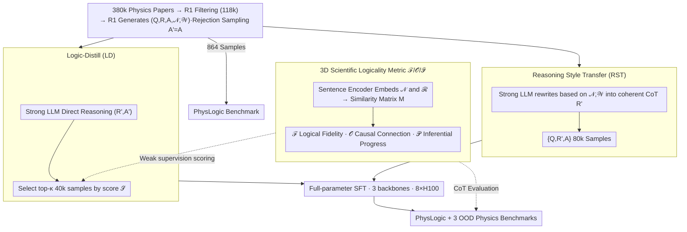

# Scientific Logicality Enriched Methodology for LLM Reasoning: A Practice in Physics

**Conference**: ICML2026  
**arXiv**: [2605.17104](https://arxiv.org/abs/2605.17104)  
**Code**: https://github.com/ScienceOne-AI/PhysLogic  
**Area**: LLM Reasoning / Scientific Reasoning / Physics QA  
**Keywords**: Scientific Logicality, Logicality Evaluation, SFT Data Selection, Physics Reasoning, PhysLogic

## TL;DR
This paper presents the first systematic study of "logicality" in scientific reasoning for LLMs. It proposes a three-dimensional evaluation metric—"Logical Fidelity / Causal Connection / Inferential Progress"—and constructs two SFT data sampling methods (Reasoning Style Transfer - RST, and Logic-Distill) based on these metrics. Experiments on the self-developed PhysLogic benchmark and three public physics benchmarks demonstrate significant improvements in both the logicality and accuracy of 7B models.

## Background & Motivation

**Background**: The current mainstream for applying LLMs to scientific Q&A involves "stacking data + stacking long CoTs"—specifically, performing SFT or RL on reasoning models like DeepSeek-R1 and o1 by collecting large-scale math/physics/chemistry corpora containing long-chain thoughts. Performance is typically evaluated solely by final accuracy on benchmarks like GPQA, SciBench, and PhysReason.

**Limitations of Prior Work**: The authors observe that while the Chains of Thought (CoT) generated by models like R1 on physics problems are lengthy, they are often a patchwork of "recalling + repeating + self-reflection." They lack the rigorous "logical chain" used by professionals, which involves problem formalization, model construction, evidence generation, evidence evaluation, and conclusion derivation. Figure 1 contrasts the CoT of R1 with that of a physicist on the same problem, showing a clear discrepancy.

**Key Challenge**: The essence of scientific reasoning (logicality)—a set of concepts, methods, and principles that ensure valid reasoning steps and reliable conclusions—is discarded by current "end-to-end NLP task" modeling. Relying solely on the correctness of the final answer fails to explain where a CoT goes wrong or provide guidance for improving reasoning quality during training.

**Goal**: (1) Establish a quantifiable methodology for evaluating scientific logicality; (2) Construct high-logicality SFT data based on these metrics; (3) Verify whether enhanced logicality effectively translates into superior task performance.

**Key Insight**: Drawing from Fischer et al.'s definition of "cognitive activities" in scientific inquiry, the authors decompose the solution process of a scientific problem into several "logical nexus" nodes $\mathcal{N}=\{\nu_1,\dots,\nu_n\}$ with importance weights $\mathcal{W}=\{w_1,\dots,w_n\}$. The model's CoT is segmented into a sentence sequence $\mathcal{R}=\{r_1,\dots,r_m\}$. By using a sentence encoder to embed both into a vector space, "logicality" is transformed into computable geometric relationships.

**Core Idea**: A similarity matrix $M\in\mathbb{R}^{n\times m}$ between sentences and logical nodes is used to simultaneously characterize *content coverage, causal ordering, and forward progress*. These three-dimensional scores serve as signals for filtering SFT training data.

## Method

### Overall Architecture
The paper addresses "how to quantify the logicality of a CoT and use it to select training data." The methodology consists of two main tracks. **Evaluation Track**: Given a scientific problem with ground-truth logical nodes $(\mathcal{N},\mathcal{W})$ and a model reasoning sequence $\mathcal{R}$, nodes and sentences are encoded into vectors $V_\mathcal{N},V_\mathcal{R}$ using `all-MiniLM-L6-v2`. A similarity matrix $M$ is calculated, from which three scores $\mathcal{F}, \mathcal{O}, \mathcal{P}$ are derived. **Data Track**: 380k physics papers are scraped from arXiv and journals; R1 filters out reviews/tools, leaving 118k. R1 then generates $(Q, R, A, \mathcal{N}, \mathcal{W})$ quintuplets via multi-turn dialogue (using rejection sampling to ensure $A'=A$, with up to 5 retries). 864 items form the PhysLogic benchmark, while the rest are processed via RST (80k) or Logic-Distill (40k) sampling strategies for SFT. Finally, full-parameter SFT is performed on Llama-3.1-8B, Qwen2.5-7B-Instruct, and DeepSeek-R1-Distill-Qwen-7B backbones using LlamaFactory on 8×H100 (lr $5\times10^{-6}$, cosine, 2 epochs, cutoff 32768), followed by evaluation on PhysLogic and public benchmarks.

### Key Designs

**1. 3D Scientific Logicality Metrics $\mathcal{F}, \mathcal{O}, \mathcal{P}$: Decomposing "Logicality" into Measurable Components**

Traditional accuracy only judges the final answer, and process-based metrics (e.g., ProcessBench) only look at local step correctness. Both fail to distinguish "correct answer with chaotic reasoning" from "correct answer with rigorous reasoning." This method first performs greedy one-to-one matching on the similarity matrix $M$ (with threshold $\tau$) to obtain a set of matched pairs $\mathcal{C}$, then calculates three components. **Logical Fidelity** (Content Coverage) is the harmonic mean of weighted recall $\rho=\sum_{(i,j)\in\mathcal{C}} w_i M_{ij}/\sum_k w_k$ and precision $\pi=|\mathcal{C}|/m$, denoted as $\mathcal{F}=2\pi\rho/(\pi+\rho)$. This measures whether the CoT covers critical logical nodes (with weights $w_i$ penalizing the omission of important nodes more heavily). **Causal Connection** (Causal Order) calculates the "semantic centroid" $P_i=\sum_j j\cdot M_{ij}/\sum_j M_{ij}$ for each node $\nu_i$, then computes the weighted proportion of nexus pairs whose centroid order matches the ground truth. **Inferential Progress** defines the novelty of each step $r_j$ as $1-\max_{k<j}\cos(\vec{S_j},\vec{S_k})$, where $\vec{S_j}$ is the similarity vector to all nexuses. $\mathcal{P}$ is the average novelty across the path—CoTs that repeat themselves or circle in place receive low scores.

**2. Reasoning Style Transfer (RST): Translating Discrete Logical Frameworks into Scientist-like natural CoT**

Directly distilling R1's native CoT (Direct-Distill) often passes on bad habits like repetition and excessive self-doubt. Simply listing nexuses as bullets lacks the flow of natural thinking. RST takes a middle path: a strong reasoning LLM $\mathcal{L}$ performs style transfer $R'=\mathcal{L}(Q,\mathcal{N},\mathcal{W})$, composing a coherent, first-person CoT with `<think>` tags following the specified logical nodes and weights. The final SFT sample is $\{Q,R',A\}$, where the answer $A$ is taken from the original paper. This approach yields samples with a "logical skeleton from the paper and skin from the strong model's language," achieving both rigor and natural style.

**3. Logic-Distill: Using 3D Scores as Weak Supervision to Filter Massive CoTs**

RST requires ground-truth nexuses, which is expensive and hard to scale. Logic-Distill treats the 3D metrics as weak supervision for ranking: $\mathcal{L}$ directly reasons on $Q$ to produce $(R', A')$, and $\pi, \rho, \mathcal{O}, \mathcal{P}$ are computed for each $R'$. To handle different scales, each component is z-score normalized and passed through a sigmoid: $\tilde X=\sigma((X-\mu_X)/\sigma_X)$. They are fused into a total score:
$$\mathcal{S}=\delta_\mathcal{F}\cdot\frac{2\tilde\pi\tilde\rho}{\tilde\pi+\tilde\rho}+\delta_\mathcal{O}\tilde{\mathcal{O}}+\delta_\mathcal{P}\tilde{\mathcal{P}},$$
The top-$\kappa$ percentile of samples $D=\mathrm{Top}_\kappa(D_{\text{full}},\mathrm{key}=\mathcal{S})$ are used for SFT. This filters the 40k most logical samples from the model's output, approximating full distillation performance with half the data.

### Loss & Training
Standard SFT cross-entropy is used without auxiliary losses; logicality is injected via data selection rather than modifying the objective. Full-parameter fine-tuning is performed with LlamaFactory: BF16, DeepSpeed ZeRO-3, FlashAttention-2, gradient checkpointing, per-device batch=1, grad accum=2, cutoff 32768, 2 epochs, seed 42, and warmup 0.03.

## Key Experimental Results

### Main Results (In-domain, PhysLogic benchmark)
Improvement of RST over the strongest baseline across three backbones (Averages of $\mathcal{F}, \mathcal{O}, \mathcal{P}$ and Final Acc):

| Backbone | Best Baseline | Avg. Logicality Δ | Acc Δ |
|----------|----------------|--------------|-------|
| Llama-3.1-8B | MegaScience (42.35 / 31.02) | **+3.59** → 45.94 | **+13.65** → 44.67 |
| Qwen2.5-7B-Instruct | MegaScience (43.12 / 39.81) | **+1.94** → 45.06 | **+3.01** → 42.82 |
| R1-Distill-Qwen-7B | SCP-116k (42.68 / 46.30) | **+3.30** → 45.98 | **+1.15** → 47.45 |

Average accuracy on three Out-of-Domain (OOD) physics benchmarks (GPQA-physics / SciBench-physics / PhysReason):

| Backbone | Best Baseline | Ours Logic-Distill (40k) | Ours RST (80k) |
|----------|--------------|--------------------------|----------------|
| Llama-3.1-8B | SCP-116k 35.08 | 35.14 | 30.98 |
| Qwen2.5-7B-Instruct | SCP-116k 34.72 | **45.04** (+10.32) | 41.41 |
| R1-Distill-Qwen-7B | SCP-116k 47.34 | **53.42** (+6.08) | 52.26 |

### Ablation Study (Contribution of Components in Logic-Distill)

| Configuration | Llama Logic/Acc | Qwen Logic/Acc | R1-7B Logic/Acc |
|------|----------------|---------------|-----------------|
| Logic-Distill (full) | 45.50 / 36.54 | 42.78 / 44.02 | 44.14 / 49.73 |
| w/o $\mathcal{F}$ | -1.60 / -2.69 | -2.75 / -3.43 | -2.56 / -4.65 |
| w/o $\mathcal{O}$ | -1.85 / **-5.23** | -4.43 / **-5.77** | -2.76 / **-11.05** |
| w/o $\mathcal{P}$ | -1.44 / -2.82 | -2.01 / -5.30 | -2.45 / -4.55 |
| Random Sampling | -1.83 / -4.61 | -1.03 / -15.25 | -3.90 / -7.95 |

### Key Findings
- Among the three dimensions, **removing Causal Connection ($\mathcal{O}$) causes the largest drop in Acc** (up to -11.05 for R1-7B). This indicates that "step order" is the most critical signals for correct physics problem-solving.
- Third-party consistency (Table 3): Pearson correlations between $\mathcal{F}, \mathcal{O}, \mathcal{P}$ and human experts/GPT-5 scores range from 0.69–0.83 ($p<0.001$), validating the automated metrics.
- Comparing correct vs. incorrect answers (Table 4) shows a significant gap in 3D scores (Avg. 43.9 vs 39.7, $p<0.001$), empirically verifying that "high logicality → high accuracy."
- **Data Efficiency**: Logic-Distill achieves best OOD results on Qwen and R1-7B using only 40k samples, outperforming 80k RST samples; this suggests that "selection precision" yields higher returns than "selection volume" in scientific reasoning.

## Highlights & Insights
- **Geometric View of Logicality**: Unifying "content, order, and progress" via a similarity matrix $M$ is a clever approach. It replaces symbolic logic verification with embedding space geometry, making it interpretable and low-cost to replicate.
- **Evaluation as Data Selection Signal**: Logic-Distill treats the evaluation metric as a weak supervision ranker. This effectively utilizes the ability to "recognize a well-reasoned solution" even if the model cannot generate one itself, providing a paradigm for process-aware data curation.
- **Causal Connection is Underrated**: The ablation shows that $\mathcal{O}$ is more vital than $\mathcal{F}$ for accuracy, implying many physics errors stem from "disordered steps" rather than "missing steps." This provides a clear direction for process-reward or step-level RL.

## Limitations & Future Work
- The ground truth $(\mathcal{N},\mathcal{W})$ is generated by DeepSeek-R1, creating a potential "self-evaluation bias." While cross-validated with humans/GPT-5 on 200 samples, this is small relative to the 80k training set.
- Sentence embeddings/cosine similarity struggle with fine-grained symbolic errors (e.g., $E=mc^2$ vs. $E=mc^3$). Symbolic or numerical verification is still needed.
- The work is limited to physics and "derivation chains" from arXiv. Coverage of experimental design or non-deductive reasoning (e.g., approximation arguments) is limited.

## Related Work & Insights
- **vs Direct-Distill / MegaScience / SCP-116k**: These baselines focus on "more and longer CoTs." This paper prioritizes "which CoTs are actually logical," achieving superior results with equal or less data.
- **vs PRM / ProcessBench**: While math-based PRMs judge per-step 0/1 correctness, this work treats process quality as a continuous multi-dimensional signal, offering a reusable framework for scientific disciplines.

## Rating
- Novelty: ⭐⭐⭐⭐ 3D logicality metrics + evaluation-as-sampler pipeline is fresh for scientific reasoning.
- Experimental Thoroughness: ⭐⭐⭐⭐ Broad coverage across backbones, OOD benchmarks, and ablation studies.
- Writing Quality: ⭐⭐⭐⭐ Clear motivation and figures.
- Value: ⭐⭐⭐⭐ Provides reproducible process signals for scientific LLM training.

<!-- RELATED:START -->

<!-- RELATED:END -->

## Related Papers

- [\[ICML 2026\] Scaling-Aware Adapter for Structure-Grounded LLM Reasoning](scaling-aware_adapter_for_structure-grounded_llm_reasoning.md)
- [\[ICLR 2026\] Nudging the Boundaries of LLM Reasoning](../../ICLR2026/llm_reasoning/nudging_the_boundaries_of_llm_reasoning.md)
- [\[ICML 2026\] R2-Router: A New Paradigm for LLM Routing with Reasoning](r2-router_a_new_paradigm_for_llm_routing_with_reasoning.md)
- [\[ICML 2026\] TRACE: 用 Toulmin 论证模型评 LLM CoT 推理过程质量](trace_toulmin-based_reasoning_assessment_through_constructive_elements_for_llm_c.md)
- [\[ICML 2026\] Are Tools Always Beneficial? Learning to Invoke Tools Adaptively for Dual-Mode Multimodal LLM Reasoning](are_tools_always_beneficial_learning_to_invoke_tools_adaptively_for_dual-mode_mu.md)

<!-- RELATED:END -->
