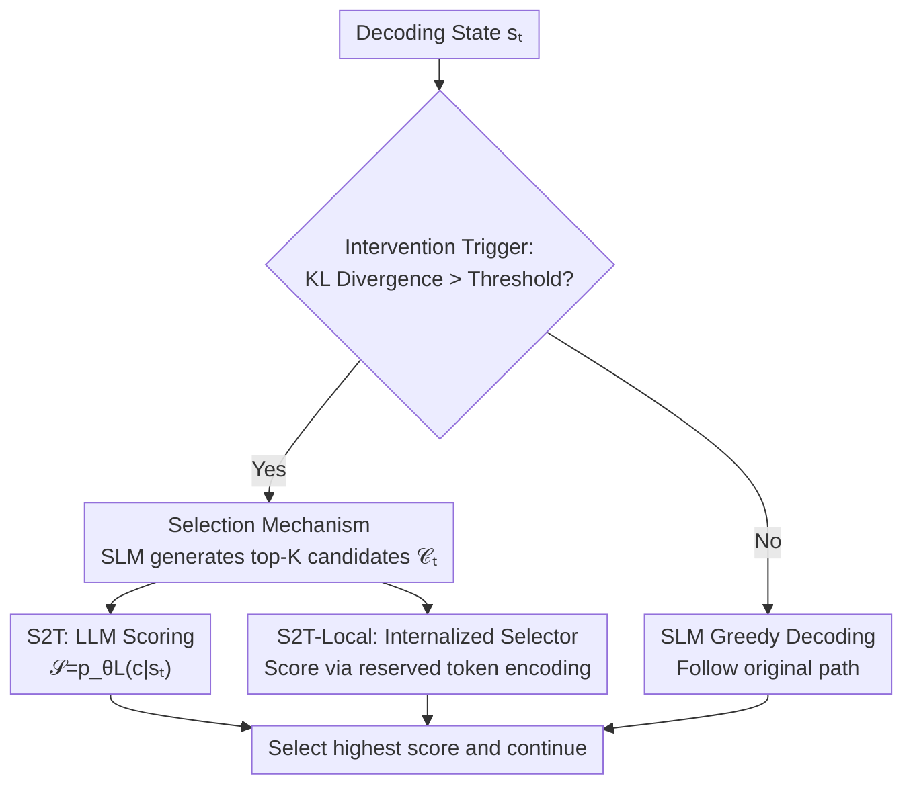

# Select to Think: Unlocking SLM Potential with Local Sufficiency

**Conference**: ICML 2026  
**arXiv**: [2604.26940](https://arxiv.org/abs/2604.26940)  
**Code**: https://github.com/YeRona/Select-to-Think  
**Area**: LLM Reasoning / SLM Reasoning Enhancement  
**Keywords**: Small Language Models, Collaborative Reasoning, Local Sufficiency, Candidate Reranking, Distillation

## TL;DR
This paper discovers that Small Language Models (SLMs) often **already include the token preferred by Large Language Models (LLMs) in their top-K candidate sets** at reasoning "divergence points" (the top-8 of a 1.5B model hits the 32B teacher's choice 95% of the time), but these are missed by greedy decoding. The authors reframe the LLM's role from "open-ended generation" to "selecting from SLM candidates" and distill this selection logic into the SLM itself. This allows a 1.5B model to improve its Math score by 24.1% relative to the baseline using single-track decoding, matching the performance of 8-way self-consistency while using only 1/8 of the compute.

## Background & Motivation
**Background**: While LLMs possess strong reasoning capabilities, their inference costs are high, leading researchers toward SLMs. However, SLMs often fall behind in multi-step reasoning. Mainstream remedies follow two paths: **collaborative reasoning** (calling an LLM to take over for several tokens at divergence points) and **standard distillation** (forcing the SLM to match the LLM's output distribution).

**Limitations of Prior Work**: Both paths have significant drawbacks. Collaborative reasoning, even with sparse intervention, requires a **synchronous LLM call** for every correction, incurring massive prefill overhead, latency, and cost. Standard distillation is hindered by the **capacity gap**—forcing a small model to match the teacher's distribution across the entire open vocabulary forces it to mimic probability peaks that conflict with its own priors, resulting in fragile imitation rather than robust decision rules.

**Key Challenge**: Errors are **highly localized**—a few critical tokens can cause a trajectory to irreversibly deviate from the optimal path. Since the problem is local, the intervention should be local. However, both "local generation takeover" and "full-vocab distribution matching" still define the LLM's role as a **generator**, leading to either high cost or capacity bottlenecks.

**Goal**: Can the reasoning potential of SLMs be released without paying the cost of runtime LLM calls or hitting the capacity gap?

**Key Insight**: The authors propose and verify a critical observation—**local sufficiency**: at divergence points, the token preferred by the LLM is often **already within the SLM's top-K next-token candidates**, even if it is not the top-1. Empirical tests show that the top-8 candidates of a 1.5B SLM cover the choice of a 32B teacher with 95% accuracy (and 83% for a 0.5B model). This implies that failure is not due to a "lack of correct candidates" but an "inability to rank the correct candidate first."

**Core Idea**: The LLM's guidance is reframed from "open-ended generation" to **"selection among SLM proposals."** This collapses the supervision signal from high-dimensional distribution matching into discrete candidate ranking, which is much easier to distill. This selection logic is then internalized into the SLM to create a local variant, S2T-Local, which requires **no runtime LLM**.

## Method

### Overall Architecture
The core of S2T (Select to Think) is replacing "open-ended generation" with "discrete selection among SLM candidates." A single decoding step involves three stages: first, a trigger determines if the current step is a "critical step" (based on divergence). Only critical steps enter the selection process. In a critical step, the SLM first produces its top-K candidate set $\mathcal{C}_t$, and then a scoring function $\mathcal{S}(c;s_t)$ picks the highest-scoring candidate among these K proposals: $\hat{y}_t=\arg\max_{c\in\mathcal{C}_t}\mathcal{S}(c;s_t)$. The scoring function is instantiated in two ways: **S2T** (collaborative version, where the LLM scores candidates using conditional probability $\mathcal{S}(c;s_t)=p_{\theta_L}(c\mid s_t)$) and **S2T-Local** (local version, where selection logic is distilled into the SLM, entirely removing the runtime LLM). This unified form gracefully degrades: when $g_t=0$ (non-critical step), the candidate set collapses to a single token, forcing the original SLM path, equivalent to standard decoding.

### Key Designs

**1. Local Sufficiency: Failure is in Ranking, Not Missing Candidates**

This is the foundational observation of the paper and addresses the core contradiction. The authors use KL divergence to measure the divergence between the SLM and LLM at a given step and calculate the probability that the LLM's preferred token falls within the SLM's top-K (Hit@K) at the most divergent steps. While Hit@1 is only 30%, Hit@8 reaches 95% (83% for 0.5B), holding consistently across Llama-3, Gemma-2, and Phi-3 architectures. The conclusion is that SLMs retain the underlying capacity to match LLM reasoning, but it is **masked** by the suboptimality of greedy decoding—the correct candidate is at hand but simply not ranked first. This redefines the problem from "insufficient generation capability" to a "ranking/prioritization problem within limited candidates."

**2. Selection Mechanism: Downgrading the LLM from "Generator" to "Scorer"**

This addresses the pain points of collaborative inference costs and the distillation capacity gap. S2T constrains the search space to the SLM's own top-K proposals. The LLM no longer generates openly; it merely provides conditional probabilities $p_{\theta_L}(c\mid s_t)$ as scores for these K candidates. This approach offers two benefits: first, the decision space is compressed from the entire vocabulary to K candidates, ensuring the choice remains within the student's local support. Second, the supervision signal shifts from "high-dimensional distribution matching" to "discrete candidate ranking," which is naturally easier to distill. The authors decompose error into two sources—hit failure $\delta_{\text{hit}}=\mathbb{I}[y^\star\notin\mathcal{C}_t]$ and selection failure $\delta_{\text{sel}}=\mathbb{I}[y^\star\in\mathcal{C}_t,\,f_\theta\neq y^\star]$—showing a trade-off: increasing K reduces $\delta_{\text{hit}}$ but increases $\delta_{\text{sel}}$ (making candidates harder to distinguish). Experiments identify K=8 as the sweet spot.

**3. S2T-Local: Internalizing Selection via Reserved Tokens**

To remove the need for runtime LLM scoring, the selection logic is internalized. The challenge is that "direct probability alignment distorts the SLM's native distribution." The authors adapt the ZIP (Zero-overhead Inference-time Prediction) framework, using the logits of a set of **reserved tokens** $\mathcal{R}\subset\mathcal{V}$ to encode preference scores. These tokens are masked from the generation distribution and do not participate in normal text generation. For each candidate $c$, a concatenated state $s_t^c=(x,y_{<t}\oplus c)$ is passed through a forward pass, and the distribution of reserved tokens is used with a predefined bin vector $\mathbf{v}$ to calculate the score $\mathcal{S}_{local}(c;s_t)=\mathbf{v}^\top\mathrm{softmax}(z_{\theta_S}(s_t^c)[\mathcal{R}])$. The K candidates can be processed in a single parallel batch. This design isolates the "selection signal" from "standard vocabulary statistics"—reserved tokens learn to carry discriminative signals while normal tokens remain a coherent language model, effectively providing the SLM with an "internal critic."

### Loss & Training
The training objective combines a selection loss with a stability regularization: $\mathcal{L}(\theta_S)=\mathcal{L}_{\mathrm{sel}}+\beta\cdot\mathcal{L}_{\mathrm{reg}}$.

The selection term $\mathcal{L}_{\mathrm{sel}}$ is a cross-entropy loss with temperature $T$, maximizing the margin between the teacher-labeled optimal candidate $c^\star$ (the one with the highest LLM likelihood in the set) and other candidates:

$$\mathcal{L}_{\mathrm{sel}}=-\log\frac{\exp(\mathcal{S}_{\text{local}}(c^\star;s_t)/T)}{\sum_{c'\in\mathcal{C}_t}\exp(\mathcal{S}_{\text{local}}(c';s_t)/T)}$$

The stability regularization $\mathcal{L}_{\mathrm{reg}}$ calculates the KL divergence between the fine-tuned model and the frozen base on the standard text vocabulary $\mathcal{V}_{\text{text}}=\mathcal{V}\setminus\mathcal{R}$. Data is collected via SLM rollouts: taking the top-$\tau=10\%$ steps by KL divergence, with K=16 candidates per step labeled by the teacher. Approximately 2k trajectories are used, **trained only on the MATH training set**, while all other benchmarks remain OOD. Training uses LoRA (Attention + MLP) and unfreezes the lm_head embeddings of reserved tokens, with a 1.5B model having only 74.3M trainable parameters (<6%).

## Key Experimental Results

### Main Results
Qwen2.5-Instruct (0.5B/1.5B students with a 32B teacher) was used, with K=8 and an intervention budget $\tau=1\%$. The core takeaway: single-track S2T-Local matches the performance of 8-way self-consistency (Maj@8) while using only 1/8 of the compute.

| Scale | Metric | Greedy | Distil | Maj@8 | TaH | S2T-Local |
|------|------|------|------|------|------|------|
| 1.5B | Math Avg. | 36.9 | 40.2 | 43.7 | 39.7 | **45.8** |
| 1.5B | GSM8k | 72.1 | 79.1 | 81.4 | 78.4 | **86.6** |
| 1.5B | MATH500 | 54.4 | 60.4 | 64.1 | 60.9 | **67.5** |
| 1.5B | HumanEval | 42.7 | 48.1 | – | 43.6 | **56.9** |
| 1.5B | MMLU-Pro | 22.9 | 27.9 | 28.6 | 21.9 | **33.6** |
| 0.5B | Math Avg. | 20.2 | 21.7 | 28.0 | 23.4 | **29.2** |

The 1.5B model's Math Avg. rose from 36.9 → 45.8 (**+24.1% relative gain**), and the 0.5B model's rose from 20.2 → 29.2 (**+44.6% relative gain**, showing larger benefits for smaller models). Furthermore, checkpoints trained on MATH generalized successfully to HumanEval and MMLU-Pro, indicating the learning of transferable reasoning preferences.

### Ablation Study

| Analysis | Key Data | Description |
|------|---------|------|
| Local Sufficiency (Hit Rate) | Hit@1=30% → Hit@8=95% (83% for 0.5B) | Correct candidates are almost always in top-8; missed by greedy. |
| K-Candidate Scanning | Saturation after K=8 | Sweet spot for coverage vs. discrimination; diminishing returns beyond. |
| Intervention Rate τ Scanning | Accuracy ↑ with τ while Hit rate stable | More frequent intervention improves precision; coverage unchanged. |
| Selector Alignment (S2T-Local) | Agree@1=67~71%, Spearman ρ≈0.63 | Internalized selector is highly consistent with the LLM. |
| Efficiency | ~75% lower latency than collab methods | Maintains standard SLM inference speeds. |
| Takeover Comparison | Same trigger/budget but LLM takeover | Isolation of "Selection vs Generation" proves selection is sufficient. |

### Key Findings
- **Selection is much cheaper than generation and sufficient**: In collaborative settings, S2T (K≥8) matches baselines where LLMs generate openly, proving that "discriminative selection" is enough to recover LLM reasoning without expensive generation.
- **Gains come from uncovering undervalued candidates**: "Rescue" zones are concentrated where $p_{\theta_L}$ is high but $p_{\theta_S}$ is low—the method specifically retrieves tokens that the teacher favors but the student heavily underestimates.
- **Smaller models benefit more**: The 0.5B model's relative gain (44.6%) is higher than the 1.5B model's (24.1%), suggesting smaller capacities have more "hidden potential."

## Highlights & Insights
- **Redefining the problem is the most valuable contribution**: Reframing "weak SLM reasoning" as a "ranking problem within candidates" rather than a "generation deficiency" collapses the distillation target and bypasses the capacity gap.
- **Clever reuse of ZIP reserved tokens**: Using masked reserved token logits for preference scores allows "selection signals" and "text generation" to exist without interference, effectively adding an internal critic to the SLM with zero extra output overhead.
- **Error decomposition provides a clear design guide**: The trade-off between $\delta_{\text{hit}}$ and $\delta_{\text{sel}}$ explains why K=8 is optimal, turning hyperparameter selection from trial-and-error into a theoretically supported choice.

## Limitations & Future Work
- **Dependency on a good trigger**: The method relies on KL divergence to determine "when to intervene." If the trigger fails to identify critical steps, the effectiveness of the selection mechanism suffers.
- **Front-loaded teacher labeling costs**: While there is no runtime LLM, training requires teacher likelihoods for K candidates at every step, which can be expensive for larger vocabularies or longer trajectories.
- **Ceiling at K=8**: Diminishing returns after K=8 imply a ceiling to "local sufficiency"—if the LLM's preferred token falls outside the top-8 (5% of cases), selection cannot help.

## Related Work & Insights
- **vs. R2R / SpecReason (Collaborative Reasoning)**: These still use "LLM generation" as the intervention primitive, requiring synchronous calls and injecting external tokens. S2T switches to "selection among SLM candidates," and S2T-Local removes the runtime LLM entirely.
- **vs. Standard Distillation / TSD-KD / RLKD**: These are often bound to the generation paradigm of "matching the LLM's full distribution." This work shifts the signal to discrete ranking, avoiding the capacity gap.
- **vs. Test-time Compute (Self-Consistency / ToT / Think-at-Hard)**: These rely on massive compute via multiple samples or explicit searches. S2T-Local matches Maj@8 with a single track, compressing "test-time compute" from "running more paths" to "selecting more accurately at each step."

## Rating
- Novelty: ⭐⭐⭐⭐⭐ "Local sufficiency" observation + reframing generation as selection is powerful.
- Experimental Thoroughness: ⭐⭐⭐⭐⭐ Two scales, six benchmarks, OOD, error decomposition, and efficiency analysis.
- Writing Quality: ⭐⭐⭐⭐ Clear logic and formulas; some charts are dense but arguments are solid.
- Value: ⭐⭐⭐⭐⭐ Provides a low-cost, distillable paradigm for SLM enhancement with high practicality.

<!-- RELATED:START -->

## Related Papers

- [\[ICML 2026\] SuCo: Sufficiency-guided Continuous Adaptive Reasoning](suco_sufficiency-guided_continuous_adaptive_reasoning.md)
- [\[ICML 2026\] PowerFlow: Unlocking the Dual Nature of LLMs via Principled Distribution Matching](powerflow_unlocking_the_dual_nature_of_llms_via_principled_distribution_matching.md)
- [\[ACL 2026\] SHAPE: Stage-aware Hierarchical Advantage via Potential Estimation for LLM Reasoning](../../ACL2026/llm_reasoning/shape_stage-aware_hierarchical_advantage_via_potential_estimation_for_llm_reason.md)
- [\[ACL 2026\] When Is Thinking Enough? Early Exit via Sufficiency Assessment for Efficient Reasoning](../../ACL2026/llm_reasoning/when_is_thinking_enough_early_exit_via_sufficiency_assessment_for_efficient_reas.md)
- [\[ACL 2026\] Think Outside the Policy: In-Context Steered Policy Optimization](../../ACL2026/llm_reasoning/think_outside_the_policy_in-context_steered_policy_optimization.md)

<!-- RELATED:END -->
