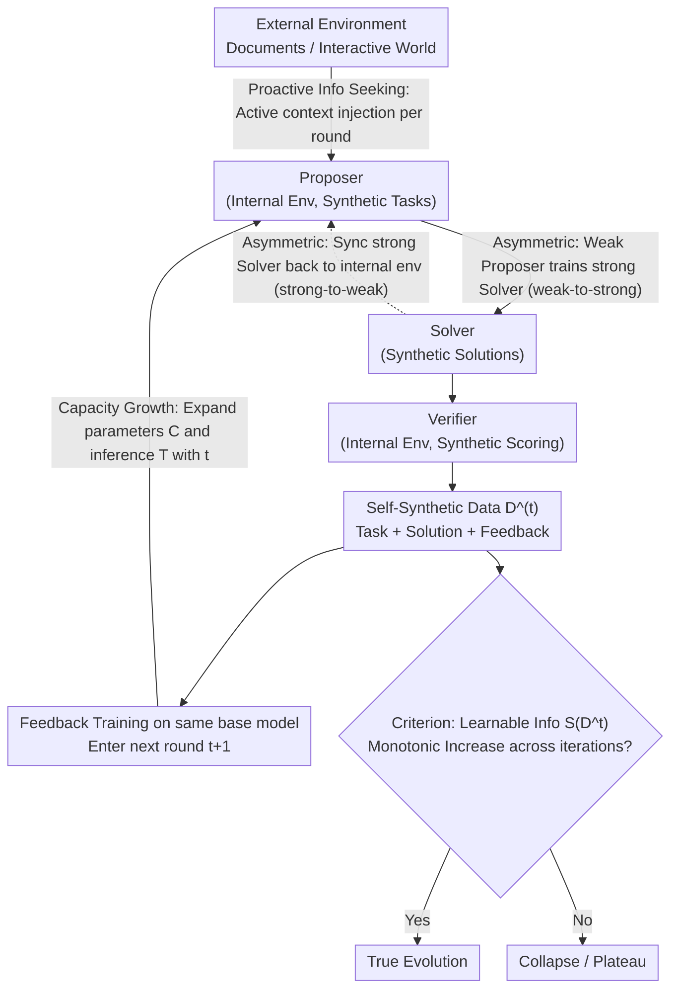

# Self-Play Only Evolves When Self-Synthetic Pipeline Ensures Learnable Information Gain

**Conference**: ICML 2026 (Position Paper)  
**arXiv**: [2603.02218](https://arxiv.org/abs/2603.02218)  
**Code**: None  
**Area**: LLM Reasoning / Self-Evolution / Self-Play / Information Theory  
**Keywords**: Self-evolving LLMs, Triadic roles (Proposer/Solver/Verifier), Learnable information, epiplexity, self-synthetic data pipeline

## TL;DR
The authors argue that the current collapse of "LLM self-play" within a few rounds is fundamentally due to self-synthetic data failing to provide learnable information gain; they formalize "learnable information" using bounded MDL/epiplexity and propose three system-level designs—Asymmetric Co-evolution, Capacity Growth, and Proactive Information Seeking—to collectively ensure the monotonic increase of learnable information in the Proposer-Solver-Verifier self-evolution loop.

## Background & Motivation

**Background**: LLM self-evolution systems typically involve the same model acting as a Proposer (task generation), Solver (problem solving), and Verifier (scoring), trained via multi-reward reinforcement learning (RL) closed loops without external labels. Representative works include Absolute Zero, R-Zero, Dr. Zero, SPIN, Self-Rewarding, URPO, Cooper, etc.

**Limitations of Prior Work**: These systems generally exhibit a "rapid early surge followed by collapse after several rounds"—Proposers degenerate into generating trivial problems ($f(x)=x$), Solver performance plateaus and then declines, and ground truth must be injected periodically to avoid "self-hallucination." Even with sophisticated reward designs (e.g., maintaining a 50% pass rate), multi-reward RL remains unstable.

**Key Challenge**: Existing methods equate self-evolution with "self-play RL," focusing solely on the monotonic increase of rewards. However, rewards can be hacked, achieved through rote memorization of pre-training knowledge, or inflated by repeatedly sampling isomorphic problems—**while task-level metrics improve, the "learnable structure" in the new synthetic data of each round does not increase**. Once learnable information saturates, the model ceases true learning.

**Goal**: (1) Provide a metric to distinguish "illusory progress" from "true evolution"; (2) Identify system-level conditions that guarantee the monotonic growth of learnable information across iterations; (3) Unify existing self-play / triadic-loop / curriculum approaches into a single analytical framework and identify their respective failure modes.

**Key Insight**: The authors borrow the concept of epiplexity from Finzi et al. (2026)—under a bounded observer (fixed parameter budget $C$ and inference budget $T$), MDL is decomposed into "learnable structure $S_{C,T}(X)$" and "residual entropy $H_{C,T}(X)$." Since the same data may be noise to a weak observer but structured to a strong one, "learnable information" is a **relative quantity** that must be co-designed with the observer's budget.

**Core Idea**: Self-evolution is not an RL game, but a **self-synthetic data pipeline**; the loop will not collapse only if $S_{C,T}(D^{(t)})$ increases monotonically across iterations $t$. This requires the synchronized rotation of three gears: the generation end (Asymmetric), the receiver end (Capacity), and the raw material end (Information Seeking).

## Method

As a position paper, this work does not propose a specific training algorithm but answers a diagnostic question: whether a self-play loop is "truly evolving." The authors' answer is three-layered—first quantifying "learnable information" with bounded information theory, then providing three system-level design principles to guarantee its monotonic growth, and finally validating that existing loops fail these conditions through diagnostic experiments.

### Overall Architecture

The entire loop is abstracted as a "single information source + multi-directional synthesis" pipeline (Figure 1): the pre-trained weights of the same LLM serve as the sole information source, producing data flows $X_d$ along three synthesis directions (proposing / solving / feedback), which are then fed back to train the model itself. The judgment of true evolution relies not on reward growth, but on the monotonic increase of the iteration sequence $\{S_{C^{(t)},T^{(t)}}(D^{(t)})\}_t$.

Here, $S$ is derived from a bounded MDL optimizer: within an observer family $\mathcal{P}_{C,T}$ defined by a fixed parameter budget $C$ and inference budget $T$, find the optimal code $P^{\star}=\arg\min_{P}\{|P|+\mathbb{E}[\log 1/P(X)]\}$, then decompose it: $S_{C,T}(X):=|P^{\star}|$ is the **epiplexity (learnable structure)**, and $H_{C,T}(X):=\mathbb{E}[\log 1/P^{\star}(X)]$ is the **bounded entropy (residual unlearnable noise)**. Crucially, this is a relative quantity: data may be pure noise to a weak observer but a learnable structure to a strong one, so "complexity" must be discussed alongside the observer's budget. This decomposition naturally defines a "Goldilocks Zone"—data must be neither too simple (low $S$, low $H$) nor too difficult (low $S$, high $H$), but must fall in the middle ground of being "complex enough to be non-trivial, yet structured enough to be learnable" for the loop to have something to learn.

The three key designs act on different segments of this loop: Asymmetric Co-evolution manages the "generation end," Capacity Growth manages the "receiver end," and Proactive Information Seeking manages the "raw material end."

### Key Designs

**1. Asymmetric Co-evolution: Making "Verification easier than Solving" a Sustainable Capability Ladder**

Existing RL only completes the first half of the weak-to-strong process—using weak Proposers/Verifiers to train a strong Solver. But once the Solver becomes strong, if the Proposer/Verifier does not follow, the task flow degenerates into "low structure" relative to the current observer, and the loop collapses toward trivial problems. This design completes the reverse closed loop: first weak-to-strong (weak proposer trains strong Solver), then strong-to-weak (syncing the stronger Solver back to the internal environment to refresh Proposer/Verifier). This is possible because, although the three roles share the same weight source, the $S_{C,T}(X_d)$ produced along different synthetic directions $d(P,S,V)$ differs under a bounded observer. Using one-way permutations as a limiting example, one can prove $H_{\text{poly}}(X|Y)-H_{\text{poly}}(Y|X)\ge c\log n$, implying a difficulty gap of $\Omega(\log n)$ bits between forward proposing and reverse solving; training converts this residual uncertainty into reusable structure. Practice involves: (i) organizing synthesis directions from small to large asymmetric gaps; (ii) using back-translation (Magicoder, MathGenie) for Proposers; (iii) attempting verifier-free RL for Verifiers.

**2. Capacity Growth: Expanding Observer Budgets with Iterations to Match New Structures**

The previous design can continuously create structured data, but it is futile if the receiver remains static—$S_{C,T}(X)$ is upper-bounded for fixed $(C,T)$. Once the observer is saturated, more structure remains "invisible." Empirically, this manifests as two mismatches: fixed parameter budget $C^{(t)}$ leads to early loss saturation, forcing the Proposer to degenerate to tasks the model can easily solve; fixed inference budget $T^{(t)}$ misidentifies "inference truncation" as "lack of knowledge." Thus, $C^{(t)}$ and $T^{(t)}$ must expand with iterations. Theoretical support is direct: if observer families are monotonically nested $\mathcal{P}_{C_1,T_1}\subseteq\mathcal{P}_{C_2,T_2}$, then $\mathrm{MDL}_{C_2,T_2}(X)\le\mathrm{MDL}_{C_1,T_1}(X)$, meaning expansion directly pushes the boundary of "learnable vs unlearnable." On the parameter axis, one can use asymmetric role scaling or cross-iteration layer/expert addition (Net2Net, Stacking, MoE); on the inference axis, adaptive reasoning tokens or Mixture-of-Recursions can be used.

**3. Proactive Information Seeking: Opening an External Inlet to Break the Pre-training Ceiling**

The first two gears rotate within the system, but the learnable information of a pure zero-data system is ultimately capped by its pre-training weights. Passively attaching fixed external corpora results in fine-tuning on that corpora, while fixed RAG either exceeds the Solver's budget early on or becomes a routine later—all three regimes "reactively" consume information without source expansion. This design enables the Proposer+Verifier to actively select an external context $d^{(t)}$ each round and inject it as a conditioning context (not a training label) into the conditional stream $(Y^{(t)}\mid d^{(t)})$. The corresponding metric is conditional bounded MDL $\mathrm{MDL}(Y\mid d):=\min_{P}\{|P|+\mathbb{E}[\log 1/P(Y\mid d)]\}$, where $S_{C,T}(Y\mid d)$ is the "conditional learnable information." Practical steps include: (i) Proposers generating queries from Solver failures or Verifier disagreements; (ii) converting $d$ into synthetic directions of varying difficulty; (iii) evolving retrievers/rerankers using self-synthetic signals.

### Loss & Training

The measurement side uses **Prequential Coding** to estimate epiplexity (Algorithm 1): the dataset is split into training/validation. During the first streaming pass over $\mathcal{D}_{\text{train}}$, the online loss $\mathcal{L}_{\text{online}}=\sum_i -\log P_{\theta_i}(Z_i)$ is accumulated. At the end of each epoch, two terms are calculated—Model cost $S=(\mathcal{L}_{\text{online}}-\mathcal{L}_{\text{train}})/\ln 2$ and Data cost $(\mathcal{L}_{\text{val}}/\ln 2)/N_{\text{val}}$. The $S^{\star}$ corresponding to the epoch with the minimum MDL is taken as the estimate of learnable information. Intuitively, this equals the "accumulated online regret the model pays to learn this batch of data."

## Key Experimental Results

The experiments are **diagnostic**, aimed at validating two things using the epiplexity metric: (1) learnable information varies significantly under different combinations of synthesis directions/Proposer/Solver capacities; (2) current self-play loops do **not** show monotonic increases in learnable information after multiple iterations. Tasks follow Absolute Zero (Zhao et al., 2025a) coding problems: abduction, deduction, and induction.

### Main Results (Experiment 1: Single-round Epiplexity Distribution)

| Variable Axis | Values | Observed Epiplexity Trend | Conclusion |
| :--- | :--- | :--- | :--- |
| Proposer Capacity | Qwen2.5 7B → Qwen2.5 14B → Qwen3 4B | Monotonic Increase | Stronger Proposers generate more learnable information |
| Solver Capacity | Small to Large | **Rise then Fall** | Consistent with Finzi et al. (2026): small models are forced to learn structure, then shift to memorization |
| Synthesis Direction | abduction / deduction / induction | induction ≫ abduction ≈ deduction | Massive variance in info gain across directions |

### Ablation Study (Experiment 2: Epiplexity Trajectory in Multi-round Self-play)

| Configuration | Epiplexity Behavior across Iterations | Behavioral Observation |
| :--- | :--- | :--- |
| Multi-reward RL self-play (no explicit mechanisms) | **Severe Oscillation**, non-monotonic | Solver performance drops, Proposer task patterns collapse |
| (Implicit Control) With three designs | Claimed monotonic growth | Pending community verification |

### Key Findings
- **Proposer strength ≠ Data quality**: When Solver capacity exceeds a threshold, the gain from a stronger Proposer is offset by the Solver's degeneration into memorization—providing empirical evidence that Capacity Growth must occur **simultaneously** across all roles.
- **Direction matters more than quantity**: Learnable information in induction is significantly higher than in abduction/deduction, proving that "changing synthesis directions" is far more effective than "adding tokens/problems."
- **Multi-reward RL is insufficient**: Fixed $(C,T)$ plus multi-reward self-play causes epiplexity to oscillate rather than rise, explaining from an information-theoretic perspective why reward shaping alone is inadequate.

## Highlights & Insights
- Translates "whether self-evolution is truly evolving" into a computable metric $S_{C,T}(D^{(t)})$, ensuring reward growth is no longer conflated with information gain.
- Uses the $\Omega(\log n)$ gap of one-way permutations to formalize "asymmetry," upgrading the intuitive "verification is easier than solving" into a citable lower bound applicable to any "forward-easy, inverse-hard" task design.
- The "Goldilocks Zone (high $S$, moderate $H$)" serves as a trick-like scheduling signal: calculating the (S, H) position each round allows for interpretable difficulty adjustment.

## Limitations & Future Work
- The epiplexity metric is from very recent work (Finzi et al., 2026) and has not been widely validated; prequential coding is computationally expensive.
- The three designs are currently easier to implement in easy-to-verify domains (code, math); how to measure and train the inverse gap in hard-to-verify domains remains open.
- The experiments lacks a "large-scale positive proof" showing that adding all three designs guarantees monotonic growth; it relies on future work to fill this gap.
- Learnable information is a macro metric and may not always correlate positively with downstream task accuracy.

## Related Work & Insights
- **vs Self-Training (STaR / ReST)**: These rely on fixed verifiers; this paper notes they saturate once the initial distribution is exhausted (Lack of Information Seeking).
- **vs Solver-Verifier Co-evolution (Self-Rewarding / SPIN)**: They lack strong-to-weak synchronization to ensure Verifiers keep up with Solvers (Lack of Asymmetric reverse loop).
- **vs Proposer-Solver Self-Play (Absolute Zero / R-Zero)**: Their collapse is attributed to Proposers drifting toward triviality, and they often lack Verifier synchronization.

## Rating
- **Novelty**: ⭐⭐⭐⭐⭐ Formally introducing information-theoretic criteria into self-evolving LLM design.
- **Experimental Thoroughness**: ⭐⭐⭐ Small-scale diagnostic experiments only; lacks full-system verification.
- **Writing Quality**: ⭐⭐⭐⭐⭐ Extremely clear structure (Framework → Metric → Principles → Practice).
- **Value**: ⭐⭐⭐⭐⭐ Provides a unified diagnostic vocabulary and design criteria for the self-evolving LLM community.

<!-- RELATED:START -->

## Related Papers

- [\[ACL 2026\] Stratagem: Learning Transferable Reasoning via Trajectory-Modulated Game Self-Play](../../ACL2026/llm_reasoning/stratagem_learning_transferable_reasoning_via_trajectory-modulated_game_self-pla.md)
- [\[ACL 2026\] Self-Consistency from Only Two Samples: CoT-PoT Ensembling for Efficient LLM Reasoning](../../ACL2026/llm_reasoning/self-consistency_from_only_two_samples_cot-pot_ensembling_for_efficient_llm_reas.md)
- [\[ICML 2026\] On the Generalization Gap in Self-Evolving Language Model Reasoning](on_the_generalization_gap_in_self-evolving_language_model_reasoning.md)
- [\[ICML 2026\] The Role of Feedback Alignment in Self-Distillation](the_role_of_feedback_alignment_in_self-distillation.md)
- [\[ICML 2026\] An Information-Theoretic Criterion for Efficient Data Synthesis](an_information-theoretic_criterion_for_efficient_data_synthesis.md)

<!-- RELATED:END -->
