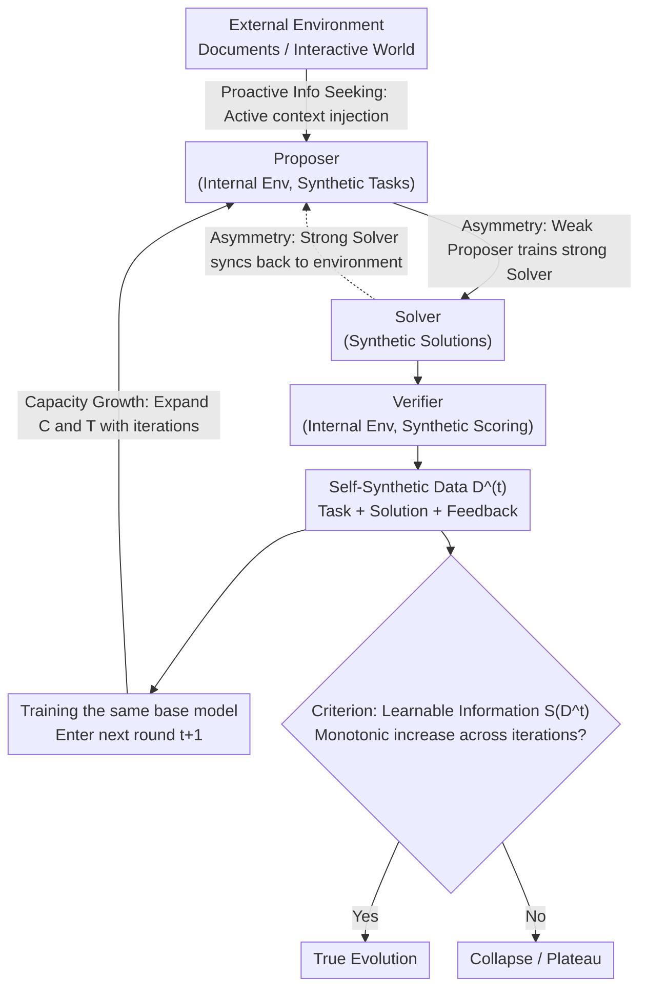

# Self-Play Only Evolves When Self-Synthetic Pipeline Ensures Learnable Information Gain

**Conference**: ICML 2026 (Position Paper)  
**arXiv**: [2603.02218](https://arxiv.org/abs/2603.02218)  
**Code**: None  
**Area**: LLM Reasoning / Self-Evolution / Self-Play / Information Theory  
**Keywords**: Self-evolving LLMs, Triadic roles (Proposer/Solver/Verifier), Learnable information, epiplexity, Self-synthetic data pipeline

## TL;DR
The authors argue that the current collapse of "LLM self-play" within a few rounds is fundamentally because self-synthetic data fails to provide learnable information gain; they formalize "learnable information" using bounded MDL/epiplexity and propose three system-level designs—Asymmetric Co-evolution, Capacity Budget Growth, and Proactive Information Seeking—to collectively ensure the monotonic increase of learnable information in the triadic (Proposer-Solver-Verifier) self-evolution loop.

## Background & Motivation

**Background**: LLM self-evolution systems typically employ the same model to play three roles simultaneously: Proposer, Solver, and Verifier. These systems use multi-reward reinforcement learning (RL) in a closed loop for training without external annotations. Representative works include Absolute Zero, R-Zero, Dr. Zero, SPIN, Self-Rewarding, URPO, and Cooper.

**Limitations of Prior Work**: These systems generally experience "rapid early growth followed by collapse after a few rounds"—the Proposer degenerates into generating trivial problems ($f(x)=x$), the Solver performance peaks and then declines, and ground truth must be injected periodically to avoid "self-hallucination" states. Even with sophisticated reward designs (such as maintaining a 50% pass rate), multi-reward RL remains unstable.

**Key Challenge**: Existing methods equate self-evolution to "self-play RL" and only focus on whether the reward increases monotonically. However, rewards can be hacked, achieved through rote memorization of pre-training knowledge, or inflated by sampling isomorphic problems—**while task-level metrics rise, the "learnable structure" in newly synthesized data does not increase**. Once learnable information saturates, the model stops truly learning.

**Goal**: (1) Provide a metric to distinguish "illusory progress" from "true evolution"; (2) Identify system-level conditions that guarantee monotonic growth of learnable information across iterations; (3) Unify existing self-play/triadic-loop/curriculum practices into a single analytical framework and identify their respective failure modes.

**Key Insight**: The authors leverage the concept of epiplexity from Finzi et al. (2026)—under a bounded observer (fixed parameter budget $C$ and inference budget $T$), MDL is decomposed into "learnable structure $S_{C,T}(X)$" and "residual entropy $H_{C,T}(X)$." Since the same data might be noise to a weak observer but structure to a strong one, "learnable information" is a **relative quantity** that must be designed alongside the observer's budget.

**Core Idea**: Self-evolution is not an RL game but a **self-synthetic data pipeline**. The loop only avoids collapse if $S_{C,T}(D^{(t)})$ increases monotonically across iterations $t$. This requires the synchronization of three gears: the generation end (Asymmetry), the receiver end (Capacity), and the raw material end (External Information).

## Method

As a position paper, this work does not provide a specific training algorithm but answers a defining question: whether a self-play loop is "truly evolving." The authors' answer has three layers—quantifying "learnable information" using bounded information theory, providing three system-level design principles to ensure its monotonic growth, and using diagnostic experiments to verify that existing loops fail to meet these conditions.

### Overall Architecture

The entire loop is abstracted as a "single information source + multi-directional synthesis" pipeline (Figure 1): the pre-trained weights of the same LLM serve as the sole information source, producing data streams $X_d$ along three synthesis directions (proposing, solving, feedback), which are Fed back to train the model itself. To judge true evolution, one monitors whether the iteration sequence $\{S_{C^{(t)},T^{(t)}}(D^{(t)})\}_t$ increases monotonically, rather than just rewards.

The metric $S$ is derived from a bounded MDL optimizer: within an observer family $\mathcal{P}_{C,T}$ framed by parameter budget $C$ and inference budget $T$, the optimal encoding $P^{\star}=\arg\min_{P}\{|P|+\mathbb{E}[\log 1/P(X)]\}$ is found. This is split into two parts: $S_{C,T}(X):=|P^{\star}|$ is the **epiplexity (learnable structure)**, and $H_{C,T}(X):=\mathbb{E}[\log 1/P^{\star}(X)]$ is the **bounded entropy (residual noise that cannot be learned)**. Crucially, this is a relative quantity: data may be pure noise to a weak observer but a learnable structure to a strong one, so "complexity" must be discussed alongside the observer's budget. This decomposition naturally identifies a "Goldilocks Zone"—data should be neither too simple (low $S$, low $H$) nor too difficult (low $S$, high $H$), but should fall in the middle ground where it is "complex enough to be non-trivial, yet structured enough to be learnable."

The three key designs act on different stages of this loop: Asymmetric Co-evolution manages the generation end, Capacity Budget Growth manages the receiver end, and Proactive Information Seeking manages the raw material end.

### Key Designs

**1. Asymmetric Co-evolution: Making "verification easier than solving" a sustainable capability ladder**

Existing RL only completes the first half of "weak-to-strong"—using a weak Proposer/Verifier to train a strong Solver. But once the Solver becomes strong, if the Proposer/Verifier does not keep up, the task stream degenerates into "low structure" relative to the current observer, and the loop collapses toward trivial problems. This design completes the reverse loop: first weak-to-strong (weak Proposer trains strong Solver), then strong-to-weak (syncing the stronger Solver back to the internal environment to refresh the Proposer/Verifier). This is possible because although the three roles share the same weight source, the $S_{C,T}(X_d)$ produced along different synthetic directions $d(P,S,V)$ differs under a bounded observer. Using one-way permutations as an extreme example, it can be proven that $H_{\text{poly}}(X|Y)-H_{\text{poly}}(Y|X)\ge c\log n$, meaning an $\Omega(\log n)$ bit difficulty gap exists between forward proposing and reverse solving. Training converts this residual uncertainty into reusable structure. Practice involves: (i) organizing synthetic directions by asymmetric gaps (from grammar correction to math proofs to medical diagnosis); (ii) using back-translation (Magicoder, MathGenie) for the Proposer; (iii) attempting verifier-free RL for the Verifier to share beliefs with the Solver.

**2. Capacity Budget Growth: Scaling observer budgets to keep pace with newly exposed structures**

While the previous design creates structured data, it is wasted if the receiver does not grow—fixed $(C,T)$ imposes an upper bound on $S_{C,T}(X)$. In practice, this manifests as two mismatches: fixed parameter budget $C^{(t)}$ causes training loss to saturate early, forcing the Proposer to degenerate; fixed inference budget $T^{(t)}$ misinterprets "truncated reasoning" as "insufficient knowledge." Thus, $C^{(t)}$ and $T^{(t)}$ must expand with iterations. Theoretical support is direct: if observer families are monotonically nested $\mathcal{P}_{C_1,T_1}\subseteq\mathcal{P}_{C_2,T_2}$, then $\mathrm{MDL}_{C_2,T_2}(X)\le\mathrm{MDL}_{C_1,T_1}(X)$, and expansion pushes the "learnable/unlearnable" boundary outward. Practical methods include asymmetric role scaling (small Proposer feeding large Solver), adding layers/experts (Net2Net, MoE), and adaptive reasoning tokens or dynamic depth (Mixture-of-Recursions).

**3. Proactive Information Seeking: Providing an external inlet to break the pre-training weight ceiling**

The first two designs operate internally, but pure zero-data systems eventually hit a ceiling imposed by pre-training weights. Passively attaching a fixed external corpus degenerates into fine-tuning, and fixed RAG may exceed the Solver's budget early on or become routine later. This design allows the Proposer+Verifier to actively select an external context $d^{(t)}$ each round and inject it as a conditioning context $(Y^{(t)}\mid d^{(t)})$. The corresponding metric is conditional bounded MDL $\mathrm{MDL}(Y\mid d)$. Practices include: (i) Proposer generating queries based on Solver failures/Verifier disagreements to synthesize tasks requiring $d$ (citation support, multi-doc synthesis); (ii) converting $d$ into multiple difficulty levels scheduled by a curriculum; (iii) evolving retrievers/rerankers using self-synthetic signals (Verifier relevance).

### Loss & Training

For the metric, **Prequential Coding** is used to estimate epiplexity (Algorithm 1): the dataset is split into training/validation. During a streaming pass over $\mathcal{D}_{\text{train}}$, online loss $\mathcal{L}_{\text{online}}=\sum_i -\log P_{\theta_i}(Z_i)$ is accumulated. At the end of each epoch, two items are calculated—model cost $S=(\mathcal{L}_{\text{online}}-\mathcal{L}_{\text{train}})/\ln 2$ and data cost $(\mathcal{L}_{\text{val}}/\ln 2)/N_{\text{val}}$. The $S^{\star}$ corresponding to the epoch with the minimum MDL is used as the estimate for learnable information. Intuitively, this equals the "online regret the model pays to learn this data." The three principles do not bind to a specific loss function; engineering手段 are provided in the "Practice" sections for subsequent integration.

## Key Experimental Results

The experiments are **diagnostic**, aiming to verify two things using the epiplexity metric: (1) whether different combinations of synthesis directions/Proposer/Solver capacities result in significant differences in learnable information; (2) that current self-play loops **do not** show monotonic increases in learnable information after multiple iterations. Tasks follow Absolute Zero (Zhao et al., 2025a) categories: abduction, deduction, and induction in code.

### Main Results (Experiment 1: Single-round epiplexity distribution)

| Variable Axis | Values | Observed epiplexity trend | Conclusion |
| :--- | :--- | :--- | :--- |
| Proposer Capacity | Qwen2.5 7B → 14B → Qwen3 4B | Monotonic increase | Stronger Proposers generate data with more learnable info |
| Solver Capacity | Small to large | **Increase then decrease** | Consistent with emergence (Finzi et al., 2026): small models learn structure, strong ones switch to memorization |
| Synthesis Direction | abduction / deduction / induction | induction ≫ abduction ≈ deduction | Learnable information varies significantly across directions |

### Ablation Study (Experiment 2: epiplexity trajectory in multi-round self-play)

| Configuration | epiplexity behavior across iterations | Behavioral Observation |
| :--- | :--- | :--- |
| Multi-reward RL self-play (standard) | **Violent oscillation**, non-monotonic | Solver capability drops, Proposer task patterns collapse |
| (Implicit Control) With three designs | Authors claim restored monotonic growth | Awaiting community verification |

### Key Findings
- **Strong Proposer $\neq$ Good Data**: When Solver capacity exceeds a threshold, the gain from a stronger Proposer is negated by "Solver degeneration into memorization"—providing empirical evidence that Capacity Growth must scale Proposer, Solver, and Verifier **simultaneously**.
- **Direction over Quantity**: Induction provides significantly higher learnable information than abduction/deduction, proving that changing synthesis directions is far more effective than just adding tokens or tasks.
- **RL is Not Enough**: Standard multi-reward self-play causes epiplexity to oscillate rather than rise, explaining why reward shaping alone is insufficient.

## Highlights & Insights
- Translates "true evolution" into a computable quantity $S_{C,T}(D^{(t)})$, separating reward inflation from actual information gain—a key step in converting vague "model collapse" into a monitored metric.
- Uses the $\Omega(\log n)$ gap of one-way permutations to elevate the "verification is easier than solving" intuition into a formal lower bound for asymmetric task design.
- The "Goldilocks Zone" provides a scheduling signal: by monitoring (S, H) coordinates, the system can adjust difficulty or directions more interpretably than pass-rate-based scheduling.
- The synergy of the three principles (Asymmetry as the generator, Capacity as the receiver, Info Seeking as the inlet) provides a diagnostic framework for locating stagnation in agentic systems.

## Limitations & Future Work
- Epiplexity is based on very recent work (Finzi et al., 2026); its utility and prequential coding costs for LLMs require broader community validation.
- The three designs are currently easier to implement in easy-to-verify domains (code, math); how to measure and train inverse gaps in hard-to-verify domains (open QA, medical) remains open.
- The paper lacks a large-scale "full loop" control experiment showing "it monotonicly increases once all three are added"; it relies heavily on future work to fulfill this position.
- Learnable information is a macro metric and may learn "intrinsic but task-irrelevant" structures.
- Proactive Information Seeking depends on "knowing what you don’t know," which is itself a challenging research problem.

## Related Work & Insights
- **vs Self-Training (STaR / ReST)**: These rely on fixed verifiers; this paper notes they saturate once the initial distribution is exhausted (lack of Information Seeking).
- **vs Solver-Verifier Synergy (Self-Rewarding / SPIN)**: These lack strong-to-weak synchronization to keep Verifiers updated (lack of Asymmetric Co-evolution).
- **vs Proposer-Solver Self-Play (Absolute Zero / R-Zero)**: Their rapid collapse is attributed to Proposers drifting toward trivial or unsolvable tasks without Verifier alignment.
- **vs Triadic Loops (SPELL / SPICE)**: Closest to this framework, but lack the unified metric $S_{C,T}$ to judge true evolution.

## Rating
- Novelty: ⭐⭐⭐⭐⭐ Formalizes self-play collapse via "lack of learnable information gain" and introduces epiplexity into self-evolving LLM design principles.
- Experimental Thoroughness: ⭐⭐⭐ Only small-scale diagnostic experiments; lacks direct positive verification of the full improved loop.
- Writing Quality: ⭐⭐⭐⭐⭐ Extremely clear structure (Framework → Metric → Principles → Practices).
- Value: ⭐⭐⭐⭐⭐ Provides the self-evolving LLM community with unified diagnostic vocabulary and design principles.

<!-- RELATED:START -->

## Related Papers

- [\[ACL 2026\] Stratagem: Learning Transferable Reasoning via Trajectory-Modulated Game Self-Play](../../ACL2026/llm_reasoning/stratagem_learning_transferable_reasoning_via_trajectory-modulated_game_self-pla.md)
- [\[ACL 2026\] Self-Consistency from Only Two Samples: CoT-PoT Ensembling for Efficient LLM Reasoning](../../ACL2026/llm_reasoning/self-consistency_from_only_two_samples_cot-pot_ensembling_for_efficient_llm_reas.md)
- [\[ICML 2026\] On the Generalization Gap in Self-Evolving Language Model Reasoning](on_the_generalization_gap_in_self-evolving_language_model_reasoning.md)
- [\[ACL 2026\] Does Self-Consistency Improve the Recall of Encyclopedic Knowledge?](../../ACL2026/llm_reasoning/does_self-consistency_improve_the_recall_of_encyclopedic_knowledge.md)
- [\[AAAI 2026\] SERL: Self-Examining Reinforcement Learning on Open-Domain](../../AAAI2026/llm_reasoning/serl_self-examining_reinforcement_learning_on_open-domain.md)

<!-- RELATED:END -->
