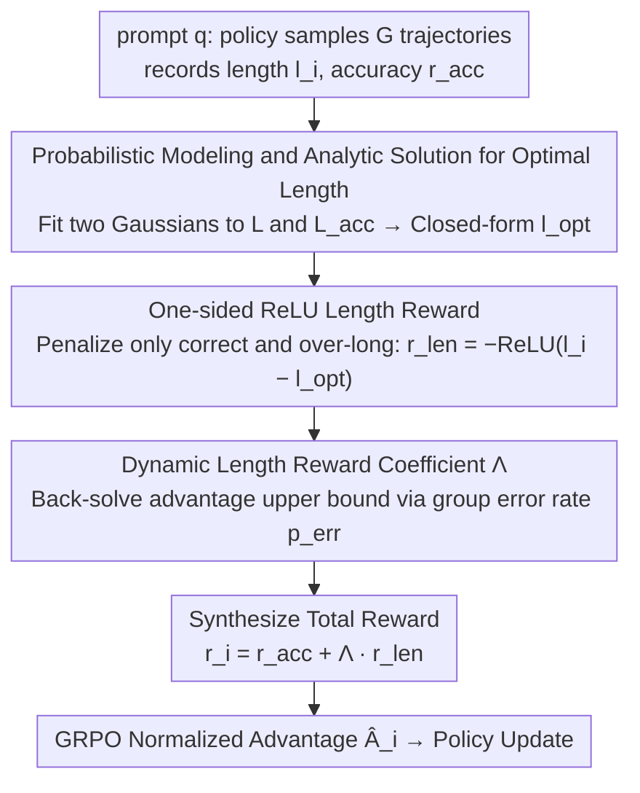

# SmartThinker: Progressive Chain-of-Thought Length Calibration for Efficient Large Language Model Reasoning

**Conference**: ICML 2026  
**arXiv**: [2603.08000](https://arxiv.org/abs/2603.08000)  
**Code**: https://github.com/SJTU-RTEAS/SmartThinker (Available)  
**Area**: LLM Reasoning / Reinforcement Learning Post-training / Efficiency Optimization  
**Keywords**: GRPO, CoT Length Calibration, Dynamic Reward, Overthinking, Optimal Reasoning Length

## TL;DR
This paper proposes SmartThinker, an efficient reinforcement learning post-training method based on GRPO. By performing Gaussian modeling on the "all trajectory length distribution" and "correct trajectory length distribution" for each prompt, it analytically derives the "optimal length $l^{\text{opt}}$ that maximizes the correct rate." Coupled with a dynamic length reward coefficient $\Lambda$ to ensure non-negative normalized advantage for correct trajectories, this method achieves up to 52.6% token compression while improving AIME25 accuracy by up to 16.6% relatively.

## Background & Motivation

**Background**: Large Reasoning Models (LRMs) represented by OpenAI o1 and DeepSeek-R1 achieve high accuracy through lengthy chain-of-thought (CoT). However, longer CoT leads to higher token consumption and latency, and simple questions risk being "misled" by excessive thinking—a phenomenon known as overthinking. To compress CoT, mainstream community solutions often add a length reward to GRPO to encourage shorter outputs, such as ShorterBetter, ThinkPrune, LASER-DE, and L1.

**Limitations of Prior Work**: The authors observe that the reward designs in these methods are "static," leading to two fundamental problems. First, the length reward $r_i^{\text{len}}$ only considers the length of its own trajectory without accounting for the joint length-correctness distribution of other trajectories in the same group, failing to perceive the relative difficulty of the problem. Second, the length reward weight coefficient $\lambda$ is a fixed hyperparameter. After reward normalization in GRPO, "long but correct" trajectories are easily assigned negative advantages, making them indistinguishable from "incorrect trajectories," thereby suppressing necessary exploration.

**Key Challenge**: The relationship between CoT length and accuracy follows an inverted U-shape—there exists an intermediate length $l^{\text{opt}}$ that maximizes the conditional probability $\Pr(r^{\text{acc}}=1 \mid l, q; \theta)$. Crude linear length penalties may exceed this optimal point, leading to over-compression. Meanwhile, a static $\lambda$ destroys the semantic meaning of the GRPO advantage sign, mixing "correct" and "overly long" signals in the gradient.

**Goal**: To simultaneously address two issues within the GRPO framework: (1) how to dynamically estimate $l^{\text{opt}}$ according to problem difficulty; (2) how to dynamically adjust the length reward weight according to group accuracy, ensuring correct trajectories have non-negative advantages and incorrect ones have non-positive advantages.

**Key Insight**: Leverage the fact that a single rollout in GRPO provides $G$ trajectories. The set of lengths $\mathcal{L}$ and the set of lengths for correct trajectories $\mathcal{L}^{\text{acc}}$ naturally provide samples for two distributions. Assuming both approximate Gaussian distributions, one can use Bayesian inference to back-solve $\Pr(r^{\text{acc}}=1\mid l)$ and analytically find the optimal length.

**Core Idea**: Transform "how long to think" into a target dynamically calculated based on the current policy and problem rather than a hyperparameter. Simultaneously, dynamically calculate the "length penalty weight" to prevent the length term from contaminating the semantic sign of the GRPO advantage.

## Method

### Overall Architecture
SmartThinker inserts two dynamic calculation steps into the GRPO training loop. For each prompt $q$, the policy $\pi_\theta$ first rolls out a group of $G$ trajectories $\{o_1,\dots,o_G\}$, recording length $l_i$ and correctness $r_i^{\text{acc}}\in\{0,1\}$. Based on these samples: (i) estimate two Gaussian distributions $(\hat\mu_1,\hat\sigma_1)$ and $(\hat\mu_2,\hat\sigma_2)$ using $\mathcal{L}$ and $\mathcal{L}^{\text{acc}}$ to solve for the optimal length $\hat l^{\text{opt}}$; (ii) calculate a ReLU-form length penalty $r_i^{\text{len}}$ for each correct trajectory based on $\hat l^{\text{opt}}$; (iii) calculate the length weight $\Lambda$ based on the group error rate $p^{\text{err}}$; (iv) synthesize the total reward $r_i = r_i^{\text{acc}} + \Lambda \cdot r_i^{\text{len}}$, then proceed with standard GRPO normalized advantage $\hat A_i$ and policy updates. This mechanism requires no value network, introduces no additional sampling, and can be embedded as a plug-in into multi-stage frameworks like AutoThink and ThinkPrune.

### Key Designs

**1. Probabilistic Modeling and Analytic Solution for Optimal Length: A theoretically grounded target for length reward**

Previous methods (e.g., ShorterBetter) directly used the "shortest correct trajectory length" as the target, but that is a marginal point of the distribution, and approaching it often leads to performance degradation. SmartThinker instead seeks the length that maximizes the conditional accuracy. It assumes all trajectory lengths in a group follow $N(\mu_1,\sigma_1^2)$ and correct trajectory lengths follow $N(\mu_2,\sigma_2^2)$. Applying Bayes' theorem yields an analytic expression for $\Pr(r^{\text{acc}}=1\mid l)$ with respect to $l$. The paper proves that this curve has a unique finite maximum if and only if $\sigma_1^2>\sigma_2^2$, with the closed-form solution $l^{\text{opt}} = \frac{\sigma_1^2 \mu_2 - \sigma_2^2 \mu_1}{\sigma_1^2 - \sigma_2^2}$; otherwise, it degenerates to $\max(\mathcal L)$ or $\min(\mathcal L)$. During training, sample mean and variance are substituted, and the result is clipped to $[\min\mathcal L, \max\mathcal L]$. 

The key benefit is that this target automatically scales with problem difficulty: for simple problems, correct trajectories are generally short, leading $\hat l^{\text{opt}}$ to follow suit and encourage conciseness; for difficult problems, $\hat l^{\text{opt}}$ increases to allow space for exploration.

**2. One-sided ReLU Length Reward: Penalizing only "Correct but Too Long"**

Existing methods often apply symmetric or linear length penalties to all trajectories. Consequently, correct long trajectories and incorrect long trajectories are treated equally, preventing the model from distinguishing between "exploratory length" and "erroneous length." SmartThinker precisely targets the "correct but exceeding optimal length" segment: $r_i^{\text{len}} = 0$ (if $r_i^{\text{acc}}=0$), otherwise $r_i^{\text{len}} = -\operatorname{ReLU}(l_i - \hat l^{\text{opt}})$. Incorrect trajectories receive no length signal, preventing the model from taking shortcuts by copying incorrect samples. 

This design also features an automatic switch: when $\hat l^{\text{opt}} \geq \max(\mathcal L^{\text{acc}})$, indicating no correct trajectory exceeds the optimal length, the group length reward becomes 0, and SmartThinker reverts to standard GRPO to focus purely on reasoning capability—an on-demand mechanism that stops compression when it is short enough.

**3. Dynamic Length Reward Coefficient $\Lambda$: Preventing length terms from contaminating GRPO advantage signs**

The fundamental flaw of a fixed weight $\lambda$ is that after GRPO normalization, "long but correct" trajectories easily get negative advantages, being categorized with "incorrect trajectories" in the gradient. SmartThinker solves for $\lambda$ by imposing a constraint: for all correct trajectories, $1+\lambda r_i^{\text{len}} \geq \operatorname{mean}(\boldsymbol r^{\text{acc}} + \lambda \boldsymbol r^{\text{len}})$ (i.e., correct trajectories must have non-negative normalized advantages). Substituting $r_i^{\text{len}}\leq 0$ yields the upper bound $\lambda \leq \frac{p^{\text{err}}}{\operatorname{mean}(\boldsymbol r^{\text{len}}) - \min(\boldsymbol r^{\text{len}})}$, where $p^{\text{err}}$ is the group error rate. To maximize compression efficiency, the upper bound is taken as $\Lambda = \frac{p^{\text{err}}}{\operatorname{mean}(\boldsymbol r^{\text{len}}) - \min(\boldsymbol r^{\text{len}})}$.

This formula ties the weight to the group error rate, encoding intuitive difficulty perception: more incorrect trajectories (harder problems) lead to stronger penalties; when all are correct ($p^{\text{err}}=0$), $\Lambda=0$, automatically disabling the length reward. This preserves exploration for hard problems while compressing simple ones, eliminating manual tuning.

### Loss & Training
The total reward is $r_i = r_i^{\text{acc}} + \Lambda(\boldsymbol r^{\text{acc}}, \boldsymbol r^{\text{len}}) \cdot r_i^{\text{len}}$, and the normalized advantage is $\hat A_i = (r_i - \operatorname{mean}\{r_j\}) / \operatorname{std}\{r_j\}$. The objective follows the standard GRPO: $\max_\theta \frac{\pi_\theta(o_i\mid q)}{\pi_{\text{old}}(o_i\mid q)} \hat A_i$. Implemented using verl with: batch=64, group=8, minibatch=16, max length=8000, lr $=1\times 10^{-6}$, excluding KL loss. 1.5B/7B/4B models are trained for only 150/75/50 steps respectively.

## Key Experimental Results

### Main Results

Comparison against static length reward baselines on MATH500, AIME25, and AMC23 using three base models (results for DeepSeek-R1-Distill-Qwen-1.5B):

| Method | Math500 Len/Acc | AIME25 Len/Acc | AMC23 Len/Acc | Avg Acc | AE↑ |
|------|------------------|-----------------|----------------|----------|-----|
| Base Model | 5420 / 84.9 | 15199 / 24.2 | 9320 / 73.1 | 60.7 | N/A |
| ShorterBetter | 1008 / 71.0 | 3727 / 19.0 | 2246 / 66.9 | 52.3 | 0.07 |
| ThinkPrune-4k | 2744 / 84.1 | 7462 / 22.5 | 4201 / 76.3 | 60.95 | 0.53 |
| LASER-DE-4096 | 2720 / 85.1 | 7706 / 22.5 | 4330 / 71.9 | 59.8 | 0.42 |
| **SmartThinker** | 2645 / 84.5 | 8431 / **25.0** | 4421 / **76.3** | **61.9** | **0.54** |

On the 7B model, AIME25 accuracy increased from 35.0 → 40.8 (16.6% relative gain). On Qwen3-4B-Thinking-2507, average tokens decreased from 13040 → 7747 (~41% compression) while average accuracy rose from 88.5 → 89.0.

### Ablation Study

Ablation of the two dynamic mechanisms on DeepSeek-R1-Distill-Qwen-1.5B:

| Configuration | Avg Len | Avg Acc | Description |
|------|-----------|----------|------|
| Fixed Coefficient | 3644 | 57.5 | Fixed $\lambda$; correct long trajectories wrongly assigned negative advantage, Acc drops by 4.4 |
| Symmetric | 5530 | 60.2 | Pulling all correct trajectories toward $\hat l^{\text{opt}}$ (not one-sided); compression weakens |
| Linear | 4242 | 58.2 | Linear length reward instead of ReLU; Acc drops by 3.7 |
| **SmartThinker** | 5169 | **61.9** | Both One-sided ReLU and Dynamic $\Lambda$ enabled |

ODD results (MMLU, MathQA, LiveCodeBench, HumanEval): 1.5B avg length 5575→3583, Acc 55.78→56.50; 4B length 5781.5→4231.25, Acc 83.97→84.43. Efficiency gains from math training transfer to general tasks.

### Key Findings
- The dynamic length reward coefficient $\Lambda$ contributes most: removing it (Fixed Coefficient) drops average accuracy by 4.4 points, proving that "ensuring non-negative advantages for correct trajectories" is critical.
- SmartThinker is the only method in the table that consistently improves average accuracy across all base models, proving that "dynamic target length" avoids the accuracy loss associated with static compression on hard problems.
- During training, $\hat l^{\text{opt}}$ was observed to be consistently lower than actual output lengths, confirming that overthinking is prevalent and that the optimal length itself shifts dynamically with the policy.
- As a plug-in for AutoThink/ThinkPrune, it outperforms the original multi-stage training with shorter duration (AE 0.55 vs 0.50; 0.58 vs 0.54).

## Highlights & Insights
- **Turning "Thinking Time" into an Analytically Derivable Quantity**: Using two Gaussian distributions + Bayesian inference to solve for $l^{\text{opt}}$ provides the first theoretical target for length rewards based on conditional accuracy rather than heuristic intuition.
- **Back-solving Length Weights via Group Error Rate**: The formula $\Lambda = p^{\text{err}}/(\operatorname{mean}-\min)$ directly addresses "advantage sign constraints." It eliminates manual tuning and encodes the logic that harder problems should have milder penalties. This approach of "deriving reward shape from GRPO normalization constraints" can be generalized.
- **One-sided ReLU + Automatic Degradation**: When $\hat l^{\text{opt}}\geq\max(\mathcal L^{\text{acc}})$, the length reward zeroes out, reverting to original GRPO. This acts as an internal adaptive switch that stops compression once thoughts are concise enough, avoiding the collapse caused by over-compression.

## Limitations & Future Work
- The Gaussian assumption is idealized. For small group sizes or multi-modal length distributions, $\hat\mu,\hat\sigma$ estimation may be noisy, leading to unstable $\hat l^{\text{opt}}$. Clipping to $[\min\mathcal L,\max\mathcal L]$ mitigates but does not eliminate this.
- Evaluated only on GRPO; whether it is equally effective for variants like DAPO, GSPO, or SAPO remains to be empirically verified.
- Only applicable to tasks with determinable correctness (math/code); ineffective for open-ended generation where $r^{\text{acc}}\in\{0,1\}$ cannot be defined.
- Still outcome-only reward; lacks process reward supervision. Integrating SmartThinker with process rewards is a listed future direction.

## Related Work & Insights
- **vs ShorterBetter**: Both add length rewards in GRPO with dynamically calculated target lengths. However, ShorterBetter uses the "shortest correct trajectory" as the target, which is sensitive to distribution outliers. SmartThinker uses the "maximum conditional accuracy" analytic extreme, which is more robust and ignores length signals for incorrect trajectories.
- **vs ThinkPrune / LASER-DE**: These use fixed token budgets (e.g., 4k/4096), essentially a "global threshold for all problems." SmartThinker's $\hat l^{\text{opt}}$ is per-prompt and per-step adaptive, preventing over-compression on hard problems like AIME25.
- **vs L1 / AutoThink**: L1 conditions length in the prompt, while AutoThink uses multi-stage curricula. SmartThinker is single-stage and plug-and-play. Experiments show that replacing stage 3 of AutoThink with SmartThinker yields better results, suggesting dynamic reward design may be superior to multi-stage curricula.

## Rating
- Novelty: ⭐⭐⭐⭐ Modeling "optimal CoT length" as the conditional probability extreme of two Gaussians is a clean and original theoretical framing.
- Experimental Thoroughness: ⭐⭐⭐⭐ Covers three base models, three math benchmarks, four OOD tasks, two multi-stage framework integrations, and several ablation configurations.
- Writing Quality: ⭐⭐⭐⭐ Clear logical chain: motivation—theory—algorithm—experiments.
- Value: ⭐⭐⭐⭐ Highly practical as a drop-in replacement for existing GRPO compression methods, achieving up to 52.6% compression without sacrificing accuracy.

<!-- RELATED:START -->

## Related Papers

- [\[AAAI 2026\] Incorporating Self-Rewriting into Large Language Model Reasoning Reinforcement](../../AAAI2026/llm_reasoning/incorporating_self-rewriting_into_large_language_model_reasoning_reinforcement.md)
- [\[ICLR 2026\] Training Large Reasoning Models Efficiently via Progressive Thought Encoding](../../ICLR2026/llm_reasoning/training_large_reasoning_models_efficiently_via_progressive_thought_encoding.md)
- [\[ICML 2026\] DecepChain: Inducing Deceptive Reasoning in Large Language Models](decepchain_inducing_deceptive_reasoning_in_large_language_models.md)
- [\[ICML 2026\] On the Generalization Gap in Self-Evolving Language Model Reasoning](on_the_generalization_gap_in_self-evolving_language_model_reasoning.md)
- [\[ICML 2026\] GRPO is Secretly a Process Reward Model](grpo_is_secretly_a_process_reward_model.md)

<!-- RELATED:END -->
