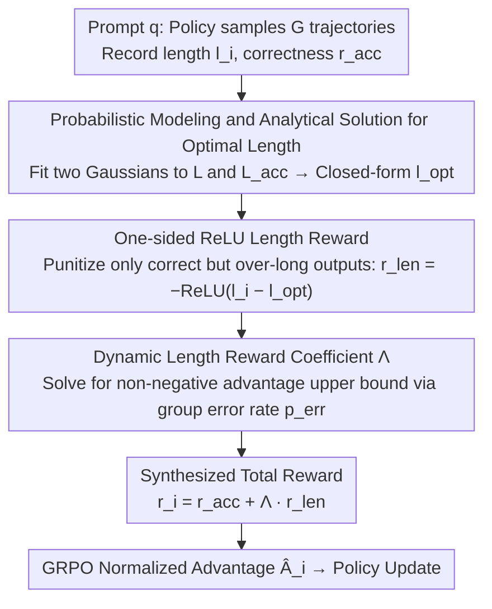

# SmartThinker: Progressive Chain-of-Thought Length Calibration for Efficient Large Language Model Reasoning

**Conference**: ICML 2026  
**arXiv**: [2603.08000](https://arxiv.org/abs/2603.08000)  
**Code**: https://github.com/SJTU-RTEAS/SmartThinker (Available)  
**Area**: LLM Reasoning / RL Post-training / Efficiency Optimization  
**Keywords**: GRPO, CoT Length Calibration, Dynamic Rewards, Overthinking, Optimal Reasoning Length

## TL;DR
This paper proposes SmartThinker, an efficient reasoning post-training method based on GRPO. By Gaussian modeling of the "total trajectory length distribution" and "correct trajectory length distribution" for each prompt, the authors analytically derive the "optimal length $l^{\text{opt}}$ that maximizes accuracy." Combined with a dynamic length reward coefficient $\Lambda$ that ensures non-negative normalized advantage for correct trajectories, the method achieves up to 52.6% token compression while improving AIME25 accuracy by up to 16.6% relatively.

## Background & Motivation

**Background**: Large Reasoning Models (LRMs) like OpenAI o1 and DeepSeek-R1 achieve high accuracy through lengthy Chain-of-Thought (CoT). However, longer CoT increases token consumption, latency, and the risk of "thinking off track" for simple problems—a phenomenon known as overthinking. To compress CoT, the community's primary solution involves adding length rewards to the GRPO framework that encourage shorter outputs (e.g., ShorterBetter, ThinkPrune, LASER-DE, L1).

**Limitations of Prior Work**: The authors observe that existing reward designs are "static," suffering from two fundamental issues. First, the length reward $r_i^{\text{len}}$ only considers its own trajectory length without accounting for the joint length-accuracy distribution of other trajectories in the same group, failing to perceive the relative difficulty of the problem. Second, the length reward weight coefficient $\lambda$ is a fixed hyperparameter. After reward normalization in GRPO, "long but correct" trajectories can easily be assigned negative advantages, making them indistinguishable from "incorrect trajectories" and suppressing necessary exploration.

**Key Challenge**: The relationship between CoT length and accuracy follows an inverted U-shape—there exists an intermediate length $l^{\text{opt}}$ that maximizes the conditional probability $\Pr(r^{\text{acc}}=1 \mid l, q; \theta)$. Simple linear length penalties may overshoot this optimal point, causing over-compression. Meanwhile, a static $\lambda$ distorts the semantics of GRPO advantage signs, conflating "correctness" with "excessive length" in the gradient signal.

**Goal**: To simultaneously address two issues within the GRPO framework: (1) how to dynamically estimate $l^{\text{opt}}$ based on problem difficulty; and (2) how to dynamically adjust the length reward weight based on group accuracy, ensuring non-negative advantage for all correct trajectories and non-positive advantage for all incorrect ones.

**Key Insight**: Utilizing the fact that GRPO generates $G$ trajectories per rollout—the set of lengths $\mathcal{L}$ and the set of lengths for correct trajectories $\mathcal{L}^{\text{acc}}$ within the same group naturally provide samples for two distributions. By assuming both approximate Gaussian distributions, one can use Bayesian inference to derive $\Pr(r^{\text{acc}}=1\mid l)$ and analytically solve for the optimal length.

**Core Idea**: Transforming "how long to think" into a target derived dynamically from the current policy and prompt rather than a static hyperparameter. Simultaneously, deriving the "length penalty weight" dynamically to ensure the sign semantics of GRPO advantages are not contaminated by the length term.

## Method

### Overall Architecture
SmartThinker inserts two dynamic calculation steps into the GRPO training loop. For each prompt $q$, the policy $\pi_\theta$ rollouts a group of $G$ trajectories $\{o_1,\dots,o_G\}$, recording length $l_i$ and correctness $r_i^{\text{acc}}\in\{0,1\}$. Based on these samples: (i) fit two Gaussian distributions $(\hat\mu_1,\hat\sigma_1)$ and $(\hat\mu_2,\hat\sigma_2)$ using $\mathcal{L}$ and $\mathcal{L}^{\text{acc}}$ to solve for the optimal length $\hat l^{\text{opt}}$ analytically; (ii) calculate a one-sided ReLU length penalty $r_i^{\text{len}}$ for each correct trajectory based on $\hat l^{\text{opt}}$; (iii) calculate the length weight $\Lambda$ based on the group error rate $p^{\text{err}}$; (iv) synthesize the total reward $r_i = r_i^{\text{acc}} + \Lambda \cdot r_i^{\text{len}}$, followed by standard GRPO advantage normalization $\hat A_i$ and policy updates. This mechanism requires no value network, introduces no extra sampling, and can be integrated as a plug-in into multi-stage frameworks like AutoThink or ThinkPrune.

### Key Designs

**1. Probabilistic Modeling and Analytical Solution for Optimal Length: A Theoretical Target for Length Rewards**

Previous methods (e.g., ShorterBetter) used the "shortest correct trajectory length" as the target, but this is an extreme point of the distribution, and approaching it often leads to performance drops. SmartThinker seeks the length that maximizes the conditional accuracy. Assuming total trajectory lengths follow $N(\mu_1,\sigma_1^2)$ and correct trajectory lengths follow $N(\mu_2,\sigma_2^2)$, the conditional accuracy $\Pr(r^{\text{acc}}=1\mid l)$ can be expressed analytically using Bayes' rule. The paper proves that this curve has a unique finite maximum if and only if $\sigma_1^2>\sigma_2^2$, with the closed-form solution $l^{\text{opt}} = \frac{\sigma_1^2 \mu_2 - \sigma_2^2 \mu_1}{\sigma_1^2 - \sigma_2^2}$; other cases degenerate to $\max(\mathcal L)$ or $\min(\mathcal L)$. During training, sample means and variances are used, and results are clipped to $[\min\mathcal L, \max\mathcal L]$ to prevent extrapolation.

This target's key advantage is its ability to scale with the relative difficulty of the problem for the policy: for simple problems where correct trajectories are short, $\hat l^{\text{opt}}$ stays small to encourage conciseness; for difficult problems where correct trajectories are longer, $\hat l^{\text{opt}}$ increases to allow space for exploration.

**2. One-sided ReLU Length Reward based on Optimal Length: Penalizing Only "Correct but Long"**

Existing methods often apply symmetric or linear length penalties across all trajectories, meaning long correct trajectories and long incorrect trajectories are treated equally. Consequently, the model cannot distinguish between "exploratory length" and "erroneous deviations." SmartThinker restricts the penalty to the segment where trajectories are "correct but exceed the optimal length": $r_i^{\text{len}} = 0$ if $r_i^{\text{acc}}=0$, otherwise $r_i^{\text{len}} = -\operatorname{ReLU}(l_i - \hat l^{\text{opt}})$. Incorrect trajectories receive no length signal, preventing the "double penalty" from inducing the model to take shortcuts based on incorrect samples.

This design includes an implicit switch: when $\hat l^{\text{opt}} \geq \max(\mathcal L^{\text{acc}})$, meaning no correct trajectory exceeds the optimal length, the group length reward becomes 0. SmartThinker then automatically reverts to standard GRPO, refocusing the training on improving reasoning capability—constituting an on-demand mechanism that stops compression when outputs are "short enough."

**3. Dynamic Length Reward Coefficient $\Lambda$: Preventing Signal Pollution in GRPO Advantages**

A fixed weight $\lambda$ fails because after GRPO normalization, "long but correct" trajectories often receive negative advantages, grouping them with "incorrect trajectories" in the gradient. SmartThinker derives the weight from constraints rather than manual tuning. It requires that for all correct trajectories, $1+\lambda r_i^{\text{len}} \geq \operatorname{mean}(\boldsymbol r^{\text{acc}} + \lambda \boldsymbol r^{\text{len}})$ (ensuring non-negative normalized advantage for correct ones). Substituting $r_i^{\text{len}}\leq 0$ yields proof for an upper bound $\lambda \leq \frac{p^{\text{err}}}{\operatorname{mean}(\boldsymbol r^{\text{len}}) - \min(\boldsymbol r^{\text{len}})}$, where $p^{\text{err}}$ is the group error rate. To maximize compression efficiency, the upper bound is chosen: $\Lambda = \frac{p^{\text{err}}}{\operatorname{mean}(\boldsymbol r^{\text{len}}) - \min(\boldsymbol r^{\text{len}})}$.

This formula ties the weight to the group error rate, encoding an intuitive difficulty awareness: more incorrect trajectories (harder problems) lead to stronger penalties for being excessively long when correct. When all trajectories are correct ($p^{\text{err}}=0$), $\Lambda=0$, effectively disabling the length reward. This allows exploration for hard problems and aggressive compression for simple ones while eliminating manual parameter tuning.

### Loss & Training
The total reward is $r_i = r_i^{\text{acc}} + \Lambda(\boldsymbol r^{\text{acc}}, \boldsymbol r^{\text{len}}) \cdot r_i^{\text{len}}$. The normalized advantage is $\hat A_i = (r_i - \operatorname{mean}\{r_j\}) / \operatorname{std}\{r_j\}$, followed by the standard GRPO objective $\max_\theta \frac{\pi_\theta(o_i\mid q)}{\pi_{\text{old}}(o_i\mid q)} \hat A_i$. Implementation is based on verl with batch=64, group=8, minibatch=16, max length=8000, lr $=1\times 10^{-6}$, omitting KL loss. Training steps for 1.5B/7B/4B models are 150/75/50, respectively.

## Key Experimental Results

### Main Results

Comparison against static length reward baselines on MATH500, AIME25, and AMC23 using three base models (results for DeepSeek-R1-Distill-Qwen-1.5B):

| Method | Math500 Len/Acc | AIME25 Len/Acc | AMC23 Len/Acc | Avg Acc | AE↑ |
|------|------------------|-----------------|----------------|----------|-----|
| Base Model | 5420 / 84.9 | 15199 / 24.2 | 9320 / 73.1 | 60.7 | N/A |
| ShorterBetter | 1008 / 71.0 | 3727 / 19.0 | 2246 / 66.9 | 52.3 | 0.07 |
| ThinkPrune-4k | 2744 / 84.1 | 7462 / 22.5 | 4201 / 76.3 | 60.95 | 0.53 |
| LASER-DE-4096 | 2720 / 85.1 | 7706 / 22.5 | 4330 / 71.9 | 59.8 | 0.42 |
| **SmartThinker** | 2645 / 84.5 | 8431 / **25.0** | 4421 / **76.3** | **61.9** | **0.54** |

On the 7B model, AIME25 accuracy increased from 35.0 to 40.8 (16.6% relative gain). On Qwen3-4B-Thinking-2507, average tokens dropped from 13040 to 7747 (~41% compression) while average accuracy improved from 88.5 to 89.0.

### Ablation Study

Ablation of the two dynamic mechanisms on DeepSeek-R1-Distill-Qwen-1.5B:

| Configuration | Avg Len | Avg Acc | Description |
|------|-----------|----------|------|
| Fixed Coefficient | 3644 | 57.5 | With fixed $\lambda$, long correct trajectories mistakenly get negative advantages; Acc drops 4.4 |
| Symmetric | 5530 | 60.2 | Pulling all correct trajectories toward $\hat l^{\text{opt}}$ instead of one-sided; weaker compression |
| Linear | 4242 | 58.2 | Replacing ReLU with linear length reward; Acc drops 3.7 |
| **SmartThinker** | 5169 | **61.9** | One-sided ReLU + dynamic $\Lambda$ both enabled |

On OOD tasks (MMLU, MathQA, LiveCodeBench, HumanEval), the 1.5B model's average length decreased from 5575 to 3583 while Acc rose from 55.78 to 56.50. This indicates that efficiency gains from math training transfer to general tasks.

### Key Findings
- The dynamic length reward coefficient $\Lambda$ contributes the most: removing it (Fixed Coefficient) causes average accuracy to drop by 4.4 points, proving that "ensuring non-negative advantage for correct trajectories" is critical.
- SmartThinker is the only method in the table that consistently improves average accuracy across all base models, proving that "dynamic target calculation per prompt" avoids precision loss on hard problems seen in static compression.
- During training, $\hat l^{\text{opt}}$ is observed to be consistently lower than the actual output length, confirming that overthinking is prevalent and the optimal length evolves dynamically with the policy.
- As a plug-in for AutoThink/ThinkPrune's final stage, it achieves better results than the original multi-stage training with shorter duration (AE 0.55 vs 0.50; 0.58 vs 0.54).

## Highlights & Insights
- **Turning "required thinking time" into an analytically derivable value**: Using two Gaussian distributions and Bayesian inference to obtain a closed-form solution for $l^{\text{opt}}$ provides the first theoretical target for length rewards based on conditional accuracy rather than heuristic intuition.
- **Solving for length weights via group error rate**: The formula $\Lambda = p^{\text{err}}/(\operatorname{mean}-\min)$ directly satisfies the "advantage sign constraint." It eliminates manual hyperparameter tuning and encodes the semantics of "stronger penalties for harder problems" into the weight.
- **One-sided ReLU + Automatic Degeneration**: When $\hat l^{\text{opt}}\geq\max(\mathcal L^{\text{acc}})$, the length reward zeroes out, reverting to original GRPO. This acts as an internal adaptive switch that stops compression to avoid performance collapse.

## Limitations & Future Work
- The Gaussian assumption is highly idealized: when intra-group samples are few or the length distribution is multi-modal, estimates for $\hat\mu,\hat\sigma$ are noisy, leading to unstable $\hat l^{\text{opt}}$. The paper utilizes clipping to $[\min\mathcal L,\max\mathcal L]$ to mitigate this but does not eliminate it.
- Validation is limited to GRPO; empirical results for GRPO variants like DAPO, GSPO, or SAPO are not provided.
- The method only handles tasks with verifiable correctness (math/code) and fails in open-ended generation where $r^{\text{acc}}\in\{0,1\}$ cannot be defined.
- It remains an outcome-only reward without process reward supervision, meaning it cannot identify fine-grained beneficial patterns within the CoT.

## Related Work & Insights
- **vs ShorterBetter**: Both use length rewards in GRPO with prompt-dynamic targets. However, ShorterBetter's target is the "shortest correct trajectory," an extreme point that often leads to accuracy drops. SmartThinker uses an analytical maximum of the conditional accuracy, which is more robust.
- **vs ThinkPrune / LASER-DE**: These use fixed token budgets (e.g., 4k/4096) as global thresholds. SmartThinker's $\hat l^{\text{opt}}$ is per-prompt and per-step adaptive, preventing over-compression on difficult tasks like AIME25.
- **vs L1 / AutoThink**: L1 conditions the expected length in the prompt, while AutoThink uses multi-stage curriculum learning for compression. SmartThinker is a single-stage, plug-and-play solution. Experiments show that replacing stage 3 of AutoThink with SmartThinker yields better results, suggesting dynamic reward design may outperform multi-stage curriculums.

## Rating
- Novelty: ⭐⭐⭐⭐ Modeling "optimal CoT length" as a conditional probability maximum of two Gaussians is a clean and original theoretical framing.
- Experimental Thoroughness: ⭐⭐⭐⭐ Covers three base models, three math benchmarks, four OOD tasks, two multi-stage frameworks, and various reward configurations.
- Writing Quality: ⭐⭐⭐⭐ Clear logical flow from motivation to theory, algorithm, and experiments; Section 2.3 effectively categorizes the issues with "static" designs.
- Value: ⭐⭐⭐⭐ Provides a drop-in replacement for existing GRPO length compression methods, achieving significant compression without loss (or even gain) in accuracy.

<!-- RELATED:START -->

## Related Papers

- [\[ICLR 2026\] Training Large Reasoning Models Efficiently via Progressive Thought Encoding](../../ICLR2026/llm_reasoning/training_large_reasoning_models_efficiently_via_progressive_thought_encoding.md)
- [\[ICLR 2026\] When More Is Less: Understanding Chain-of-Thought Length in LLMs](../../ICLR2026/llm_reasoning/when_more_is_less_understanding_chain-of-thought_length_in_llms.md)
- [\[ICML 2026\] Calibration of Structured Ignorance Certificates for Diagnosing Unknown Unknowns in Reasoning Models](calibration_of_structured_ignorance_certificates_for_diagnosing_unknown_unknowns.md)
- [\[ICML 2026\] DecepChain: Inducing Deceptive Reasoning in Large Language Models](decepchain_inducing_deceptive_reasoning_in_large_language_models.md)
- [\[AAAI 2026\] Incorporating Self-Rewriting into Large Language Model Reasoning Reinforcement](../../AAAI2026/llm_reasoning/incorporating_self-rewriting_into_large_language_model_reasoning_reinforcement.md)

<!-- RELATED:END -->
## Related Papers

- [\[AAAI 2026\] Incorporating Self-Rewriting into Large Language Model Reasoning Reinforcement](../../AAAI2026/llm_reasoning/incorporating_self-rewriting_into_large_language_model_reasoning_reinforcement.md)
- [\[ICML 2026\] DecepChain: Inducing Deceptive Reasoning in Large Language Models](decepchain_inducing_deceptive_reasoning_in_large_language_models.md)
- [\[ICML 2026\] On the Generalization Gap in Self-Evolving Language Model Reasoning](on_the_generalization_gap_in_self-evolving_language_model_reasoning.md)
- [\[ICLR 2026\] Training Large Reasoning Models Efficiently via Progressive Thought Encoding](../../ICLR2026/llm_reasoning/training_large_reasoning_models_efficiently_via_progressive_thought_encoding.md)
- [\[ICML 2026\] GRPO is Secretly a Process Reward Model](grpo_is_secretly_a_process_reward_model.md)

<!-- RELATED:END -->
