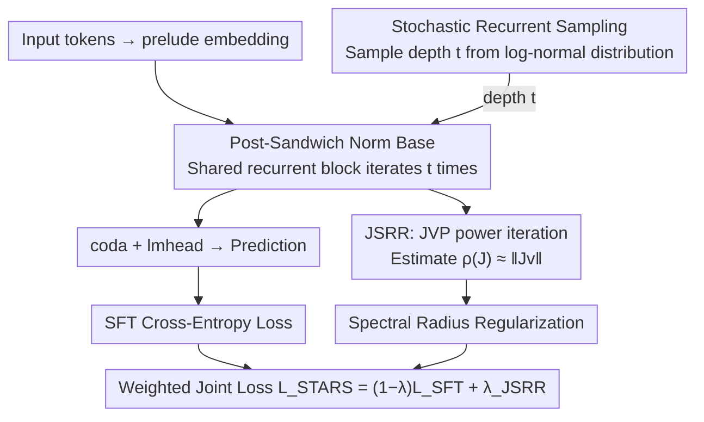

# Stabilizing Recurrent Dynamics for Test-Time Scalable Latent Reasoning in Looped Language Models

**Conference**: ICML 2026  
**arXiv**: [2605.26733](https://arxiv.org/abs/2605.26733)  
**Code**: https://github.com/njuyxw/STARS (Available)  
**Area**: LLM Reasoning / Latent Reasoning / Recurrent Transformer  
**Keywords**: Looped LM, Test-time Scaling, Jacobian Spectral Radius, Dynamical System Stability, Stochastic Recurrent Sampling

## TL;DR
This paper diagnoses the root cause of the "performance collapse" in Looped Language Models (LoopLM) when scaling depth at test-time from a dynamical systems perspective: a "stability-effectiveness" duality caused by normalization placement. It proposes STARS, which combines Jacobian Spectral Radius Regularization (JSRR) with stochastic recurrent sampling to pull latent trajectories toward "asymptotically stable effective fixed points." On GSM8K, STARS reduces the performance drop at 8 iterations from 20.47% to 8.26%, while increasing peak performance by 4.01%.

## Background & Motivation

**Background**: The mainstream path for LLM test-time scaling involves explicitly extending output length (CoT, majority voting, ToT, MCTS), which is limited by natural language bandwidth and efficiency. Emerging Looped Language Models (LoopLM, e.g., Huginn, Ouro) take a different route: performing deep recursion on a shared Transformer block to move "thinking" into a continuous latent space. Theoretically, more iterations should lead to more refined representations without increasing context length.

**Limitations of Prior Work**: The authors find that the assumption of "longer thinking leads to higher accuracy" does not hold. On GSM8K, the accuracy of Ouro-1.4B "collapses sharply" after reaching a peak at a certain iteration depth. For instance, after standard SFT, performance drops from 70.46% to 52.97% at step 8. This suggests that LoopLMs have not truly learned "scalable latent reasoning" but have instead overfitted to the fixed iteration depth used during training.

**Key Challenge**: Utilizing a dynamical systems lens, the authors diagnose the recurrent block as a discrete-time mapping $\mathbf{h}^{(t+1)}=\Phi_\theta(\mathbf{h}^{(t)})$. They identify a fundamental duality—**effectiveness and stability are determined by LayerNorm placement, and the two are mutually exclusive**:
- **Internal Normalization** (Pre-Norm / Pre-Sandwich): Residuals bypass normalization, keeping the "information highway" open (effective), but update vectors accumulate directly on the backbone. This causes the hidden state norm to explode exponentially, leading to trajectory deviation and performance collapse.
- **External Normalization** (Post-Norm / Post-Sandwich): Normalization wraps the residuals, keeping hidden states bounded (stable), but the reasoning depth remains shallow, preventing high performance during training.

The authors also verify that common remedies—non-recurrent Prelude/Coda layers, L2 regularization, and stochastic sampling—**cannot resolve this deadlock**.

**Goal**: To enable LoopLMs to possess truly test-time scalable latent reasoning capabilities; specifically, deeper iterations should lead to more converged latent states and more robust performance.

**Key Insight**: Reasoning is conceptualized as an "iterative process of uncertainty reduction." In dynamical terms, this means hidden states should converge to a fixed point that is both "stable" (non-divergent, non-oscillatory) and "effective" (positioned to solve the problem).

**Core Idea**: Utilizing the Lyapunov Linearization Theorem—where the stability of a fixed point is determined by the Jacobian spectral radius—the authors explicitly formulate "asymptotic stability" as a regularization term $\rho(J) < 1$. They then generalize this constraint across the entire trajectory using stochastic recurrent sampling.

## Method

### Overall Architecture

STARS (STAbility-driven Recurrent Scaling) is a training framework applicable to any existing LoopLM (the paper uses Ouro-1.4B for fine-tuning). Its core proposition is that to achieve "deeper is better," the recurrent mapping must be forced into an asymptotically stable attractor during training. The pipeline mirrors standard LoopLM training: tokens pass through a prelude embedding into a shared recurrent block $\Phi_\theta = \mathcal{M}^L$, iterate $t$ times, and pass through a coda + lmhead. The change is in the loss: each batch samples a depth $t$ from a log-normal distribution $\mathcal{P}$ and calculates both standard SFT cross-entropy $\mathcal{L}_{SFT}^{(t)}$ and Jacobian Spectral Radius Regularization $\mathcal{L}_{JSRR}^{(t)}$.

### Key Designs

**1. Dynamical System Diagnosis & Post-Sandwich Base: Selecting the Right Architecture first**
The authors conducted exhaustive experiments with 12 normalization structures (LayerNorm/RMSNorm/SimpleNorm × Pre/Post/Pre-Sandwich/Post-Sandwich) using a 4-digit addition task. Visualizing trajectories via PCA showed that the **position** of normalization, rather than the type, dictates dynamics. Internal normalization leads to exploding norms. External normalization keeps states bounded but limits depth. STARS adopts **Post-Sandwich LayerNorm** as its base because it is naturally bounded and easy to converge, then adds guidance to ensure the attractor is in an effective location.

**2. Jacobian Spectral Radius Regularization (JSRR): Pushing Fixed Points to Stability**
To ensure the system converges to a "stable and effective" point, the authors explicitly penalize the Jacobian spectral radius $\rho(J)$ of the recurrent mapping $\Phi_\theta$. Following Lyapunov's theorem, a system is locally stable if $\rho(J(\mathbf{h}^\star)) < 1$. Since $J\in\mathbb{R}^{D\times D}$ is too large for direct eigenvalue calculation, STARS uses **single-step power iteration + Jacobian-vector product (JVP)**. Spectral radius is estimated as $\rho(J)\approx \|J\mathbf{v}\|_2$. The regularization term is $\mathcal{L}_{JSRR}^{(t)} = \frac{1}{N}\sum_i \|J^{(t,i)} \mathbf{v}^{(t,i)}\|_2^2$.

**3. Stochastic Recurrent Sampling × JSRR: Global Trajectory Constraints**
Constraining the spectral radius at a single depth $t$ does not guarantee convergence at deeper iterations. Every batch samples a step count $t$ from a log-normal distribution ($\mu=1.7, \sigma=0.4$, range $[1,16]$). The joint optimization $\mathcal{L}_{STARS} = \mathbb{E}_{t\sim\mathcal{P}}[(1-\lambda)\cdot\mathcal{L}_{SFT}^{(t)} + \lambda\cdot\mathcal{L}_{JSRR}^{(t)}]$ (with $\lambda=0.1$) ensures that JSRR applies across the support set of depths in $\mathcal{P}$.

### Loss & Training

The final objective is:
$$\mathcal{L}_{STARS} = \mathbb{E}_{t\sim\mathcal{P}}\left[(1-\lambda)\cdot\mathcal{L}_{SFT}^{(t)} + \lambda\cdot\mathcal{L}_{JSRR}^{(t)}\right]$$

For mathematical reasoning: Fine-tuned Ouro-1.4B on a 400K subset of NuminaMath-1.5 for 1 epoch. Used AdamW, cosine schedule, initial lr $1\times10^{-6}$, and $\lambda=0.1$.

## Key Experimental Results

### Main Results (Mathematical Reasoning, Ouro-1.4B fine-tune)

| Model | Loop Steps | GSM8K | MATH500 | ASDiv | SVAMP | AMC23 | Average |
|------|---------|-------|---------|-------|-------|-------|------|
| Ouro-1.4B (base) | 4 | 75.21 | 59.60 | 76.57 | 75.67 | 50.00 | 67.41 |
| Ouro-1.4B (base) | 8 | 58.23 | 40.80 | 70.07 | 66.33 | 40.00 | 55.09 |
| Ouro-1.4B-SFT | 4 | 80.06 | 64.60 | 83.47 | 76.67 | 47.50 | 70.46 |
| Ouro-1.4B-SFT | 8 | 60.05 | 39.20 | 75.10 | 68.00 | 22.50 | 52.97 |
| **Ouro-1.4B-STARS** | 4 | **81.96** | **67.40** | **84.73** | **84.33** | **52.50** | **74.18** |
| **Ouro-1.4B-STARS** | 8 | 74.45 | 54.80 | 82.52 | 81.00 | 35.00 | 65.55 |

Key comparison: Relative drop from peak (step 4) to step 8 on GSM8K is 20.47% for Ouro, 25.0% for SFT, and only 8.26% for STARS.

### Ablation Study (Average of 4 Math Benchmarks)

| Configuration | Trend Characteristics |
|------|---------|
| Ouro-1.4B (base) | Sharp decline after 4 steps |
| + Random Loop only | Slower decline, but significant decay remains |
| + JSRR only | Slower decline, complementary to Random Loop |
| **Full STARS (RL+JSRR)** | Slowest decline and highest peak |

### Key Findings
- **Normalization position is the bottleneck**: Types (RMSNorm vs. LN) matter less than Pre vs. Post placement.
- **Common remedies fail**: Prelude/Coda layers and L2 regularization cannot simultaneously achieve stability and effectiveness.
- **JSRR and Random Loop are complementary**: JSRR provides local stability, while Random Loop extends this to the global trajectory.

## Highlights & Insights
- **Dynamical Perspective**: Re-examining LoopLM "thinking" as fixed-point convergence provides a robust theoretical framework for diagnosis.
- **Efficient JSRR**: Implementing JSRR via JVP and power iteration makes stability optimization computationally feasible at $O(D)$ cost.
- **Design Philosophy**: The concept of "stable and effective fixed points" can be generalized to other latent reasoning methods (e.g., Coconut, SIM-CoT).

## Limitations & Future Work
- **Proxy Points**: JSRR constrains the Jacobian at the current state $\mathbf{h}^{(t)}$ rather than the true fixed point $\mathbf{h}^\star$.
- **Scale**: Experiments were conducted at the 1.4B parameter scale; verification on larger models is needed.
- **Remaining Gap**: While collapse is mitigated, performance at 8 steps still trails the peak by 8.62 points.

## Related Work & Insights
- **vs. Huginn / Ouro**: These models rely on non-recurrent layers, which STARS proves are insufficient for long-term stability.
- **vs. DEQ**: While DEQ regularizes the Frobenius norm $\|J\|_F$, STARS targets the spectral radius $\rho(J)$, which is more precise and less intrusive to model expressivity.
- **vs. Continuous CoT**: While methods like Coconut expand in the sequence dimension, STARS targets the depth dimension.

## Rating
- Novelty: ⭐⭐⭐⭐⭐ 
- Experimental Thoroughness: ⭐⭐⭐⭐ 
- Writing Quality: ⭐⭐⭐⭐⭐ 
- Value: ⭐⭐⭐⭐⭐ 

<!-- RELATED:START -->

<!-- RELATED:END -->

## Related Papers

- [\[ICML 2026\] Prioritize the Process, Not Just the Outcome: Rewarding Latent Thought Trajectories Improves Reasoning in Looped Language Models](prioritize_the_process_not_just_the_outcome_rewarding_latent_thought_trajectorie.md)
- [\[ICML 2026\] Prism: Efficient Test-Time Scaling via Hierarchical Search and Self-Verification for Discrete Diffusion Language Models](prism_efficient_test-time_scaling_via_hierarchical_search_and_self-verification_.md)
- [\[ACL 2026\] Parallel Test-Time Scaling for Latent Reasoning Models](../../ACL2026/llm_reasoning/parallel_test-time_scaling_for_latent_reasoning_models.md)
- [\[ICML 2026\] Dynamics Within Latent Chain-of-Thought: An Empirical Study of Causal Structure](dynamics_within_latent_chain-of-thought_an_empirical_study_of_causal_structure.md)
- [\[ICLR 2026\] Efficient Test-Time Scaling for Small Vision-Language Models](../../ICLR2026/llm_reasoning/efficient_test-time_scaling_for_small_vision-language_models.md)

<!-- RELATED:END -->
