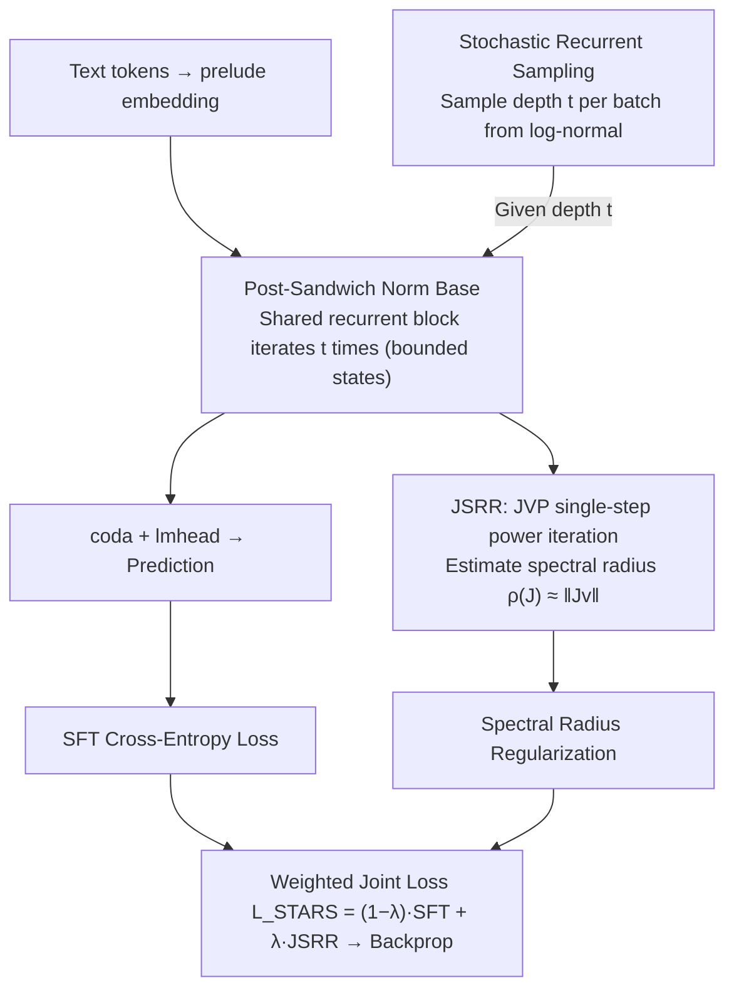

# Stabilizing Recurrent Dynamics for Test-Time Scalable Latent Reasoning in Looped Language Models

**Conference**: ICML 2026  
**arXiv**: [2605.26733](https://arxiv.org/abs/2605.26733)  
**Code**: https://github.com/njuyxw/STARS (Yes)  
**Area**: LLM Reasoning / Latent Reasoning / Recurrent Transformer  
**Keywords**: Looped LM, Test-time Scaling, Jacobian Spectral Radius, Dynamical System Stability, Stochastic Recurrent Sampling

## TL;DR
This paper diagnoses the root cause of the "gain-then-collapse" phenomenon in Looped Language Models (LoopLM) when scaling depth at test-time from a dynamical systems perspective—a "Stability-Effectiveness" dilemma caused by normalization placement. It proposes STARS: using Jacobian Spectral Radius Regularization (JSRR) + Stochastic Recurrent Sampling to pull latent trajectories toward "asymptotically stable effective fixed points." On GSM8K, it compresses the performance drop at 8 iterations from 20.47% to 8.26%, while increasing peak performance by 4.01%.

## Background & Motivation

**Background**: The mainstream path for LLM test-time scaling involves explicitly extending output length (CoT, multi-sample voting, ToT, MCTS), but these are limited by the bandwidth and efficiency of natural language sequences. Recently emerged Looped Language Models (LoopLM, e.g., Huginn, Ouro) take a different path: by performing depth recursion on a shared set of Transformer block parameters, they move "thinking" into the continuous latent space. Theoretically, more iterations should lead to more refined representations without increasing context length.

**Limitations of Prior Work**: The authors find that the assumption of "thinking longer makes it more accurate" does not hold. On GSM8K, the accuracy of Ouro-1.4B "collapses sharply" after reaching a peak at a certain iteration depth—SFT directly leads to a higher peak, but performance drops from 70.46% to 52.97% at step 8. This implies that LoopLMs have not truly learned "scalable latent reasoning capabilities" but have merely overfitted the fixed iteration depth used during training.

**Key Challenge**: The authors perform diagnostic experiments from a dynamical systems perspective, treating the recurrent block as a discrete-time mapping $\mathbf{h}^{(t+1)}=\Phi_\theta(\mathbf{h}^{(t)})$. They identify a fundamental, overlooked binary dilemma—**effectiveness and stability are determined by the position of LayerNorm, and they are mutually exclusive**:
- **Internal Normalization** (Pre-Norm / Pre-Sandwich): Residuals skip normalization, keeping the information highway open (effective), but update vectors are directly accumulated onto the backbone. The hidden state norm expands exponentially with iterations, causing trajectories to deviate from the data manifold $\rightarrow$ performance collapse.
- **External Normalization** (Post-Norm / Post-Sandwich): Normalization encloses the residuals, keeping hidden states bounded (stable), but reasoning remains shallow, preventing high performance during training.

The authors also systematically verify that common remedies—adding non-recurrent Prelude/Coda layers, L2 regularization, and stochastic recurrent sampling—**all fail to break this deadlock simultaneously**.

**Goal**: To enable LoopLMs to possess truly test-time scalable latent reasoning capabilities: where deeper iterations result in more converged latent states and more robust performance.

**Key Insight**: The authors conceptualize "reasoning" as an "iterative process of uncertainty reduction." In dynamical language, this means hidden states should converge to a fixed point that is both "stable" (no divergence or oscillation) and "effective" (positioned to solve the problem). Stability alone is insufficient (shallow thinking), and effectiveness alone is insufficient (chaotic thinking).

**Core Idea**: Utilizing the Lyapunov Linearization Theorem—where the stability of a fixed point is determined by the Jacobian spectral radius—the authors explicitly formulate "asymptotic stability" as a regularization term $\rho(J) < 1$ during training. They then use stochastic recurrent sampling to extend this constraint across the entire trajectory, allowing the model to learn to converge to "stable and accurate" fixed points.

## Method

### Overall Architecture

STARS (STAbility-driven Recurrent Scaling) is a training framework applicable to any existing LoopLM (the paper fine-tunes Ouro-1.4B). Its core premise is: for "deeper iterations lead to higher accuracy" to hold, the recurrent mapping must be forced into an asymptotically stable attractor during training. The entire pipeline is nearly identical to standard LoopLM training—text tokens enter a shared-parameter recurrent block $\Phi_\theta = \mathcal{M}^L$ via a prelude embedding, iterate $t$ times, and are output through a coda + lmhead. The only modification is in the loss: each batch first randomly samples a recurrent depth $t$ from a log-normal distribution $\mathcal{P}$, then calculates the standard SFT cross-entropy $\mathcal{L}_{SFT}^{(t)}$ and the Jacobian Spectral Radius Regularization $\mathcal{L}_{JSRR}^{(t)}$ at that depth, which are weighted and backpropagated. There is zero additional overhead during inference.

### Key Designs

**1. Dynamical System Diagnosis and Post-Sandwich Norm Base: Choosing the Right Architecture First**

Before modifying training, the authors answer a more fundamental question: which architecture possesses the potential to be "saved." In a fully controllable experiment on 4-digit addition, they exhaustively trained 12 normalization structures (LayerNorm/RMSNorm/SimpleNorm × Pre/Post/Pre-Sandwich/Post-Sandwich), projected latent trajectories using PCA, and tracked trajectory "scale" and accuracy evolution over test iterations $T_{test}$. The conclusion was clear: dynamics are determined by the **position** of normalization, not the **type**. Internal normalization (Pre / Pre-Sandwich) trajectories explode in PCA plots; external normalization (Post / Post-Sandwich) trajectories are bounded but remain shallow. Common remedies alone fail to break this deadlock. Consequently, STARS adopts **Post-Sandwich LayerNorm** as its base: it is naturally bounded and converges to attractors; the only remaining task is to actively guide the attractor to an "effective" position. This section is one of the paper's most valuable negative results, constraining subsequent methods to the path of using an external normalization base with explicit stability constraints.

**2. Jacobian Spectral Radius Regularization (JSRR): Pushing Fixed Points to Asymptotic Stability via Lyapunov Conditions**

External normalization ensures "boundedness," but attractors might not land on problem-solving positions. This term explicitly lowers the Jacobian spectral radius $\rho(J)$ of the recurrent mapping $\Phi_\theta$ during training to pull convergence points toward "asymptotically stable and effective" states. Theoretically based on the Lyapunov Linearization Theorem, the local stability of a discrete system $\mathbf{h}^{(t+1)}=\Phi_\theta(\mathbf{h}^{(t)})$ at a fixed point $\mathbf{h}^\star$ is determined by $\rho(J(\mathbf{h}^\star)) = \max_i |\lambda_i|$; $\rho < 1$ guarantees exponential decay of small perturbations and convergence. Since $J\in\mathbb{R}^{D\times D}$ is high-dimensional, the authors use **single-step power iteration + Jacobian-vector product (JVP)**. They randomly initialize vector $\mathbf{v}$ and use PyTorch's JVP to compute $J\mathbf{v}$ without constructing $J$, estimating the spectral radius as $\rho(J)\approx \|J\mathbf{v}\|_2$. The regularization term is $\mathcal{L}_{JSRR}^{(t)} = \frac{1}{N}\sum_i \|J^{(t,i)} \mathbf{v}^{(t,i)}\|_2^2$. Since the true fixed point $\mathbf{h}^\star$ is unknown during training, the hidden state at the current iteration $t$, $\mathbf{h}^{(t)}$, is used as a proxy. Regulating the spectral radius instead of the Frobenius norm $\|J\|_F$ (as in DEQ) is preferred because $\rho(J)\le\|J\|$ is only a loose upper bound; squeezing $\|J\|$ overly restricts expressivity, while $\rho(J)$ precisely targets the most unstable direction. Single-step iteration avoids second-order gradient dependency while remaining statistically correct across batches with minimal overhead.

**3. Stochastic Recurrent Sampling × JSRR: Extending Local Stability to Global Trajectory Constraints**

Suppressing the spectral radius at a single depth $t$ does not guarantee convergence at deeper iterations, and the model might overfit that fixed training depth. This component spreads the constraint across the trajectory. For each batch, a recurrent step $t$ is sampled from a distribution $\mathcal{P}$ (log-normal with $\mu=1.7, \sigma=0.4$ in the paper, range $[1,16]$), and optimized via $\mathcal{L}_{STARS} = \mathbb{E}_{t\sim\mathcal{P}}[(1-\lambda)\cdot\mathcal{L}_{SFT}^{(t)} + \lambda\cdot\mathcal{L}_{JSRR}^{(t)}]$ ($\lambda=0.1$). This ensures the SFT term covers various depths and the JSRR term applies stability across the support of $\mathcal{P}$. Diagnostic experiments show that neither stochastic sampling nor JSRR alone can solve the problem; their combination ensures the entire path is both bounded and effective.

### Loss & Training

Final training objective (Equation 4):

$$\mathcal{L}_{STARS} = \mathbb{E}_{t\sim\mathcal{P}}\left[(1-\lambda)\cdot\mathcal{L}_{SFT}^{(t)} + \lambda\cdot\mathcal{L}_{JSRR}^{(t)}\right]$$

In mathematical reasoning experiments: Fine-tuned Ouro-1.4B on a 400K subset of NuminaMath-1.5 for 1 epoch; 4×A800 + AdamW + cosine schedule + initial lr $1\times10^{-6}$; stochastic loop log-normal $\mu=1.7, \sigma=0.4$, range $[1,16]$, $\lambda=0.1$. Addition experiments used log-normal $\mu=2, \sigma=0.7$, range $[1,100]$, lr $1\times10^{-4}$.

## Key Experimental Results

### Main Results (Mathematical Reasoning, Ouro-1.4B fine-tune)

| Model | Loop Steps | GSM8K | MATH500 | ASDiv | SVAMP | AMC23 | Average |
|------|---------|-------|---------|-------|-------|-------|------|
| Ouro-1.4B (base) | 4 | 75.21 | 59.60 | 76.57 | 75.67 | 50.00 | 67.41 |
| Ouro-1.4B (base) | 8 | 58.23 | 40.80 | 70.07 | 66.33 | 40.00 | 55.09 |
| Ouro-1.4B-SFT | 4 | 80.06 | 64.60 | 83.47 | 76.67 | 47.50 | 70.46 |
| Ouro-1.4B-SFT | 8 | 60.05 | 39.20 | 75.10 | 68.00 | 22.50 | 52.97 |
| **Ouro-1.4B-STARS** | 4 | **81.96** | **67.40** | **84.73** | **84.33** | **52.50** | **74.18** |
| **Ouro-1.4B-STARS** | 8 | 74.45 | 54.80 | 82.52 | 81.00 | 35.00 | 65.55 |

Key Comparison: On GSM8K, the relative drop from peak (4 steps) to 8 steps was 20.47% for Ouro, 25.0% for SFT, and only 8.26% for STARS. Furthermore, the 4-step peak of 81.96% for STARS is 1.90% higher than SFT. On multi-digit addition, STARS maintained 100% accuracy within 4–100 steps.

### Ablation Study (Figure 4 right, average of 4 math benchmarks)

| Configuration | Trend Characteristics |
|------|---------|
| Ouro-1.4B (base) | Sharp decline after 4 steps |
| + Random Loop only | Slower decline, but distinct decay persists |
| + JSRR only | Slower decline, complementary to Random Loop |
| **Full STARS (RL+JSRR)** | Slowest decline, highest peak; both are essential |

### Key Findings
- **Normalization position is the Achilles' heel**: Exhaustive search over 12 structures shows norm type has little impact, but Pre vs Post determines if the latent space diverges or converges.
- **Common remedies fail**: Prelude/Coda layers, L2, and pure stochastic sampling cannot simultaneously achieve stability and effectiveness.
- **JSRR and Random Loop are complementary**: JSRR provides local stability, while Random Loop extends this across the global trajectory.

## Highlights & Insights
- **Revisiting LoopLM from a Dynamical Perspective**: Translating "worse performance over time" into "trajectory does not converge to a fixed point" and visualizing this with PCA makes the proposal highly persuasive.
- **Leveraging Lyapunov via JSRR**: Moving control theory stability conditions into Transformer training via JVP reduces the intractable Jacobian spectral radius problem to $O(D)$ complexity.
- **The Philosophy of "Stable and Accurate Fixed Points"**: Formalizing reasoning as a fixed-point convergence process allows other latent reasoning methods (Coconut, SIM-CoT, etc.) to be evaluated through the same stability-effectiveness framework.

## Limitations & Future Work
- **Proxy points instead of true fixed points**: JSRR constrains the radius at the current hidden state $\mathbf{h}^{(t)}$ rather than the true $\mathbf{h}^\star$, which is theoretically heuristic.
- **Validated at 1.4B scale only**: Experiments did not extend to larger base models or extremely deep iterations (>16); the decay beyond 8 steps was slowed but not eradicated.
- **8.62 point gap at 8 steps**: The method delays collapse but does not fully achieve the ultimate goal of monotonic performance increases with infinite depth.
- **Future Directions**: Combining JSRR with explicit fixed-point solvers (DEQ style), higher-order power iterations, adaptive $\lambda$, and extending STARS to sequential latent reasoning like Coconut.

## Related Work & Insights
- **vs Geiping et al. (Huginn) / Zhu et al. (Ouro)**: These works rely on Prelude/Coda layers; this paper proves such layers only slightly delay drift in Pre-Norm systems. STARS solves scalability by adding JSRR.
- **vs DEQ (Bai et al. 2019, 2021)**: DEQ uses $\|J\|_F$, which is for the Frobenius norm. This paper targets the spectral radius directly, which is more precise and less restrictive on model capacity.
- **vs Coconut / SIM-CoT / CODI**: These extend representation along the "sequence dimension," still limited by token bandwidth. LoopLM scales the "depth dimension," and STARS makes this path scalable.
- **vs Universal Transformer**: Early recurrent Transformers lacked stability analysis; this work provides a methodology for "recurrent depth for reasoning."

## Rating
- Novelty: ⭐⭐⭐⭐⭐ First to systematically diagnose LoopLM scaling failure via dynamics and inject Lyapunov stability into LLM training differentiably.
- Experimental Thoroughness: ⭐⭐⭐⭐ Extensive controlled experiments and math benchmarks, though scaling to larger LLMs is pending.
- Writing Quality: ⭐⭐⭐⭐⭐ A logical progression from diagnosis to philosophy to method.
- Value: ⭐⭐⭐⭐⭐ Highly applicable to all "recurrent depth" latent reasoning work; a crucial step for test-time scalable LoopLMs.

<!-- RELATED:START -->

<!-- Related papers would be listed here -->

<!-- RELATED:END -->

## Related Papers

- [\[ICML 2026\] Prioritize the Process, Not Just the Outcome: Rewarding Latent Thought Trajectories Improves Reasoning in Looped Language Models](prioritize_the_process_not_just_the_outcome_rewarding_latent_thought_trajectorie.md)
- [\[ICML 2026\] Prism: Efficient Test-Time Scaling via Hierarchical Search and Self-Verification for Discrete Diffusion Language Models](prism_efficient_test-time_scaling_via_hierarchical_search_and_self-verification_.md)
- [\[ACL 2026\] Parallel Test-Time Scaling for Latent Reasoning Models](../../ACL2026/llm_reasoning/parallel_test-time_scaling_for_latent_reasoning_models.md)
- [\[ICML 2026\] Dynamics Within Latent Chain-of-Thought: An Empirical Study of Causal Structure](dynamics_within_latent_chain-of-thought_an_empirical_study_of_causal_structure.md)
- [\[ICML 2026\] Inference Time Optimization with Confidence Dynamics](inference_time_optimization_with_confidence_dynamics.md)

<!-- RELATED:END -->
