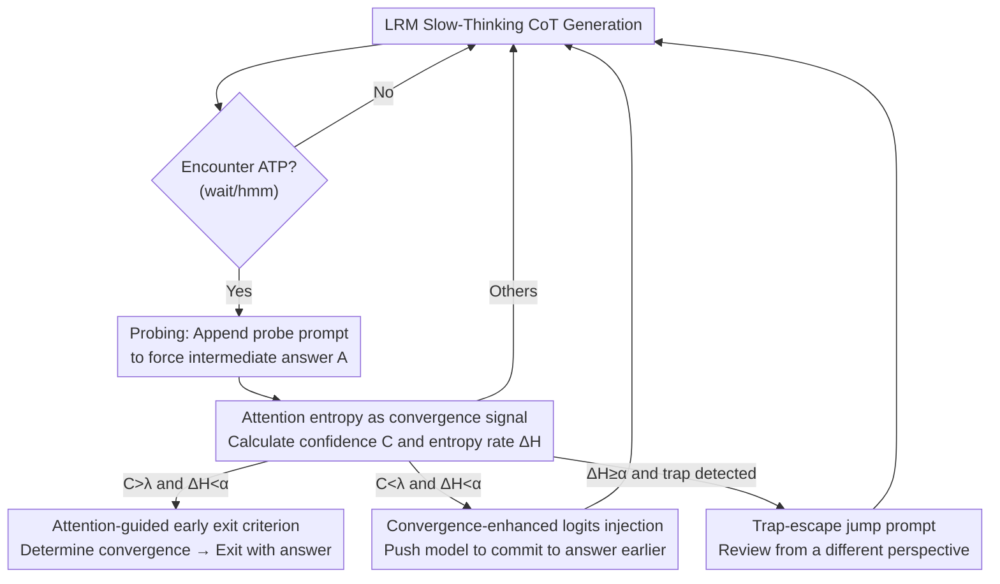

# Stop When Further Reasoning Won't Help: Attention-State Adaptive Generation in Reasoning Models

**Conference**: ICML2026  
**arXiv**: [2606.15070](https://arxiv.org/abs/2606.15070)  
**Code**: To be confirmed  
**Area**: LLM Reasoning  
**Keywords**: Overthinking, early exit, attention entropy, test-time compute, training-free

## TL;DR
ASAG is a training-free, plug-and-play early exit framework for reasoning. It monitors both model confidence and attention entropy at the switching points of each "reasoning action" in Large Reasoning Models (LRMs) to determine if reasoning has truly converged. It adaptively selects from four strategies—"early exit," "logits injection for enhancement," "trap escape," or "continue"—improving average accuracy by 3.2% on Qwen3-8B while reducing generated tokens by nearly 40%.

## Background & Motivation
**Background**: Large Reasoning Models (LRMs) such as DeepSeek-R1, GPT-o1, and Qwen3 rely on test-time compute scaling to explicitly generate long Chain-of-Thought (CoT), decomposing problems into multi-step "slow thinking" before providing conclusions. Longer chains generally lead to better performance on complex tasks.

**Limitations of Prior Work**: However, LRMs suffer from universal "overthinking"—continuing with "wait, hmm, let me recheck" even after deriving the correct answer. This increases latency and compute costs while potentially leading the model to deviate from the correct path. Existing mitigation methods fall into three categories: training-based (SFT/RL, high cost), prompting-based (carefully designed prompts, poor generalization), and output-based (plug-and-play, but only rely on internal confidence signals).

**Key Challenge**: Output-based methods follow a "reason-probe-exit" paradigm, assuming "high confidence = correct answer." They trigger an early exit if the confidence at an Action Transition Point (ATP, marked by tokens like "wait" or "hmm") exceeds a threshold. However, confidence is unreliable: models are **overconfident on hard problems** (Fig 1a: assigning a 0.99 exit probability to a wrong answer, leading to incorrect early exit) and **underconfident on easy problems** (Fig 1b: hesitating on the correct answer "15" until confidence reaches 0.93, wasting tokens). A single confidence signal fails by both exiting too early and failing to stop when necessary.

**Key Insight**: The authors examine attention distributions. Drawing from discoveries in KV-cache eviction—where the attention matrix acts as an information filter concentrating weights on key tokens—they hypothesize that when an LRM converges to a reliable conclusion, its attention shifts from "diffuse exploration" to "concentrated evidence," resulting in a significant drop in **attention entropy**. Pre-experiments (274 correct samples) confirm that entropy remains high and stable before the answer appears, but drops sharply once the correct intermediate answer is derived, with over 70% of samples showing an entropy change rate $\Delta H < -0.1$.

**Core Idea**: Use both "model confidence + attention entropy" signals to characterize the reasoning state instead of relying on confidence alone. Entropy indicates whether the information flow is stable, thereby addressing both overconfidence-induced premature exits and underconfidence-induced procrastination.

## Method

### Overall Architecture
ASAG (Attention-State Adaptive Generation) is a test-time controller wrapped around an existing LRM without modifying any weights. The model generates CoT as usual. Whenever it hits an ATP (e.g., the "wait" token, marking the end of a reasoning action), the "probing" phase begins: a probe prompt `\n\n Final Answer\n\n \boxed` is temporarily appended to force an intermediate answer $A$. From this, two metrics are calculated—average confidence $C$ and attention entropy $H$ (yielding the entropy change rate $\Delta H$). Based on where $(C, \Delta H)$ falls, one of four strategies is selected: attention-guided early exit, convergence-enhanced logits injection, trap-escape jump prompt, or standard continuation. This process repeats at each ATP until an early exit is triggered or the generation ends naturally.

### Key Designs

**1. Attention Entropy as Reasoning Convergence Signal: An internal probe for "model certainty"**

This design addresses the core issue that confidence alone is unreliable. ASAG defines normalized Shannon entropy to measure the diffusion of information flow using the query-key attention matrix between the current decoding window and global tokens. First, a softmax is applied to attention scores to obtain the weight matrix $A^W_{h,l}$, then $H_{h,l} = -\frac{\sum_{i}\sum_{j} A^W_{h,l}[i,j]\log A^W_{h,l}[i,j]}{\log k}$, where $A^W_{h,l}[i,j]$ represents the influence of the $j$-th token on the $i$-th token and $k$ is the key length. The aggregate entropy $H = \sum_{h=1}^{N}\sum_{l=L-3}^{L} H_{h,l}$ is the sum of entropy across all heads for the last 4 layers. The entropy change rate is defined as $\Delta H = \frac{H - H_1}{H_1}$ ($H_1$ is the entropy at the first ATP). Low and decreasing entropy suggests attention is shifting from "exploration" to "focusing on key evidence," serving as a more robust convergence indicator than token confidence.

**2. Attention-Guided Early Exit: Dual-gate confidence and entropy to prevent "overconfident errors"**

Targeted at overconfidence in difficult problems. Methods like DEER exit as soon as $C > \lambda$, getting trapped by deceptively high confidence on hard problems. ASAG adds an entropy gate: confidence $C$ is the mean probability of tokens in the intermediate answer $C=\frac{1}{n}\sum_{i=1}^{n} p(a_i)$. The rules are: at the **first ATP**, $C > \lambda$ allows early exit; at **subsequent ATPs**, early exit requires **both** $C > \lambda$ **and** $\Delta H < \alpha$. Otherwise, reasoning is considered unstable, and generation continues. Requiring "entropy is indeed decreasing" ensures that even if a model is temporarily confident on a hard task, it won't be allowed to exit until attention converges.

**3. Convergence-Enhanced Logits Injection: A push for easy problems where "insight is reached but hesitation persists"**

Targeted at underconfidence on easy problems (e.g., repeatedly "waiting" for the answer "15"). When $C < \lambda$ but $\Delta H < \alpha$, attention has converged and key evidence is captured, but token-level confidence remains low, causing the model to waste tokens. Rather than shifting attention, ASAG performs a lightweight modification of output logits: it takes the normalized logit probability of target tokens in the intermediate answer $\text{Logits}_r$ and injects it as $\text{Logits} = 0.95\cdot\text{Softmax}(M(P,T)) + 0.05\cdot\text{Logits}_r$. This uses the converged intermediate answer as a soft guide, helping the model commit to the correct conclusion sooner with minimal overhead.

**4. Trap-Escape Jump Prompt: Identifying loops and forcing a path change**

Targeted at scenarios with high entropy change rates ($\Delta H \geq \alpha$), signifying non-convergence. Sometimes, continuing the current path is futile if the model is caught in a "thought trap," repeatedly reviewing an incorrect initial path. ASAG detects this by constructing a global attention weight matrix $A^W_{\text{global}} = \frac{1}{N}\cdot\frac{1}{4}\sum_{h=1}^{N}\sum_{l=L-3}^{L} A^W_{h,l}$. If the current action $T_i$ allocates more average attention to the **previous action** $T_{i-1}$ than to itself, the model is deemed as ruminating without progress. A jump prompt $J$ ("Wait, my previous reasoning is not correct. I should adopt a more concise and different approach…") is injected to force a restart from a new perspective. To prevent infinite loops, a maximum attempt limit $s$ triggers a forced early exit if exceeded.

### Loss & Training
ASAG is **completely training-free**: it requires no SFT, no RL, and no additional training data. All logic is executed during inference. It only reads the attention matrix and logits of the existing LRM and performs lightweight logit injection, making it compatible with any mainstream LRM like DeepSeek-R1-Distill or Qwen3. Key hyperparameters include the confidence threshold $\lambda$, entropy rate threshold $\alpha$, and maximum jump count $s$.

## Key Experimental Results

### Main Results
Evaluation was conducted on 9 reasoning benchmarks (6 Math: GSM8K / MATH-500 / AMC2023 / AIME2024 / AIME2025 / OlympiadBench; 1 Science: GPQA Diamond; 2 Code: HumanEval / LiveCodeBench), covering various scales of DeepSeek-R1-Distill and Qwen3. Metrics include Accuracy (Acc↑), Generation Length (Len↓), and Compression Rate (CR↓, percentage of vanilla tokens). Selected results for Qwen3-4B follow (lower CR is more efficient, higher Acc is better):

| Method | GSM8K Acc | AIME2024 Acc | OlympiadBench Acc | GPQA Acc | Avg Acc↑ | Avg CR↓ |
|------|-----------|--------------|-------------------|----------|-----------|----------|
| Vanilla | 93.8 | 63.3 | 59.0 | 46.5 | 71.0 | 100% |
| NoThinking | 89.6 | 23.3 | 40.6 | 36.4 | 54.8 | 34.3% |
| TALE | 91.3 | 60.0 | 54.7 | 41.9 | 67.1 | 58.7% |
| Dynasor | 92.9 | 63.3 | 63.6 | 46.5 | 71.6 | 64.4% |
| DEER | 94.2 | 60.0 | 62.9 | 47.0 | 71.3 | 64.4% |
| **ASAG (Ours)** | **94.2** | **70.0** | **64.6** | **48.0** | **Higher** | **Sig. Lower** |

On AIME2024, ASAG improves accuracy from 63.3 to 70.0 while reducing tokens from 11,916 to 8,768, validating that the dual-signal approach prevents both premature exit and procrastination.

### Ablation Study

| Model | Accuracy Gain | Token Reduction |
|------|-----------|-----------|
| Qwen3-4B | +2.9% (Absolute) | ≈37% |
| Qwen3-8B | +3.2% (Absolute) | ≈40% |

### Key Findings
- **Entropy is the critical signal**: Pre-experiments show that for correct samples, attention entropy drops sharply once the correct intermediate answer is found (>70% of $\Delta H$ falls below -0.1), whereas entropy remains high for incorrect samples—providing the empirical foundation for the method.
- **Largest gains on hard tasks**: The most significant improvements occur on high-difficulty benchmarks like AIME (AIME2024 +6.7 absolute accuracy), indicating the entropy gate successfully salvages hard problems failed by confidence-only methods.
- **Alignment of efficiency and accuracy**: Unlike most early exit methods that trade accuracy for token savings, ASAG improves accuracy while significantly compressing length by pruning truly redundant or harmful overthinking.

## Highlights & Insights
- **Turning Information Theory into Actionable Signals**: Attention entropy is transformed from a vague interpretability concept into a real-time probe that drives decisions at every ATP—shifting the criterion for "when to stop" from "guessing confidence" to "monitoring information flow convergence."
- **Targeted Strategies**: Early exit, logit injection, and jump prompts precisely target "overconfidence, underconfidence, and thought traps," offering more comprehensive coverage than simple early exit.
- **Zero-Training Portability**: Relying only on attention matrices and logits allows any open-attention LRM to adopt this. The "trap detection" using attention ratios between $T_{i-1}$ and $T_i$ could be generalized to any generation task needing to detect "model loops."

## Limitations & Future Work
- **Dependence on Native Attention**: Requires access to internal attention matrices and layer-wise entropy, making it inapplicable to closed-source API models.
- **Threshold Calibration**: $\lambda$, $\alpha$, and $s$ are empirical thresholds. Optimal values may vary by model/task; no automated tuning scheme is provided.
- **Limited Control of Jump Prompts**: The authors admit jump prompts cannot always force a path change (due to deep reasoning biases), necessitating the safeguard of the retry limit $s$.
- **Boundary of the Entropy Hypothesis**: The "convergence equals entropy drop" assumption holds for math/code but requires further verification on open-ended tasks with non-unique answers.

## Related Work & Insights
- **vs. DEER**: DEER also probes at ATPs but uses only confidence $C > \lambda$ for exit; ASAG adds the entropy gate $\Delta H < \alpha$, logit injection, and jump prompts to fix vulnerabilities at both ends of the difficulty spectrum.
- **vs. TALE / CoD (Prompting)**: These rely on prompt engineering to encourage brevity, which lacks generalization and internal state awareness. ASAG decides based on attention dynamics.
- **vs. DAST / C3oT (Training)**: These require retraining or constructing variable-length CoT data, which is costly. ASAG is plug-and-play but requires test-time attention access.
- **vs. KV-cache Eviction**: Inspired by the "attention as information filter" observation in KV-cache eviction research, repurposing it for "judging reasoning convergence."

## Rating
- Novelty: ⭐⭐⭐⭐⭐ Using attention entropy as a primary early exit criterion with a four-way intervention strategy is innovative and self-consistent.
- Experimental Thoroughness: ⭐⭐⭐⭐ Strong results across 9 benchmarks and multiple LRM scales. More depth on threshold sensitivity across domains would be beneficial.
- Writing Quality: ⭐⭐⭐⭐ Clear logical chain from motivation to observation and method. Fig 1/2 provide intuitive explanations of failure modes and signals.
- Value: ⭐⭐⭐⭐⭐ Training-free and plug-and-play while increasing accuracy and saving 40% tokens; direct practical value for reasoning model deployment.

<!-- RELATED:START -->

## Related Papers

- [\[ICLR 2026\] Adaptive Thinking: Large Language Models Know When to Think in Latent Space](../../ICLR2026/llm_reasoning/adaptive_thinking_large_language_models_know_when_to_think_in_latent_space.md)
- [\[ICML 2026\] SuCo: Sufficiency-guided Continuous Adaptive Reasoning](suco_sufficiency-guided_continuous_adaptive_reasoning.md)
- [\[ICLR 2026\] Your Models Have Thought Enough: Training Large Reasoning Models to Stop Overthinking](../../ICLR2026/llm_reasoning/your_models_have_thought_enough_training_large_reasoning_models_to_stop_overthin.md)
- [\[NeurIPS 2025\] Does Thinking More Always Help? Mirage of Test-Time Scaling in Reasoning Models](../../NeurIPS2025/llm_reasoning/does_thinking_more_always_help_mirage_of_test-time_scaling_in_reasoning_models.md)
- [\[NeurIPS 2025\] ARM: Adaptive Reasoning Model](../../NeurIPS2025/llm_reasoning/arm_adaptive_reasoning_model.md)

<!-- RELATED:END -->
