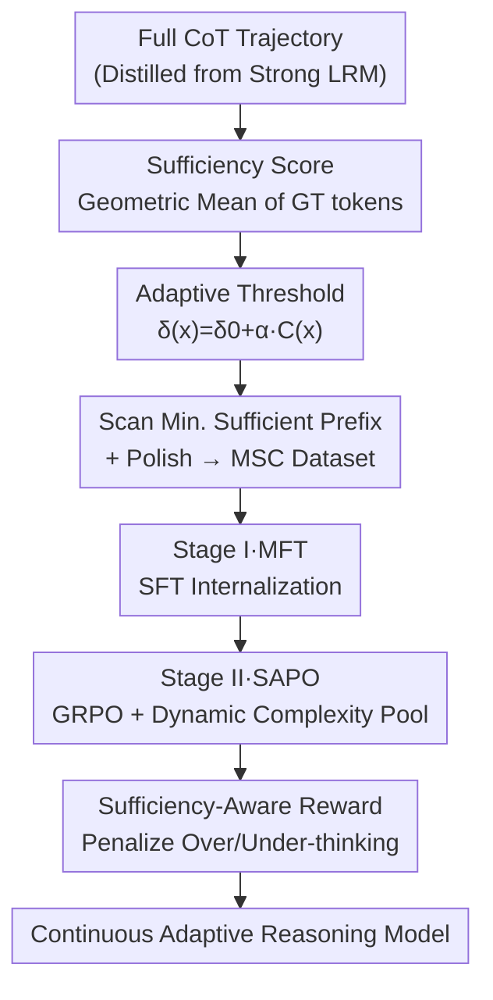

# SuCo: Sufficiency-guided Continuous Adaptive Reasoning

**Conference**: ICML2026  
**arXiv**: [2606.17687](https://arxiv.org/abs/2606.17687)  
**Code**: TBD  
**Area**: LLM Reasoning  
**Keywords**: Adaptive Reasoning, Chain-of-Thought Efficiency, Minimum Sufficient CoT, Reinforcement Learning, Overthinking

## TL;DR
SuCo proposes "Minimum Sufficient CoT (MSC)"—the shortest CoT prefix capable of producing the correct answer. Based on this, it designs a two-stage training process (MSC-aligned Fine-Tuning, MFT + Sufficiency-Aware Policy Optimization, SAPO), enabling large reasoning models to autonomously adjust reasoning length on a **continuous spectrum**. It achieves higher accuracy with fewer tokens across math, code, and science benchmarks (7B average accuracy +2.7, reasoning length reduced from 5239 to 1267).

## Background & Motivation
**Background**: Large Reasoning Models (LRM) like DeepSeek-R1, o1, and Qwen3 lead significantly on difficult problems by explicitly generating Chains-of-Thought (CoT). However, they tend to write long reasoning chains for **any** problem—even "1+1"—causing severe computational and latency waste, which hinders deployment in scenarios like real-time coding assistants or edge devices.

**Limitations of Prior Work**: Existing Adaptive Reasoning Models (ALRM) attempt to adjust reasoning volume based on difficulty, but most use **discrete** control: either manual switching by users (Qwen3's think on/off), selection from preset levels (GPT-OSS multi-level strategy), or binary selection via external classifiers/domain labels (AdaCoT, LHRM). Their common flaw is the **lack of a principled "sufficiency" criterion**, forcing them to switch between limited handcrafted modes.

**Key Challenge**: Ideal adaptive reasoning should simultaneously satisfy "length scaling with difficulty + no manual intervention + optimal performance with minimal reasoning." However, there is a counter-intuitive tension: while the test-time scaling law suggests "more reasoning is better," is it possible that "less reasoning is better"? Discrete modes cannot answer this, nor can they finely calibrate reasoning depth at the problem level.

**Goal**: To identify a quantifiable "reasoning sufficiency" criterion and train a model capable of autonomously controlling reasoning length on a continuous spectrum.

**Key Insight**: The authors define and empirically test the **Minimum Sufficient CoT (MSC)**—the "shortest prefix in a CoT trajectory sufficient to produce the correct answer." Across five difficulty levels of MATH, MSC not only significantly reduces tokens but also achieves **consistently higher** accuracy than the full CoT. This suggests that blindly piling up reasoning is counterproductive; truncating precisely at the "sufficiency point" is superior.

**Core Idea**: Sufficiency is defined using the "model's confidence in the ground-truth answer" to identify the minimum sufficient prefix for each problem as a supervision target. Two-stage training (SFT to internalize concise reasoning, followed by RL to learn autonomous allocation) transforms the decision of "when to stop" into a continuously adjustable capability of the model, rather than an external discrete switch.

## Method

### Overall Architecture
The core of SuCo is a computable sufficiency criterion and a two-stage training pipeline. Given a problem $x$ and ground-truth answer $y^*$, the **reasoning sufficiency** of a CoT trajectory $z$ is defined as the geometric mean of the model's probabilities for each token in the ground-truth answer:

$$\mathcal{S}_\theta(z\mid x,y^*) := \Big(\prod_{i=1}^{\|y^*\|}\pi_\theta(y^*_i\mid x,z,y^*_{<i})\Big)^{1/\|y^*\|}$$

The geometric mean is preferred over joint probability because the latter decays exponentially as the answer lengthens, making it fragile for long sequences. A trajectory is called $\delta$-sufficient when $\mathcal{S}_\theta(z\mid x,y^*)\ge\delta$; the **MSC** is the **shortest sentence-level prefix** $z_{<t^*}$ that satisfies sufficiency (sentences are used as atomic steps to avoid logical fragmentation).

The entire pipeline: Generate full CoT using a strong LRM → Scan for the minimum sufficient prefix using an adaptive threshold $\delta(x)$ for each problem, then polish into an MSC dataset → **Stage I (MFT)** internalizes "concise but sufficient" reasoning via SFT → **Stage II (SAPO)** uses RL with a dynamic complexity pool and sufficiency rewards to let the model decide its own reasoning length.

### Key Designs

**1. Sufficiency Score and MSC: A Computable Criterion for "Is Reasoning Enough"**

While previous discrete methods could not define "how much reasoning is enough," SuCo quantifies it using the model's own confidence in the ground-truth answer. The higher the sufficiency score $\mathcal{S}_\theta$, the better the current reasoning prefix supports the correct answer. MSC is the shortest sentence-level prefix satisfying $\mathcal{S}_\theta\ge\delta$, requiring both **sufficiency** ($\mathcal{S}_\theta(z_{<t^*})\ge\delta$) and **minimality** (all shorter prefixes are $<\delta$). An interesting phenomenon noted: once the sufficiency threshold is crossed, further "waiting/self-verification" often leads to a **sharp decline** in sufficiency—extra reasoning is not just useless but can undermine the model's existing correct judgment.

**2. Problem-Adaptive Threshold: Scaling "Sufficiency" with Difficulty**

A fixed threshold $\delta$ is suboptimal: simple problems would retain unnecessary reasoning with a high $\delta$, while difficult problems would lose critical steps with a low $\delta$. SuCo uses a difficulty-dependent threshold $\delta(x)=\delta_0+\alpha\cdot\mathcal{C}(x)$, where $\delta_0$ is the baseline, $\alpha$ controls sensitivity to complexity, and $\mathcal{C}(x)\in[0,1]$ is problem complexity. Complexity is estimated using the **percentile rank of reasoning length**: $\mathcal{C}(x_i)=\frac1N\sum_j \mathbb{1}[\|z_j\|\le\|z_i\|]$. Using length as a proxy for difficulty is empirically supported; the percentile form is robust to outliers and uniformly distributed in $[0,1]$, ensuring stable threshold scaling.

**3. Stage I — MSC Alignment Fine-Tuning (MFT): Internalizing Concise Reasoning**

MFT transforms the criterion into model behavior. Full CoT is generated, adaptive thresholds are calculated per Algorithm 1, and the minimum sufficient prefix $z^{raw}$ is identified. If the prefix is shorter than $L_{min}=5$ sentences, the problem is deemed to "require no explicit reasoning" (empty think block). Otherwise, a refinement model polishes the truncated prefix into a logically coherent $z^{MSC}$. The data format is `<think> z^MSC </think> ŷ`. Training uses standard negative log-likelihood SFT: $\mathcal{L}_{MFT}=-\mathbb{E}[\log\pi_\theta(z^{MSC}\mid x)+\log\pi_\theta(\hat y\mid x,z^{MSC})]$.

**4. Stage II — Sufficiency-Aware Policy Optimization (SAPO): Autonomous Allocation and Distribution Drift**

SAPO utilizes GRPO (sampling $K=8$ trajectories per problem). A key challenge is that as the policy updates, the distribution of reasoning lengths drifts, making offline complexity/thresholds obsolete. SuCo maintains a **dynamic complexity pool** $\mathcal{P}=\{\|z_i^{avg}\|\}$ to track the evolving reasoning length of each problem online via EMA: $\|z_i^{avg}\|\leftarrow(1-\eta)\|z_i^{avg}\|+\eta\cdot\frac1K\sum_k\|z_i^{(k)}\|$ ($\eta=0.1$). Sufficiency rewards are then recalculated in real-time. The reward $\mathcal{R}=\mathcal{R}_{cor}+\mathcal{R}_{format}+\beta\mathcal{R}_{suff}$ uses a **sufficiency reward that penalizes two types of deviations**:

$$\mathcal{R}_{suff}=\underbrace{-\lambda_{over}\mathbb{1}[L_z>t^*+\epsilon]}_{\text{Overthinking}}-\underbrace{\mathbb{1}[y\ne y^*]\cdot\lambda_{under}\mathbb{1}[L_z<t^*]}_{\text{Under-thinking}}$$

Penalties are applied for exceeding the MSC point $t^*$ (with tolerance $\epsilon=2$) to suppress overthinking. Crucially, under-thinking is only penalized **if the answer is incorrect**, encouraging brevity where possible.

### Loss & Training
Two stages: MFT uses SFT (3 epochs, lr $1\times10^{-4}$); SAPO uses GRPO (lr $1\times10^{-6}$, batch 128, micro-batch 8, $K=8$ rollouts, $\beta=1.0$, $\lambda_{over}=\lambda_{under}=0.5$, $\epsilon=2$ sentences). Data sourced from Llama-Nemotron, Mixture-of-Thoughts, OpenR1-Math-220k, OpenCodeReasoning, and s1K-1.1, totaling 270,011 high-quality samples after MSC construction and Qwen3-Next-80B quality checks. Training on 8×H100.

## Key Experimental Results

### Main Results
Evaluated on math (GSM8K/MATH500/AMC23/AIME25), code (MBPP/LiveCodeBench-V6), and science (MMLU-STEM/GPQA-D) across 1.5B and 7B scales, reporting both accuracy and response length.

| Method (Qwen2.5-7B) | Avg. Accuracy ↑ | Avg. Length (tokens) ↓ |
|------|------|------|
| DeepSeek-R1-Distill | 63.2 | 5,239 |
| AdaCoT | 66.2 | 3,419 |
| AdaptThink | 66.6 | 3,400 |
| S-GRPO | 69.4 | 2,478 |
| LHRMs | 68.6 | 1,891 |
| **SuCo (Ours)** | **72.1** | **1,267** |

| Method (Qwen2.5-1.5B) | Avg. Accuracy ↑ | Avg. Length (tokens) ↓ |
|------|------|------|
| DeepSeek-R1-Distill | 45.2 | 5,736 |
| LHRMs | 50.5 | 2,055 |
| **SuCo (Ours)** | **53.1** | **1,483** |

SuCo achieves a **win-win in accuracy and efficiency**: at the 7B scale, average accuracy is 2.7 points higher than the strongest baseline (S-GRPO) and 8.9 points higher than the distillation baseline, while reasoning length is compressed by approximately **4.1×** (5239 to 1267) compared to the distillation baseline.

### Ablation Study

| Dimension | Observation | Explanation |
|------|------|------|
| MSC vs Full CoT | MSC has fewer tokens and higher accuracy across 5 MATH difficulty levels | Validates "less is more," the foundation of the work |
| Post-Sufficiency Reasoning | Sufficiency score drops sharply | Overthinking undermines correct judgments, justifying the dual penalty |
| Geometric Mean vs Joint Probability | Geometric mean is more robust for long answers | Justifies the choice of sufficiency score metric |
| Fixed vs Adaptive Threshold | MSC distribution is more discriminative of difficulty | Hard problems retain more reasoning; simple ones stop early |

### Key Findings
- **"Sufficiency points" are universal**: Truncating at the MSC point is equal or superior to full CoT across all difficulty levels, suggesting redundant reasoning is a systematic waste in LRMs.
- **Dynamic complexity pool is critical for RL stability**: Without tracking length drift, offline thresholds become obsolete, distorting reward signals. EMA tracking keeps goals aligned at near-zero cost.
- **Significant gains on hard problems**: SuCo maintains a stable lead on hard benchmarks like AIME25 and GPQA-D (61.7 vs 58.3 for S-GRPO on AIME25), proving that compressing reasoning does not sacrifice performance on difficult tasks.

## Highlights & Insights
- **Sufficiency as a continuous variable**: Quantifying sufficiency via model confidence bypasses discrete paradigms like "external classifiers" or "handcrafted levels," transitioning from a "switch" to a "knob."
- **Lightweight complexity proxy**: Using percentile rank of length as a difficulty metric removes the need for extra labeling models and is naturally robust and well-distributed.
- **Asymmetric under-thinking penalty**: Penalizing under-thinking only on failure is crucial for preventing "forced reasoning" and rewarding brevity on simple tasks.
- **Dynamic Complexity Pool**: Elegantly solves the distribution drift problem in RL; this can be generalized to any online training where the supervision target depends on policy behavior statistics.

## Limitations & Future Work
- **Dependence on ground truth**: Calculating $\mathcal{S}_\theta$ requires $y^*$, meaning the criterion is limited to training; the model "internalizes" the habit rather than judging sufficiency online. Performance on unlabeled new distributions remains to be seen.
- **Length as a complexity proxy**: While practical, long reasoning does not always equal a difficult problem (it could be verbosity). This proxy might fail in specific domains.
- **Two-stage training cost**: The pipeline is heavy, requiring full CoT distillation, SFT, and RL, with MSC construction relying on an 80B model.
- **Future directions**: Designing online sufficiency estimation without ground truth or transforming MSC into an online self-assessment signal.

## Related Work & Insights
- **vs AdaCoT / LHRM (Binary/Label Triggered)**: These rely on external models or domain labels to decide whether to "turn on CoT," which is coarse-grained. SuCo uses sufficiency to calibrate depth precisely on a continuous spectrum.
- **vs Qwen3 / GPT-OSS / ThinkDial (Preset Levels)**: These use system prompts to select handcrafted modes; SuCo enables autonomous, continuous adjustment.
- **vs S-GRPO / ThinkPrune (RL Pruning)**: While also using RL to reduce length, SuCo's reward is anchored to the principled "MSC point" with dual-direction penalties and a dynamic pool, yielding a better efficiency-accuracy trade-off.
- **vs Test-time Scaling "More is Better"**: SuCo provides empirical counter-evidence—truncating at the sufficiency point saves tokens and improves accuracy, aligning with analyses on "overthinking."

## Rating
- Novelty: ⭐⭐⭐⭐⭐ 
- Experimental Thoroughness: ⭐⭐⭐⭐⭐ 
- Writing Quality: ⭐⭐⭐⭐⭐ 
- Value: ⭐⭐⭐⭐⭐ 

<!-- RELATED:START -->

## Related Papers

- [\[AAAI 2026\] LLMs for Game Theory: Entropy-Guided In-Context Learning and Adaptive CoT Reasoning](../../AAAI2026/llm_reasoning/llms_for_game_theory_entropy-guided_in-context_learning_and_adaptive_cot_reasoni.md)
- [\[ICML 2026\] Select to Think: Unlocking SLM Potential with Local Sufficiency](select_to_think_unlocking_slm_potential_with_local_sufficiency.md)
- [\[ICLR 2026\] Continuous Chain of Thought Enables Parallel Exploration and Reasoning](../../ICLR2026/llm_reasoning/continuous_chain_of_thought_enables_parallel_exploration_and_reasoning.md)
- [\[ACL 2026\] When Is Thinking Enough? Early Exit via Sufficiency Assessment for Efficient Reasoning](../../ACL2026/llm_reasoning/when_is_thinking_enough_early_exit_via_sufficiency_assessment_for_efficient_reas.md)
- [\[ICML 2026\] The Easy, the Hard, and the Learnable: Confidence and Difficulty-Adaptive Policy Optimization for LLM Reasoning](the_easy_the_hard_and_the_learnable_confidence_and_difficulty-adaptive_policy_op.md)

<!-- RELATED:END -->
