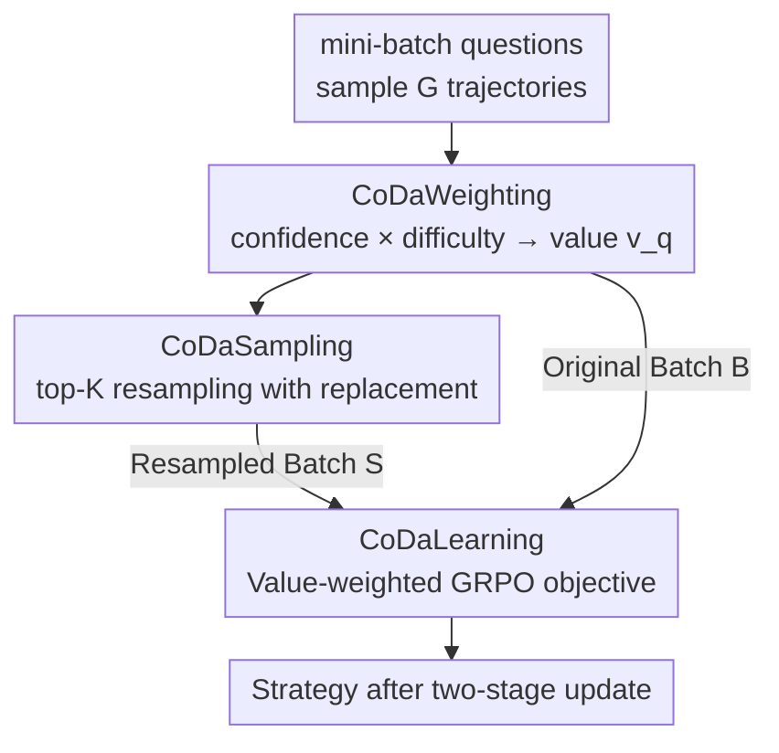

# The Easy, the Hard, and the Learnable: Confidence and Difficulty-Adaptive Policy Optimization for LLM Reasoning

**Conference**: ICML2026  
**arXiv**: [2606.07950](https://arxiv.org/abs/2606.07950)  
**Code**: https://github.com/tmlr-group/CoDaPO  
**Area**: LLM Reasoning  
**Keywords**: GRPO, Verifiable Reward RL, Compute Allocation, Difficulty Adaptation, Confidence

## TL;DR
This paper decomposes the training dynamics of GRPO and discovers that treating easy, hard, and learnable problems uniformly leads to compute mismatch. It proposes CoDaPO, which calculates a bounded value based on "confidence × difficulty" for each question. this value is used both to weight gradient updates and to resample high-value questions, concentrating updates on the "learnable zone" within a fixed compute budget. CoDaPO consistently outperforms methods like GRPO across 12 reasoning benchmarks.

## Background & Motivation
**Background**: Post-training LLMs using RL has become mainstream for reasoning tasks with verifiable rewards (e.g., math, code). Since PPO requires an extra value network and is computationally expensive, critic-free methods like GRPO have become popular—sampling a group of trajectories per question, normalizing rewards within the group as advantages, and using a PPO-style clipping objective.

**Limitations of Prior Work**: GRPO treats all problems with **uniform sampling + near-uniform weighting**. However, once a question is "solved," further updates primarily sharpen the distribution and push up confidence with almost no contribution to accuracy. Conversely, truly hard problems are bottlenecked by "discovery"—with only 8 trajectories sampled per group, it is rare to find even one correct path, so positive reinforcement almost never occurs. Both ends waste compute.

**Key Challenge**: By tracking token log probabilities, group-normalized advantages, and resulting token-level update weights, the authors reveal three recurring dynamics in GRPO training: (1) **Confidence Inflation**—confidence for both correct and incorrect trajectories pushes toward 100%, causing calibration collapse; (2) **Advantage Shrinkage**—as group accuracy increases, positive advantages approach 0 while rare failures receive increasingly large negative advantages; (3) **Stratified Convergence**—easy problems saturate quickly and gradients vanish, while hard problems are stuck at discovery bottlenecks with slow improvement.

The authors attribute these to two structural features of GRPO: **asymmetric clipping** (retaining upward drifts but truncating sufficiently negative updates) and **group normalization under binary rewards** (weakening positive signals as accuracy approaches 1). The conclusion is that the utility of an update is highly non-uniform, depending on both problem difficulty and the current model level.

**Core Idea**: Since update utility is non-uniform, compute should not be distributed uniformly. A **bounded value** $v_q$ is calculated using the confidence and difficulty of each question to simultaneously "weight updates" and "resample high-value questions," concentrating computation on the "learnable zone" (medium difficulty questions with correct trajectories to learn from) within a fixed budget.

## Method

### Overall Architecture
CoDaPO is a **data-centric, model-adaptive** framework that integrates directly into standard RL objectives without changing the theoretical ceiling of RL, only reallocating "where to spend compute." Each training step follows a three-stage process: first, sample a group of trajectories for each question in a mini-batch; **CoDaWeighting** computes a scalar value $v_q$ per question; **CoDaSampling** selects the top-K questions and resamples them with replacement to form an equal-sized "high-value batch"; **CoDaLearning** uses a value-weighted GRPO objective to update first on the original batch (preserving coverage) and then on the resampled batch (concentrating compute). The key constraint is **fixed budget reallocation**: half of the compute is spent on the original mini-batch and half on the resampled batch, rather than increasing the total budget.

### Key Designs

**1. CoDaWeighting: Locating the "Learnable Zone" with Confidence × Difficulty**

To address the waste of compute from uniform weighting, this design assigns a bounded value to each question, characterizing whether it is "still worth optimizing." It extracts two free signals from a group of trajectories: **collective confidence** $c_q$ (exponential of the average token likelihood, measuring path coherence) and **difficulty** $d_q$ (group error rate):

$$c_q = \exp\left[\frac{1}{G}\sum_{i=1}^{G}\frac{1}{|o_i|}\sum_{t=1}^{|o_i|}\log f_\theta(o_{i,t}\mid q, o_{i,<t})\right],\quad d_q = 1 - \frac{1}{G}\sum_{i=1}^{G} r_i.$$

The value is product of two separable functions $v_q = V_c(c_q)\,V_d(d_q)$. The authors choose a **linear** $V_c(x)=x$ (encouraging larger updates for questions the model is already certain about) and a **U-shaped** (specifically inverse U/parabolic) $V_d(x)=1-4(x-1/2)^2$, resulting in:

$$v_q = c_q\left(1 - 4(d_q - 1/2)^2\right).$$

This acts as a "learnable zone prior": $v_q \approx 0$ when $d_q \approx 0$ (solved, update only inflates confidence) or $d_q \approx 1$ (discovery limited, gradients dominated by clipped negative samples), peaking at $d_q \approx 1/2$—where correct trajectories appear frequently enough to provide actionable signals.

**2. CoDaSampling: Resampling High-Value Questions to Increase Discovery Probability**

To address the "discovery bottleneck" of hard problems, this design ranks questions by value, keeps the top-K, and performs **resampling with replacement** $B/K$ times each to form an equal-sized batch $S$, then reruns rollouts for these questions. The intuition is probabilistic: if the success rate per trajectory is $\pi(q)$, the probability of seeing at least one correct trajectory in $G$ samples is $1-(1-\pi(q))^G$. Repeating this $m$ times with new groups changes it to $1-(1-\pi(q))^{Gm}$. When $\pi(q)$ is small, resampling significantly increases the probability of observing at least one correct trajectory, more reliably triggering the "positive advantage amplification" phase.

**3. CoDaLearning: Value-Weighted Two-Stage GRPO Updates**

The value is injected directly into the gradient by maximizing a **value-weighted GRPO objective**, where the standard clipped surrogate is multiplied by a question-level factor $v^{(j)}$:

$$J_{\text{CoDaPO}} = \sum_{j=1}^{B}\frac{1}{\sum_i |o_i^{(j)}|}\sum_{i,t}\min\!\Big(\rho_{i,t}^{(j)}\hat{A}_i^{(j)},\,\text{clip}(\rho_{i,t}^{(j)}, 1{-}\epsilon, 1{+}\epsilon)\hat{A}_i^{(j)}\Big)\,v^{(j)}.$$

This objective is applied first to the original batch and then to the resampled batch $S$. Effectively, the token-level weight becomes $w_{i,t}^{(j)} = v^{(j)}\,\mathbb{1}_{\text{unclipped}}\,\rho_{i,t}^{(j)}\hat{A}_i^{(j)}$. CoDaPO maintains the asymmetry of clipping but reshapes gradient directions using question-level factors. Two engineering modifications are included (following DAPO/GPG): **token-level micro-averaging** (replacing per-trajectory averages with $\frac{1}{\sum_i|o_i|}\sum_{i,t}$ to eliminate implicit length penalties) and **removing KL regularization** (encouraging exploration and saving a reference model forward pass). A benefit is that "advantage shrinkage" becomes a feature: as $\bar r \to 1$, both $\hat A^{(+)} \to 0$ and $d_q \to 0$, naturally annealing gradients for easy problems.

### Loss & Training
Both value $v_q$ and advantage $\hat A_i$ use stop-gradients. Under a fixed budget: 50% of compute is used for generating/learning from the original mini-batch, and 50% for the resampled batch $S$. The extra training steps in CoDaPO are included in the total step count to ensure fair comparison with baselines.

## Key Experimental Results

### Main Results
Llama-3.2-1B-Instruct, Qwen2.5-Math-1.5B, and Qwen2.5-Math-7B were post-trained on MATH (4×A100, batch=16, 8 rollouts/q). Evaluations were conducted on 7 math benchmarks (sampling 32 times @ temp 0.6):

| Model | Method | MATH500 | OlympiadBench | AIME2025 | 7-Avg |
|------|------|---------|---------------|----------|-----------|
| Qwen2.5-Math-1.5B | Base | 30.63 | 18.78 | 2.50 | 16.55 |
| Qwen2.5-Math-1.5B | GRPO | 70.31 | 32.18 | 8.00 | 39.08 |
| Qwen2.5-Math-1.5B | GPG | 69.89 | 32.72 | 8.03 | 39.77 |
| Qwen2.5-Math-1.5B | **Ours** | **71.54** | **36.16** | **12.35** | **41.30** |
| Qwen2.5-Math-7B | GRPO | 72.18 | 37.35 | 11.07 | 44.58 |
| Qwen2.5-Math-7B | **Ours** | **74.39** | **37.98** | 11.46 | **46.67** |

On the 1.5B model, CoDaPO increased the average from 39.08% (GRPO) to 41.30% (relative +5.68%), with significant gains on the OOD OlympiadBench (32.18% → 36.16%). It also achieved the best performance on Llama-3.2-1B, showing robustness across backbones.

### Ablation Study
Components were added incrementally (same base model and budget):

| Config | MATH500 | AIME2024 | AIME2025 | Avg |
|------|---------|----------|----------|------|
| +GRPO | 70.31 | 13.02 | 8.00 | 30.44 |
| +CoDaWeighting | 71.09 | 13.90 | 9.59 | 31.53 |
| +CoDaSampling (Full) | 71.54 | 14.47 | 12.35 | 32.79 |

### Key Findings
- **Value weighting acts first, while resampling saves hard problems**: Adding CoDaWeighting alone improved the average from 30.44% to 31.53% by suppressing useless updates. CoDaSampling further increased it to 32.79%, with gains concentrated on the hardest AIME2025 (8.00% → 9.59% → 12.35%), confirming resampling helps discovery-limited problems.
- **Cross-domain Generalization**: Despite being trained only on MATH, CoDaPO outperformed GRPO on MMLU, GPQA, and HumanEval (Avg 32.64% → 39.96%, HumanEval 34.76% → 50.61%), indicating improvements in transferable reasoning behaviors.
- **Test-time Scaling**: Pass@K across all K values on AIME25 was superior to GRPO. The relative gain was highest in the low-sample zone (Pass@1), and Pass@128 reached 53.33%, demonstrating better sample efficiency.

## Highlights & Insights
- **Diagnosis-driven Approach**: The paper's strength lies in the mathematical decomposition of GRPO dynamics (asymmetric clipping → confidence inflation, group normalization → advantage shrinkage, finite sampling → stratified convergence). Each CoDaPO component maps to a specific pathological state.
- **Inverse U Difficulty Prior**: The $1-4(d-1/2)^2$ formula naturally suppresses the "solved" and "unsolved" ends, focusing compute on medium difficulty. This simple formula implements "learnable zone" focus and is generalizable to any group-sampling RL objective.
- **Turning Advantage Shrinkage into a Feature**: Rather than fighting advantage decay as $\bar r \to 1$ as others have, this work allows $v_q$ and $\hat A^{(+)}$ to decay together, enabling implicit annealing for easy problems.

## Limitations & Future Work
- **Independence Assumption in Discovery**: The $1-(1-\pi)^{Gm}$ probability assumes independent rollouts. The authors admit this is optimistic; correlation within a group (different rollouts failing in similar ways) makes the real discovery probability lower.
- **Limited Scope of Validation**: Experiments were conducted on MATH and models up to 7B. The choices of linear $V_c$ and parabolic $V_d$ are empirical. Sensitivity analysis for $K$ and $B/K$ across different domains or larger models is missing.
- **Fixed 50/50 Budget Split**: The split between the original and resampled batches is fixed. Dynamic adjustment of this ratio based on training stages (e.g., more hard problems early vs. saturation late) remains unexplored.

## Related Work & Insights
- **Comparison with GRPO**: While GRPO uses uniform sampling and weighting, CoDaPO multiplies the objective by a question-level value $v_q$ and resamples high-value questions. It is an improvement in "compute allocation" rather than the "per-sample objective," making it orthogonal.
- **Comparison with DAPO / GPG**: These methods focus on token-level objectives (e.g., decoupled clipping, length bias). CoDaPO adopts their micro-averaging but innovates at the **question level** via difficulty/confidence adaptive allocation.
- **Comparison with Dr. GRPO**: Dr. GRPO corrects advantage normalization bias. CoDaPO accepts the normalization structure but uses the resulting shrinkage as an annealing signal for easy problems.

## Rating
- Novelty: ⭐⭐⭐⭐ Clear diagnosis-driven compute allocation perspective; inverse U value function is elegant.
- Experimental Thoroughness: ⭐⭐⭐⭐ Three backbones, 12 benchmarks, cross-domain and test-time scaling; lacks hyperparameter sensitivity.
- Writing Quality: ⭐⭐⭐⭐⭐ Rigorous logical chain from analysis to derivation; good alignment between formulas and intuition.
- Value: ⭐⭐⭐⭐ Plug-and-play improvement under fixed budget; highly practical for verifiable reward RL.

<!-- RELATED:START -->

## Related Papers

- [\[ICML 2026\] Inference Time Optimization with Confidence Dynamics](inference_time_optimization_with_confidence_dynamics.md)
- [\[ICLR 2026\] Curriculum Reinforcement Learning from Easy to Hard Tasks Improves LLM Reasoning](../../ICLR2026/llm_reasoning/curriculum_reinforcement_learning_from_easy_to_hard_tasks_improves_llm_reasoning.md)
- [\[ACL 2026\] Adapt to Thrive! Adaptive Power-Mean Policy Optimization for Improved LLM Reasoning](../../ACL2026/llm_reasoning/adapt_to_thrive_adaptive_power-mean_policy_optimization_for_improved_llm_reasoni.md)
- [\[ICML 2026\] Attention Illuminates LLM Reasoning: The Preplan-and-Anchor Rhythm Enables Fine-Grained Policy Optimization](attention_illuminates_llm_reasoning_the_preplan-and-anchor_rhythm_enables_fine-g.md)
- [\[ICLR 2026\] Reference-guided Policy Optimization for Molecular Optimization via LLM Reasoning](../../ICLR2026/llm_reasoning/reference-guided_policy_optimization_for_molecular_optimization_via_llm_reasonin.md)

<!-- RELATED:END -->
