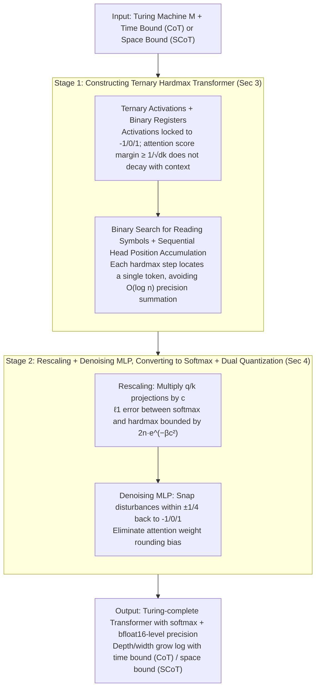

# The Expressive Power of Low Precision Softmax Transformers with (Summarized) Chain-of-Thought

**Conference**: ICML 2026  
**arXiv**: [2605.18079](https://arxiv.org/abs/2605.18079)  
**Code**: https://github.com/moritzbroe/transformer-expressivity (Available)  
**Area**: LLM Inference / Transformer Expressivity Theory  
**Keywords**: Low-precision softmax, Chain-of-Thought, Turing Machine Simulation, Ternary Activation, Summarized CoT

## TL;DR
This paper provides the first proof that a standard Transformer decoder using softmax attention and bfloat16-level precision (where both activations and attention weights are rounded) can simulate any Turing machine using CoT, provided its depth and width grow logarithmically with the context. It further proves that Summarized CoT (SCoT) reduces the required scale from a time bound $\hat{t}$ to a space bound $\hat{s}$. Empirical results on Sudoku tasks reveal that "increasing depth rather than increasing precision" is the true remedy for CoT failures in long contexts.

## Background & Motivation

**Background**: Transformer expressivity theory has proven the ability to simulate Turing machines, but at the cost of models being significantly disconnected from reality. Prior constructions (Merrill & Sabharwal 2024; Yang et al. 2025) rely on hardmax attention and at least $\mathcal{O}(\log \hat{t})$ activation precision, with some introducing non-standard positional encodings.

**Limitations of Prior Work**: Modern LLMs universally use softmax attention with bfloat16/int8 precision and improve capabilities by increasing depth and width. Theoretical results involving "logarithmic precision + constant depth/width" represent an opposite direction to the practical "constant precision + logarithmic depth/width," offering little predictive power for practice.

**Key Challenge**: Directly converting existing hardmax constructions to softmax requires scaling query/key projections by a constant $c$ to make the softmax sharp enough to approximate hardmax. However, in existing constructions, the attention score margin $\beta$ decays polynomially with sequence length, forcing $c$ to grow polynomially. This leads to exploding parameter magnitudes, violating "uniformity" and requiring $\mathcal{O}(\log \hat{t})$ precision just to store these values.

**Goal**: To construct a Transformer model that aligns with practice—using softmax attention, bfloat16-level precision, and moderate parameter magnitudes—and prove it remains Turing-complete. Simultaneously, the paper aims to quantify the depth/width/precision requirements for CoT versus SCoT.

**Key Insight**: Rather than patching existing hardmax constructions, the authors **construct a new class of hardmax Transformers that are "easy to softmaxify from scratch"**. All activations are restricted to $\{-1, 0, 1\}$ (ternary), and attention score margins do not decay with context (remaining $\geq 1/\sqrt{d_k}$). Consequently, a moderate $c = \mathcal{O}((\log \hat{l})^{3/4})$ suffices to suppress softmax error.

**Core Idea**: Replace "floating-point accumulation with logarithmic precision" with "ternary activations + binary position registers + binary search for symbol reading." This reduces the cost of the hardmax-to-softmax conversion to a logarithmic level and applies the same construction path to the SCoT paradigm.

## Method

the paper consists of a two-stage constructive proof followed by a set of small-scale empirical validations. First, a hardmax Transformer with purely ternary activations is presented (Section 3). Then, a unified "rescaling + denoising MLP" mechanism transforms it losslessly into a quantized softmax version (Section 4). Finally, a small Transformer is trained on Sudoku to verify theoretical predictions regarding modeling choices (Section 5).

### Overall Architecture

Given a multi-tape Turing machine $M$ and a time bound $\hat{t}$ (or space bound $\hat{s}$), the first stage constructs a hardmax Transformer $T$ where activations are restricted to $\{-1, 0, 1\}$ and depth/width grow by $\mathcal{O}(\log \hat{t})$. It uses CoT/SCoT to output $f_M(w)$ within $\mathcal{O}(t_M(w)+|w|)$ steps. The second stage scales $T$'s query/key projections by constant $c$, replaces hardmax with softmax, and inserts denoising MLPs to eliminate biases introduced by attention weight rounding, resulting in a softmax version $\tilde T_c$ that matches $T$ exactly for all valid inputs. The final precision requirement is $c = \mathcal{O}((\log \hat{l})^{3/4})$, with $\mathcal{O}(\log\log\log \hat{l})$ bits for activation exponents and $\mathcal{O}(\log\log \hat{l})$ for attention weight exponents, meaning bfloat16 is sufficient until $\hat{l} \approx 10^{38}$. The difference between CoT and SCoT lies in the bounds used in the second stage: CoT relies on the time bound $\hat{t}$ as the entire decoded sequence occupies one context, while SCoT uses `<summ>...</summ>` blocks as "breakpoints," where each non-summary segment length is only $\mathcal{O}(s_M(w))$. Thus, SCoT model size grows logarithmically with the space bound, providing significant gains for tasks like Sudoku that are "low-space but high-time."

### Key Designs

**1. Ternary Activations + Binary Registers: Maintaining Constant Attention Score Margins**  
The first step encodes the Turing machine configuration (state, head position, tape symbols) into a residual stream in $\{-1,0,1\}^d$. Each hidden dimension carries specific semantics: several bits for position registers (binary representations of absolute token position and head positions), several for state/symbol one-hot encodings, and several for token type flags. MLPs perform bitwise operations (copy, clear, increment/decrement) in the ternary domain. Attention extracts registers from history, and positional encodings are replaced with a binary version (geometric frequency decay, similar to sinusoidal but independent of high precision). Locking activations to three points is critical: it ensures the initial attention score margin $\beta \geq 1/\sqrt{d_k}$ is not diluted by sequence length, allowing softmax conversion with a moderate $c = \mathcal{O}((\log \hat{l})^{3/4})$ rather than polynomial growth. Furthermore, the denoising MLP (Design 3) can only perform "hard snapping" on these three discrete ternary points.

**2. Binary Search for Reading Symbols + Sequential Head Accumulation: Replacing Global Summation with Logarithmic Locating**  
In hardmax mode, generating a "run" token requires identifying the last symbol written at the current head position. Ours inserts a `
...
` block every $r$ tokens to explicitly write the head coordinate. Within tokens, sequential layers accumulate head movements $\{L, S, R\}$. Reading symbols involves binary search across $r = \mathcal{O}(\log \hat{t})$ layers; each layer uses hardmax to prune half of the candidate historical tokens, eventually locking onto the "most recent write to this coordinate." This contrasts with the approach of Merrill & Sabharwal 2024, which sums historical tokens and divides by $n$, requiring $\mathcal{O}(\log n)$ precision to store $1/n$. Binary search only selects one token via hardmax, keeping margins from decaying.

**3. Rescaling + Denoising MLP: A Lossless Bridge from Hardmax to Softmax**  
To convert the hardmax construction to a quantized softmax version, all query/key projections are multiplied by $c$, bounding the $\ell_1$ error between softmax and hardmax by $2n e^{-\beta c^2}$. While ternary values can be exactly represented in floating-point formats, attention weights $\alpha_{ij} \approx 1/k$ (when multiple tokens hit) cannot. A coordinate-wise denoising MLP is inserted after each attention layer. it implements a piecewise function $f$ that snaps any value in $(-\tfrac{5}{4},-\tfrac{3}{4}), (-\tfrac{1}{4},\tfrac{1}{4}), (\tfrac{3}{4},\tfrac{5}{4})$ back to $\{-1, 0, 1\}$ via $x \mapsto x+f(x)$. As long as attention errors are within $\pm 1/4$, the next layer receives activations identical to the hardmax version. This MLP reduces the attention weight precision requirement to $\mathcal{O}(\log\log \hat{l})$.

### Loss & Training
The theoretical part involves no training. The empirical section (Section 5) trains a small Transformer to mimic a deterministic MRV depth-first search Sudoku solver. Using the sudoku-extreme dataset (~4 million problems), SCoT segments consist of 512 non-summary tokens, with summary blocks encoding the solver's full configuration. Training uses 20B tokens, bfloat16 mixed precision, temperature-0 greedy decoding, and counts only correct solutions as successful.

## Key Experimental Results

### Main Results: Learnability of Small Models under SCoT vs CoT

**SCoT Model Size Scan** ($d=512$, $H=8$, Accuracy on random 10k test subset):

| Depth $L$ | 4 | 5 | 6 | 7 | 8 |
|-----------|---|---|---|---|---|
| Acc (%) | 16.3 | 97.2 | 99.5 | 99.7 | 99.6|

Performance saturates at $L=6$. A CoT model of the same size under $N=2^{14}$ training context suffers accuracy collapse long before reaching the length bound.

### Key Comparison: Increasing Depth vs Increasing Precision (Solving CoT Long Context Failure)

| Setting | Max Training Context $N$ | Observation | Conclusion |
|------|-------------------|------|------------|
| $L=6$, bf16 (baseline) | $2^{14}$ | CoT fails far before $N$ | Model size insufficient |
| $L=8$, bf16 | $2^{14}$ | CoT remains stable throughout | **Increasing depth is effective** |
| $L=6$, **fp32** | $2^{14}$ | Nearly identical to bf16, still fails | **Increasing precision is ineffective** |

### Key Findings
- **Theoretical learnability predictions outperform logarithmic precision results**: While prior theories suggest "increasing precision," this theory suggests "increasing model size." Empirical tests explicitly support the latter. This is the first empirical validation of "model selection implications" from expressivity theory.
- **SCoT's space bound advantage is practically real**: Since the space requirement for Sudoku solving is constant regardless of difficulty, SCoT models can generalize to total token counts nine orders of magnitude larger once they learn the algorithm on medium lengths.
- **No difference between bfloat16 and fp32 in long-context CoT**, aligning with the community's "mixed precision generally doesn't drop performance" experience, while providing the first theoretical explanation path.

## Highlights & Insights
- **The "Softmax-friendly hardmax construction" philosophy is ingenious**: Instead of patching hardmax to handle softmax, the authors design the hardmax construction to have "constant attention score margins," reducing the cost of softmax conversion. This strategy of "designing prototypes for conversion" is reusable for other theory-practice bridges.
- **Denoising MLPs as a standard abstraction for truncating continuous noise into discrete symbols**: By restricting the state space to a small discrete set (ternary), a fixed-size MLP can always capture disturbances. This technique is placed at the critical juncture of attention weight rounding to close the expressivity proof.
- **Theory provides falsifiable predictions for "depth vs precision" for the first time**: Expressivity theory is often criticized for being "unfalsifiable." This paper conducts a clean controlled experiment, translating abstract $\mathcal{O}(\log \hat{t})$ into specific design choices ($L=6$ vs $L=8$ and bf16 vs fp32).
- **Theoretical validity of sparse attention**: Section 4.3 proves that 1-sparse attention does not lose expressivity, providing backing for MIPS-based sparse attention like Reformer.

## Limitations & Future Work
- **Ours acknowledges**: Expressivity $\neq$ learnability. Even if logarithmic depth/width + bfloat16 is "capable of expressing" the function, whether SGD can find it remains an open question.
- **Construction is not yet fully uniform**: Depth and width grow with $\log \hat{t}/\hat{s}$. Theoretically, this is not as "decoupled" from input as prior "constant depth + log precision" works. However, the discussion on RoPE reconstructing binary positional encoding within double-logarithmic precision moves a step closer to practice.
- **Empirical validation limited to Sudoku**: While the algorithm is typical, it differs significantly from natural language reasoning. Evidence is needed to see if SCoT's "constant segment length generalization" holds for math or code tasks.

## Related Work & Insights
- **vs Merrill & Sabharwal 2024**: They use constant depth/width + $\mathcal{O}(\log \hat{t})$ precision + hardmax; Ours uses logarithmic depth/width + $\mathcal{O}(\log\log \hat{t})$ precision + softmax. Both simulate Turing machines, but Ours is closer to practice and offers different remedies for long-context failures.
- **vs Yang et al. 2025 (SCoT)**: Also use the SCoT framework for expressivity but rely on hardmax + logarithmic precision. Ours uses softmax + double-logarithmic precision and proves that logarithmic scaling of depth/width is required to maintain ternary activation advantages.
- **vs Jiang et al. 2026**: The only other "truly uniform softmax Turing-complete" result, but at the cost of exponential slow-down + linear precision. Ours sacrifices logarithmic depth/width for practically feasible precision.

## Rating
- **Novelty**: ⭐⭐⭐⭐⭐ First construction matching practical precision for Turing completeness, incorporating SCoT into a unified theory.
- **Experimental Thoroughness**: ⭐⭐⭐⭐ Sudoku experiments are clean and powerful but limited to a single task type.
- **Writing Quality**: ⭐⭐⭐⭐⭐ Clear asymptotic comparisons and well-structured outlines of key technical points.
- **Value**: ⭐⭐⭐⭐⭐ Bridging the gap between "expressivity theory" and "actual model design choices" with falsifiable predictions.

## Related Papers

- [\[NeurIPS 2025\] Exact Expressive Power of Transformers with Padding](../../NeurIPS2025/llm_reasoning/exact_expressive_power_of_transformers_with_padding.md)
- [\[ICML 2026\] Clustering as Reasoning: A $k$-Means Interpretation of Chain-of-Thought Graph Learning](clustering_as_reasoning_a_k-means_interpretation_of_chain-of-thought_graph_learn.md)
- [\[NeurIPS 2025\] A Little Depth Goes a Long Way: The Expressive Power of Log-Depth Transformers](../../NeurIPS2025/llm_reasoning/a_little_depth_goes_a_long_way_the_expressive_power_of_logde.md)
- [\[ICML 2026\] How Far Ahead Do LLMs Plan? Uncovering the Latent Horizon in Chain-of-Thought Reasoning](how_far_ahead_do_llms_plan_uncovering_the_latent_horizon_in_chain-of-thought_rea.md)
- [\[ICML 2026\] A Formal Comparison Between Chain of Thought and Latent Thought](a_formal_comparison_between_chain_of_thought_and_latent_thought.md)

<!-- RELATED:END -->

<!-- RELATED:START -->

## Related Papers

- [\[ICML 2026\] Hidden Error Awareness in Chain-of-Thought Reasoning: The Signal Is Diagnostic, Not Causal](hidden_error_awareness_in_chain-of-thought_reasoning_the_signal_is_diagnostic_no.md)
- [\[ICML 2026\] How Far Ahead Do LLMs Plan? Uncovering the Latent Horizon in Chain-of-Thought Reasoning](how_far_ahead_do_llms_plan_uncovering_the_latent_horizon_in_chain-of-thought_rea.md)
- [\[ICML 2026\] Modeling Hierarchical Thinking in Large Reasoning Models](modeling_hierarchical_thinking_in_large_reasoning_models.md)
- [\[ICML 2026\] Clustering as Reasoning: A $k$-Means Interpretation of Chain-of-Thought Graph Learning](clustering_as_reasoning_a_k-means_interpretation_of_chain-of-thought_graph_learn.md)
- [\[ICML 2026\] A Formal Comparison Between Chain of Thought and Latent Thought](a_formal_comparison_between_chain_of_thought_and_latent_thought.md)

<!-- RELATED:END -->
