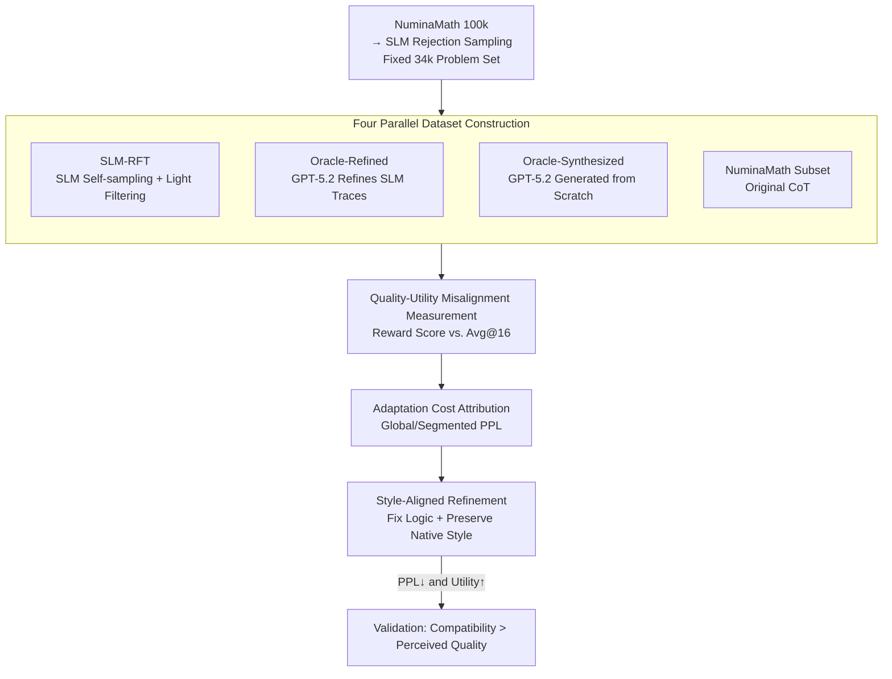

# The Quality-Utility Paradox: Why High-Reward Data Impairs Small Model Mathematical Reasoning

**Conference**: ICML2026  
**arXiv**: [2606.16152](https://arxiv.org/abs/2606.16152)  
**Code**: https://github.com/Dracoqhl/Quality-Utility-Paradox  
**Area**: LLM Reasoning / Knowledge Distillation  
**Keywords**: Small Model Distillation, Reward Model, Distribution Shift, Rejection Sampling, Mathematical Reasoning

## TL;DR
This paper reveals the "Quality-Utility Paradox" in small language model (SLM) mathematical reasoning distillation: training data refined by strong Oracles, which receives higher reward model scores, actually results in inferior downstream fine-tuning compared to lower-scoring data sampled by the SLMs themselves. This is because Oracle refinement, while fixing logic, pushes reasoning traces away from the SLM's native distribution, raising the adaptation cost. The authors introduce "Style-Aligned Refinement" to decouple logic repair from stylistic drift, successfully reclaiming downstream gains.

## Background & Motivation

**Background**: To train SLMs for mathematical reasoning, the mainstream approach involves distilling from stronger models—an "Oracle" (e.g., GPT-5.2) generates or refines reasoning traces, which the SLM then imitates via standard SFT. In practice, **reward model scores** are widely used as a proxy for data quality, assuming that more rigorous traces provide higher supervisory value.

**Limitations of Prior Work**: The chain "Reward Score = Data Quality = Downstream Utility" does not hold for SLM mathematical reasoning. The authors observe a counter-intuitive phenomenon: data refined by Oracles consistently achieves higher reward scores, yet models fine-tuned on this data **consistently underperform** those trained on traces generated by the SLM itself through rejection sampling. This phenomenon is consistent across Qwen2.5, LLaMA-3, and DeepSeek model families.

**Key Challenge**: The issue is not that logical refinement by the Oracle is inherently harmful, but that Oracle refinement **couples** two effects: improving superficial logical quality while pushing traces away from the target model's native distribution. When the "adaptation cost" raised by this distribution shift exceeds the gains from logical improvement, higher perceived quality no longer translates to higher downstream utility. Essentially, research focus must shift from "absolute data quality" to "learner-data compatibility."

**Goal**: (1) Formally prove the paradox while excluding confounding factors (difficulty, objectives, scale, hyperparameters); (2) Identify what Oracle refinement changes and why it harms SLMs; (3) Provide an intervention to validate the mechanism.

**Key Insight**: Within a controlled experimental setting—fixing the problem set and varying only whether the Oracle rewrote the SLM's own traces—the effects of "logical improvement" and "distributional deviation" can be isolated. The authors identify visible **Syntactic Compaction** after GPT-5.2 refinement: dense symbolic expressions replace the loose natural language scaffolding (spaces, colloquial delimiters) characteristic of SLMs.

**Core Idea**: Use Perplexity (PPL) to quantify "adaptation cost" and introduce **Style-Aligned Refinement**—where the Oracle fixes logic but is forced to mimic the SLM's native linguistic style—to decouple logical repair from style drift. This proves that Oracle improvements are only beneficial when delivered in "learner-digestible representations."

## Method

### Overall Architecture
This work is not just a new algorithm but a research framework involving **controlled experiments + mechanistic attribution + confirmatory intervention**. The core is constructing four parallel datasets on a fixed problem set that differ only in how logical repair and representation form are coupled, comparing "perceived quality (reward score)" against "actual utility (downstream accuracy)," attributing utility gaps to adaptation costs via PPL, and validating via style-aligned intervention.

The pipeline: Sample 100k problems from NuminaMath CoT → Perform Rejection Fine-Tuning (RFT, $N=8$, $T=1.0$) with Qwen2.5-Math-1.5B to obtain ~34k "SLM-solvable" problems, forming a **shared** problem set → Derive four data streams → Fine-tune via SFT/DFT → Measure Avg@16 across math benchmarks → Analyze rank misalignment between reward scores and accuracy → PPL attribution → Style-aligned intervention.

### Key Designs

**1. Shared Problem Set + Four Parallel Data Streams: Eliminating "Problem Difficulty" as a Confounder**
To prove that "data representation itself" affects utility, the authors fix the problem set. They use the target SLM (Qwen2.5-Math-1.5B) to perform rejection sampling on 100k NuminaMath problems, filtering for ~34k problems that the SLM is capable of solving. Four streams are derived: ① **SLM-RFT**: Correct solutions generated by the SLM, lightly filtered to remove noise while preserving native logic/style; ② **Oracle-Refined**: GPT-5.2 performs "minimal intervention" refinement (fixing grammar/incoherence) on SLM-RFT; ③ **Oracle-Synthesized**: GPT-5.2 generates solutions from scratch; ④ **NuminaMath Subset**: Corresponding ground-truth CoT from the original set.

**2. Dual-Axis Measurement of Perceived Quality vs. Actual Utility**
**Perceived Quality** is measured using reward model scores (Qwen2.5-Math-72B-Reward, with cross-verification via Skywork and Nemotron). **Actual Downstream Utility** is measured by the **Avg@16** accuracy on benchmarks like MATH500, AIME24, AMC23, Minerva, and OlympiadBench. Both standard SFT ($\mathcal{L}_{\text{SFT}}(\theta)=\mathbb{E}_{(x,y^*)\sim\mathcal{D}}[-\log\pi_\theta(y^*\mid x)]$) and over-fitting resistant DFT ($\mathcal{L}_{\text{DFT}}(\theta)=\mathbb{E}[-\text{sg}(\pi_\theta(y^*\mid x))\log\pi_\theta(y^*\mid x)]$, where $\text{sg}$ is stop-gradient) are used. 

**3. Perplexity Attribution: Translating "Utility Gaps" to "Adaptation Costs"**
The authors use **Global Perplexity (PPL)** as a proxy for distributional compatibility—measuring how "predictable" a training trace is for the target SLM. They also employ **Segmented PPL**, splitting traces into four quarters ($Q_1$ to $Q_4$). A key finding is that PPL and downstream accuracy are **monotonically negatively correlated**: SLM-RFT has the lowest PPL (1.52) and highest accuracy (37.06), while Oracle-Synthesized has the highest PPL (2.69) and lowest accuracy (30.02).

**4. Style-Aligned Refinement: Decoupling Logic Repair and Style Drift**
If adaptation costs stem from Oracle-specific styles, logic repair should be beneficial if delivered in the SLM's native style. The authors prompt the Oracle to correct logical errors while **strictly adhering to the SLM's native linguistic style**. Result: Style-Aligned (Qwen) global PPL drops to **1.46** (lower than SLM-RFT's 1.52 due to noise reduction), while its reward score is also lower (1.37 vs. SLM-RFT 1.47)—proving that reward models systematically undervalue native distributions that are highly learnable for target SLMs. Downstream Avg@16 reaches 39.12, surpassing Oracle-Refined (34.06) and SLM-RFT (37.06).

### Loss & Training
Training follows the DFT protocol: learning rate 5e-5, batch size 256, 1 epoch; SFT serves as a baseline. Rejection sampling uses $N=8, T=1.0$. Evaluation uses Avg@16 ($T=1.0$, max 4096 tokens, zero-shot CoT).

## Key Experimental Results

### Main Results: Quality-Utility Misalignment (Avg@16 under DFT)

| Dataset | Reward Score (Avg) | SFT Total Avg | DFT Total Avg |
|:---|:---:|:---:|:---:|
| Oracle-Synthesized | **1.88** (Max) | 23.26 | 30.02 |
| NuminaMath Subset | 1.78 | 16.72 | 31.28 |
| Oracle-Refined | 1.70 | 19.60 | 34.06 |
| SLM-RFT | **1.47** (Min) | 22.74 | **37.06** (Max) |

Reward score ranking is almost perfectly inverse to downstream utility.

### Mechanism Analysis: PPL, Semantic Retention, and Utility

| Dataset | Global PPL↓ | Reward Score↑ | Semantic Retention↑ | Avg@16↑ |
|:---|:---:|:---:|:---:|:---:|
| Style-Aligned (Qwen) | **1.46** | 1.37 | **4.77** | **39.12** |
| SLM-RFT | 1.52 | 1.47 | — | 37.06 |
| Style-Aligned (GPT-5.2) | 1.78 | 1.81 | 4.07 | 38.21 |
| Oracle-Refined | 1.85 | 1.70 | 4.26 | 34.06 |
| Oracle-Synthesized | 2.69 | 1.88 | 3.91 | 30.02 |

### Key Findings
- **PPL and downstream accuracy are monotonically negatively correlated** across all segments ($Q_1 \sim Q_4$), identifying adaptation cost as the core driver of utility.
- **Robustness to Hyperparameters**: SLM-RFT remains optimal across varying learning rates (2e-5, 5e-5) and batch sizes (128, 256).
- **Syntactic Compaction is a specific Oracle bias**: Refinement increases the frequency of symbol-heavy tokens (e.g., `\(`) while suppressing native natural language scaffolding.
- **Style Alignment reduces PPL below native SLM-RFT**: Filtering accidental noise while maintaining style creates "optimal learning data" that outperforms the model's raw output.

## Highlights & Insights
- **Redefines "Data Quality"** as a relative measure of "Learner-Data Compatibility" rather than an absolute property assigned by a strong evaluator.
- Using **Perplexity as a proxy for adaptation cost** allows for granular, token-level attribution of why strong teacher data fails.
- **Style-Aligned Refinement** provides a robust causal validation: by fixing logic while preserving style, it proves the harm originates from distributional drift.
- **Engineering Implication**: Reward scores should not be the sole criterion for distillation data; compatibility must be considered via PPL filtering or learner-aware reward models.

## Limitations & Future Work
- Evidence is currently limited to **SLM scales and mathematical reasoning**; scalability to larger models or general instruction tuning remains an open question.
- Style-Aligned Refinement is currently a **prompt-based validation method**; practical implementation at scale may require automatic style transfer or learner-integrated reward models.

## Related Work & Insights
- **vs. Standard Distillation / RFT**: Challenges the assumption that stronger teachers or higher rewards always lead to better students, aligning with findings that smaller models may not benefit from over-complex reasoning traces.
- **vs. On-Policy Distillation (OPD)**: Rejection sampling benefits not just from quality filtering, but from providing "pseudo on-policy" signals naturally compatible with the student's distribution.
- **vs. Synthetic Data Scaling**: Suggests that gains from rejection sampling are partially derived from distributional compatibility rather than pure logic quality.

## Rating
- Novelty: ⭐⭐⭐⭐⭐ 
- Experimental Thoroughness: ⭐⭐⭐⭐ 
- Writing Quality: ⭐⭐⭐⭐⭐ 
- Value: ⭐⭐⭐⭐⭐ 

<!-- RELATED:START -->

## Related Papers

- [\[ICLR 2026\] Why is Your Language Model a Poor Implicit Reward Model?](../../ICLR2026/llm_reasoning/why_is_your_language_model_a_poor_implicit_reward_model.md)
- [\[ICML 2026\] GRPO is Secretly a Process Reward Model](grpo_is_secretly_a_process_reward_model.md)
- [\[ACL 2025\] An Efficient and Precise Training Data Construction Framework for Process-Supervised Reward Model in Mathematical Reasoning](../../ACL2025/llm_reasoning/an_efficient_and_precise_training_data_construction_framework_for_process-superv.md)
- [\[NeurIPS 2025\] Unlocking Multimodal Mathematical Reasoning via Process Reward Model](../../NeurIPS2025/llm_reasoning/unlocking_multimodal_mathematical_reasoning_via_process_reward_model.md)
- [\[ICLR 2026\] Predicting LLM Reasoning Performance with Small Proxy Model](../../ICLR2026/llm_reasoning/predicting_llm_reasoning_performance_with_small_proxy_model.md)

<!-- RELATED:END -->
