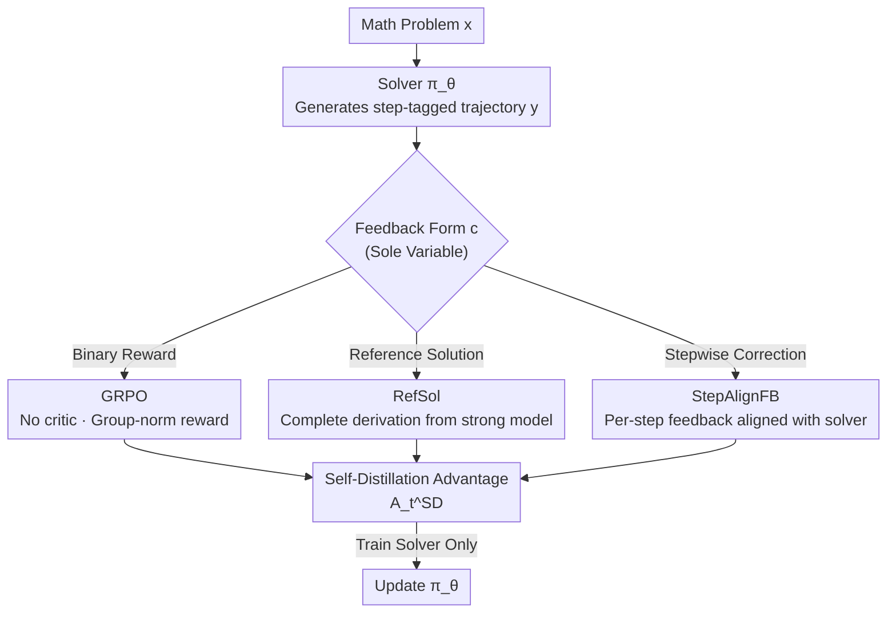

# The Role of Feedback Alignment in Self-Distillation

**Conference**: ICML2026  
**arXiv**: [2606.11173](https://arxiv.org/abs/2606.11173)  
**Code**: TBD  
**Area**: LLM Reasoning / Self-Distillation  
**Keywords**: Self-distillation, Feedback Alignment, Process Supervision, GRPO, Mathematical Reasoning

## TL;DR
This paper systematically investigates the design of context in "self-distillation." By comparing three feedback forms within a solver–critic framework, it is found that corrective feedback **step-aligned** with the solver's own reasoning trajectory (StepAlignFB) significantly outperforms binary rewards (GRPO, +16.11 points) and reference solutions (RefSol, +5.27 points Avg@12). This is because it concentrates distillation signals on the solver's actual erroneous tokens while bypassing correct steps, thereby implicitly achieving process-level supervision (PRM-style signals) without training a reward model.

## Background & Motivation

**Background**: There are currently two main paths for enhancing LLM reasoning. One is **RLVR (Reinforcement Learning from Verifiable Rewards)**, represented by GRPO, where each rollout receives only a scalar reward (final answer correctness). This fails to inform the model which specific step in the reasoning process was wrong, making credit assignment difficult. The other is **distillation**, which provides dense token-level supervision but requires access to the logits of a strong teacher—which are often hidden behind APIs or too costly to transfer at scale.

**Limitations of Prior Work**: **Self-distillation** bypasses both constraints: the same model plays two roles—a student seeing only the problem $x$, and a self-teacher seeing additional context $c$ (execution trajectories, reference solutions, feedback from other models, etc.). During training, the divergence between the two distributions is minimized to distill "in-context emergent abilities" into the context-free policy. However, all existing works treat the context $c$ as a **fixed choice**; none have studied "how the design of context changes what the model learns."

**Key Challenge**: What self-distillation learns is entirely determined by the context received by the self-teacher (see the per-token advantage formula $A_t^{\text{SD}}$, which is directly determined by how much the context shifts the next-token prediction). When the context is "feedback from another model," practitioners actually **have the ability to design its structure**—a design space that has been largely ignored. A complete and correct reference solution seems like a strong signal, but in self-distillation, it **diffuses across the entire rollout**: even if a derivation is correct, its phrasing and path differ from the solver's, forcing the model to change behavior at every token, including correct ones.

**Goal**: To answer "what form of feedback produces the most effective self-teacher" within a solver–critic setting for mathematical reasoning.

**Key Insight**: Feedback structure is the sole independent variable. By fixing the solver, loss, divergence, and all hyperparameters while comparing three contexts, per-token advantage analysis reveals the mechanism.

**Core Idea**: **Structural alignment** between feedback and the solver's reasoning trajectory is more important than the "quality" of the feedback itself. Step-aligned corrections precisely pin distillation signals onto erroneous tokens, further amplifying the inherent process-level signals of self-distillation into PRM-style implicit process supervision.

## Method

### Overall Architecture
Ours is a **controlled study** where the framework itself is a classic self-distillation solver–critic training loop. The actual contribution lies in the comparison of three values for the "feedback form" knob. The process is: for each math problem $x$, the trainable solver $\pi_\theta$ generates a reasoning trajectory with step tags $y=\langle\text{step}_1\rangle\ldots\langle\text{step}_N\rangle\langle\text{answer}\rangle$; a frozen critic $\pi_{\text{critic}}$ produces feedback $f$ based on $x$ and the solver's response; then, self-distillation (Eq. 3) uses $f$ as context $c$ to train the solver—only the solver is trained, while the critic remains frozen throughout.

The self-distillation loss minimizes the per-token divergence between the student (seeing only $x$) and the self-teacher (seeing $x+c$):

$$\mathcal{L}_{\text{SD}}=\mathbb{E}_{y\sim\pi_\theta(\cdot\mid x)}\left[D\big(\pi_\theta(y\mid x)\,\big\|\,\text{sg}[\pi_\theta(y\mid x,c)]\big)\right]$$

The gradient form is equivalent to $-\mathcal{J}_{\text{GRPO}}$, but the per-token advantage becomes:

$$A_t^{\text{SD}}(\hat{y}_t)=\log\pi_\theta(\hat{y}_t\mid x,c,y_{<t})-\log\pi_\theta(\hat{y}_t\mid x,y_{<t})$$

This quantifies "how much the context pushes the model's next-token prediction." Unlike the **constant** advantage in GRPO across the whole rollout ($A_{i,t}=A_i^{\text{GRPO}}$), $A_t^{\text{SD}}$ varies at every token position, naturally providing dense credit assignment. All insights in this work are built upon "how the form of context $c$ shapes this per-token advantage."

### Key Designs

**1. Controlled Comparison of Three Feedback Forms: Isolating "Feedback Structure"**

To cleanly answer "which feedback is most effective," the authors fix the solver (Qwen3-1.7B), the loss (forward KL divergence), and all hyperparameters, varying only the context $c$ seen by the self-teacher. **GRPO**: The standard RLVR baseline where the solver generates $G=8$ rollouts per problem, each scored by a binary reward and group-normalized ($A_i^{\text{GRPO}}=(r_i-\bar{r})/\sigma(r)$), with no critic or self-distillation. **RefSol**: A complete CoT reference solution from a stronger model is used as context, following the setup of zhao2026opsd. **StepAlignFB**: The critic receives both the solver’s step-tagged response and the ground-truth solution, producing **stepwise** feedback—prompting it to copy correct steps verbatim and modify only incorrect or incomplete steps, while staying as close as possible to the solver's trajectory. This "single-variable" design ensures any performance difference is attributable solely to the feedback structure.

**2. Verbatim Copying of Correct Steps: Sharpening Advantage via In-Context Copying**

A seemingly minor but critical design in StepAlignFB is **requiring the critic to copy correct steps verbatim** rather than paraphrasing. The authors observe that verbatim copying triggers the model's in-context copying behavior (induction head mechanism), which **sharpens the advantage estimation, especially for correct steps**. The intuition is: when the self-teacher's context contains the solver's correct steps intact, $\pi_\theta(\hat{y}_t \mid x,c,y_{<t})$ is strongly reinforced on these tokens, making $A_t^{\text{SD}}$ clearly positive on correct tokens and negative on incorrect ones, resulting in a clean signal separation. Conversely, if the critic paraphrases correct steps, phrasing differences pollute the advantage at those positions.

**3. Feedback Alignment Over Feedback Quality: Concentrating Signals to Avoid Diffusion**

This is the core mechanism of the paper. RefSol provides a **completely correct** derivation with high information quality, but its surface form almost inevitably deviates from the solver’s trajectory—even on steps where the solver was originally correct, the phrasing, variable naming, and derivation paths differ. Consequently, the self-distillation advantage **diffuses** across the entire rollout, forcing the model to change behavior at every token (including correct ones), which ironically suppresses correct trajectories. StepAlignFB, by providing stepwise corrections tailored to the solver's actual trajectory, **concentrates distribution shifts on tokens adjacent to errors** while leaving correct steps alone. Per-token advantage analysis shows it acts "like a Process Reward Model (PRM)": reinforcing correct steps and suppressing incorrect ones. In other words, self-distillation already provides a process-level signal via token-level advantages; StepAlignFB simply **precisely amplifies this signal at the point of failure**. This implicit process supervision achieves PRM-like effects **without training a reward model or collecting per-step scalar annotations**.

### Loss & Training
Forward KL is used for the divergence. The self-distillation group size $G=1$, while GRPO uses $G=8$. Temperature $T=1.1$, maximum 2048 tokens, with all sampling done on-policy. The Thinking-Mode-Off student / Thinking-Mode-On teacher pairing from zhao2026opsd is adopted, where the teacher is fixed as the initial (non-LoRA) base policy (disabling the adapter during teacher forward passes rather than loading a separate checkpoint). LoRA ($r=64$, $\alpha=128$) trains all attention/MLP projections. AdamW optimizer, learning rate $5\times10^{-6}$, effective batch size 32, bf16, on 4×H100. StepAlignFB critiques are generated once per rollout via greedy decoding ($T=0$) from a frozen Qwen/QwQ-32B, stripping `<think>` traces to concatenate only structured corrective outputs. VLLM prefix caching is used to offset long prompt overhead. Data consists of 312 problems (30 test, 282 train) filtered from OpenMathReasoning by difficulty and format, keeping problems difficult for the 1.7B model (Avg@16 < 5/16) but solvable by the critic, trained for up to 7 epochs.

## Key Experimental Results

### Main Results: Best Metrics for Three Feedback Types (OpenMathReasoning 30-item Test Set, n=12)

| Method | Pass@12 | Maj@12 | Avg@12 | Avg. Answer Length |
| :--- | :--- | :--- | :--- | :--- |
| GRPO | 76.67 (s=40) | 26.67 (s=50) | 19.72 (s=30) | **1681.49** (s=50) |
| RefSol | 86.67 (s=60) | 43.33 (s=60) | 30.56 (s=40) | 1935.83 |
| StepAlignFB | **90.00** (s=60) | **56.67** (s=50) | **35.83** (s=50) | 1996.07 |

$s$ indicates the training step where the best metric was achieved. For each (method, metric), the best value across all checkpoints was taken (since different methods peak at different steps).

### Key Gain Decomposition

| Comparison | Pass@12 | Maj@12 | Avg@12 |
| :--- | :--- | :--- | :--- |
| StepAlignFB − RefSol | +2.33 | **+13.33** | +5.27 |
| StepAlignFB − GRPO | — | — | **+16.11** |

### Key Findings
- **StepAlignFB Leads Overall**: Despite never seeing ground-truth derivations, it outperforms RefSol on all aggregate accuracy metrics, with +5.27 Avg@12 and +13.33 Maj@12. The significant lead in Majority-Vote suggests its policy **concentrates probability more sharply** on the correct answer (rather than just covering it), which is exactly the regime that benefits most from test-time aggregation.
- **Mechanism is Token-Level Credit Assignment**: Per-token advantage analysis reveals that the StepAlignFB self-distillation signal "acts like a PRM"—reinforcing correct steps and suppressing incorrect ones in the solver's trajectory. Conversely, RefSol suppresses even correct solver trajectories, causing signal diffusion.
- **Self-Distillation Outperforms GRPO**: Except for answer length (where GRPO is more token-efficient), RefSol and StepAlignFB maintain higher accuracy than GRPO throughout training, with an final Avg@12 gap of approximately 8 points. Note that under **equal compute**, self-distillation consumes $1/8$ the prompts per step compared to GRPO ($G=1$ vs $G=8$), but both were trained for 7 epochs, ruling out data exposure as a confounding factor.
- **Need for Early Stopping + Checkpoint Selection**: Peak performance is reached at 5–6 epochs. Fixed end-of-run evaluations systematically underestimate the ceiling of self-distillation; therefore, fair comparison requires selecting the best checkpoint based on a hold-out validation set.

## Highlights & Insights
- **"Feedback Alignment $\ge$ Feedback Quality" is a counterintuitive but robust conclusion**: A complete reference solution contains more information but, because its surface form deviates from the solver’s trajectory, the signal diffuses in self-distillation. Step-aligned corrections, even with less information, concentrate signals precisely on errors due to structural alignment—shifting the understanding of "good feedback" from "correct content" to "structural fit."
- **Visualizing abstract "signal diffusion vs. concentration" via per-token advantage $A_t^{\text{SD}}$** is clever, providing mechanistic evidence that StepAlignFB performs implicit process supervision rather than just reporting score improvements.
- **"Verbatim copying of correct steps to activate induction heads and sharpen advantage"** is a reusable trick: in any scenario requiring the self-teacher context to retain correct parts of the student response, copying can be leveraged to stabilize credit assignment.
- **Engineering Value**: Achieving process-level supervision **without training a PRM or collecting per-step annotations** is highly beneficial for teams with limited labeling budgets or no access to strong teacher logits.

## Limitations & Future Work
- **Small Scale and Data**: Validated only on Qwen3-1.7B and a 312-problem subset of OpenMathReasoning; as an ICML 2026 RLxF workshop paper, the generalizability of the conclusions needs verification on larger models/datasets.
- **Dependency on a Strong Critic (QwQ-32B)**: Data filtering requires the critic to be able to solve the problem; otherwise, RefSol and StepAlignFB would degenerate into the same setup. This limits applicability to "truly hard" problems that even the critic cannot solve.
- **Observation**: Reporting the best value across checkpoints is justified by the authors (different methods peak at different times), but it is naturally optimistic. This introduces a caveat for comparability between methods peaking at significantly different steps ($s$). The token efficiency of GRPO (shorter answers) might be more important than accuracy in certain deployment scenarios.

## Related Work & Insights
- **vs. GRPO / RLVR**: RLVR suffers from difficult credit assignment with only one scalar reward per rollout; Ours uses the token-level advantage of self-distillation to provide dense supervision, leading by 16.11 points in Avg@12 with $1/8$ the prompts under equal compute.
- **vs. Standard Distillation / On-Policy Distillation (OPD)**: Traditional distillation requires strong teacher logits (often unavailable via API); self-distillation uses the same model in dual roles to bypass this. The increment over OPD is the first systematic study of how "context/feedback form design" changes what is learned, rather than treating context as a fixed choice.
- **vs. RefSol (zhao2026opsd)**: RefSol uses complete reference solutions as context. This work proves this causes signal diffusion and suppresses correct steps; StepAlignFB replaces this with stepwise corrections aligned with the solver's trajectory, proving superior across all aggregate metrics.
- **vs. PRM (Lightman et al., Uesato et al.)**: PRMs require training a reward model and collecting per-step annotations; StepAlignFB implicitly replicates the token-level localization of a PRM via feedback alignment, eliminating these costs.

## Rating
- **Novelty**: ⭐⭐⭐⭐ First to treat "self-distillation context design" as a research object; conclusion on feedback alignment > quality is clear.
- **Experimental Thoroughness**: ⭐⭐⭐ Robust mechanistic analysis, but model (1.7B) and data (312 problems) scales are small (workshop paper).
- **Writing Quality**: ⭐⭐⭐⭐⭐ Sharp motivation, per-token advantage mechanism explained thoroughly.
- **Value**: ⭐⭐⭐⭐ Provides a practical path to process supervision for teams without PRMs or strong teacher logits.

<!-- RELATED:START -->

## Related Papers

- [\[ICLR 2026\] SkillFactory: Self-Distillation for Learning Cognitive Behaviors](../../ICLR2026/llm_reasoning/skillfactory_self-distillation_for_learning_cognitive_behaviors.md)
- [\[ICML 2026\] Critique-GRPO: Advancing LLM Reasoning with Natural Language and Numerical Feedback](critique-grpo_advancing_llm_reasoning_with_natural_language_and_numerical_feedba.md)
- [\[AAAI 2026\] In-Token Rationality Optimization: Towards Accurate and Concise LLM Reasoning via Self-Feedback](../../AAAI2026/llm_reasoning/in-token_rationality_optimization_towards_accurate_and_concise_llm_reasoning_via.md)
- [\[ICML 2026\] Reward Modeling from Natural Language Human Feedback](reward_modeling_from_natural_language_human_feedback.md)
- [\[ICML 2026\] Prompt Injection as Role Confusion](prompt_injection_as_role_confusion.md)

<!-- RELATED:END -->
