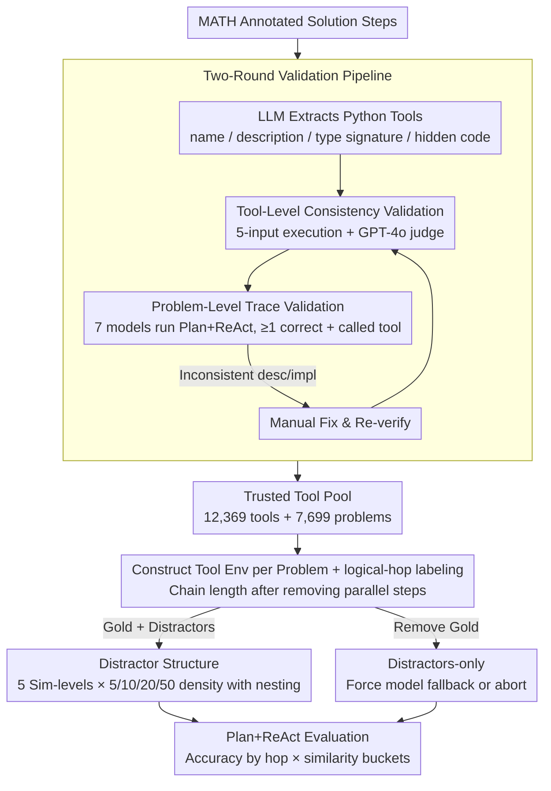

# ToolMATH: A Math Tool Benchmark for Realistic Long-Horizon Multi-Tool Reasoning

**Conference**: ICML 2026  
**arXiv**: [2602.21265](https://arxiv.org/abs/2602.21265)  
**Code**: None  
**Area**: LLM Agent / Tool Use Benchmarking  
**Keywords**: Tool-call Evaluation, Long-Horizon Multi-Tool Reasoning, Distractor Tools, Tool-Missing Scenarios, Plan+ReAct

## TL;DR
The authors construct the ToolMATH benchmark, containing 8K problems and 12K tools, by translating manual solution steps in the MATH dataset into "reusable Python tools with descriptions and type signatures." It covers long-horizon multi-tool compositions (hops 1-8+), controllable distractor similarity (5 levels × 4 densities), and tool-missing scenarios where "gold tools are entirely removed." Evaluations reveal that the dominant factor for model failure is reasoning itself rather than tool selection—thought errors account for over 90%, while distractors amplify early minor deviations into irreversible execution drift.

## Background & Motivation
**Background**: Tool-augmented LLM has become the standard agent paradigm, with works ranging from Toolformer and Gorilla to BFCL and ToolLLM standardizing function calling. However, most existing benchmarks only focus on 1-2 axes among: (i) standardized schema comparison (BFCL), (ii) robustness under tool unavailability (Treviño et al. 2025), (iii) tool control interfaces (ReAct/DFSDT), and (iv) tool dependency graph construction (TaskBench).

**Limitations of Prior Work**: Real-world deployments present agents with complex joint scenarios involving "massive and semantically overlapping tool catalogs + long-horizon multi-step dependencies + occasional missing critical capabilities." No benchmark currently covers all three dimensions within a **single, automatically verifiable** task. Existing math reasoning benchmarks (GSM8K, MATH) are objectively verifiable but lack the tool dimension; existing tool benchmarks often rely on human judgment or lack long-horizon dependencies.

**Key Challenge**: To precisely analyze agent failure modes, a benchmark must simultaneously satisfy four characteristics: (i) **objective automatic verification** (not relying on LLM judges), (ii) **natural long-horizon dependency** (inter-step coupling), (iii) **controllable distractor tool structures**, and (iv) **controllable tool-missing scenarios**. The step-by-step solutions in MATH provide an ideal source: each step can be extracted into a Python tool, the logical steps are hard-coupled, and answers are machine-verifiable.

**Goal**: (i) Translate MATH solution steps into reusable tools to construct long-horizon compositional tasks; (ii) design sampling strategies for distractor tools and "Distractors-only" environments to controllably vary distractor similarity and density; (iii) ensure benchmark reliability through tool-level and problem-level validation plus manual auditing; (iv) decouple long-horizon difficulty from distractor difficulty using hop counts.

**Key Insight**: Utilize the "logical chain of steps" in mathematics as a natural scaffolding for tool composition. Each step corresponds to a Python implementation, natural language description, and type signature. Models see only descriptions and schemas, not the code. The property where one wrong step leads to a wrong final answer allows both "long-horizon reasoning failures" and "tool selection failures" to be amplified and exposed.

**Core Idea**: Construct a benchmark that simultaneously analyzes "tool selection / long-horizon planning / tool-missing fallback" by using MATH step-to-tool mapping, distractors, and missing tools as three independent dimensions.

## Method

### Overall Architecture
ToolMATH utilizes "mathematical step-by-step solutions" as a natural scaffold for tool composition, proceeding in two phases. The first phase is **Tool Extraction and Validation**: manual steps in MATH are fed to an LLM to generate small Python functions (including name, description, typed input schema, and code), followed by tool-level and problem-level automatic validation and manual repair to yield a trusted tool pool. The second phase is **Tool-Augmented Evaluation**: each problem $p$ is paired with an environment containing both the gold toolset $\mathcal G(p)$ and sampled distractors $\mathcal D_{\ell,k}(p)$ (5 similarity levels, density $k\in\{5,10,20,50\}$). A "Distractors-only" mode is also established by removing $\mathcal G(p)$, forcing the model to fallback. Each problem is independently labeled with a hop count to decouple "long-horizon difficulty" from "distractor difficulty." Models only see tool descriptions and schemas, making errors highly consequential, thereby exposing failures in both long-horizon reasoning and tool selection.

### Key Designs

**1. MATH Step → Reusable Tool Validation Pipeline: Transforming human solution steps into a trusted tool pool rather than benchmark noise.**
If an LLM simply translates solution steps into functions, it is easy to introduce "dirty tools" where descriptions match but behavior is wrong, or tools that are never called. The authors use two stages of filtering: **Tool-level consistency validation** prepares 5 schema-valid inputs for each extracted tool, executes them, and uses GPT-4o as a judge to determine if descriptions match execution behavior (allowing floating-point tolerance); **Problem-level trace validation** provides the problem and gold toolset (without code) to 7 validation models {GPT-4o-mini, Llama 3-8B, Mistral-7B, Qwen2-7B, Qwen2.5-7B, Phi-3 Medium, Yi 1.5-9B} running Plan+ReAct. If at least one model answers correctly and the trace successfully calls tool $t$, then $t$ is deemed truly usable. Failed tools enter a manual repair loop. The two stages are complementary: the former ensures self-consistency of the tool, while the latter ensures the tool is practical in real problem-solving, preventing tool implementation errors from being blamed on the agent model. This yields a main set of 12,369 tools across 7,699 problems, plus 329 "ToolMATH-Hard" problems.

**2. 5 Similarity Levels × 4 Densities of Distractor Structure: Decoupling "catalog size" and "tool confusion."**
Previous benchmarks often used weak distractors (low semantic overlap) or fixed sets (no gradient), failing to quantitatively answer whether higher similarity leads to more errors. The authors arrange distractors on a similarity scale: Level 1 (different-category random) → Level 2 (pure random) → Level 3 (same-category random) → Level 4 (embedding similarity retrieval) → Level 5 (keyword overlap + embedding). Density is set at $k\in\{5,10,20,50\}$ with **nesting guarantees** $\mathcal D_{\ell,k_1}(p)\subseteq\mathcal D_{\ell,k_2}(p)$ to ensure density comparisons reflect more distractors rather than different samples. Sampling is deterministic and reproducible. This allows for clean "Accuracy vs. Similarity" curves (Figure 2), proving that high-similarity distractors amplify failures in long-horizon reasoning.

**3. Distractors-only + logical-hop Labeling: Separating "tool availability" from "reasoning depth."**
When model performance is poor, it was previously difficult to distinguish between task difficulty and environment complexity. The authors decouple these using two mechanisms. **Distractors-only** removes all gold tools, forcing the model to either fallback to no-tool reasoning or give up, specifically testing "fallback under capability gaps." **Logical-hop labeling** uses two LLM prompts for step extraction and parallelism checks to calculate the hop count—not simply counting tools, but the length of the logical chain after removing parallelizable steps. This serves as a pure metric for long-horizon difficulty. Plotting accuracy by hop bucket reveals that accuracy decreases monotonically with hops (even for the No-tools baseline), and high-similarity distractors further accelerate this decline in high-hop buckets. Distractors-only also reveals that Qwen2.5-7B can synthesize alternative solutions using general distractors, reflecting the multi-path nature of math problems.

### Loss & Training
This is a pure benchmark/evaluation paper; no models are trained. The primary evaluation protocol is Plan+ReAct (writing a plan first, then alternating reasoning with structured tool calls). Evaluated models include {GPT-4o-mini, Llama 3-8B, Qwen 2.5-7B}, with normalized exact-match accuracy as the metric. On ToolMATH-Hard, additional comparisons are made between ReAct, DFSDT, and Plan+ReAct frameworks.

## Key Experimental Results

### Main Results
Average accuracy in gold-present settings across hops and similarities (represented by GPT-4o-mini):

| Setting | hop 1-2 | hop 5 | hop 7 | hop 8+ |
|---|---|---|---|---|
| No tools | ~High | Mid | Low | Very Low |
| Gold-only | Near ceiling | High | Mid | Low (crashes at 8+) |
| Gold + Level 1-2 Distractors | Near Gold-only | Mid-High | Mid | Low |
| Gold + Level 4-5 Distractors | Still high | High drop | Sharp drop | Worst |

ToolMATH-Hard framework comparison (gold-only):

| Framework | Low hop | High hop | General Trend |
|---|---|---|---|
| No tools | High | Sharp drop | Long-horizon failure |
| ReAct | High | Mid | Limited local reasoning |
| DFSDT | Mid-High | Mid-High | Best for mid-range |
| **Plan+ReAct** | High | **Strongest** | Stable for long-horizon |

### Ablation Study (Manual annotation of failure types, 100 problems per model)

| Failure Type | Llama 3-8B | Qwen 2.5-7B | GPT-4o-mini |
|---|---|---|---|
| Thought Error | >90% | >90% | >90% |
| Plan Error | **89** | Mid | Mid |
| Incomplete Execution | 59 | **8** | Mid |
| Observation Omission | Mid | **63** | Mid |
| Repeated Call | Mid | Mid | **67** |
| Tool Hallucination | Low | Low | Low |
| Wrong Parameter Value | Mid | Mid | Mid |

### Key Findings
- Thought Error exceeds 90% across all models, proving that **reasoning capability itself**, rather than tool understanding, is the primary bottleneck for agents.
- Models exhibit distinct behavioral profiles: Llama 3-8B is conservative and fragile (high Plan Error + Incomplete), Qwen 2.5-7B is impulsive (lowest Incomplete but highest Observation Omission), and GPT-4o-mini is overall strongest but suffers from the "repetition paradox" (lacking self-correction when caught in loops).
- Plan+ReAct significantly outperforms ReAct/DFSDT in high-hop scenarios, indicating that the value of "explicit global planning" in long-horizon execution increases with hop count; at low hops, the planning overhead is less beneficial.
- High-similarity distractors do not cause errors directly; instead, they **amplify early deviations**, making the failure rate significantly steeper at hop 8+ compared to low-similarity settings.
- Under Distractors-only, Qwen 2.5-7B can utilize non-gold tools to substitute for gold ones (accuracy higher than No-tools baseline), confirming that math problems allow for "wrong tool, right answer" via alternative paths.

## Highlights & Insights
- **MATH steps as natural tool scaffolding** is an elegant observation: translating human steps into Python functions + descriptions preserves logical coupling while making tool schemas objects that the model must correctly understand. This "mathematical rigor for tool evaluation" can be generalized to code and theorem proving.
- **"Thought error as the primary bottleneck" is a counter-intuitive finding**: The community has long focused on function calling schema standardization and control flows (ReAct/DFSDT). This work quantitatively proves these are not the primary contradictions—true bottlenecks lie in reasoning. This recalibrates research priorities.
- **Behavioral Profiles (Conservative Llama / Impulsive Qwen / Looping GPT)** provide valuable engineering insights: when selecting an agent model, one should match the model's "personality" to the specific characteristics of the task.

## Limitations & Future Work
- Domain specificity to mathematics: Lacks the openness, ambiguity, and under-defined goals of real-world environments. Cannot be directly extrapolated to web, coding, or scientific agents.
- Tool consistency relies on LLM judges: 5 test cases may provide limited coverage, potentially missing corner-case behavioral inconsistencies.
- Evaluation frameworks are limited to Plan+ReAct/ReAct/DFSDT: Emerging "reasoning model agents" (e.g., o1/R1 series with internal reasoning + tool use) were not evaluated; they might show lower thought error proportions.
- ToolMATH-Hard is limited to 329 problems, providing limited statistical power particularly in the hop 8+ bucket.
- Future directions: Extension to non-math domains (especially code tasks with objective verification); inclusion of reasoning model agents and self-correction loop baselines; factor analysis of hop count vs. distractor contribution.

## Related Work & Insights
- **vs ToolLLM / API-Bank**: These focus on large-scale API function calling standardization but lack long-horizon dependencies and objective scoring. ToolMATH uses the hard logical chains of MATH to fill these gaps.
- **vs BFCL (Patil et al. 2025)**: BFCL emphasizes function calling formatting and missing tool behavior but lacks compositional dependencies between tools. ToolMATH makes long-horizon composition explicit via hop counts.
- **vs TaskBench (Shen et al. 2024)**: TaskBench uses graph structures to generate tool-dependency tasks but remains somewhat synthetic. ToolMATH tools are derived from human solution steps, offering more realistic dependencies.
- **vs Treviño et al. 2025 (Tool Failure Benchmark)**: They focus on tool unavailability; ToolMATH incorporates this as the "Distractors-only" axis and evaluates it alongside long-horizon difficulty.

## Rating
- Novelty: ⭐⭐⭐⭐ Using MATH steps as tool scaffolding is a simple yet overlooked idea; the three-dimensional joint evaluation meets urgent deployment needs.
- Experimental Thoroughness: ⭐⭐⭐⭐ Evaluation across 3 models, 5 similarity levels, 4 densities, 8+ hop buckets, and 3 frameworks, combined with manual failure analysis.
- Writing Quality: ⭐⭐⭐⭐ Clear mapping between challenges and designs; however, some primary data is presented only in figures rather than tables.
- Value: ⭐⭐⭐⭐ Provides the agent community with a much-needed objectively verifiable benchmark; the finding regarding thought errors as the bottleneck provides clear guidance for future research.

<!-- RELATED:START -->

## Related Papers

- [\[ICML 2026\] The Deterministic Horizon: When Extended Reasoning Fails and Tool Delegation Becomes Necessary](the_deterministic_horizon_when_extended_reasoning_fails_and_tool_delegation_beco.md)
- [\[ACL 2026\] Evo-Attacker: Memory-Augmented Reinforcement Learning for Long-Horizon Tool Attacks on LLM-MAS](../../ACL2026/llm_reasoning/evo-attacker_memory-augmented_reinforcement_learning_for_long-horizon_tool_attac.md)
- [\[ICML 2026\] MOSAIC: Learning When to Act or Refuse — Guarding Agentic Reasoning Models for Safe Multi-step Tool Use](learning_when_to_act_or_refuse_guarding_agentic_reasoning_models_for_safe_multi-.md)
- [\[ICML 2026\] Diversity Over Frequency: Rethinking Tool Use in Visual Chain-of-Thought Agents](diversity_over_frequency_rethinking_tool_use_in_visual_chain-of-thought_agents.md)
- [\[ICML 2026\] DenseSteer: Steering Small Language Models towards Dense Math Reasoning](densesteer_steering_small_language_models_towards_dense_math_reasoning.md)

<!-- RELATED:END -->
