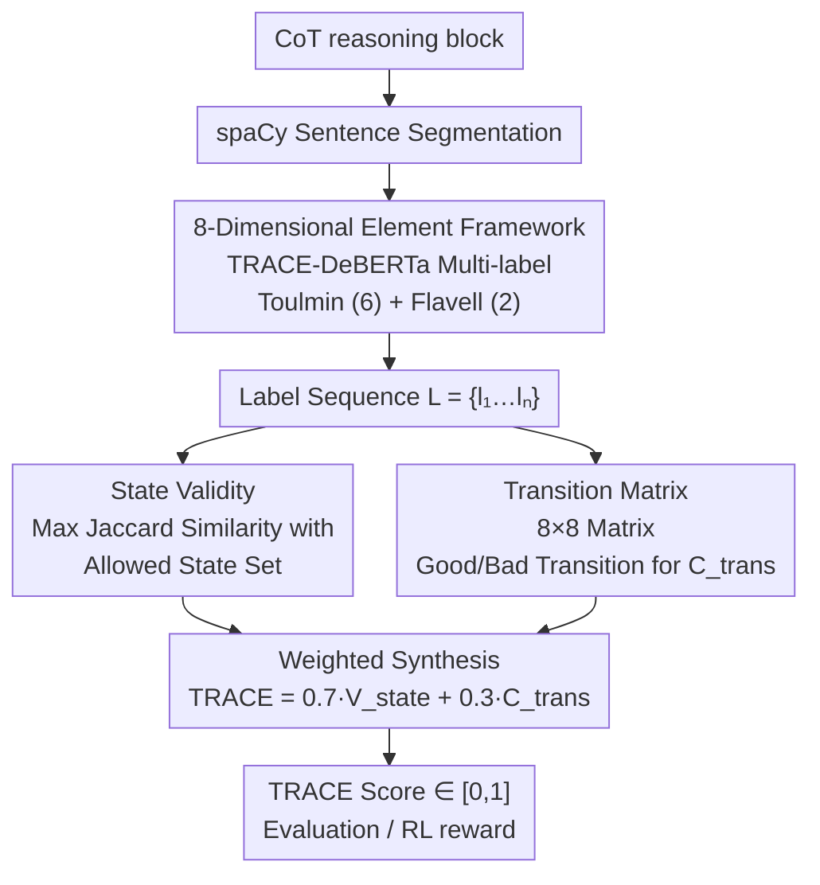

# TRACE: Evaluating LLM CoT Reasoning Process Quality with the Toulmin Argumentation Model

**Conference**: ICML 2026  
**arXiv**: [2605.29656](https://arxiv.org/abs/2605.29656)  
**Code**: https://github.com/hyyangkisti/trace  
**Area**: LLM Evaluation / Reasoning Analysis / Argumentation Mining  
**Keywords**: CoT Evaluation, Toulmin Argumentation, Metacognition, Reference-free Metrics, RL reward

## TL;DR
TRACE is a reference-free CoT quality evaluation metric that synthesizes the Toulmin Argumentation Model (Claim/Data/Warrant/Backing/Qualifier/Rebuttal) and Flavell Metacognition (Monitoring/Evaluation) into 8 core elements. It utilizes DeBERTa for multi-label recognition of these elements in each reasoning sentence, calculating a weighted sum of "State Validity + Transition Coherence." Across 26.3K QA pairs from 7 models, it achieves a correlation of $r=0.741$ with benchmark accuracy and improves GSM8K performance by +9.9% when used as an RL reward.

## Background & Motivation

**Background**: LLMs currently rely on Chain-of-Thought (CoT) for multi-step reasoning, yet evaluation remains regressed to outcome-based methods (accuracy, exact match) or surface statistics (perplexity, MTLD), which fail to capture "how the model thinks." While LLM-as-judge can provide assessments, it is a "black-box" approach prone to biases and difficulty in pinpointing specific reasoning flaws. Step-level annotation methods like ProcessBench or PRM require ground-truth verifiers, limiting scalability.

**Limitations of Prior Work**: (1) Outcome metrics treat the reasoning process as a black box, failing to locate "where the error occurred"; (2) Surface statistics (perplexity, length) are decoupled from actual reasoning quality—long CoT does not equate to good CoT; (3) LLM-as-judge suffers from verbosity and position biases and requires heavy prompt engineering; (4) Step-level labeling depends on human ground truth or heavy verifier models, hindering scalability.

**Key Challenge**: Process evaluation requires a structured definition of "reasoning architecture." However, CoT is free-form text. The challenge lies in extracting quantifiable reasoning structures from the text without relying on non-transparent LLM judges or expensive step-level correctness labels.

**Goal**: To develop a reference-free, lightweight, and interpretable CoT evaluation metric that scores the reasoning process and provides feedback for training (e.g., RL rewards).

**Key Insight**: Argumentation theory (Toulmin 1958) and metacognition theory in cognitive science (Flavell 1979) have studied the criteria for valid arguments for decades. Toulmin decomposes arguments into Claim, Data, Warrant, Backing, Qualifier, and Rebuttal, which are domain-agnostic. Flavell decomposes metacognition into Monitoring and Evaluation. Together, these theories cover the "fact + logic + introspection" dimensions of CoT.

**Core Idea**: Each CoT sentence is classified via multi-label DeBERTa into 8 elements. A "set of allowed states $\mathcal{S}_{\mathrm{allowed}}$" is defined (e.g., Claim, or Backing+Evaluation are valid; Qualifier+Claim is a weak hedged combination). State Validity is computed as the average maximum Jaccard similarity for each sentence. Furthermore, a transition matrix distinguishes Good Transitions (Evidence $\to$ Claim) from Bad Transitions (Monitoring $\to$ Qualifier) to compute Transition Coherence. Finally, $\mathrm{TRACE} = 0.7 V_{\mathrm{state}} + 0.3 C_{\mathrm{trans}}$.

## Method

### Overall Architecture

TRACE aims to score the CoT reasoning process without relying on standard answers. The process consists of two stages: first, the reasoning block is segmented into sentences using spaCy and fed into TRACE-DeBERTa for 8-dimensional multi-label classification, resulting in an element label sequence $L = \{l_1, l_2, \dots, l_n\}$. Second, two complementary metrics are computed over this sequence: structural validity per sentence (State Validity) and the flow between units (Transition Coherence). These are weighted to produce a TRACE Score in the range $[0, 1]$. This pipeline does not utilize ground truth, making it applicable to open-ended tasks.

The classifier is built on DeBERTa-v3-base with an 8-dimensional sigmoid multi-label head. Training data was generated via few-shot prompting of GPT-5.1 and Claude 4.5 Sonnet on 100k sentences using definitions from Toulmin and Flavell. The evaluation set was manually annotated by three senior NLP researchers on 400 sentences, achieving a Cohen's $\kappa=0.672$. The final Macro F1 of 0.666 is close to this human agreement limit, suggesting remaining errors stem from task ambiguity rather than classifier failure.

### Key Designs

**1. 8-Dimensional Element System (Toulmin + Flavell): Quantifying Reasoning Quality**

Since CoT is free text without a quantifiable structural definition, TRACE adopts two theoretical frameworks. The Toulmin Argumentation Model provides six elements: Claim, Data/Evidence, Warrant (inference rules), Backing, Qualifier, and Rebuttal. Flavell’s metacognition adds Monitoring (self-checking) and Evaluation (assessing conclusion validity). Each CoT sentence uses sigmoid multi-label classification to allow overlapping labels; for example, "By Pythagorean theorem (Warrant), since $3^2 + 4^2 = 9 + 16 = 25$ (Data), the hypotenuse is 5 (Claim)" is labeled as {Warrant, Data, Claim}. This is effective because the Toulmin model is domain-agnostic (applicable to math, science, law) and Flavell’s categories capture the "self-correction" style of modern LLMs.

**2. State Validity + Allowed States: Penalizing Structurally Weak Sentences**

To determine if a sentence constitutes a "valid argumentative unit," TRACE defines a set of allowed states $\mathcal{S}_{\mathrm{allowed}}$. Individual Claim/Data/Warrant/Backing labels are valid, as are composite states like Backing+Evaluation. However, weak assertions like Qualifier+Claim only receive $J=0.5$. For each sentence label set $l_i$, the maximum Jaccard similarity with any allowed state is taken, and the average is computed across the text:

$$V_{\mathrm{state}} = \frac{1}{N} \sum_i \max\{J(l_i, s) : s \in \mathcal{S}_{\mathrm{allowed}}\}$$

This penalizes isolated Monitoring or excessive Qualifiers, transforming the intuition that "good reasoning consists of valid units" into a metric while allowing stylistic diversity.

**3. Transition Matrix: Distinguishing Good/Bad Reasoning Flows**

State Validity only examines individual sentences. To evaluate the flow between sentences, TRACE employs an $8 \times 8$ transition matrix defining Good Transitions (e.g., Evidence $\to$ Claim, Monitoring $\to$ Evaluation) and Bad Transitions (e.g., Monitoring $\to$ Qualifier, Qualifier $\to$ Qualifier). Transition Coherence ($C_{\mathrm{trans}}$) is calculated based on how closely the distribution matches a good-weighted ideal. As seen in Figure 1 heatmaps, Kimi-K2-Thinking shows noticeably more Good Transitions and fewer Bad Transitions compared to Qwen-Turbo, aligning with human intuition.

The final score is synthesized as:

$$\mathrm{TRACE} = \alpha \cdot V_{\mathrm{state}} + (1-\alpha) \cdot C_{\mathrm{trans}}, \quad \alpha=0.7$$

State Validity is assigned a higher weight (0.7) under the rationale that valid units must exist before their transitions can be judged meaningful.

## Key Experimental Results

### TRACE-DeBERTa Classification Performance (vs. Human)

| Label | Precision | Recall | F1 |
|------|-----------|--------|-----|
| Claim | 0.696 | 0.634 | 0.662 |
| Data/Evidence | 0.774 | 0.588 | 0.663 |
| Warrant | 0.602 | 0.544 | 0.547 |
| Backing | 0.780 | 0.612 | 0.685 |
| Qualifier | 0.865 | 0.783 | 0.821 |
| Rebuttal | 0.712 | 0.549 | 0.619 |
| Monitoring | 0.803 | 0.585 | 0.675 |
| Evaluation | 0.610 | 0.711 | 0.654 |
| **Macro Avg** | **0.730** | **0.626** | **0.666** |

The Macro F1 of 0.666 is close to the inter-annotator agreement (Cohen's $\kappa=0.672$). Qualifiers have the highest F1 (0.821) due to explicit keywords, while Warrant (implicit rules) is the lowest (0.547).

### Correlation: TRACE Score vs. Accuracy (7 LLMs × 39 benchmarks)

| Model | AIME Avg Acc/TRACE | GSM8K Acc/TRACE | ARC Avg Acc/TRACE | MMLU Range |
|------|---|---|---|---|
| GPT-OSS 120B | 82% / 0.641 | 99% / 0.751 | 98% / 0.711 | TRACE 0.66-0.75 |
| DeepSeek R1 | 92% / 0.581 | 97% / 0.591 | 97% / 0.640 | TRACE 0.55-0.65 |
| Kimi K2 Thinking | 85% / 0.628 | 98% / 0.646 | 81% / 0.672 | TRACE 0.64-0.68 |
| Qwen Turbo | 67% / 0.559 | 99% / 0.620 | 97% / 0.559 | TRACE 0.55-0.60 |
| Claude 3.7 Sonnet | 32% / 0.582 | 95% / 0.701 | 98% / 0.679 | TRACE 0.62-0.70 |

Across 26.3K reasoning blocks, the Pearson correlation is $r=0.741$, which is exceptionally strong for a reference-free metric.

### RL Reward Application: GSM8K

| Training Signal | GSM8K Acc |
|---------|----------|
| Base (Qwen2.5-7B) | 71.5 |
| RL with accuracy-only reward | 76.2 |
| **RL with accuracy + TRACE reward** | **81.4** |

Using TRACE as a reward signal (combined with accuracy) improves GSM8K performance by +9.9%, demonstrating that "process + outcome" rewards are superior to outcome-only rewards.

### Key Findings

- **TRACE correlates strongly with accuracy ($r=0.741$)**: This is an order of magnitude higher than surface metrics like perplexity (~0.3) or length (~0.1), proving logical structure is a true quality proxy.
- **DeepSeek R1 discrepancy**: High accuracy (92%) but moderate TRACE (0.581) suggests correct answers don't always imply optimal reasoning structure; R1's frequent Monitoring for self-checking lowers its State Validity.
- **Warrant is the hardest to label**: Warrants are implicit rules with few surface markers, leading to an F1 of 0.547.
- **RL Improvement**: The +9.9% gain proves TRACE is effective for closed-loop training.

## Highlights & Insights

- **Interdisciplinary adaptation**: Adapting 1950s/70s philosophical and cognitive theories to LLM evaluation provides a robust, domain-agnostic framework.
- **Multi-label granularity**: Using an 8-dimensional multi-label system is more nuanced than binary step correctness, reflecting how humans actually reason (e.g., a sentence being both Data and Claim).
- **Dual-dimension Scoring**: Combining State and Transition prevents rewarding "good units with bad flow" or "smooth flow with empty content."
- **Interpretability**: Transition heatmaps allow developers to diagnose specific reasoning errors in different models.
- **Zero-supervision**: Applicable to open tasks without ground-truth answers.

## Limitations & Future Work

- **Warrant Identification**: The low F1 for Warrants means TRACE is less sensitive to "logical leaps"—a common human-like failure mode.
- **Hand-crafted Allowed States**: The set $\mathcal{S}_{\mathrm{allowed}}$ is manually designed; its robustness across extremely diverse languages or specialized domains requires further validation.
- **Dataset-tuned $\alpha$**: The optimal balance between State and Transition might vary by task (e.g., math vs. creative writing).
- **Goodhart's Law**: Models might learn to "hack" the TRACE score during RL without genuinely improving underlying reasoning.

## Related Work & Insights

- **vs. LLM-as-judge**: TRACE is cheaper, transparent, and avoids verbosity/position biases.
- **vs. ProcessBench / PRM**: TRACE eliminates the need for expensive step-level correctness annotations and ground-truth knowledge.
- **vs. Surface Metrics**: TRACE provides a much stronger correlation to reasoning quality than perplexity or length.
- **Insights**: The approach suggests that "logic structure" metrics are the future of reference-free evaluation for generative reasoning.

## Rating

- Novelty: ⭐⭐⭐⭐⭐ Cross-disciplinary innovation using Toulmin + Flavell.
- Experimental Thoroughness: ⭐⭐⭐⭐⭐ Comprehensive cross-model correlation and RL validation.
- Writing Quality: ⭐⭐⭐⭐ Clear framework, though some design choices are empirical.
- Value: ⭐⭐⭐⭐⭐ Highly practical for both diagnostic evaluation and training signal generation.

<!-- RELATED:START -->

## Related Papers

- [\[ICML 2026\] LatentChem: From Textual CoT to Latent Thinking in Chemical Reasoning](latentchem_from_textual_cot_to_latent_thinking_in_chemical_reasoning.md)
- [\[ICML 2026\] Many-Shot CoT-ICL: Making In-Context Learning Truly Learn](many-shot_cot-icl_making_in-context_learning_truly_learn.md)
- [\[ACL 2026\] Self-Consistency from Only Two Samples: CoT-PoT Ensembling for Efficient LLM Reasoning](../../ACL2026/llm_reasoning/self-consistency_from_only_two_samples_cot-pot_ensembling_for_efficient_llm_reas.md)
- [\[ACL 2025\] CoT-based Synthesizer: Enhancing LLM Performance through Answer Synthesis](../../ACL2025/llm_reasoning/cot-based_synthesizer_enhancing_llm_performance_through_answer_synthesis.md)
- [\[ICML 2026\] R2-Router: A New Paradigm for LLM Routing with Reasoning](r2-router_a_new_paradigm_for_llm_routing_with_reasoning.md)

<!-- RELATED:END -->
