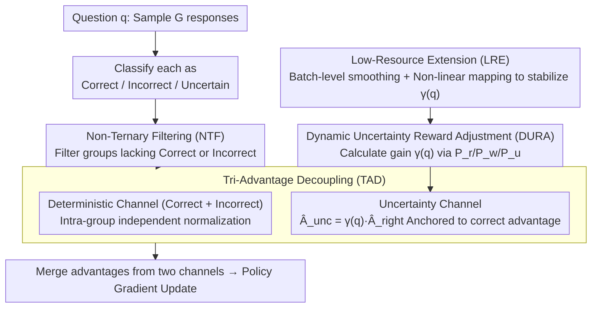

# UCPO: Uncertainty-Aware Policy Optimization

**Conference**: ICML2026  
**arXiv**: [2601.22648](https://arxiv.org/abs/2601.22648)  
**Code**: https://github.com/xzhouzeng/ucpo  
**Area**: LLM Reasoning  
**Keywords**: Uncertainty Expression, Reinforcement Learning, Policy Optimization, Trustworthy AI, Overconfidence Mitigation  

## TL;DR
UCPO addresses the advantage bias caused by fixed uncertainty rewards in existing RL paradigms through two mechanisms: Tri-Advantage Decoupling (TAD) and Dynamic Uncertainty Reward Adjustment (DURA). This allows LLMs to reliably express uncertainty at knowledge boundaries, achieving a PAQ of 79.63% in mathematical reasoning on Qwen3-8B.

## Background & Motivation

**Background**: LLMs perform remarkably well on complex reasoning tasks but tend to provide overconfident false assertions (hallucinations) when facing questions beyond their knowledge boundaries. Building trustworthy AI requires models to possess the metacognitive ability to "know what they don't know."

**Limitations of Prior Work**: Existing uncertainty alignment methods follow two paths: (1) The SFT path—using datasets with abstention labels for imitation learning, but data synthesis costs are high and static data cannot capture dynamic uncertainty during reasoning; (2) The RL path—assigning a fixed intermediate reward (e.g., 0.5) to uncertain responses, but such static rewards are extremely sensitive to hyperparameters. On difficult tasks, models engage in "reward hacking" by over-refusing to obtain stable rewards (evasion degradation); on simple tasks, uncertainty signals are drowned out by high rewards from correct answers, leading to continued overconfidence.

**Key Challenge**: RL frameworks like GRPO generate a fundamental "advantage bias" after introducing ternary rewards (correct/incorrect/uncertain). In high-performance intervals, the advantage of uncertain samples becomes negative (majority suppression), punishing rather than encouraging the model to express doubt; in low-performance intervals, the advantage of uncertain samples dominates the gradient (reward hacking), causing the model to degenerate into outputting uncertainty for all samples.

**Goal**: Design an adaptive RL framework that achieves a dynamic balance in the ternary decision space (correct/incorrect/uncertain) without exhaustive hyperparameter tuning.

**Key Insight**: Theoretically analyze the mathematical mechanism of how fixed rewards lead to advantage bias in the GRPO framework—specifically, the sign of the advantage function for uncertain samples flips across different performance intervals, which is a structural issue that static rewards cannot solve.

**Core Idea**: Decouple deterministic and uncertainty paths into independent channels for advantage estimation (eliminating semantic interference), while dynamically adjusting the uncertainty reward weight based on real-time model capability and sample difficulty.

## Method

### Overall Architecture
UCPO aims to solve the issue where introducing "correct/incorrect/uncertain" ternary rewards in GRPO causes the advantage of uncertain samples to flip signs based on model performance—it is suppressed to negative values in high-performance intervals (punishing the model for being cautious) and dominates gradients in low-performance intervals (leading to collective abstention). It performs two modifications to standard GRPO: for a question $q$, the model first samples $G$ responses and classifies each as correct, incorrect, or uncertain; instead of global advantage normalization, it uses Tri-Advantage Decoupling (TAD) to split deterministic and uncertain samples into two independent channels; the strength of the uncertainty channel is handled by Dynamic Uncertainty Reward Adjustment (DURA), which calculates a gain coefficient $\gamma(q)$ based on the real-time ratio of correct/incorrect/uncertain responses in the current group, allowing rewards to adapt to model capability rather than relying on a manually tuned fixed value. Extreme distributions and high intra-group variance are handled by Non-Ternary Filtering (NTF) and Low-Resource Extension (LRE).

### Key Designs

**1. Tri-Advantage Decoupling (TAD): Extracting uncertainty signals from the global average into a separate channel.**

The root cause is that GRPO's global normalization assigns advantage by comparing "higher or lower than the group average." When the model becomes stronger and correct samples dominate, a reasonable uncertain response is pulled into negative advantage because its reward is lower than the average—caution, which should be encouraged, is punished as a low-quality answer. This is "majority suppression." TAD splits the $G$ rollouts into a deterministic set $\mathcal{S}_{det}$ (correct + incorrect) and an uncertainty set $\mathcal{S}_{unc}$, ensuring the two channels do not interfere. The deterministic channel uses independent normalization $\hat{A}_{i,t}^{det} = (r_i - \text{mean}(\mathbf{r}_{det})) / (\text{std}(\mathbf{r}_{det}) + \epsilon)$, where correct paths receive positive reinforcement and incorrect paths receive negative punishment. Crucially, the advantage in the uncertainty channel is no longer calculated independently but is dynamically projected by anchoring to the advantage of correct samples:

$$\hat{A}_{i,t}^{unc} = \gamma(q) \cdot \hat{A}_{right}$$

In other words, the advantage of correct samples serves as a "performance anchor," allowing the incentive for abstention to scale automatically with the model's current peak reasoning capability. This ensures uncertainty signals no longer compete with the global average (avoiding suppression) and their strength remains tied to "how well the model can actually perform on this question." If a group lacks correct or incorrect samples, it is discarded by NTF.

**2. Dynamic Uncertainty Reward Adjustment (DURA): Adapting abstention rewards to capability and difficulty.**

The problem with a fixed intermediate reward $r_u$ (e.g., 0.5) is its one-size-fits-all nature: model capability grows during training, and task difficulty varies. The same $r_u$ induces evasion degradation on hard tasks and is drowned out by high rewards on easy tasks. DURA splits the gain coefficient $\gamma(q)$ into an incentive term and a suppression term:

$$\gamma(q) = \underbrace{\frac{P_w}{P_u + P_w + \epsilon}(1 - P_u)}_{\text{Uncertainty Incentive}} - \underbrace{w \cdot \frac{P_r}{P_r + P_w + \epsilon}P_u}_{\text{Uncertainty Suppression}}$$

Where $P_r, P_w, P_u$ are the proportions of correct/incorrect/uncertain rollouts in the current group. The incentive term amplifies abstention when error rates are high ($P_w$ is large), pushing the model from "false assertions" toward "honest doubt," while multiplying by $(1-P_u)$ to prevent saturation toward total abstention. The suppression term punishes unnecessary evasion as the model strengthens ($P_r$ increases), pushing it toward deterministic correct answers. This creates a "regulation buffer" that suppresses hallucinations early in training and promotes precision later.

**3. Non-Ternary Filtering (NTF) and Low-Resource Extension (LRE): Mitigating variance from extreme distributions and small groups.**

DURA's $\gamma(q)$ relies on intra-group ternary proportions, making the estimate unstable when groups are small or distributions are extreme. NTF filters groups lacking correct or incorrect rollouts, logically equivalent to regular GRPO treating all-correct/all-incorrect groups with zero advantage. LRE handles high variance in small groups: when $G$ is small (e.g., $G=4$), single-group proportions are noisy, causing $\gamma(q)$ to fluctuate. LRE uses batch-level smoothing and non-linear mapping to stabilize the gain estimation, ensuring training stability under low rollout budgets.

## Key Experimental Results

### Main Results (Mathematical Reasoning, PAQ Metric)

| Method | AIME24 | AMC | MATH500 | Minerva | OlympiadBench | Average PAQ |
|------|--------|-----|---------|---------|---------------|---------|
| Qwen3-8B Baseline | 73.33 | 91.57 | 96.80 | 45.96 | 69.63 | 75.46 |
| GRPO | 77.01 | 88.35 | 96.46 | 47.18 | 69.22 | 75.64 |
| GRPO-UC (r_u=0.2) | 83.75 | 88.98 | 96.31 | 48.60 | 70.68 | 77.66 |
| **UCPO** | **86.11** | **91.95** | **97.28** | **49.15** | **73.67** | **79.63** |
| Llama-3.1-8B Baseline | 3.33 | 15.66 | 45.80 | 15.81 | 14.96 | 19.11 |
| GRPO-UC (r_u=0.5) | 0.00 | 21.43 | 57.61 | 26.16 | 19.28 | 24.90 |
| **UCPO** | **5.13** | **28.12** | **60.95** | **22.50** | **25.56** | **28.45** |

### Ablation Study (Llama-3.1-8B, Mathematical Reasoning)

| Configuration | Uncertainty Ratio | PAQ | F1 |
|------|-------------|-----|-----|
| w/o TAD | 50.33 | 22.56 | 16.21 |
| w/o DURA | 79.91 | 35.22 | 13.16 |
| w/o NTF | 37.96 | 28.51 | 22.93 |
| w/o LRE | 43.19 | 27.83 | 21.12 |
| Full UCPO | **39.09** | **28.45** | **22.65** |

### Key Findings
- Fixed rewards in GRPO-UC are extremely fragile: on Llama-3.1-8B math tasks, $r_u \geq 0.5$ triggers reward hacking, with uncertainty ratios surging to 100% and F1 collapsing to single digits (9.01); meanwhile, $r_u = 0.2$ is insufficient to incentivize uncertainty learning on general tasks.
- Removing TAD significantly decreases PAQ (28.45 → 22.56), and removing DURA causes the uncertainty ratio to jump to 79.91% (reward hacking), proving both components are indispensable.
- UCPO achieves an average PAQ of 79.63% on Qwen3-8B, approximately 2 percentage points higher than the best GRPO-UC variant, without needing to tune the $r_u$ hyperparameter.
- A group size of $G=8$ is optimal for PAQ, while $G=16$ is better for F1, indicating that larger groups provide more stable advantage estimates.

## Highlights & Insights
- **Anchoring uncertainty advantage to correct sample advantage** $\hat{A}_{unc} = \gamma(q) \cdot \hat{A}_{right}$ is an elegant design: it allow the incentive for uncertainty to scale automatically with the model's current peak reasoning capability, avoiding the suppression effect of global normalization and the hacking risks of fixed rewards. This "performance anchoring" concept is transferable to any RL scenario requiring a balance between multiple reward types.
- The DURA formula implements a self-stabilizing system: it encourages abstention when errors are frequent and inhibits it when capability is high. This adaptive mechanism is a fundamental advancement over manual $r_u$ tuning—moving from "one hyperparameter fits all" to "automatic adjustment based on current state."
- The theoretical analysis of the ternary imbalance problem is very clear—using ternary plots to visualize the behavior of the advantage function across different performance intervals intuitively reveals the mathematical mechanism behind the failure of fixed rewards.

## Limitations & Future Work
- The authors acknowledge that the rollout type distribution (initial ratios of $P_r, P_w, P_u$) may affect uncertainty learning, but this was not fully explored.
- In multiple-choice scenarios, F1 might decrease because "lucky guesses" are converted to uncertainty—UCPO optimizes for reliability (PAQ) rather than coverage.
- The DURA gain formula depends on intra-group statistics and may degenerate in extreme distributions (e.g., all correct or all incorrect), requiring NTF as a safeguard.
- Future work could explore continuous uncertainty expressions (e.g., confidence scores) rather than discrete abstention decisions.

## Related Work & Insights
- TruthRL / KnowRL: Representative methods for uncertainty alignment using fixed intermediate rewards, where hyperparameter sensitivity is the primary bottleneck.
- GRPO / DeepSeek-R1: The base RL framework for UCPO, which introduces a ternary decision space on top of it.
- DAPO / Dr.GRPO: Concurrent works improving GRPO training stability, focusing on sampling strategies and clipping mechanisms rather than uncertainty modeling.

<!-- RELATED:START -->

## Related Papers

- [\[ICML 2026\] Are Tools Always Beneficial? Learning to Invoke Tools Adaptively for Dual-Mode Multimodal LLM Reasoning](are_tools_always_beneficial_learning_to_invoke_tools_adaptively_for_dual-mode_mu.md)
- [\[ACL 2026\] Think Outside the Policy: In-Context Steered Policy Optimization](../../ACL2026/llm_reasoning/think_outside_the_policy_in-context_steered_policy_optimization.md)
- [\[ICML 2026\] Verifying Meta-Awareness via Predictive Rewards in Reasoning Models](verifying_meta-awareness_via_predictive_rewards_in_reasoning_models.md)
- [\[ICML 2026\] Beyond Two-Stage Training: Cooperative SFT and RL for LLM Reasoning](beyond_two-stage_training_cooperative_sft_and_rl_for_llm_reasoning.md)
- [\[ICML 2026\] An Information-Theoretic Criterion for Efficient Data Synthesis](an_information-theoretic_criterion_for_efficient_data_synthesis.md)

<!-- RELATED:END -->
